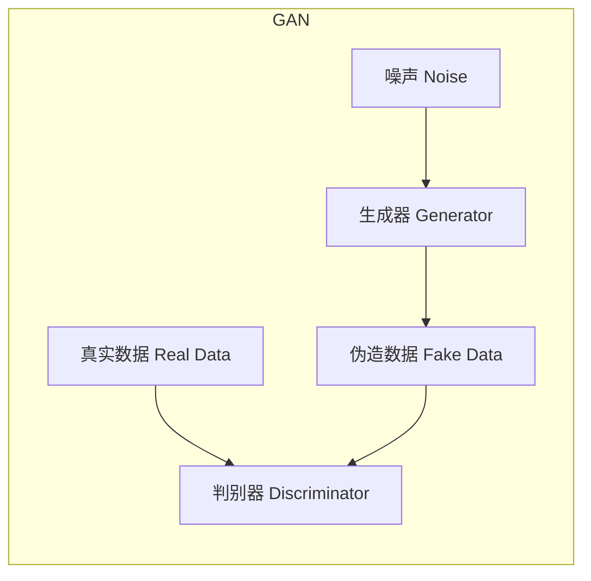

# 生成对抗网络 (GAN)

## 1. 背景介绍

生成对抗网络(Generative Adversarial Networks, GAN)是近年来人工智能领域中一种极具革命性的概念和技术。它由伊恩·古德费洛(Ian Goodfellow)等人在2014年提出,旨在通过对抗性训练的方式生成逼真的数据样本。GAN的出现为生成模型注入了新的活力,在图像、语音、文本等多个领域取得了令人瞩目的成就。

在传统的机器学习中,我们通常采用判别模型(discriminative model)来解决分类和回归等任务。判别模型的目标是从输入数据中学习一个条件概率分布,以对给定的输入样本做出正确的预测。然而,这种方法并不能生成新的数据样本。相比之下,生成模型(generative model)则是学习数据的联合概率分布,从而能够生成新的样本。

生成模型在很多领域都有广泛的应用,例如计算机视觉、自然语言处理、语音合成等。然而,以往的生成模型如隐马尔可夫模型(Hidden Markov Model)、受限玻尔兹曼机(Restricted Boltzmann Machine)等,由于其结构的限制,往往难以学习到复杂数据的真实分布。GAN的出现为生成模型带来了新的契机,它能够直接从数据中学习到复杂的概率分布,从而生成逼真的样本。

## 2. 核心概念与联系

GAN的核心思想是构建两个神经网络,一个是生成器(Generator),另一个是判别器(Discriminator)。生成器的目标是从随机噪声中生成逼真的样本,而判别器的目标是区分生成的样本和真实样本。两个网络相互对抗,生成器努力生成更加逼真的样本来欺骗判别器,而判别器则努力提高区分能力。通过这种对抗性的训练过程,生成器和判别器的能力都会不断提高,最终生成器能够生成高质量的样本。



GAN的训练过程可以看作是一个极小极大游戏(minimax game),生成器和判别器相互对抗,目标是找到一个纳什均衡点。生成器 $G$ 的目标是最小化判别器将生成样本识别为假样本的概率,而判别器 $D$ 的目标是最大化正确识别真实样本和生成样本的概率。这个过程可以用以下公式表示:

$$\min_G \max_D V(D, G) = \mathbb{E}_{x \sim p_\text{data}(x)}[\log D(x)] + \mathbb{E}_{z \sim p_z(z)}[\log (1 - D(G(z)))]$$

其中, $p_\text{data}$ 是真实数据的分布, $p_z$ 是生成器输入噪声的分布, $x$ 是真实样本, $z$ 是噪声向量。

通过这种对抗性训练,生成器和判别器都会不断提高自身的能力。当达到纳什均衡时,生成器生成的样本分布 $p_g$ 将与真实数据分布 $p_\text{data}$ 相同,判别器将无法区分真实样本和生成样本。

## 3. 核心算法原理具体操作步骤

GAN的训练过程可以分为以下几个步骤:

1. **初始化生成器和判别器网络**

   首先,我们需要定义生成器和判别器的神经网络结构。生成器通常采用上采样(upsampling)层和卷积层组成的编码器-解码器结构,输入是一个随机噪声向量,输出是一个生成的样本(如图像)。判别器则通常采用卷积神经网络结构,输入是一个样本(真实或生成),输出是一个标量,表示该样本为真实样本的概率。

2. **生成器生成样本**

   在每次迭代中,我们首先从噪声分布 $p_z$ 中采样一个噪声向量 $z$,将其输入到生成器 $G$ 中,得到一个生成样本 $G(z)$。

3. **判别器对真实样本和生成样本进行判别**

   将生成样本 $G(z)$ 和一批真实样本 $x$ 输入到判别器 $D$ 中,分别得到判别器对它们的判别结果 $D(G(z))$ 和 $D(x)$。

4. **计算损失函数并进行参数更新**

   根据上面的极小极大公式,我们可以计算生成器和判别器的损失函数:

   - 判别器损失: $\mathcal{L}_D = -\mathbb{E}_{x \sim p_\text{data}(x)}[\log D(x)] - \mathbb{E}_{z \sim p_z(z)}[\log (1 - D(G(z)))]$
   - 生成器损失: $\mathcal{L}_G = -\mathbb{E}_{z \sim p_z(z)}[\log D(G(z))]$

   通过反向传播算法,我们可以计算损失函数对网络参数的梯度,并使用优化算法(如Adam)更新生成器和判别器的参数。

5. **重复训练过程**

   重复步骤2-4,直到生成器和判别器达到一个稳定的状态,即生成样本的分布 $p_g$ 与真实数据分布 $p_\text{data}$ 非常接近。

需要注意的是,GAN的训练过程并不稳定,很容易出现模式崩溃(mode collapse)、梯度消失等问题。因此,在实际训练中,我们通常需要采用一些技巧和改进方法,如特征匹配(feature matching)、小批量训练(mini-batch training)、正则化等,以提高GAN的训练稳定性和生成质量。

## 4. 数学模型和公式详细讲解举例说明

在上一节中,我们介绍了GAN的核心算法原理和训练步骤。现在,我们将更深入地探讨GAN的数学模型和公式。

### 4.1 极小极大游戏

GAN的训练过程可以看作是一个极小极大游戏(minimax game),生成器 $G$ 和判别器 $D$ 相互对抗,目标是找到一个纳什均衡点。具体来说,生成器 $G$ 的目标是最小化判别器将生成样本识别为假样本的概率,而判别器 $D$ 的目标是最大化正确识别真实样本和生成样本的概率。这个过程可以用以下公式表示:

$$\min_G \max_D V(D, G) = \mathbb{E}_{x \sim p_\text{data}(x)}[\log D(x)] + \mathbb{E}_{z \sim p_z(z)}[\log (1 - D(G(z)))]$$

其中, $p_\text{data}$ 是真实数据的分布, $p_z$ 是生成器输入噪声的分布, $x$ 是真实样本, $z$ 是噪声向量。

这个公式可以进一步拆解为判别器和生成器的损失函数:

- 判别器损失: $\mathcal{L}_D = -\mathbb{E}_{x \sim p_\text{data}(x)}[\log D(x)] - \mathbb{E}_{z \sim p_z(z)}[\log (1 - D(G(z)))]$
- 生成器损失: $\mathcal{L}_G = -\mathbb{E}_{z \sim p_z(z)}[\log D(G(z))]$

在训练过程中,我们需要最小化生成器损失 $\mathcal{L}_G$,最大化判别器损失 $\mathcal{L}_D$。当达到纳什均衡时,生成器生成的样本分布 $p_g$ 将与真实数据分布 $p_\text{data}$ 相同,判别器将无法区分真实样本和生成样本。

### 4.2 Jensen-Shannon 散度

在原始 GAN 论文中,作者使用 Jensen-Shannon 散度(Jensen-Shannon Divergence)来衡量生成器分布 $p_g$ 和真实数据分布 $p_\text{data}$ 之间的差异。Jensen-Shannon 散度是一种基于 Kullback-Leibler 散度(KL 散度)的度量,它可以用于衡量两个概率分布之间的相似程度。

对于两个概率分布 $P$ 和 $Q$,它们的 Jensen-Shannon 散度定义为:

$$JSD(P \| Q) = \frac{1}{2}D_{KL}(P \| M) + \frac{1}{2}D_{KL}(Q \| M)$$

其中, $M = \frac{1}{2}(P + Q)$ 是 $P$ 和 $Q$ 的均值分布, $D_{KL}$ 是 Kullback-Leibler 散度。

在 GAN 的情况下,我们希望最小化生成器分布 $p_g$ 和真实数据分布 $p_\text{data}$ 之间的 Jensen-Shannon 散度,即:

$$\min_G JSD(p_\text{data} \| p_g) = \frac{1}{2}D_{KL}(p_\text{data} \| \frac{p_\text{data} + p_g}{2}) + \frac{1}{2}D_{KL}(p_g \| \frac{p_\text{data} + p_g}{2})$$

通过一些数学推导,可以证明最小化 Jensen-Shannon 散度等价于最大化判别器和生成器的对抗性损失函数。因此,GAN 的训练过程实际上是在最小化生成器分布和真实数据分布之间的 Jensen-Shannon 散度。

### 4.3 其他距离度量

除了 Jensen-Shannon 散度,还有一些其他的距离度量可以用于衡量生成器分布和真实数据分布之间的差异,例如:

- **Wasserstein 距离(Earth Mover's Distance)**

  Wasserstein 距离是一种基于最优传输理论的距离度量,它可以衡量两个概率分布之间的"运输成本"。Wasserstein GAN (WGAN) 使用 Wasserstein 距离作为目标函数,通常能够提供更稳定的训练过程和更好的生成质量。

- **最大均值差异(Maximum Mean Discrepancy, MMD)**

  MMD 是一种基于核方法的距离度量,它可以用于衡量两个分布之间的相似程度。MMD GAN 使用 MMD 作为目标函数,在一些任务上表现出色。

- **总变分距离(Total Variation Distance)**

  总变分距离是一种常用的概率距离度量,它衡量两个分布之间的最大差异。一些 GAN 变体使用总变分距离作为目标函数。

不同的距离度量对应不同的优化目标,会影响 GAN 的训练稳定性和生成质量。选择合适的距离度量对于特定任务至关重要。

## 5. 项目实践: 代码实例和详细解释说明

为了更好地理解 GAN 的原理和实现,我们将通过一个实际的代码示例来演示如何构建和训练一个简单的 GAN 模型。在本例中,我们将使用 PyTorch 框架,并以手写数字数据集 MNIST 为例,训练一个能够生成手写数字图像的 GAN 模型。

### 5.1 导入所需库

```python
import torch
import torch.nn as nn
import torch.optim as optim
import torchvision
import torchvision.transforms as transforms
import matplotlib.pyplot as plt
import numpy as np
```

### 5.2 定义生成器和判别器网络

首先,我们定义生成器和判别器的网络结构。生成器采用全连接层和上采样层组成的编码器-解码器结构,输入是一个100维的随机噪声向量,输出是一个28x28的手写数字图像。判别器则采用卷积神经网络结构,输入是一个28x28的图像,输出是一个标量,表示该图像为真实图像的概率。

```python
# 生成器
class Generator(nn.Module):
    def __init__(self, input_dim, output_dim):
        super(Generator, self).__init__()
        self.fc1 = nn.Linear(input_dim, 256)
        self.bn1 = nn.BatchNorm1d(256)
        self.fc2 = nn.Linear(256, 512)
        self.bn2 = nn.BatchNorm1d(512)
        self.fc3 = nn.Linear(512, 1024)
        self.bn3 = nn.BatchNorm1d(1024)
        self.fc4 = nn.Linear(1024, output_dim)

    def forward(self, x):
        x = nn.LeakyReLU(0.2)(self.bn1(self.fc1(x)))
        x = nn