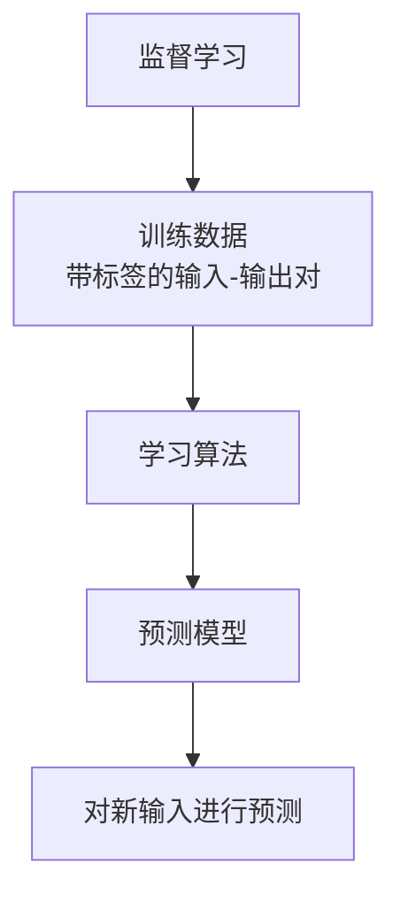
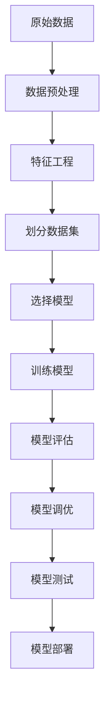

# 监督学习(Supervised Learning) - 原理与代码实例讲解

## 1. 背景介绍

监督学习是机器学习中最广为人知和应用最广泛的一种学习范式。它旨在从标记的训练数据中学习出一个函数,该函数可以将输入映射到期望的输出。监督学习算法通过分析大量带有正确答案的示例数据,学习到一个可以对新的输入数据做出预测的模型。

监督学习在现实生活中有着广泛的应用,如图像分类、语音识别、自然语言处理、推荐系统等。它的核心思想是利用已知的输入-输出对训练模型,使其能够对新的输入做出准确的输出预测。



## 2. 核心概念与联系

监督学习中有几个核心概念需要理解:

1. **特征(Features)**:输入数据的属性,用于描述输入样本的特征。
2. **标签(Labels)**:训练数据中每个样本对应的正确输出。
3. **模型(Model)**:学习算法从训练数据中学习得到的函数映射。
4. **损失函数(Loss Function)**:衡量模型预测输出与真实标签之间的差距。
5. **优化算法(Optimization Algorithm)**:通过最小化损失函数来调整模型参数,使模型性能不断提高。

这些概念之间紧密相连,构成了监督学习的基本框架。特征和标签组成了训练数据,模型通过学习算法从训练数据中捕获输入与输出之间的映射关系,损失函数评估模型的性能,优化算法则不断调整模型参数以最小化损失函数,从而提高模型的预测精度。

## 3. 核心算法原理具体操作步骤

监督学习算法的核心步骤如下:

1. **数据预处理**:对原始数据进行清洗、标准化等预处理,以确保数据质量。
2. **特征工程**:从原始数据中提取有意义的特征,这些特征将作为模型的输入。
3. **划分数据集**:将数据集划分为训练集、验证集和测试集。
4. **选择模型**:根据问题的性质选择合适的监督学习模型,如线性回归、逻辑回归、决策树、支持向量机等。
5. **训练模型**:使用训练集训练模型,通过优化算法不断调整模型参数,最小化损失函数。
6. **模型评估**:使用验证集评估模型的性能,根据评估指标选择最优模型。
7. **模型调优**:通过调整超参数、特征选择等方式优化模型性能。
8. **模型测试**:使用保留的测试集对最终模型进行测试,评估其在新数据上的表现。
9. **模型部署**:将训练好的模型部署到实际应用中,对新的输入数据进行预测。



## 4. 数学模型和公式详细讲解举例说明

监督学习算法通常基于某种数学模型,并使用优化算法来学习模型参数。以线性回归为例,我们将详细讲解其数学模型和公式。

线性回归旨在学习一个线性函数,使其能够最佳地拟合训练数据。给定输入特征向量 $\mathbf{x} = (x_1, x_2, \dots, x_n)$ 和对应的标量输出 $y$,线性回归模型可以表示为:

$$
y = \theta_0 + \theta_1 x_1 + \theta_2 x_2 + \dots + \theta_n x_n
$$

其中 $\theta_0, \theta_1, \dots, \theta_n$ 是需要学习的模型参数。

为了学习这些参数,我们需要定义一个损失函数,衡量模型预测值与真实值之间的差距。常用的损失函数是均方误差(Mean Squared Error, MSE):

$$
\text{MSE} = \frac{1}{m} \sum_{i=1}^m (y_i - \hat{y}_i)^2
$$

其中 $m$ 是训练样本的数量, $y_i$ 是第 $i$ 个样本的真实输出, $\hat{y}_i$ 是模型对该样本的预测输出。

为了最小化均方误差,我们可以使用梯度下降(Gradient Descent)等优化算法来学习模型参数。梯度下降的基本思想是沿着损失函数的负梯度方向更新参数,直到收敛到最小值。对于线性回归模型,参数更新规则为:

$$
\theta_j := \theta_j - \alpha \frac{\partial}{\partial \theta_j} \text{MSE}(\mathbf{\theta})
$$

其中 $\alpha$ 是学习率,控制每次更新的步长。通过不断迭代更新参数,直到收敛到最小化均方误差的参数值。

以上是线性回归模型的基本数学原理和公式。在实际应用中,我们还可以引入正则化项来防止过拟合,或使用其他损失函数和优化算法来适应不同的问题。

## 5. 项目实践: 代码实例和详细解释说明

为了更好地理解监督学习的原理和实践,我们将使用Python中的scikit-learn库实现一个线性回归的示例。

```python
import numpy as np
from sklearn.linear_model import LinearRegression
from sklearn.model_selection import train_test_split
from sklearn.metrics import mean_squared_error

# 生成示例数据
X = np.array([[1], [2], [3], [4], [5]])
y = np.array([2, 4, 5, 4, 5])

# 划分训练集和测试集
X_train, X_test, y_train, y_test = train_test_split(X, y, test_size=0.2, random_state=42)

# 创建线性回归模型
model = LinearRegression()

# 训练模型
model.fit(X_train, y_train)

# 在测试集上进行预测
y_pred = model.predict(X_test)

# 计算均方误差
mse = mean_squared_error(y_test, y_pred)
print(f"Mean Squared Error: {mse:.2f}")

# 输出模型参数
print(f"Intercept: {model.intercept_:.2f}")
print(f"Coefficient: {model.coef_[0]:.2f}")
```

在这个示例中,我们首先生成了一个简单的线性数据集。然后,我们使用`train_test_split`函数将数据集划分为训练集和测试集。

接下来,我们创建了一个`LinearRegression`对象,并使用`fit`方法在训练集上训练模型。训练完成后,我们使用`predict`方法在测试集上进行预测,并计算预测值与真实值之间的均方误差。

最后,我们输出了模型的截距(`intercept`)和系数(`coef_`),这些参数值是在训练过程中学习得到的。

运行这段代码,你将看到类似如下的输出:

```
Mean Squared Error: 0.30
Intercept: 1.20
Coefficient: 0.80
```

这个示例展示了如何使用scikit-learn库实现一个简单的线性回归模型。在实际应用中,你可能需要处理更复杂的数据集和特征,并根据具体问题选择合适的模型和超参数。

## 6. 实际应用场景

监督学习在各个领域都有广泛的应用,下面列举了一些典型的应用场景:

1. **图像分类**: 通过训练模型识别图像中的物体、人物等,应用于计算机视觉、自动驾驶等领域。
2. **自然语言处理(NLP)**: 训练模型进行文本分类、情感分析、机器翻译等任务,应用于聊天机器人、智能助手等场景。
3. **金融预测**: 使用历史金融数据训练模型,预测股票价格、贷款违约风险等,应用于投资决策、风险管理等领域。
4. **医疗诊断**: 基于患者症状、检查结果等数据训练模型,辅助医生进行疾病诊断和预测病情发展。
5. **推荐系统**: 根据用户历史行为数据训练模型,为用户推荐感兴趣的商品、内容等,应用于电商、视频网站等场景。
6. **欺诈检测**: 使用历史交易数据训练模型,识别出可疑的欺诈行为,应用于金融、网络安全等领域。

监督学习的应用场景非常广泛,只要有足够的标记数据,就可以训练出解决实际问题的模型。随着数据的不断积累和算法的进一步发展,监督学习在更多领域将发挥重要作用。

## 7. 工具和资源推荐

在实践监督学习时,有许多优秀的工具和资源可以帮助你更好地学习和应用相关技术。以下是一些推荐:

1. **Python科学计算库**:
   - NumPy: 提供高性能的数值计算功能
   - Pandas: 提供高性能、易用的数据结构和数据分析工具
   - Matplotlib: 用于绘制高质量的2D和3D图形
   - Scikit-learn: 机器学习库,提供了多种监督和非监督学习算法

2. **深度学习框架**:
   - TensorFlow: Google开源的端到端机器学习平台
   - PyTorch: Facebook开源的深度学习框架,具有动态计算图和良好的Python集成性

3. **在线课程和教程**:
   - Andrew Ng的机器学习课程(Coursera)
   - 吴恩达的深度学习专项课程(Coursera)
   - 斯坦福大学的机器学习课程(Coursera)
   - 机器学习实战(书籍)

4. **数据集**:
   - UCI机器学习数据库
   - Kaggle数据集
   - Google数据集搜索引擎

5. **社区和论坛**:
   - Kaggle竞赛和讨论区
   - Stack Overflow
   - Reddit机器学习社区

利用这些优秀的工具和资源,你可以更高效地学习和实践监督学习,并跟上机器学习领域的最新发展。

## 8. 总结: 未来发展趋势与挑战

监督学习在过去几十年取得了长足的进步,但仍然面临着一些挑战和发展方向:

1. **大规模数据处理**:随着数据量的不断增长,如何高效地处理和利用海量数据是一个重大挑战。分布式计算、在线学习等技术将发挥重要作用。

2. **弱监督和半监督学习**:获取大量高质量的标记数据是一个巨大的挑战。弱监督和半监督学习技术可以利用少量标记数据和大量未标记数据进行训练,降低标记成本。

3. **可解释性和可信赖性**:随着机器学习模型在更多关键领域的应用,模型的可解释性和可信赖性变得越来越重要。如何解释模型的决策过程并确保其公平性和安全性是一个值得关注的方向。

4. **迁移学习和元学习**:如何利用已有的知识快速适应新的任务和领域,是一个具有挑战性的问题。迁移学习和元学习等技术可以提高模型的泛化能力和学习效率。

5. **人工智能与人类智能的融合**:未来,人工智能系统将与人类更加紧密地协作。如何设计人机协作系统,充分发挥人工智能和人类智能的优势,是一个值得探索的方向。

6. **算力和硬件加速**:随着模型规模和数据量的不断增长,对计算能力的需求也在不断增加。新型算力和硬件加速技术将为监督学习的发展提供强大的支持。

总的来说,监督学习仍然是机器学习中最活跃和最具影响力的领域之一。未来,它将继续在各个领域发挥重要作用,并与其他技术相结合,推动人工智能的发展。

## 9. 附录: 常见问题与解答

1. **什么是监督学习?**

   监督学习是机器学习中最常见的一种范式,它旨在从标记的训练数据中学习出一个函数,该函数可以将输入映射到期望