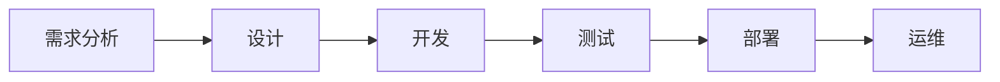

# 突破AI可靠性瓶颈的策略

## 1.背景介绍
### 1.1 人工智能的发展现状
### 1.2 AI可靠性的重要性
### 1.3 当前AI可靠性面临的主要挑战

人工智能(Artificial Intelligence, AI)技术在近年来取得了突飞猛进的发展,在图像识别、自然语言处理、智能决策等领域展现出了强大的能力,正在深刻影响和改变着人类社会的方方面面。然而,随着AI系统变得日益复杂和强大,其可靠性问题也日益凸显,成为制约AI技术进一步发展和广泛应用的一大瓶颈。

AI系统的可靠性直接关系到其能否安全、稳定、可控地执行任务,服务于人类社会。一个不可靠的AI系统可能会做出错误的判断和决策,产生严重的负面后果。例如,自动驾驶汽车的失控事故、人脸识别系统的误判、智能客服的胡言乱语等,都会给使用者和社会带来安全隐患和信任危机。因此,如何提升AI系统的可靠性,让人类能够放心地将任务托付给AI,是当前亟需解决的重大课题。

目前,AI可靠性面临的主要挑战包括:
1. AI系统自身算法的局限性,如泛化能力不足、鲁棒性差等;
2. 训练数据的质量问题,如数据噪声、偏差等;  
3. 缺乏有效的测试、验证手段,难以全面评估AI系统的可靠性;
4. 缺乏可解释性,AI系统的决策过程是一个"黑箱",难以被人理解和信任;
5. 缺乏行为可控性,难以约束AI系统的行为边界,避免其做出超出预期的行为。

针对这些挑战,学术界和工业界都在积极探索,力图找到一套系统性的解决方案,建立可靠的AI系统,推动AI技术的健康发展。接下来,本文将重点阐述提升AI可靠性的若干关键策略。

## 2.核心概念与联系
### 2.1 AI可靠性的定义与度量
### 2.2 可靠性与安全性、隐私性等概念的关系
### 2.3 AI系统生命周期各阶段的可靠性需求

AI可靠性是指AI系统在特定条件下和规定时间内完成指定功能的能力。可以从正确性、稳定性、鲁棒性、可用性等不同角度来度量。其中,正确性指AI系统按照设计要求,给出正确的输出;稳定性指AI系统在各种条件下的工作状态是否稳定持续;鲁棒性指AI系统面对干扰、对抗、异常等情况时,能否正常工作;可用性指AI系统能否在用户需要时以足够的性能水平提供服务。

可靠性与安全性、隐私性是相辅相成的。一个可靠的AI系统必须是安全的,不会给使用者和社会带来危害;同时还要保护好用户隐私,不能泄露用户的敏感信息。反之,缺乏安全性和隐私保护的AI系统也是不可靠的。

AI系统的生命周期主要包括需求分析、设计、开发、测试、部署、运维等阶段。每个阶段都有不同的可靠性需求和保障措施。比如,在需求分析阶段,就要明确系统的边界和使用场景,以及面临的风险和挑战;设计阶段要进行可靠性设计,采用成熟可靠的技术方案;开发阶段要遵循最佳实践,写出高质量的代码实现;测试阶段要全面评估系统的可靠性,找出潜在的缺陷和风险;部署和运维阶段还要持续监控系统的运行状态,及时发现和处理故障。可靠性需要系统性的工程实践,从始至终贯穿AI系统的整个生命周期。



## 3.核心算法原理具体操作步骤
### 3.1 数据增强与清洗
### 3.2 对抗训练
### 3.3 集成学习
### 3.4 可解释性算法

提升AI可靠性的一个重要策略是改进其底层算法。目前主流的AI算法如深度学习,虽然在多个任务上取得了瞩目成绩,但也存在泛化能力不足、容易被对抗样本欺骗等问题,导致可靠性不高。针对这些问题,研究者提出了一系列改进方法:

1. 数据增强与清洗。通过对原始训练数据进行旋转、缩放、添加噪声、插值等变换,可以增加数据的多样性,提升模型的泛化能力。同时,还要对数据进行清洗,去除噪声和异常点,提高数据质量。

2. 对抗训练。通过生成对抗样本并将其加入训练集,可以提升模型抵御对抗攻击的能力。常见的对抗训练算法包括FGSM、PGD等。

3. 集成学习。通过结合多个模型的预测结果,可以减少单一模型的错误和不确定性,提升整体性能。常见的集成学习方法有Bagging、Boosting、Stacking等。

4. 可解释性算法。传统的深度学习模型是一个"黑箱",难以解释其决策依据。为了提高可解释性,研究者提出了一些新的算法,如注意力机制、因果推理等,让模型的决策过程更加透明,从而获得更多信任。

以对抗训练为例,其基本步骤如下:

```
输入:原始训练数据集 D, 学习率 α, 对抗样本数量 m, 迭代轮数 T
输出:对抗训练后的模型参数 θ

随机初始化模型参数 θ
for t = 1 to T do:
    从 D 中采样一批数据 (x, y)
    生成对抗样本:
    for i = 1 to m do:
        x' = x + α·sign(∇x J(θ, x, y))  // J 是损失函数
    end for
    更新模型参数:
    θ = θ - α·∇θ J(θ, x', y)  // 用对抗样本更新梯度
end for
```

其核心思想是,在每次迭代中,先在原始样本 x 的邻域内生成一些对抗样本 x',然后用对抗样本而不是原始样本来更新模型参数。这样训练出的模型,对对抗扰动有更强的鲁棒性。

## 4.数学模型和公式详细讲解举例说明
### 4.1 可靠性评估模型
### 4.2 失效概率计算公式
### 4.3 马尔可夫可靠性模型

为了定量评估AI系统的可靠性,需要建立数学模型和公式。一个常用的可靠性评估模型是失效率模型:

$$\lambda(t) = \lim_{\Delta t \to 0} \frac{P(t \leq T < t+\Delta t | T \geq t)}{\Delta t}$$

其中,$\lambda(t)$ 表示在时刻 t 的失效率,$P(t \leq T < t+\Delta t|T \geq t)$ 表示在 t 时刻正常,但在 $\Delta t$ 内发生失效的条件概率。这个模型刻画了AI系统在不同时刻的失效概率变化趋势。

基于失效率模型,可以推导出平均失效间隔时间(MTBF):

$$MTBF = \int_{0}^{\infty} R(t) dt = \int_{0}^{\infty} e^{-\int_{0}^{t} \lambda(x) dx} dt$$

其中,$R(t) = 1 - F(t) = e^{-\int_{0}^{t} \lambda(x) dx}$ 是可靠度函数,$F(t)$ 是失效概率分布函数。MTBF 表示系统两次失效之间的平均时间间隔,是衡量可靠性的一个重要指标,MTBF 越大说明系统越可靠。

另一类常用的可靠性模型是马尔可夫模型,刻画了系统在不同状态之间的转移概率。假设系统有 n 个状态,状态 i 到状态 j 的转移概率为 $p_{ij}$,则系统的状态转移概率矩阵为:

$$
P = 
\begin{bmatrix}
p_{11} & p_{12} & \cdots & p_{1n}\\
p_{21} & p_{22} & \cdots & p_{2n}\\
\vdots & \vdots & \ddots & \vdots\\
p_{n1} & p_{n2} & \cdots & p_{nn}\\
\end{bmatrix}
$$

假设初始状态概率分布为 $\pi(0) = [\pi_1(0), \pi_2(0), ..., \pi_n(0)]$,则 k 步后的状态概率分布为:

$$\pi(k) = \pi(0) P^k$$

通过求解马尔可夫链的稳态分布,可以分析系统的长期可靠性趋势。

举个例子,假设一个自动驾驶汽车有3个状态:正常行驶(1)、偏离车道(2)、碰撞事故(3),初始状态都是正常行驶。状态转移概率矩阵为:

$$
P =
\begin{bmatrix} 
0.9 & 0.08 & 0.02\\ 
0.6 & 0.3 & 0.1\\
0 & 0 & 1
\end{bmatrix}
$$

则该系统从正常行驶开始,10分钟后处于碰撞状态的概率为:

$$\pi_3(10) = [1, 0, 0] P^{10} \approx 0.22$$

说明该自动驾驶系统10分钟内发生事故的概率较高,可靠性有待提高。工程师可以通过优化感知、决策算法,或者在偏离车道时及时预警和接管,来降低事故概率,提升整车的可靠性。

## 5.项目实践：代码实例和详细解释说明
### 5.1 蒸馏学习提升模型鲁棒性
### 5.2 因果推理提升模型可解释性
### 5.3 运行时监控与异常检测

下面通过几个代码实例,展示如何在实践中应用前述策略,提升AI系统的可靠性。

第一个例子是利用蒸馏学习,将复杂的大模型的知识迁移到小模型中,在保持性能的同时,提高模型的鲁棒性。基本原理是用大模型的软标签作为小模型的训练目标,使小模型拟合大模型的行为。以图像分类任务为例:

```python
import torch
import torch.nn as nn
import torch.nn.functional as F

class TeacherModel(nn.Module):
    def __init__(self):
        super().__init__()
        self.conv1 = nn.Conv2d(3, 64, 3)
        self.conv2 = nn.Conv2d(64, 128, 3) 
        self.fc1 = nn.Linear(128*6*6, 512)
        self.fc2 = nn.Linear(512, 10)
        
    def forward(self, x):
        x = F.relu(self.conv1(x))
        x = F.max_pool2d(x, 2)
        x = F.relu(self.conv2(x))
        x = F.max_pool2d(x, 2)
        x = x.view(-1, 128*6*6)
        x = F.relu(self.fc1(x))
        x = self.fc2(x)
        return x

class StudentModel(nn.Module):
    def __init__(self):
        super().__init__()
        self.fc1 = nn.Linear(3*32*32, 128)
        self.fc2 = nn.Linear(128, 10)
        
    def forward(self, x):
        x = x.view(-1, 3*32*32)
        x = F.relu(self.fc1(x))
        x = self.fc2(x)
        return x
        
teacher_model = TeacherModel()
student_model = StudentModel()

for images, labels in dataloader:
    teacher_logits = teacher_model(images)
    student_logits = student_model(images)
    soft_labels = F.softmax(teacher_logits / T, dim=1)
    distill_loss = F.kl_div(F.log_softmax(student_logits / T, dim=1), soft_labels, reduction='batchmean') * T**2
    distill_loss.backward()
    optimizer.step()
```

其中,TeacherModel 是一个 CNN 大模型,StudentModel 是一个简单的 MLP 小模型。训练时,先用大模型生成软标签 soft_labels,然后让