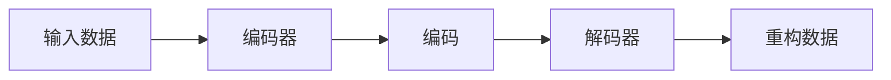

## 1.背景介绍

自编码器，这个名字听起来就像是一种神奇的魔法。它是一种特殊的神经网络，用于学习数据的有效表示，这种表示称为编码。自编码器的特点是，它可以使用少量的数据来学习这种编码，使得我们可以使用编码而不是原始数据。这样，我们就可以在保持数据质量的同时，大大减少数据的复杂性。

## 2.核心概念与联系

自编码器由两部分组成：编码器和解码器。编码器的任务是将输入数据转化为编码，而解码器的任务是将编码转化为原始数据。编码器和解码器通常都是神经网络，它们可以是任何类型的神经网络，例如全连接网络、卷积神经网络等。



## 3.核心算法原理具体操作步骤

自编码器的训练过程包含以下步骤：

1. 首先，我们需要将输入数据送入编码器，编码器会将数据转化为编码。
2. 然后，我们将编码送入解码器，解码器会将编码转化为重构数据。
3. 接着，我们需要比较重构数据和输入数据，计算它们之间的差异，这个差异称为重构误差。
4. 最后，我们需要通过优化算法，如梯度下降，来最小化重构误差，从而训练自编码器。

## 4.数学模型和公式详细讲解举例说明

自编码器的数学模型可以用以下公式表示：

假设我们有一个输入数据 $x$，编码器的函数为 $f$，解码器的函数为 $g$，那么重构数据 $x'$ 可以表示为：

$$
x' = g(f(x))
$$

重构误差 $L$ 可以表示为：

$$
L = ||x - x'||^2
$$

我们的目标是最小化重构误差 $L$，即：

$$
\min_{f, g} L
$$

## 5.项目实践：代码实例和详细解释说明

下面是一个简单的自编码器的实现，使用了 PyTorch 框架。

```python
import torch
from torch import nn

# 定义编码器
class Encoder(nn.Module):
    def __init__(self):
        super(Encoder, self).__init__()
        self.fc = nn.Linear(784, 128)

    def forward(self, x):
        return self.fc(x)

# 定义解码器
class Decoder(nn.Module):
    def __init__(self):
        super(Decoder, self).__init__()
        self.fc = nn.Linear(128, 784)

    def forward(self, x):
        return self.fc(x)

# 定义自编码器
class AutoEncoder(nn.Module):
    def __init__(self):
        super(AutoEncoder, self).__init__()
        self.encoder = Encoder()
        self.decoder = Decoder()

    def forward(self, x):
        return self.decoder(self.encoder(x))
```

## 6.实际应用场景

自编码器在许多领域都有广泛的应用，包括但不限于：

- 图像去噪：自编码器可以学习图像的有效表示，然后使用这种表示来重构图像，从而去除噪声。
- 特征提取：自编码器可以学习数据的有效表示，这种表示可以作为数据的特征，用于其他任务，如分类、聚类等。
- 异常检测：自编码器可以学习正常数据的有效表示，然后使用这种表示来重构数据，如果重构误差大于某个阈值，那么我们就可以认为这个数据是异常的。

## 7.工具和资源推荐

- PyTorch：一个强大的深度学习框架，可以用来实现自编码器。
- TensorFlow：另一个强大的深度学习框架，也可以用来实现自编码器。
- Keras：一个高级的深度学习框架，可以方便地实现自编码器。

## 8.总结：未来发展趋势与挑战

自编码器是一种强大的无监督学习方法，但它也面临着一些挑战，例如如何选择合适的编码器和解码器，如何选择合适的重构误差，如何处理大规模数据等。尽管如此，我相信随着深度学习技术的进步，这些问题都会得到解决，自编码器将在未来发挥更大的作用。

## 9.附录：常见问题与解答

Q: 自编码器可以用于有监督学习吗？

A: 自编码器本身是一种无监督学习方法，但它学习到的编码可以用于有监督学习。例如，我们可以先用自编码器学习数据的编码，然后用这种编码作为输入，训练一个分类器。

Q: 自编码器和PCA有什么区别？

A: 自编码器和PCA都是降维方法，但它们的方法不同。PCA是一种线性方法，它通过找到数据的主要方向来降维。而自编码器是一种非线性方法，它通过学习数据的有效表示来降维。

作者：禅与计算机程序设计艺术 / Zen and the Art of Computer Programming