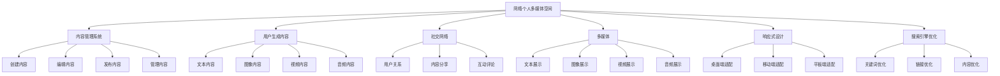

# 网络个人多媒体空间的设计(博客)

## 1.背景介绍

随着互联网和移动设备的快速发展,个人在线存在和自我表达的需求日益增长。博客作为一种网络个人多媒体空间,为用户提供了展示自己想法、分享生活、记录点滴的绝佳平台。无论是个人博客、企业博客还是专业博客,博客都成为了人们表达自我、交流互动的重要窗口。

博客的兴起可以追溯到上世纪90年代中期,最初是一种网络日志形式。随后,博客逐渐发展成为一种全新的网络出版模式,具有内容管理、版本控制、评论互动等功能。如今,博客已经成为网络时代自我表达和内容创作的代名词。

设计一个优秀的博客系统,需要考虑多方面的因素,包括用户体验、内容管理、社交互动、安全性等。本文将探讨网络个人多媒体空间(博客)的设计原则、核心技术以及实现方案,为读者提供全面的指导和最佳实践。

## 2.核心概念与联系

设计博客系统涉及多个核心概念,包括:

1. **内容管理系统(CMS)**:用于创建、编辑、发布和管理网站内容的应用程序。博客系统通常集成了CMS功能。
2. **用户生成内容(UGC)**:由用户创建和分享的各种形式的内容,如文本、图像、视频等。博客本质上就是一种UGC平台。
3. **社交网络**:允许用户建立社交关系、分享信息和进行互动的网络平台。博客系统通常包含社交功能,如关注、评论等。
4. **多媒体**:包括文本、图像、音频、视频等多种形式的媒体内容。博客系统需要支持多种媒体类型的发布和展示。
5. **响应式设计**:网站设计能够自动适应不同设备(如桌面、平板、手机等)的显示效果。移动互联网时代,响应式设计对博客系统至关重要。
6. **搜索引擎优化(SEO)**:一系列优化网站的措施,使其在搜索引擎中获得更高的排名和曝光率。SEO对博客的流量和影响力至关重要。

这些核心概念相互关联、环环相扣,构成了博客系统的基础架构。设计博客系统需要全面考虑和平衡这些因素,才能打造出卓越的用户体验。

## 3.核心算法原理具体操作步骤

设计博客系统涉及多个核心算法,包括:

### 3.1 内容管理算法

内容管理算法负责处理博客内容的创建、编辑、发布和管理等操作。主要步骤如下:

1. **内容创建**: 用户在编辑器中输入文本、上传图像、视频等多媒体内容,系统将内容数据存储到数据库中。
2. **内容编辑**: 用户可以对已发布的内容进行修改和编辑,系统需要提供版本控制功能,记录每次编辑的差异。
3. **内容发布**: 用户提交发布请求后,系统将内容从草稿状态转换为已发布状态,并生成对应的静态页面或动态页面。
4. **内容管理**: 系统提供内容列表、分类、标签等管理功能,方便用户对内容进行组织和检索。
5. **内容缓存**: 为提高访问速度,系统可以对热门内容进行缓存,减少数据库查询压力。
6. **内容搜索**: 系统集成全文搜索引擎,为用户提供内容搜索功能,支持关键词、标签等搜索方式。

### 3.2 社交互动算法

社交互动算法实现了用户之间的关系管理、内容分享和互动评论等功能,主要步骤包括:

1. **用户关系管理**: 用户可以关注其他用户,系统维护用户关系数据,并根据关系推送内容到用户的订阅流。
2. **内容分享**: 用户可以将自己的内容分享到其他社交平台,系统需要集成各平台的分享接口。
3. **互动评论**: 用户可以对博客内容发表评论,系统需要存储评论数据,并提供回复、点赞等互动功能。
4. **通知推送**: 当有新的关注者、评论或互动时,系统需要向用户推送通知,保持用户的参与度。
5. **反垃圾机制**: 系统需要采取措施防止垃圾评论、恶意关注等行为,保护社区环境。

### 3.3 多媒体处理算法

多媒体处理算法负责处理文本、图像、视频、音频等多种媒体类型,主要步骤包括:

1. **媒体上传**: 用户上传多媒体文件,系统需要进行文件类型和大小的检查,防止上传非法文件。
2. **媒体存储**: 系统将上传的媒体文件存储到对象存储服务中,并生成对应的访问链接。
3. **媒体转码**: 对于视频和音频文件,系统需要进行转码处理,生成适合不同终端和带宽的多种码率版本。
4. **媒体展示**: 系统需要在页面上正确展示各种媒体类型,并提供播放、缩放等交互功能。
5. **媒体优化**: 对于图像文件,系统可以进行压缩优化,减小文件大小,提高加载速度。

### 3.4 响应式设计算法

响应式设计算法确保博客系统能够适配不同终端设备,提供良好的用户体验,主要步骤包括:

1. **设备检测**: 系统需要检测用户的访问设备类型(桌面、平板、手机等),并加载对应的样式文件。
2. **自适应布局**: 采用自适应布局技术(如Bootstrap、Foundation等),根据设备屏幕大小动态调整页面元素的排列方式。
3. **媒体查询**: 使用CSS3的@media查询,根据设备特征(如屏幕分辨率、设备方向等)应用不同的样式规则。
4. **字体缩放**: 根据设备屏幕大小动态调整字体大小,保证良好的阅读体验。
5. **交互优化**: 针对移动设备,优化交互方式,如采用大按钮、手势操作等,提高可用性。

### 3.5 搜索引擎优化算法

搜索引擎优化算法旨在提高博客系统在搜索引擎中的排名和曝光率,主要步骤包括:

1. **关键词优化**: 根据用户的搜索习惯,优化页面标题、描述、正文等位置的关键词密度和排布。
2. **链接优化**: 构建合理的内链和外链结构,提高页面的权重和可访问性。
3. **内容优化**: 提供高质量、原创的内容,并保持内容的持续更新,吸引用户访问和链接。
4. **结构优化**: 优化网站的信息架构和导航结构,方便搜索引擎抓取和用户浏览。
5. **性能优化**: 优化页面加载速度、服务器响应时间等性能指标,提升用户体验。
6. **移动优化**: 针对移动设备进行优化,如采用响应式设计、提供APP等,满足移动搜索需求。

## 4.数学模型和公式详细讲解举例说明

在博客系统的设计中,有一些数学模型和公式可以帮助我们量化和优化系统的性能。

### 4.1 内容相关性模型

内容相关性模型用于衡量两篇文章之间的相似度,从而为用户推荐相关内容。常用的相关性模型包括:

1. **余弦相似度**

余弦相似度是一种常用的文本相似度计算方法,它基于文档的向量空间模型。假设有两篇文章$A$和$B$,它们的向量表示为$\vec{A}$和$\vec{B}$,则它们的余弦相似度定义为:

$$\text{CosineSimilarity}(A, B) = \frac{\vec{A} \cdot \vec{B}}{|\vec{A}||\vec{B}|} = \frac{\sum\limits_{i=1}^{n}A_iB_i}{\sqrt{\sum\limits_{i=1}^{n}A_i^2}\sqrt{\sum\limits_{i=1}^{n}B_i^2}}$$

其中$n$是向量的维度,通常对应于文档中不同词项的数量。余弦相似度的值介于0和1之间,值越大表示两篇文章越相似。

2. **BM25模型**

BM25是一种常用的文本相关性排序模型,它考虑了词频(TF)、逆文档频率(IDF)和文档长度等因素。对于查询$Q$和文档$D$,BM25分数定义为:

$$\text{BM25}(Q, D) = \sum\limits_{q \in Q} \text{IDF}(q) \cdot \frac{f(q, D) \cdot (k_1 + 1)}{f(q, D) + k_1 \cdot (1 - b + b \cdot \frac{|D|}{avgdl})}$$

其中:
- $f(q, D)$是查询词$q$在文档$D$中出现的次数
- $|D|$是文档$D$的长度
- $avgdl$是文档集合的平均长度
- $k_1$和$b$是调节因子,用于控制词频和文档长度的影响

BM25模型可以有效地将相关文档排在较高的位置,常用于搜索引擎和推荐系统中。

### 4.2 PageRank算法

PageRank算法最初是由谷歌公司提出的,用于评估网页的重要性和排名。在博客系统中,我们可以将PageRank算法应用于评估博客内容的质量和影响力。

PageRank算法的核心思想是,一篇高质量的文章会受到其他高质量文章的引用和链接。算法将网页看作一个图,每个网页是一个节点,链接则是边。PageRank值的计算公式如下:

$$PR(p_i) = (1 - d) + d \cdot \sum\limits_{p_j \in M(p_i)} \frac{PR(p_j)}{L(p_j)}$$

其中:
- $PR(p_i)$是页面$p_i$的PageRank值
- $M(p_i)$是链接到页面$p_i$的所有页面集合
- $L(p_j)$是页面$p_j$的出链接数量
- $d$是一个阻尼系数,通常取值为0.85

PageRank算法通过迭代计算直至收敛,得到每个页面的最终PageRank值。在博客系统中,我们可以将PageRank值作为内容质量的一个重要指标,用于内容推荐、排序等场景。

### 4.3 协同过滤推荐算法

协同过滤推荐算法是一种常用的个性化推荐技术,它基于用户过去的行为数据(如浏览历史、点赞记录等)来预测用户的兴趣偏好,从而为用户推荐感兴趣的内容。

常见的协同过滤算法包括:

1. **基于用户的协同过滤**

基于用户的协同过滤算法假设,具有相似兴趣爱好的用户,对于同一件物品也会有相似的评分。算法的步骤如下:

- 计算任意两个用户之间的相似度,常用的相似度计算方法有皮尔逊相关系数、余弦相似度等。
- 对于