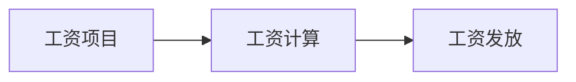

## 1.背景介绍

在现代企业管理中，工资管理作为企业人力资源管理的重要组成部分，其准确性、及时性和公正性对于企业的稳定和发展具有重要的影响。随着企业规模的扩大和管理的复杂性增加，传统的手工工资管理方式已经无法满足需求，因此，开发一个能够自动化处理工资计算和发放的职工工资管理系统变得越来越重要。

## 2.核心概念与联系

职工工资管理系统主要涉及到以下几个核心概念：

- **工资项目**：包括基本工资、岗位工资、绩效工资、津贴、奖金等。
- **工资计算**：根据员工的工作表现、出勤情况等因素，结合各项工资项目进行计算。
- **工资发放**：将计算好的工资按照规定的时间和方式发放给员工。

这三个核心概念之间的联系如下：



## 3.核心算法原理具体操作步骤

职工工资管理系统的核心算法主要包括工资项目管理、工资计算和工资发放三个部分。

1. **工资项目管理**：系统需要提供工资项目的增删改查功能，以便于管理各项工资项目的信息。

2. **工资计算**：系统需要根据员工的工作表现、出勤情况等因素，结合各项工资项目进行工资计算。具体的计算公式可以根据企业的实际情况进行设定。

3. **工资发放**：系统需要按照规定的时间和方式将计算好的工资发放给员工。发放方式可以包括现金、银行转账等。

## 4.数学模型和公式详细讲解举例说明

在职工工资管理系统中，工资计算是一个重要的环节。以下是一个简单的工资计算公式：

$$
工资 = 基本工资 + 岗位工资 + 绩效工资 + 津贴 + 奖金 - 扣款
$$

其中，各项工资和扣款的计算公式可以根据企业的实际情况进行设定。例如，绩效工资可以根据员工的工作绩效评分进行计算，具体的计算公式可以是：

$$
绩效工资 = 绩效评分 \times 绩效系数
$$

其中，绩效系数是一个预先设定的数值，绩效评分是根据员工的工作表现进行评定的。

## 5.项目实践：代码实例和详细解释说明

以下是一个简单的工资计算函数的代码实例：

```python
def calculate_salary(basic_salary, job_salary, performance_score, performance_coefficient, allowance, bonus, deduction):
    performance_salary = performance_score * performance_coefficient
    salary = basic_salary + job_salary + performance_salary + allowance + bonus - deduction
    return salary
```

这个函数接收七个参数，分别是基本工资、岗位工资、绩效评分、绩效系数、津贴、奖金和扣款。函数首先计算绩效工资，然后将各项工资加起来，最后减去扣款，得到最终的工资。

## 6.实际应用场景

职工工资管理系统可以广泛应用于各类企业和组织，包括但不限于制造业、服务业、公共事业等。通过使用职工工资管理系统，企业可以实现工资管理的自动化和精确化，提高工资管理的效率和准确性，同时也有助于提高员工的满意度和忠诚度。

## 7.工具和资源推荐

以下是一些开发和使用职工工资管理系统的推荐工具和资源：

- **开发工具**：Python、MySQL、Django
- **开发资源**：《Python编程：从入门到实践》、《MySQL必知必会》、《Django官方文档》

## 8.总结：未来发展趋势与挑战

随着科技的发展，职工工资管理系统将会越来越智能化和个性化。例如，系统可以根据大数据分析，自动调整工资项目和计算公式，以更好地激励员工的工作积极性。同时，随着员工对于工资透明度的要求提高，如何在保证公平公正的同时，保护员工的隐私，也是职工工资管理系统面临的一个挑战。

## 9.附录：常见问题与解答

**问**：职工工资管理系统可以自动计算工资吗？

**答**：是的，职工工资管理系统可以根据预设的工资项目和计算公式，自动计算员工的工资。

**问**：职工工资管理系统可以自动发放工资吗？

**答**：是的，职工工资管理系统可以按照预设的时间和方式，自动将计算好的工资发放给员工。

**问**：职工工资管理系统可以自定义工资项目和计算公式吗？

**答**：是的，职工工资管理系统通常都提供了工资项目和计算公式的自定义功能，以便于满足不同企业的需求。

作者：禅与计算机程序设计艺术 / Zen and the Art of Computer Programming