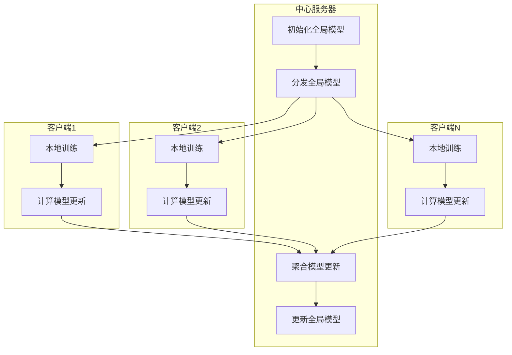

# 联邦学习(Federated Learning)原理与代码实战案例讲解

## 1. 背景介绍

### 1.1 数据隐私与机器学习的矛盾

在当今的数字时代,数据被视为新的"燃料",推动着人工智能和机器学习的发展。然而,随着数据隐私意识的不断增强,个人和企业对于保护敏感数据的需求也与日俱增。传统的集中式机器学习方法要求将所有训练数据集中在一个中心服务器上,这不仅存在数据隐私风险,而且在某些场景下也是不切实际的。

### 1.2 联邦学习的兴起

为了解决数据隐私与机器学习之间的矛盾,联邦学习(Federated Learning)应运而生。联邦学习是一种分布式机器学习范式,它允许多个客户端(如手机、物联网设备等)在保护数据隐私的同时,共同训练一个机器学习模型。这种方法避免了数据集中,同时也利用了大量分散的数据源,有助于提高模型的准确性和泛化能力。

### 1.3 联邦学习的优势

相比于传统的集中式机器学习,联邦学习具有以下优势:

- **数据隐私保护**: 训练数据不需要离开本地设备,从而有效保护了数据隐私。
- **数据异构性**: 可以利用来自不同设备、不同场景的异构数据,提高模型的泛化能力。
- **节省通信带宽**: 只需要传输模型参数,而不是原始数据,从而节省了通信带宽。
- **减轻中心服务器压力**: 计算任务分散在各个客户端,减轻了中心服务器的计算压力。

## 2. 核心概念与联系

### 2.1 联邦学习的基本流程

联邦学习的基本流程如下:

1. 中心服务器初始化一个全局模型,并将其分发给所有参与的客户端。
2. 每个客户端使用本地数据对全局模型进行训练,得到一个本地模型更新。
3. 客户端将本地模型更新上传到中心服务器。
4. 中心服务器聚合所有客户端的模型更新,得到一个新的全局模型。
5. 重复步骤1-4,直到模型收敛或达到预设的训练轮数。

### 2.2 联邦学习中的关键问题

尽管联邦学习为保护数据隐私提供了一种有效的解决方案,但它也面临着一些关键问题:

- **统计异构性**: 由于客户端数据分布不均匀,可能导致模型在某些数据上表现不佳。
- **系统异构性**: 客户端的计算能力、网络条件等存在差异,可能影响模型收敛速度。
- **隐私攻击**: 虽然原始数据不会离开客户端,但模型更新可能会泄露一些隐私信息。
- **通信开销**: 大量客户端参与训练会带来较大的通信开销。

后续章节将详细介绍联邦学习的核心算法原理,以及如何应对上述挑战。

## 3. 核心算法原理具体操作步骤

### 3.1 联邦平均算法(FedAvg)

联邦平均算法(FedAvg)是联邦学习中最基础和广为人知的算法,它的具体操作步骤如下:

1. **初始化**: 中心服务器初始化一个全局模型 $w_0$,并将其分发给所有客户端。

2. **本地训练**: 在第 $t$ 轮迭代中,中心服务器随机选择一部分客户端 $\mathcal{K}_t$,每个客户端 $k \in \mathcal{K}_t$ 使用本地数据 $\mathcal{D}_k$ 对当前全局模型 $w_t$ 进行 $E$ 轮本地训练,得到一个本地模型更新 $\Delta w_k^t$。本地训练通常使用小批量随机梯度下降(SGD)或其变体算法。

   $$
   \Delta w_k^t = w_k^t - w_t
   $$

   其中 $w_k^t$ 是客户端 $k$ 经过 $E$ 轮本地训练后的模型参数。

3. **模型聚合**: 中心服务器收集所有选中客户端的本地模型更新 $\{\Delta w_k^t\}_{k \in \mathcal{K}_t}$,并根据客户端的数据量 $n_k$ 计算加权平均,得到一个新的全局模型更新 $\Delta w_t$:

   $$
   \Delta w_t = \sum_{k \in \mathcal{K}_t} \frac{n_k}{n} \Delta w_k^t
   $$

   其中 $n = \sum_{k \in \mathcal{K}_t} n_k$ 是所有选中客户端的总数据量。

4. **模型更新**: 中心服务器使用新的全局模型更新 $\Delta w_t$ 更新当前全局模型 $w_t$,得到下一轮的全局模型 $w_{t+1}$:

   $$
   w_{t+1} = w_t + \eta_t \Delta w_t
   $$

   其中 $\eta_t$ 是第 $t$ 轮的学习率。

5. **迭代终止**: 重复步骤2-4,直到模型收敛或达到预设的最大训练轮数。

FedAvg 算法的优点是简单直观,易于实现和理解。然而,它也存在一些缺陷,例如对数据异构性和系统异构性的鲁棒性较差。后续章节将介绍一些改进的联邦学习算法,以应对这些挑战。

### 3.2 联邦学习中的一些改进算法

#### 3.2.1 联邦分布式优化算法

联邦分布式优化算法(FedOPT)是一种改进的联邦学习算法,它通过在客户端进行多次本地更新,并在服务器端进行控制变量优化,来提高收敛速度和通信效率。

FedOPT 算法的具体步骤如下:

1. 服务器初始化一个全局模型 $w_0$,并将其分发给所有客户端。
2. 在第 $t$ 轮迭代中,服务器随机选择一部分客户端 $\mathcal{K}_t$。
3. 每个客户端 $k \in \mathcal{K}_t$ 使用本地数据 $\mathcal{D}_k$ 对当前全局模型 $w_t$ 进行 $\tau_k$ 轮本地更新,得到一个本地模型 $w_k^t$。
4. 客户端将本地模型 $w_k^t$ 上传到服务器。
5. 服务器使用所有客户端上传的本地模型,通过控制变量优化算法(如ADMM、DANE等)计算出一个新的全局模型 $w_{t+1}$。
6. 重复步骤2-5,直到模型收敛或达到预设的最大训练轮数。

FedOPT 算法的优点在于,通过在客户端进行多次本地更新,可以减少通信开销;而在服务器端使用控制变量优化算法,可以提高模型收敛速度。此外,FedOPT 还具有一定的鲁棒性,能够更好地应对数据异构性和系统异构性带来的挑战。

#### 3.2.2 联邦代理优化算法

联邦代理优化算法(FedProx)是另一种改进的联邦学习算法,它在 FedAvg 的基础上引入了一个正则化项,以限制客户端模型与全局模型的偏离程度,从而提高对数据异构性的鲁棒性。

FedProx 算法的具体步骤如下:

1. 服务器初始化一个全局模型 $w_0$,并将其分发给所有客户端。
2. 在第 $t$ 轮迭代中,服务器随机选择一部分客户端 $\mathcal{K}_t$。
3. 每个客户端 $k \in \mathcal{K}_t$ 使用本地数据 $\mathcal{D}_k$ 对当前全局模型 $w_t$ 进行 $E$ 轮本地训练,得到一个本地模型更新 $\Delta w_k^t$,其中本地训练目标函数包含一个正则化项:

   $$
   \Delta w_k^t = \arg\min_{w} \left\{ F_k(w) + \frac{\mu}{2} \|w - w_t\|^2 \right\}
   $$

   其中 $F_k(w)$ 是客户端 $k$ 的本地损失函数, $\mu$ 是正则化系数,用于控制本地模型与全局模型之间的偏离程度。

4. 客户端将本地模型更新 $\Delta w_k^t$ 上传到服务器。
5. 服务器收集所有选中客户端的本地模型更新 $\{\Delta w_k^t\}_{k \in \mathcal{K}_t}$,并根据客户端的数据量 $n_k$ 计算加权平均,得到一个新的全局模型更新 $\Delta w_t$。
6. 服务器使用新的全局模型更新 $\Delta w_t$ 更新当前全局模型 $w_t$,得到下一轮的全局模型 $w_{t+1}$。
7. 重复步骤2-6,直到模型收敛或达到预设的最大训练轮数。

FedProx 算法的优点在于,通过引入正则化项,可以限制客户端模型与全局模型的偏离程度,从而提高对数据异构性的鲁棒性。然而,它也存在一些缺陷,例如正则化系数的选择对模型性能有较大影响,且无法很好地应对系统异构性带来的挑战。

#### 3.2.3 联邦学习中的其他算法

除了上述算法之外,还有一些其他改进的联邦学习算法,例如:

- **FedNova**: 通过控制客户端模型更新的范数,来提高对异构数据和异构系统的鲁棒性。
- **FedDyn**: 通过动态调整客户端的学习率和本地训练轮数,来适应不同的数据和系统异构性。
- **FedProx-SAGA**: 结合了 FedProx 和 SAGA 算法,能够更好地处理非凸和强对偶问题。
- **FedBCD**: 基于块坐标下降算法,可以在保证隐私的同时提高收敛速度。

这些算法各有优缺点,需要根据具体场景和需求进行选择和调优。

## 4. 数学模型和公式详细讲解举例说明

### 4.1 联邦学习的数学模型

我们可以将联邦学习问题建模为以下优化问题:

$$
\min_{w} F(w) = \sum_{k=1}^{K} \frac{n_k}{n} F_k(w)
$$

其中:

- $w$ 是需要优化的模型参数
- $K$ 是客户端的总数
- $n_k$ 是第 $k$ 个客户端的数据量
- $n = \sum_{k=1}^{K} n_k$ 是所有客户端的总数据量
- $F_k(w)$ 是第 $k$ 个客户端的本地损失函数,定义为:

  $$
  F_k(w) = \frac{1}{n_k} \sum_{i=1}^{n_k} f(w; x_i^k, y_i^k)
  $$

  其中 $(x_i^k, y_i^k)$ 是第 $k$ 个客户端的第 $i$ 个数据样本,而 $f(w; x, y)$ 是模型在单个样本上的损失函数。

在联邦学习中,我们无法直接优化上述目标函数,因为每个客户端只能访问自己的本地数据 $\mathcal{D}_k$,无法获取其他客户端的数据。因此,我们需要采用迭代优化的方式,在每一轮迭代中,客户端使用本地数据对当前全局模型进行更新,然