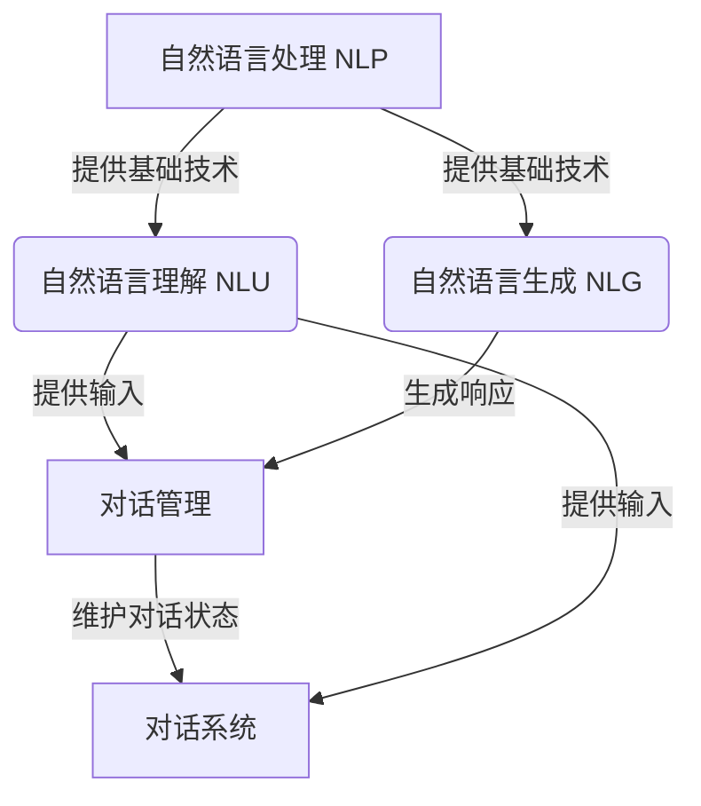

# 自然语言交互与对话系统原理与代码实战案例讲解

## 1.背景介绍

在当今时代,人工智能技术飞速发展,自然语言处理(NLP)作为其中的一个重要分支,已经广泛应用于各个领域。随着人机交互需求的不断增长,自然语言交互系统(NLI)和对话系统的重要性日益凸显。这些系统旨在实现人与机器之间自然、流畅的语言交互,提高工作效率,优化用户体验。

### 1.1 自然语言交互系统概述

自然语言交互系统是一种能够理解和生成人类自然语言的计算机系统。它通过语音或文本输入接收用户的查询或命令,对其进行语义理解和意图识别,然后根据上下文生成相应的自然语言响应。这种交互方式更加自然、直观,降低了人机交互的门槛。

### 1.2 对话系统概述

对话系统是一种更加复杂的自然语言交互形式。它不仅需要理解单个查询,还需要维护对话的连贯性和上下文,根据之前的对话历史生成恰当的响应。对话系统广泛应用于客服机器人、个人助理等领域,为用户提供更加智能化的交互体验。

### 1.3 应用场景

自然语言交互和对话系统在诸多领域发挥着重要作用,例如:

- 智能助手(Siri、Alexa等)
- 客服机器人
- 问答系统
- 语音交互系统
- 教育辅助系统
- 医疗健康领域
- 等等

## 2.核心概念与联系

在深入探讨自然语言交互和对话系统的原理之前,我们需要了解一些核心概念及其相互关系。

### 2.1 自然语言处理(NLP)

自然语言处理是人工智能的一个分支,旨在使计算机能够理解和生成人类语言。它包括以下几个关键步骤:

1. **语音识别**: 将语音信号转换为文本。
2. **词法分析**: 将文本分割成单词(tokens)。
3. **句法分析**: 确定单词之间的语法关系。
4. **语义分析**: 理解句子的实际含义。
5. **语音合成**: 将文本转换为语音输出。

### 2.2 机器学习在NLP中的应用

传统的NLP系统通常基于规则和特征工程,但近年来,机器学习和深度学习技术在NLP领域取得了巨大成功。常见的机器学习模型包括:

- **词向量**(Word Embeddings): 将单词映射到连续的向量空间,捕捉语义和语法信息。
- **递归神经网络**(RNN): 处理序列数据,适用于语言建模和生成任务。
- **长短期记忆网络**(LSTM): 改进的RNN,解决了长期依赖问题。
- **注意力机制**(Attention Mechanism): 允许模型关注输入序列的不同部分。
- **transformer**: 基于注意力机制的新型神经网络架构,在多个NLP任务中表现出色。
- **BERT**: 基于transformer的预训练语言模型,在多个NLP基准测试中取得了最佳成绩。

### 2.3 自然语言理解(NLU)

自然语言理解是自然语言交互和对话系统的核心组成部分。它包括以下几个关键步骤:

1. **tokenization**: 将输入文本分割成单词或子词单元。
2. **命名实体识别**(NER): 识别文本中的人名、地名、组织机构名等实体。
3. **词性标注**(POS Tagging): 确定每个单词的词性(名词、动词、形容词等)。
4. **依存分析**: 确定句子中单词之间的依存关系。
5. **意图识别**: 确定用户查询的目的或意图。
6. **槽填充**(Slot Filling): 从查询中提取关键信息,填充到预定义的"槽"中。

### 2.4 自然语言生成(NLG)

自然语言生成是将结构化数据或语义表示转换为自然语言文本的过程。它在自然语言交互和对话系统中扮演着重要角色,用于生成对用户查询的响应。常见的NLG技术包括:

- **基于模板的生成**: 使用预定义的模板和规则生成响应。
- **基于统计的生成**: 使用统计语言模型从训练数据中学习生成响应。
- **基于神经网络的生成**: 使用序列到序列(Seq2Seq)模型或变体(如带注意力机制的模型)生成响应。

### 2.5 对话管理

对话管理是对话系统的"大脑",负责维护对话状态、决策下一步行为以及管理对话流程。它通常包括以下组件:

1. **对话状态跟踪器**: 跟踪对话的当前状态和历史。
2. **对话策略**: 根据当前状态决策下一步的行为(如请求更多信息或提供响应)。
3. **错误处理和恢复**: 处理异常情况,如无法理解的查询或系统错误。

### 2.6 核心概念关系

上述核心概念之间存在着紧密的联系,它们共同构成了自然语言交互和对话系统的基础。下图展示了它们之间的关系:

## 3.核心算法原理具体操作步骤

在本节中,我们将探讨自然语言交互和对话系统中一些核心算法的原理和具体操作步骤。

### 3.1 序列到序列模型(Seq2Seq)

序列到序列模型是一种常用的神经网络架构,广泛应用于机器翻译、对话系统等任务。它由两个主要组件组成:编码器(Encoder)和解码器(Decoder)。

#### 3.1.1 编码器(Encoder)

编码器的作用是将输入序列(如一个句子)映射到一个向量表示,称为上下文向量(Context Vector)。常见的编码器包括:

- **RNN编码器**: 使用RNN或LSTM对输入序列进行编码。
- **Transformer编码器**: 基于自注意力机制,允许模型关注输入序列的不同部分。

编码器的操作步骤如下:

1. 将输入序列的每个单词映射到其词向量表示。
2. 使用RNN/LSTM或Transformer对词向量序列进行编码,产生隐藏状态序列。
3. 对隐藏状态序列进行池化操作(如取最后一个隐藏状态),得到上下文向量。

#### 3.1.2 解码器(Decoder)

解码器的作用是根据上下文向量生成目标序列(如一个句子)。常见的解码器包括:

- **RNN解码器**: 使用RNN或LSTM生成目标序列。
- **Transformer解码器**: 基于自注意力机制和编码器-解码器注意力机制。

解码器的操作步骤如下:

1. 初始化解码器的隐藏状态,通常使用上下文向量或特殊的起始标记。
2. 在每个时间步:
   - 根据当前隐藏状态和上一个生成的单词,预测下一个单词的概率分布。
   - 从概率分布中采样或选择概率最大的单词作为输出。
   - 更新隐藏状态,准备生成下一个单词。
3. 重复步骤2,直到生成终止标记或达到最大长度。

Seq2Seq模型通常使用最大似然估计(Maximum Likelihood Estimation)进行训练,目标是最大化生成正确目标序列的概率。

### 3.2 注意力机制(Attention Mechanism)

注意力机制是一种重要的神经网络组件,允许模型在编码或解码时关注输入序列的不同部分。它广泛应用于机器翻译、阅读理解等任务。

#### 3.2.1 注意力计算

注意力计算的基本思想是:对于每个目标位置,计算其与源序列中每个位置的相关性得分,然后根据这些得分对源序列进行加权求和,得到一个注意力向量。

具体操作步骤如下:

1. 计算查询向量(Query)、键向量(Key)和值向量(Value)。
2. 计算查询向量与每个键向量的相似性得分(通常使用点积或缩放点积)。
3. 对相似性得分进行softmax操作,得到注意力权重。
4. 使用注意力权重对值向量进行加权求和,得到注意力向量。
5. 将注意力向量与其他向量(如解码器隐藏状态)进行组合,作为下游任务的输入。

#### 3.2.2 多头注意力(Multi-Head Attention)

多头注意力是一种常用的注意力变体,它允许模型从不同的表示子空间捕捉不同的相关模式。

具体操作步骤如下:

1. 将查询向量(Query)、键向量(Key)和值向量(Value)线性投影到多个头(Head)上。
2. 对于每个头,独立计算注意力向量。
3. 将所有头的注意力向量进行拼接,并进行线性变换,得到最终的多头注意力向量。

多头注意力机制提高了模型的表示能力,并且通过并行计算提高了计算效率。

### 3.3 BERT及其变体

BERT(Bidirectional Encoder Representations from Transformers)是一种基于Transformer的预训练语言模型,在多个NLP任务中取得了卓越的表现。

#### 3.3.1 BERT预训练

BERT的预训练过程包括两个主要任务:

1. **掩码语言模型**(Masked Language Modeling, MLM): 随机掩码输入序列中的一些单词,并预测这些被掩码的单词。
2. **下一句预测**(Next Sentence Prediction, NSP): 判断两个句子是否连续出现在语料库中。

通过这两个任务,BERT学习了双向的上下文表示,能够更好地捕捉单词之间的关系。

#### 3.3.2 BERT微调

在下游任务上,BERT通常采用微调(Fine-tuning)的方式进行迁移学习。具体步骤如下:

1. 添加一个特定任务的输出层(如分类层或序列标注层)到BERT模型之上。
2. 在特定任务的标注数据上微调整个模型(包括BERT和输出层)的参数。
3. 在测试集上评估模型性能。

BERT及其变体(如RoBERTa、ALBERT等)在多个NLP任务上取得了最佳性能,成为当前最流行的预训练语言模型之一。

### 3.4 对话策略学习

对话策略是对话管理的核心组件,决定了系统在每个对话状态下采取何种行为。常见的对话策略学习方法包括:

#### 3.4.1 基于规则的策略

基于规则的策略依赖于人工设计的规则和流程图,相对简单但缺乏灵活性。

#### 3.4.2 监督学习策略

监督学习策略将对话策略建模为一个监督学习问题,使用标注的对话数据进行训练。常见的方法包括:

- 将对话状态和行为作为特征,训练一个分类器(如逻辑回归或神经网络)预测下一个行为。
- 使用序列标注模型(如RNN或Transformer)直接预测整个对话行为序列。

#### 3.4.3 强化学习策略

强化学习策略将对话过程建模为一个马尔可夫决策过程(MDP),通过与用户交互来学习最优策略。常见的方法包括:

- **Q-Learning**: 学习一个Q函数,估计在给定状态采取某个行为的长期回报。
- **策略梯度方法**(Policy Gradient): 直接优化策略模型的参数,使期望回报最大化。

强化学习策略具有更强的泛化能力,但训练过程复杂,需要大量的交互数据。

### 3.5 端到端对话系统训练

除了分别训练各个组件,近年来也出现了一些端到端训练对话系统的方法,试图直接从对话数据中学习整个系统。常见的方法包括:

#### 3.5.1 序列到序列模型

将