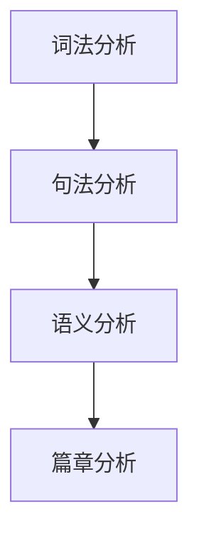

# 自然语言处理原理与代码实战案例讲解

## 1. 背景介绍
### 1.1 自然语言处理概述
#### 1.1.1 自然语言处理的定义
自然语言处理（Natural Language Processing，NLP）是人工智能的一个重要分支，旨在使计算机能够理解、生成和处理人类语言。它涉及语言学、计算机科学和人工智能等多个学科领域的交叉融合。

#### 1.1.2 自然语言处理的发展历程
自然语言处理的研究可以追溯到20世纪50年代，经历了基于规则、统计学习和深度学习等不同阶段。近年来，随着深度学习技术的突破和大规模语料库的积累，NLP取得了长足的进步，在机器翻译、情感分析、问答系统等应用领域展现出巨大的潜力。

#### 1.1.3 自然语言处理的应用场景
自然语言处理技术已广泛应用于各个领域，如智能客服、搜索引擎、语音助手、文本分类、情感分析、机器翻译、知识图谱等。它极大地改变了人们与计算机交互的方式，提升了信息处理和知识挖掘的效率。

### 1.2 自然语言处理的挑战
#### 1.2.1 语言的复杂性和多样性
人类语言具有高度的复杂性和多样性，存在歧义、语境依赖、隐喻等现象，给计算机理解带来了巨大挑战。不同语言之间的差异也增加了NLP任务的难度。

#### 1.2.2 知识表示和推理
自然语言处理需要将语言知识进行合适的表示，并具备一定的推理能力，以实现对语义的深入理解。知识表示和推理是NLP的核心问题之一。

#### 1.2.3 数据标注和模型训练
大规模高质量的标注数据是训练高性能NLP模型的基础。然而，语言数据的标注成本高昂，对专业知识要求高，这在一定程度上制约了NLP技术的发展。

## 2. 核心概念与联系
### 2.1 词法分析
#### 2.1.1 分词
将连续的字符序列切分成有意义的词汇单元，是NLP的基础步骤之一。常见的分词算法有基于字典匹配、统计模型、深度学习等方法。

#### 2.1.2 词性标注
为分词结果中的每个单词赋予词性标签，如名词、动词、形容词等。词性信息对句法分析和语义理解具有重要意义。常用的词性标注算法包括隐马尔可夫模型、条件随机场等。

### 2.2 句法分析
#### 2.2.1 成分句法分析
将句子划分为主语、谓语、宾语等语法成分，揭示句子的语法结构。常见的句法分析算法有基于规则的方法和基于统计的方法。

#### 2.2.2 依存句法分析
分析句子中词与词之间的依存关系，构建依存句法树。依存句法信息对语义角色标注、信息抽取等任务具有重要价值。基于转移的方法和基于图的方法是两类主流的依存句法分析算法。

### 2.3 语义分析
#### 2.3.1 词义消歧
解决词汇在不同语境下的多义性问题，确定词语在具体语境中的准确含义。常用的词义消歧方法有基于知识的方法和基于监督学习的方法。

#### 2.3.2 语义角色标注
识别句子中的语义角色，如施事、受事、时间、地点等，揭示句子的语义结构。常见的语义角色标注算法包括基于特征工程的方法和基于深度学习的方法。

#### 2.3.3 指代消解
确定代词或其他指示性表达所指代的对象，以理解语篇的连贯性。指代消解通常采用基于规则的方法和基于机器学习的方法。

### 2.4 篇章分析
#### 2.4.1 篇章结构分析
分析语篇的结构组织，识别语篇中的连贯关系和修辞结构。篇章结构分析对文本摘要、文本分类等任务具有重要意义。

#### 2.4.2 语篇连贯性分析
研究语篇中句子和段落之间的语义连贯性，包括照应关系、连接关系等。语篇连贯性分析有助于提高文本理解的准确性。

### 2.5 各个层面之间的关系

词法分析是NLP的基础，为句法分析提供词汇单元和词性信息。句法分析在词法分析的基础上进行，揭示句子的语法结构。语义分析依赖于词法和句法信息，进行词义消歧、语义角色标注等。篇章分析建立在以上各个层面之上，分析语篇的结构和连贯性。各个层面之间相互依存、密切关联，共同构成了自然语言处理的完整体系。

## 3. 核心算法原理具体操作步骤
### 3.1 分词算法
#### 3.1.1 基于字典匹配的分词
1. 构建词典，收录常用词汇及其词性信息。
2. 对输入文本进行扫描，采用正向最大匹配或逆向最大匹配的策略，在词典中查找匹配的词汇。
3. 将匹配到的词汇作为分词结果输出。
4. 对未登录词进行处理，可以采用一些启发式规则或统计方法进行识别。

#### 3.1.2 基于统计模型的分词
1. 对大规模语料库进行预处理，进行分词和标注。
2. 根据标注语料，训练统计分词模型，常用的模型有隐马尔可夫模型、条件随机场等。
3. 对新的输入文本，使用训练好的统计模型进行分词，得到最优的分词序列。

#### 3.1.3 基于深度学习的分词
1. 将分词问题转化为序列标注问题，每个字符对应一个标签（如B、M、E、S），表示该字符在词中的位置。
2. 构建深度学习模型，常用的模型有BiLSTM-CRF、Transformer等。
3. 对标注语料进行训练，优化模型参数。
4. 对新的输入文本，使用训练好的深度学习模型进行分词，得到最优的分词序列。

### 3.2 词性标注算法
#### 3.2.1 基于隐马尔可夫模型的词性标注
1. 对标注语料进行统计，计算词性的先验概率和词性转移概率。
2. 对观测序列（词序列）进行统计，计算发射概率。
3. 使用维特比算法，在词性标签序列空间中搜索最优路径，得到词性标注结果。

#### 3.2.2 基于条件随机场的词性标注
1. 定义特征模板，提取词性标注相关的特征，如词本身、前后词、前后词性等。
2. 对标注语料进行特征提取，构建特征向量。
3. 使用条件随机场模型进行训练，优化模型参数。
4. 对新的输入文本，提取特征，使用训练好的条件随机场模型进行词性标注。

### 3.3 句法分析算法
#### 3.3.1 基于规则的句法分析
1. 定义句法规则，描述句子的语法结构。
2. 对输入句子进行分词和词性标注。
3. 使用自顶向下或自底向上的分析策略，根据句法规则对句子进行递归分析，生成句法树。

#### 3.3.2 基于统计的句法分析
1. 对句法树库进行统计，计算语法规则的概率。
2. 使用PCFG（概率上下文无关文法）对句子进行建模，计算句子的生成概率。
3. 使用CKY算法或Earley算法，在语法规则空间中搜索最优的句法树。

### 3.4 语义角色标注算法
#### 3.4.1 基于特征工程的语义角色标注
1. 定义语义角色标注相关的特征，如谓词、论元的词性、位置、依存关系等。
2. 对标注语料进行特征提取，构建特征向量。
3. 使用机器学习模型（如支持向量机、最大熵模型等）进行训练，优化模型参数。
4. 对新的输入句子，提取特征，使用训练好的模型进行语义角色标注。

#### 3.4.2 基于深度学习的语义角色标注
1. 将语义角色标注问题转化为序列标注问题，每个词对应一个语义角色标签。
2. 构建深度学习模型，常用的模型有BiLSTM-CRF、Transformer等。
3. 对标注语料进行训练，优化模型参数。
4. 对新的输入句子，使用训练好的深度学习模型进行语义角色标注。

## 4. 数学模型和公式详细讲解举例说明
### 4.1 隐马尔可夫模型
隐马尔可夫模型（Hidden Markov Model, HMM）是一种统计学模型，常用于序列标注任务，如词性标注、命名实体识别等。HMM由状态序列和观测序列组成，状态序列是隐藏的，观测序列是可观察的。

HMM的三个基本问题：
1. 评估问题：给定模型参数和观测序列，计算观测序列的概率。
2. 解码问题：给定模型参数和观测序列，求最可能的状态序列。
3. 学习问题：给定观测序列，估计模型参数。

HMM的三个基本参数：
1. 初始状态概率向量 $\pi$：$\pi_i=P(q_1=i), i=1,2,\dots,N$
2. 状态转移概率矩阵 $A$：$a_{ij}=P(q_{t+1}=j|q_t=i), i,j=1,2,\dots,N$
3. 发射概率矩阵 $B$：$b_j(k)=P(o_t=v_k|q_t=j), j=1,2,\dots,N; k=1,2,\dots,M$

其中，$N$是状态的数量，$M$是观测符号的数量。

举例说明：
在词性标注任务中，状态序列对应词性标签序列，观测序列对应词序列。通过统计标注语料，可以估计HMM的三个基本参数。在标注新的句子时，使用维特比算法求解最优的词性标签序列。

维特比算法的递推公式：
$$
\delta_t(i)=\max_{1\leq j\leq N}\delta_{t-1}(j)a_{ji}b_i(o_t), i=1,2,\dots,N; t=1,2,\dots,T
$$
其中，$\delta_t(i)$表示在时刻$t$状态为$i$的最大概率，$T$是观测序列的长度。

### 4.2 条件随机场
条件随机场（Conditional Random Field, CRF）是一种判别式概率图模型，常用于序列标注任务。相比HMM，CRF可以引入更丰富的特征，并且对观测序列的依赖更加灵活。

CRF的定义：
给定观测序列$X=(x_1,x_2,\dots,x_T)$和状态序列$Y=(y_1,y_2,\dots,y_T)$，CRF定义条件概率：
$$
P(Y|X)=\frac{1}{Z(X)}\exp\left(\sum_{t=1}^T\sum_{k=1}^K\lambda_kf_k(y_{t-1},y_t,X,t)\right)
$$
其中，$Z(X)$是归一化因子，$f_k$是特征函数，$\lambda_k$是对应的权重参数。

CRF的三个基本问题：
1. 评估问题：给定模型参数和观测序列，计算条件概率。
2. 解码问题：给定模型参数和观测序列，求最可能的状态序列。
3. 学习问题：给定观测序列和对应的状态序列，估计模型参数。

举例说明：
在命名实体识别任务中，观测序列对应词序列，状态序列对应命名实体标签序列（如B-Person、I-Person、O等）。通过特征模板提取词性、词本身、前后词等特征，构建特征向量。使用CRF模型进行训练，学习特征权重参数。