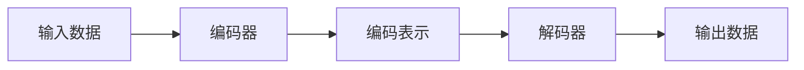

# 自编码器 (Autoencoders) 原理与代码实例讲解

## 1.背景介绍

### 1.1 什么是自编码器？

自编码器(Autoencoder)是一种无监督学习的人工神经网络,其被设计用于通过神经网络将输入数据编码为较低维度的编码表示,然后再将该编码解码为与输入数据接近的输出。自编码器的目标是学习输入数据的紧凑表示形式,以便可以捕捉输入数据的最重要特征。

### 1.2 自编码器的应用

自编码器具有多种应用,包括:

- 数据去噪
- 特征学习和降维
- 数据压缩
- 序列到序列学习
- 图像生成

### 1.3 自编码器的类型

常见的自编码器类型包括:

- 稀疏自编码器(Sparse Autoencoder)
- 变分自编码器(Variational Autoencoder, VAE)
- 卷积自编码器(Convolutional Autoencoder)
- 递归自编码器(Recursive Autoencoder)
- 去噪自编码器(Denoising Autoencoder)

## 2.核心概念与联系

### 2.1 自编码器的结构

自编码器通常由两部分组成:编码器(Encoder)和解码器(Decoder)。



编码器将高维输入数据压缩为低维编码表示,而解码器则将该编码表示解码为与原始输入数据接近的输出。

### 2.2 自编码器的损失函数

自编码器的训练目标是最小化输入数据与重构输出数据之间的差异,通常使用均方误差(Mean Squared Error, MSE)或交叉熵(Cross Entropy)作为损失函数。

$$\text{Loss} = \frac{1}{n}\sum_{i=1}^{n}(x_i - \hat{x}_i)^2$$

其中 $x_i$ 是输入数据, $\hat{x}_i$ 是重构输出数据, $n$ 是数据样本数量。

### 2.3 自编码器的正则化

为了防止自编码器简单地学习输入数据的恒等映射,通常会对编码器施加正则化约束,例如:

- 稀疏性约束(Sparsity Constraint)
- 降噪自编码器(Denoising Autoencoder)
- 变分自编码器(Variational Autoencoder, VAE)

## 3.核心算法原理具体操作步骤 

### 3.1 基本自编码器算法步骤

1. **初始化编码器和解码器网络**:定义网络结构和参数。
2. **前向传播**:将输入数据通过编码器获得编码表示,再通过解码器获得重构输出。
3. **计算损失**:比较输入数据与重构输出的差异,计算损失函数值。
4. **反向传播**:根据损失函数值,计算网络参数的梯度。
5. **更新参数**:使用优化算法(如梯度下降)更新网络参数。
6. **重复训练**:重复步骤2-5,直至收敛或达到最大迭代次数。

### 3.2 稀疏自编码器算法步骤

1. **初始化编码器和解码器网络**:定义网络结构和参数。
2. **前向传播**:将输入数据通过编码器获得编码表示,再通过解码器获得重构输出。
3. **计算重构损失**:比较输入数据与重构输出的差异,计算重构损失函数值。
4. **计算稀疏性损失**:计算编码表示的稀疏性损失函数值。
5. **计算总损失**:将重构损失和稀疏性损失相加,得到总损失函数值。
6. **反向传播**:根据总损失函数值,计算网络参数的梯度。
7. **更新参数**:使用优化算法(如梯度下降)更新网络参数。
8. **重复训练**:重复步骤2-7,直至收敛或达到最大迭代次数。

### 3.3 变分自编码器算法步骤

1. **初始化编码器和解码器网络**:定义网络结构和参数。
2. **前向传播**:将输入数据通过编码器获得均值和方差参数,采样获得编码表示,再通过解码器获得重构输出。
3. **计算重构损失**:比较输入数据与重构输出的差异,计算重构损失函数值。
4. **计算KL散度损失**:计算编码表示与标准正态分布之间的KL散度损失函数值。
5. **计算总损失**:将重构损失和KL散度损失相加,得到总损失函数值。
6. **反向传播**:根据总损失函数值,计算网络参数的梯度。
7. **更新参数**:使用优化算法(如梯度下降)更新网络参数。 
8. **重复训练**:重复步骤2-7,直至收敛或达到最大迭代次数。

## 4.数学模型和公式详细讲解举例说明

### 4.1 自编码器的数学模型

设输入数据为 $\mathbf{x} \in \mathbb{R}^{d}$,编码函数为 $f_\theta: \mathbb{R}^{d} \rightarrow \mathbb{R}^{k}$,解码函数为 $g_\phi: \mathbb{R}^{k} \rightarrow \mathbb{R}^{d}$,其中 $\theta$ 和 $\phi$ 分别表示编码器和解码器的参数。

自编码器的目标是找到参数 $\theta$ 和 $\phi$,使得重构输出 $\hat{\mathbf{x}} = g_\phi(f_\theta(\mathbf{x}))$ 尽可能接近原始输入 $\mathbf{x}$。

常用的重构损失函数是均方误差(MSE):

$$\mathcal{L}(\mathbf{x}, \hat{\mathbf{x}}) = \|\mathbf{x} - \hat{\mathbf{x}}\|^2 = \|\mathbf{x} - g_\phi(f_\theta(\mathbf{x}))\|^2$$

通过最小化该损失函数,可以学习到输入数据的紧凑编码表示 $f_\theta(\mathbf{x})$。

### 4.2 稀疏自编码器

为了获得更加稀疏的编码表示,稀疏自编码器在重构损失基础上增加了稀疏性惩罚项。设编码表示为 $\mathbf{h} = f_\theta(\mathbf{x})$,稀疏性惩罚项可以定义为:

$$\Omega(\mathbf{h}) = \sum_{j=1}^{k} \text{KL}(\rho \| \hat{\rho}_j)$$

其中 $\rho$ 是期望的稀疏度, $\hat{\rho}_j = \frac{1}{m}\sum_{i=1}^{m}[h_j^{(i)}]$ 是第 $j$ 个隐层神经元的平均活跃度, $m$ 是样本数量。

KL散度(Kullback-Leibler Divergence)定义为:

$$\text{KL}(\rho \| \hat{\rho}_j) = \rho \log\frac{\rho}{\hat{\rho}_j} + (1-\rho)\log\frac{1-\rho}{1-\hat{\rho}_j}$$

总损失函数为重构损失与稀疏性惩罚项之和:

$$\mathcal{L}(\mathbf{x}, \hat{\mathbf{x}}) = \|\mathbf{x} - \hat{\mathbf{x}}\|^2 + \lambda \Omega(\mathbf{h})$$

其中 $\lambda$ 是调节两项之间权重的超参数。

### 4.3 变分自编码器

变分自编码器(VAE)假设编码表示 $\mathbf{z}$ 服从某个潜在的概率分布 $p(\mathbf{z})$,通常假设为标准正态分布 $\mathcal{N}(0, \mathbf{I})$。编码器的目标是学习将输入数据 $\mathbf{x}$ 映射到该潜在空间的分布 $q_\theta(\mathbf{z}|\mathbf{x})$,而解码器则学习从该潜在空间重构原始数据 $p_\phi(\mathbf{x}|\mathbf{z})$。

VAE的损失函数由两部分组成:

1. **重构损失**: $\mathbb{E}_{q_\theta(\mathbf{z}|\mathbf{x})}[\log p_\phi(\mathbf{x}|\mathbf{z})]$
2. **KL散度损失**: $\text{KL}(q_\theta(\mathbf{z}|\mathbf{x}) \| p(\mathbf{z}))$

总损失函数为:

$$\mathcal{L}(\mathbf{x}, \theta, \phi) = -\mathbb{E}_{q_\theta(\mathbf{z}|\mathbf{x})}[\log p_\phi(\mathbf{x}|\mathbf{z})] + \text{KL}(q_\theta(\mathbf{z}|\mathbf{x}) \| p(\mathbf{z}))$$

在实现中,通常使用蒙特卡罗采样来近似计算期望项,而KL散度项则可以解析计算。

## 5.项目实践:代码实例和详细解释说明

以下是使用PyTorch实现基本自编码器的代码示例:

```python
import torch
import torch.nn as nn

# 定义自编码器模型
class Autoencoder(nn.Module):
    def __init__(self, input_dim, encoded_dim):
        super(Autoencoder, self).__init__()
        
        # 编码器
        self.encoder = nn.Sequential(
            nn.Linear(input_dim, 512),
            nn.ReLU(),
            nn.Linear(512, encoded_dim)
        )
        
        # 解码器
        self.decoder = nn.Sequential(
            nn.Linear(encoded_dim, 512),
            nn.ReLU(),
            nn.Linear(512, input_dim)
        )
        
    def forward(self, x):
        # 编码
        encoded = self.encoder(x)
        
        # 解码
        decoded = self.decoder(encoded)
        
        return decoded

# 超参数设置
input_dim = 784  # MNIST图像展平后的维度
encoded_dim = 32 # 编码维度
batch_size = 128
epochs = 20
learning_rate = 1e-3

# 加载MNIST数据集
from torchvision.datasets import MNIST
from torch.utils.data import DataLoader

train_dataset = MNIST(root='./data', train=True, transform=None, download=True)
train_loader = DataLoader(train_dataset, batch_size=batch_size, shuffle=True)

# 初始化模型
model = Autoencoder(input_dim, encoded_dim)

# 定义损失函数和优化器
criterion = nn.MSELoss()
optimizer = torch.optim.Adam(model.parameters(), lr=learning_rate)

# 训练模型
for epoch in range(epochs):
    train_loss = 0.0
    for data, _ in train_loader:
        data = data.view(-1, input_dim).float()
        
        # 前向传播
        outputs = model(data)
        loss = criterion(outputs, data)
        
        # 反向传播和优化
        optimizer.zero_grad()
        loss.backward()
        optimizer.step()
        
        train_loss += loss.item() * data.size(0)
        
    train_loss /= len(train_dataset)
    print(f'Epoch {epoch+1}, Loss: {train_loss:.4f}')
```

代码解释:

1. 定义自编码器模型,包括编码器和解码器两个子模块。编码器将输入数据编码为低维编码表示,解码器则将编码表示解码为与输入数据相近的输出。
2. 设置超参数,包括输入维度、编码维度、批量大小、训练轮数和学习率。
3. 加载MNIST数据集,并使用DataLoader构建数据加载器。
4. 初始化自编码器模型实例。
5. 定义均方误差(MSE)作为损失函数,使用Adam优化器。
6. 训练模型,对于每个epoch:
   - 遍历训练数据集
   - 进行前向传播,计算重构输出
   - 计算重构损失
   - 反向传播,更新模型参数

在训练过程中,自编码器将学习到输入数据的紧凑编码表示,并尝试从该编码表示重构原始输入数据。

## 6.实际应用场景

自编码器在以下领域有广泛的应用:

1. **数据去噪**: 通过训练去噪自编码器,可以从含噪数据中学习干净数据的表示,从而实现数据去噪。
2. **异常检测**: 利用自编码器对正常数据进行编码和重构,异常数据由于与正常数据分布不同,将难以被正确重构,因此可以通过重构误差来检测异常。
3. **特征提取和降维**: 自编码器可