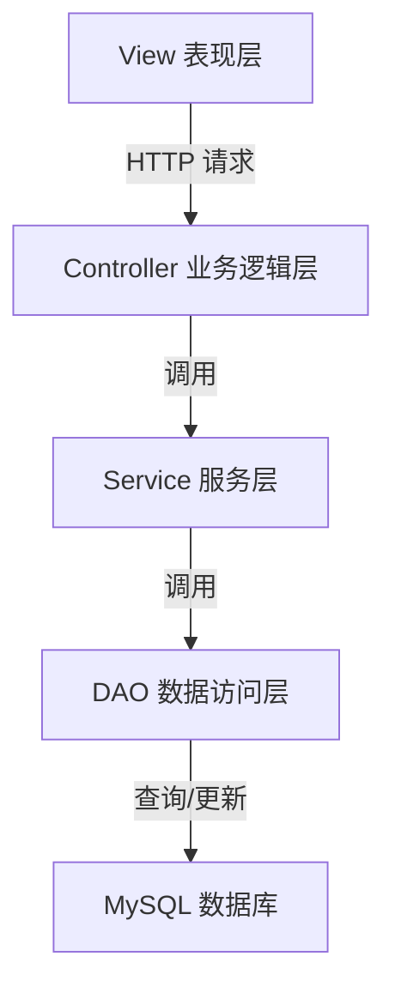

# 课程管理系统详细设计与具体代码实现

## 1.背景介绍

随着教育事业的不断发展,课程管理系统在学校教学管理中扮演着越来越重要的角色。课程管理系统是一种基于Web的信息管理系统,旨在为学校提供高效、便捷的课程管理解决方案。它集成了课程开设、选课、考试安排、成绩管理等多项功能,使得学校的教学管理工作更加精细化、规范化和信息化。

课程管理系统的出现解决了传统手工管理模式中存在的诸多问题,如工作效率低下、数据存储分散、信息流转不畅等。通过将教学管理流程数字化,课程管理系统实现了信息的高效传递和数据的集中存储,从而提高了管理效率,降低了人力成本。同时,系统还为师生提供了方便快捷的自助服务平台,实现了教学管理的无纸化和自动化。

## 2.核心概念与联系

课程管理系统的核心概念主要包括:

1. **课程**:指学校为学生开设的每门教学科目,包括课程名称、课程编号、学分、任课教师等基本信息。

2. **教师**:系统的主要使用者之一,负责课程的开设、上课、布置作业、阅卷等教学活动。

3. **学生**:系统的另一类主要使用者,可以查看开设课程、选课、提交作业、查看成绩等。

4. **选课**:学生根据自身的专业培养计划,选择本学期所需修读的课程。

5. **考试安排**:教师根据教学大纲,为每门课程安排考试时间、地点、监考信息等。

6. **成绩管理**:教师为学生课程绩效评定分数,系统记录并存储学生的成绩信息。

这些核心概念之间存在着密切的联系,构成了课程管理系统的基本运行逻辑。教师开设课程并安排考试,学生选课并参加考试,最终教师评定学生的成绩。系统则负责将整个教学过程数字化,实现信息流转和数据存储。

## 3.核心算法原理具体操作步骤

课程管理系统的核心算法主要包括以下几个方面:

### 3.1 课程排课算法

排课算法是课程管理系统中最为关键的算法之一。它的主要任务是根据学校的教学资源(如教室、教师等)以及课程之间的先后次序关系,为每门课程自动生成上课时间和地点安排。

排课算法通常采用图着色算法或启发式搜索算法等方法。以图着色算法为例,其具体步骤如下:

1. 构建课程冲突图:将每门课程视为一个节点,如果两门课程在同一时间段内存在冲突(如同一位教师或同一批学生),则在两个节点之间连一条边。

2. 为课程节点着色:尝试用最少的颜色为所有节点进行着色,使得相邻节点不存在同一种颜色,每种颜色代表一个可用的上课时间段。

3. 为每门课程指派上课时间:遍历所有节点,将具有相同颜色的节点安排在同一时间段上课。

4. 为每门课程分配教室资源:根据课程的学生人数,为其分配合适大小的教室。

该算法的时间复杂度通常为 NP 难题,需要采用近似算法或启发式算法来求解。

### 3.2 选课算法

选课算法的主要任务是根据学生的专业培养计划,为其自动生成或审核选课结果。常见的选课算法包括:

1. **规则匹配算法**:根据学校制定的选课规则(如必修课、学分门槛等),检查学生的选课结果是否合规。

2. **优先级算法**:当同一门课程的选课人数超过课程容量时,根据预先设定的优先级规则(如年级、绩点等),确定哪些学生可以选修该课程。

3. **启发式搜索算法**:将选课问题建模为一个组合优化问题,使用启发式算法(如模拟退火、遗传算法等)寻找最优的选课方案。

以规则匹配算法为例,其具体步骤如下:

1. 获取学生的专业培养计划,提取出该专业的所有必修课程列表。

2. 遍历学生的选课结果,检查其中是否包含所有必修课程。

3. 检查学生当前已修学分是否满足学校规定的最低学分门槛。

4. 如果以上条件均满足,则通过选课审核;否则,需要调整选课方案。

### 3.3 成绩计算算法

成绩计算算法负责根据学生的各项绩效(如平时分、期中考试、期末考试等),计算出最终的课程成绩。常见的计算方法包括:

1. **加权平均算法**:为每项绩效分数赋予一定的权重系数,将加权分数求和得到最终成绩。

2. **等级积分制算法**:根据学生的分数等级,按照预先设定的等级对应分值进行成绩换算。

3. **主观评分算法**:由任课教师根据学生的综合表现进行主观评分。

以加权平均算法为例,其具体步骤如下:

1. 设定各项绩效的权重系数,如平时分 20%、期中考试 30%、期末考试 50%。

2. 对每项绩效的原始分数进行加权计算:平时分×0.2 + 期中分×0.3 + 期末分×0.5。

3. 将加权分数求和,得到最终的百分制课程成绩。

4. 根据学校制定的成绩等级规则,将百分制成绩转换为等级制成绩(如 A、B、C 等)。

## 4.数学模型和公式详细讲解举例说明

在课程管理系统中,数学模型和公式主要应用于算法的设计和优化过程。以下是一些常见的数学模型和公式:

### 4.1 图着色模型

图着色模型常用于课程排课算法中,将课程视为节点,冲突关系视为边,目标是使用最少的"颜色"(时间段)为所有节点着色。

设有 n 门课程,m 个时间段(颜色),定义决策变量:

$$
x_{ij} = \begin{cases}
1, & \text{如果课程 i 安排在时间段 j} \\
0, & \text{否则}
\end{cases}
$$

则课程排课问题可以建模为整数线性规划问题:

$$
\begin{aligned}
\min \quad & \sum_{j=1}^{m} y_j \\
\text{s.t.} \quad & \sum_{j=1}^{m} x_{ij} = 1, \quad \forall i \in \{1, 2, \ldots, n\} \\
& x_{ij} + x_{i'j} \leq 1 + y_j, \quad \forall (i, i') \in E, j \in \{1, 2, \ldots, m\} \\
& x_{ij} \in \{0, 1\}, \quad y_j \in \{0, 1\}, \quad \forall i \in \{1, 2, \ldots, n\}, j \in \{1, 2, \ldots, m\}
\end{aligned}
$$

其中 $E$ 表示课程冲突关系集合。目标函数最小化使用的时间段数量,约束条件保证每门课程只安排一个时间段,且冲突课程不能安排在同一时间段。

### 4.2 组合优化模型

组合优化模型可用于选课算法中,将选课问题视为一个组合优化问题,目标是在满足各种约束条件的情况下,为学生选择一组最优的课程组合。

设有 n 门可选课程,m 名学生,定义决策变量:

$$
x_{ij} = \begin{cases}
1, & \text{如果学生 j 选修课程 i} \\
0, & \text{否则}
\end{cases}
$$

则选课问题可以建模为 0-1 整数规划问题:

$$
\begin{aligned}
\max \quad & \sum_{i=1}^{n} \sum_{j=1}^{m} c_{ij} x_{ij} \\
\text{s.t.} \quad & \sum_{i=1}^{n} a_{ik} x_{ij} \leq b_k, \quad \forall k \in \{1, 2, \ldots, p\}, j \in \{1, 2, \ldots, m\} \\
& x_{ij} \in \{0, 1\}, \quad \forall i \in \{1, 2, \ldots, n\}, j \in \{1, 2, \ldots, m\}
\end{aligned}
$$

其中 $c_{ij}$ 表示学生 j 选修课程 i 的收益值,如学分、兴趣等;$a_{ik}$ 和 $b_k$ 分别表示约束条件 k 的系数和右端常数,如学分门槛、先修课程等。目标函数最大化学生的总收益值,约束条件保证选课方案满足各种规则。

### 4.3 加权平均模型

加权平均模型常用于计算学生的最终课程成绩,将各项绩效分数按照一定权重系数进行加权求和。

设有 n 项绩效分数,定义:

- $x_i$:第 i 项绩效分数
- $w_i$:第 i 项绩效权重,满足 $\sum_{i=1}^{n} w_i = 1$

则最终成绩 $y$ 可以按照如下公式计算:

$$
y = \sum_{i=1}^{n} w_i x_i
$$

例如,如果平时分、期中考试分、期末考试分的权重分别为 20%、30%、50%,对应的分数为 85、78、92,则最终成绩为:

$$
y = 0.2 \times 85 + 0.3 \times 78 + 0.5 \times 92 = 86
$$

## 5.项目实践:代码实例和详细解释说明

为了更好地理解课程管理系统的实现细节,我们将通过一个基于 Java Web 的项目实例进行代码级别的讲解。本实例采用 Spring Boot 框架和 MySQL 数据库,使用 IntelliJ IDEA 作为集成开发环境。

### 5.1 系统架构

课程管理系统采用经典的三层架构设计,包括表现层(View)、业务逻辑层(Controller)和数据访问层(DAO),如下图所示:



1. **View 表现层**:使用 Thymeleaf 模板引擎渲染前端页面,如课程列表、选课界面等。

2. **Controller 业务逻辑层**:接收前端请求,调用相应的服务层方法进行业务处理,并将结果返回给视图层。

3. **Service 服务层**:实现系统的核心业务逻辑,如课程排课、选课审核、成绩计算等。

4. **DAO 数据访问层**:通过 MyBatis 框架与数据库进行交互,执行数据查询、插入、更新和删除操作。

5. **MySQL 数据库**:存储系统的课程、教师、学生、选课和成绩等数据。

### 5.2 数据模型

系统的核心数据模型包括以下几个表:

1. `course` 表:存储课程基本信息

```sql
CREATE TABLE `course` (
  `id` int(11) NOT NULL AUTO_INCREMENT COMMENT '课程ID',
  `name` varchar(50) NOT NULL COMMENT '课程名称',
  `code` varchar(20) NOT NULL COMMENT '课程编号',
  `credit` int(11) NOT NULL COMMENT '学分',
  `teacher_id` int(11) NOT NULL COMMENT '任课教师ID',
  PRIMARY KEY (`id`)
) ENGINE=InnoDB DEFAULT CHARSET=utf8mb4 COMMENT='课程表';
```

2. `teacher` 表:存储教师基本信息

```sql
CREATE TABLE `teacher` (
  `id` int(11) NOT NULL AUTO_INCREMENT COMMENT '教师ID',
  `name` varchar(50) NOT NULL COMMENT '教师姓名',
  `email` varchar(50) NOT NULL COMMENT '邮箱',
  PRIMARY KEY (`id`)
) ENGINE=InnoDB DEFAULT CHARSET=utf8mb4 COMMENT='教师表';
```

3. `student` 表:存储学生基本信息

```sql
CREATE TABLE `student` (
  `id` int(11) NOT NULL AUTO_INCREMENT COMMENT '学生ID',
  `name` varchar(50) NOT NULL COMMENT '学生姓名',
  