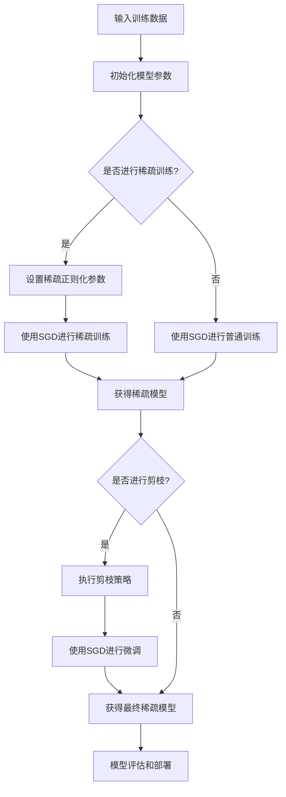

# 随机梯度下降算法的稀疏训练和剪枝

## 1.背景介绍

在深度学习领域,模型的大规模化趋势日益明显,以提高模型的准确性和泛化能力。然而,大型模型也带来了计算资源消耗的增加、推理延迟的提高以及部署成本的增加等问题。因此,如何在保持模型性能的同时减小模型的计算复杂度和存储需求,成为了一个亟待解决的挑战。

稀疏训练和剪枝是一种有效的模型压缩方法,通过在训练过程中引入稀疏正则化或者在训练后对模型进行剪枝,可以获得精简且高效的深度神经网络模型。这种方法的核心思想是减少网络中的冗余参数,保留对模型性能贡献最大的参数子集。

随机梯度下降(Stochastic Gradient Descent, SGD)是深度学习中最常用的优化算法之一。将稀疏训练和剪枝技术与SGD相结合,可以在训练过程中动态调整模型的稀疏性,从而获得更高效、更精简的神经网络模型。本文将深入探讨SGD在稀疏训练和剪枝中的应用,并介绍相关的核心概念、算法原理和实现细节。

## 2.核心概念与联系

### 2.1 随机梯度下降(SGD)

SGD是一种迭代优化算法,广泛用于训练深度神经网络模型。在每一次迭代中,SGD根据损失函数对模型参数进行更新,以最小化损失值。具体来说,SGD在每次迭代时,从训练数据中随机采样一个小批量数据(mini-batch),计算该批量数据的梯度,并根据梯度值更新模型参数。

SGD的更新规则如下:

$$\theta_{t+1} = \theta_t - \eta \nabla_\theta J(\theta_t; x^{(i:i+n)}, y^{(i:i+n)})$$

其中:
- $\theta_t$是当前迭代步的模型参数
- $\eta$是学习率(learning rate),控制每次更新的步长
- $\nabla_\theta J(\theta_t; x^{(i:i+n)}, y^{(i:i+n)})$是损失函数$J$在当前小批量数据$(x^{(i:i+n)}, y^{(i:i+n)})$上关于模型参数$\theta_t$的梯度

SGD的优点是简单高效,适合大规模数据集和高维模型,但收敛速度较慢,并且容易陷入局部最优解。

### 2.2 稀疏训练(Sparse Training)

稀疏训练是在模型训练过程中,通过引入稀疏正则化项,使得部分模型参数趋于零,从而达到模型压缩的目的。常见的稀疏正则化方法包括L1正则化(Lasso)和组稀疏正则化等。

以L1正则化为例,其目标函数为:

$$J(\theta) = J_0(\theta) + \lambda \sum_{i=1}^{d} |\theta_i|$$

其中:
- $J_0(\theta)$是原始损失函数
- $\lambda$是正则化系数,控制稀疏程度
- $\sum_{i=1}^{d} |\theta_i|$是L1范数正则项,会使部分参数$\theta_i$精确等于0

通过在损失函数中加入稀疏正则项,模型在训练时会自动学习出一个稀疏的参数矩阵,从而达到模型压缩的目的。

### 2.3 剪枝(Pruning)

剪枝是在模型训练完成后,通过分析各个参数对模型性能的贡献,移除那些不重要的参数,从而压缩模型大小。常见的剪枝方法包括基于规范剪枝(Norm-Based Pruning)、基于灵敏度剪枝(Sensitivity-Based Pruning)等。

以基于规范剪枝为例,其基本思路是:
1. 计算每个参数的规范(如L1或L2范数)
2. 设置一个阈值,将规范小于该阈值的参数设置为0
3. 根据剪枝后的稀疏模型进行微调(fine-tuning),使其性能尽可能小的降低

剪枝可以有效减小模型大小,但也可能导致一定程度的性能下降。因此,如何在模型压缩率和性能之间寻求平衡是剪枝中需要考虑的重要问题。

### 2.4 SGD与稀疏训练和剪枝的联系

SGD作为深度学习中最常用的优化算法,与稀疏训练和剪枝有着天然的联系。具体来说:

1. 在稀疏训练中,SGD用于优化包含稀疏正则项的损失函数,从而学习出稀疏的模型参数。
2. 在剪枝后的微调阶段,SGD用于根据剪枝后的稀疏模型,进一步优化模型参数,提高模型性能。

此外,SGD本身的一些特性也与稀疏训练和剪枝密切相关:

- 小批量更新(mini-batch)有助于引入一定的随机噪声,从而促进稀疏解的产生。
- 学习率衰减(learning rate decay)有助于在后期训练中保持模型的稀疏性。
- 动量(momentum)和自适应学习率优化器(如Adam)可以加速稀疏解的收敛。

综上所述,SGD与稀疏训练和剪枝有着内在的联系,将它们结合可以充分发挥各自的优势,获得精简高效的深度神经网络模型。

## 3.核心算法原理具体操作步骤

### 3.1 SGD与稀疏训练相结合

在SGD训练过程中引入稀疏正则化项,可以实现稀疏训练。以L1正则化为例,其目标函数为:

$$J(\theta) = J_0(\theta) + \lambda \sum_{i=1}^{d} |\theta_i|$$

其中$J_0(\theta)$是原始损失函数,如交叉熵损失等;$\lambda$是正则化系数,控制稀疏程度;$\sum_{i=1}^{d} |\theta_i|$是L1范数正则项。

在每次SGD迭代中,我们需要计算损失函数$J(\theta)$关于模型参数$\theta$的梯度,并根据梯度值更新参数:

$$\theta_{t+1} = \theta_t - \eta \nabla_\theta J(\theta_t)$$

其中梯度$\nabla_\theta J(\theta_t)$包含两部分:

$$\nabla_\theta J(\theta_t) = \nabla_\theta J_0(\theta_t) + \lambda \nabla_\theta \sum_{i=1}^{d} |\theta_i|$$

第一项$\nabla_\theta J_0(\theta_t)$是原始损失函数的梯度,可以通过反向传播算法计算;第二项$\lambda \nabla_\theta \sum_{i=1}^{d} |\theta_i|$是L1正则项的梯度,其中:

$$\nabla_\theta |\theta_i| = \begin{cases}
1, & \text{if } \theta_i > 0\\
-1, & \text{if } \theta_i < 0\\
0, & \text{if } \theta_i = 0
\end{cases}$$

通过在每次迭代中计算并应用上述梯度更新规则,SGD可以自动学习出一个稀疏的参数矩阵,从而实现模型压缩。

值得注意的是,在实际应用中,我们通常会采用一些技巧来提高稀疏训练的效率和稳定性,例如:

- 分阶段调整正则化系数$\lambda$,在初始阶段设置较小的$\lambda$值,后期逐渐增大。
- 引入参数剪切(weight clipping),限制参数值的范围,避免出现过大的参数值。
- 采用分组稀疏正则化(Group Sparse Regularization),对参数进行结构化剪枝。

### 3.2 SGD与剪枝相结合

剪枝是在模型训练完成后进行的,因此SGD主要用于剪枝后的微调(fine-tuning)阶段。具体步骤如下:

1. **剪枝**: 根据预设的剪枝策略(如基于规范剪枝或基于灵敏度剪枝等)对已训练好的模型进行剪枝,获得一个稀疏的模型。
2. **微调**: 使用SGD对剪枝后的稀疏模型进行微调,以恢复模型性能。

在微调阶段,SGD的目标函数仍然是原始的损失函数$J_0(\theta)$,不需要引入额外的正则项。但由于模型已经是稀疏的,因此SGD的更新过程会自动保持这种稀疏性。

为了提高微调效率,我们可以采用一些策略,例如:

- 使用较小的学习率,避免剪枝后的参数发生剧烈变化。
- 采用学习率衰减或重启策略(restart strategy),在后期微调中逐渐减小学习率。
- 引入动量(momentum)或自适应学习率优化器(如Adam),加速收敛。
- 对不同层的参数采用不同的学习率,灵活调整各层的更新幅度。

通过合理设置SGD的超参数,可以在保持模型稀疏性的同时,最大限度地恢复模型性能。

### 3.3 算法流程图

以下是SGD与稀疏训练和剪枝相结合的整体算法流程图:

上述流程图展示了SGD在稀疏训练和剪枝中的应用,以及两者的有机结合。根据具体需求,可以灵活选择是否进行稀疏训练、剪枝或两者兼而有之。

## 4.数学模型和公式详细讲解举例说明

在前面的章节中,我们已经介绍了SGD与稀疏训练和剪枝相结合的核心概念和算法原理。现在,我们将通过数学模型和公式,进一步深入探讨其中的细节和实现方式。

### 4.1 SGD更新规则

SGD的基本更新规则为:

$$\theta_{t+1} = \theta_t - \eta \nabla_\theta J(\theta_t; x^{(i:i+n)}, y^{(i:i+n)})$$

其中:
- $\theta_t$是当前迭代步的模型参数
- $\eta$是学习率(learning rate),控制每次更新的步长
- $\nabla_\theta J(\theta_t; x^{(i:i+n)}, y^{(i:i+n)})$是损失函数$J$在当前小批量数据$(x^{(i:i+n)}, y^{(i:i+n)})$上关于模型参数$\theta_t$的梯度

在实际应用中,我们通常会引入一些技巧来加速SGD的收敛,例如动量(momentum)和自适应学习率优化器(如Adam)等。

以动量为例,其更新规则为:

$$\begin{aligned}
v_t &= \gamma v_{t-1} + \eta \nabla_\theta J(\theta_t; x^{(i:i+n)}, y^{(i:i+n)})\\
\theta_{t+1} &= \theta_t - v_t
\end{aligned}$$

其中$v_t$是当前步的动量向量,通过指数加权移动平均(Exponential Moving Average, EMA)累积了过去的梯度,从而加速了SGD在梯度一致的维度上的收敛。$\gamma$是动量因子,控制了过去梯度的衰减速度。

### 4.2 稀疏正则化

在稀疏训练中,我们需要在损失函数中引入稀疏正则化项,以促使模型参数趋于稀疏。常见的稀疏正则化方法包括L1正则化(Lasso)和组稀疏正则化等。

**L1正则化**

L1正则化的目标函数为:

$$J(\theta) = J_0(\theta) + \lambda \sum_{i=1}^{d} |\theta_i|$$

其中$J_0(\theta)