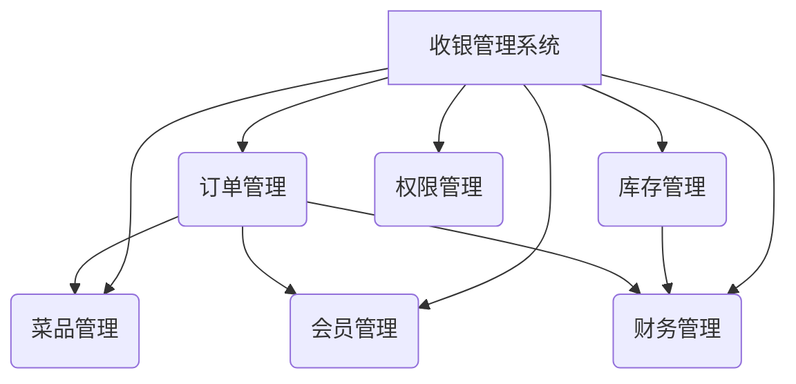

# 餐饮娱乐行业收银管理系统设计与实现

## 1. 背景介绍

随着餐饮娱乐行业的蓬勃发展，越来越多的企业开始意识到高效的收银管理系统对于提高运营效率、优化用户体验以及增强盈利能力的重要性。传统的人工收银系统存在着效率低下、容易出错等诸多弊端,因此开发一套先进的收银管理系统势在必行。

本文将探讨如何设计并实现一个高效、安全、可扩展的收银管理系统,以满足餐饮娱乐行业日益增长的需求。我们将深入探讨系统的核心概念、算法原理、数学模型,并提供实际应用场景、代码实例以及未来发展趋势等内容。

## 2. 核心概念与联系

收银管理系统的核心概念包括:

1. **订单管理**: 涉及订单的创建、修改、查询和支付等操作。
2. **菜品管理**: 包括菜品的添加、修改、删除以及分类等功能。
3. **库存管理**: 实时监控原材料库存,并根据需求进行补货。
4. **会员管理**: 提供会员注册、积分管理和优惠活动等服务。
5. **财务管理**: 包括收入统计、支出记录和报表生成等功能。
6. **权限管理**: 对不同角色(如管理员、服务员等)分配适当的系统权限。

这些概念相互关联,共同构建了一个完整的收银管理系统。例如,订单管理需要与菜品管理和会员管理模块交互,以获取正确的菜品信息和会员折扣;财务管理则依赖于订单管理和库存管理,以准确计算收入和支出。



## 3. 核心算法原理具体操作步骤

### 3.1 订单管理算法

订单管理算法负责处理订单的创建、修改、查询和支付等操作。以下是该算法的具体步骤:

1. **创建订单**
   - 接收用户点餐信息,包括菜品ID和数量
   - 根据菜品ID查询菜品信息(名称、价格等)
   - 计算订单总金额
   - 生成订单ID并将订单信息存储到数据库

2. **修改订单**
   - 根据订单ID查询订单详情
   - 接收用户修改信息(增加/删除菜品、修改数量等)
   - 更新订单信息并重新计算总金额
   - 将修改后的订单信息更新到数据库

3. **查询订单**
   - 根据订单ID或其他查询条件(如下单时间等)从数据库中查询订单信息
   - 返回查询结果

4. **支付订单**
   - 根据订单ID查询订单详情
   - 接收用户支付信息(支付方式、金额等)
   - 验证支付金额是否正确
   - 更新订单状态为"已支付"
   - 进行相应的财务处理(如扣减库存、记录收入等)

### 3.2 菜品管理算法

菜品管理算法负责菜品的添加、修改、删除和分类等操作。以下是该算法的具体步骤:

1. **添加菜品**
   - 接收新菜品信息(名称、价格、分类等)
   - 验证菜品信息的合法性
   - 生成菜品ID
   - 将菜品信息存储到数据库

2. **修改菜品**
   - 根据菜品ID查询菜品详情
   - 接收用户修改信息(名称、价格、分类等)
   - 验证修改后的菜品信息合法性
   - 更新菜品信息到数据库

3. **删除菜品**
   - 根据菜品ID查询菜品详情
   - 检查菜品是否仍在订单中使用
   - 如果未使用,从数据库中删除菜品信息
   - 如果仍在使用,提示无法删除

4. **菜品分类**
   - 接收新的分类信息(名称、描述等)
   - 验证分类信息的合法性
   - 生成分类ID
   - 将分类信息存储到数据库
   - 更新相应菜品的分类信息

### 3.3 库存管理算法

库存管理算法负责实时监控原材料库存,并根据需求进行补货操作。以下是该算法的具体步骤:

1. **监控库存**
   - 定期扫描所有原材料的库存量
   - 对于库存量低于预设阈值的原材料,标记为"需要补货"

2. **生成补货单**
   - 根据"需要补货"的原材料列表,生成补货单
   - 补货单包括原材料ID、名称、所需数量等信息

3. **处理补货单**
   - 接收供应商的补货信息
   - 验证补货信息与补货单是否一致
   - 如果一致,更新相应原材料的库存量
   - 如果不一致,拒绝接收并生成差异报告

4. **库存报告**
   - 定期生成库存报告,包括各原材料的库存量、补货记录等信息
   - 库存报告可用于分析原材料消耗趋势,优化采购策略

### 3.4 会员管理算法

会员管理算法负责会员的注册、积分管理和优惠活动等功能。以下是该算法的具体步骤:

1. **会员注册**
   - 接收用户注册信息(姓名、联系方式等)
   - 验证注册信息的合法性
   - 生成会员ID和初始积分
   - 将会员信息存储到数据库

2. **积分管理**
   - 根据订单金额和会员等级,计算应获得的积分
   - 更新会员积分余额
   - 定期审核会员积分,防止作弊行为

3. **优惠活动**
   - 设置不同的优惠活动(如满减、折扣等)
   - 根据会员等级和积分余额,确定可享受的优惠
   - 在下单时自动应用相应的优惠

4. **会员查询**
   - 根据会员ID或其他查询条件(如姓名、联系方式等)查询会员信息
   - 返回会员详情、积分余额和优惠记录等信息

### 3.5 财务管理算法

财务管理算法负责收入统计、支出记录和报表生成等功能。以下是该算法的具体步骤:

1. **收入统计**
   - 实时监控已支付订单的金额
   - 按照时间段(日/周/月)统计总收入
   - 按照菜品类别统计收入构成

2. **支出记录**
   - 记录原材料采购支出
   - 记录人工成本、房租和其他运营支出
   - 按照支出类别进行分类统计

3. **报表生成**
   - 定期生成财务报表,包括收入报表、支出报表和利润报表
   - 收入报表反映总收入、收入构成等信息
   - 支出报表反映各类支出的明细
   - 利润报表展示净利润及其与上期的对比

4. **数据分析**
   - 基于历史财务数据,进行趋势分析和预测
   - 识别收入和支出的关键驱动因素
   - 提供决策支持,优化运营策略

## 4. 数学模型和公式详细讲解举例说明

在收银管理系统中,数学模型和公式扮演着重要的角色,用于计算订单总额、会员积分、库存需求等。以下是一些常见的数学模型和公式:

### 4.1 订单总额计算

订单总额是订单管理中的核心计算,它决定了顾客需要支付的金额。订单总额的计算公式如下:

$$
总额 = \sum_{i=1}^{n} 数量_i \times 单价_i
$$

其中:
- $n$ 表示订单中菜品的种类数
- $数量_i$ 表示第 $i$ 种菜品的数量
- $单价_i$ 表示第 $i$ 种菜品的单价

例如,一个订单包含 2 份西红柿鸡蛋 (单价 18 元)、1 份kung 排骨 (单价 38 元)和 3 份米饭 (单价 3 元),则订单总额计算如下:

$$
总额 = 2 \times 18 + 1 \times 38 + 3 \times 3 = 36 + 38 + 9 = 83 \text{ 元}
$$

### 4.2 会员积分计算

会员积分是根据订单金额和会员等级计算得出的。积分计算公式如下:

$$
积分 = 订单总额 \times 积分系数
$$

其中,积分系数是根据会员等级确定的。例如,普通会员的积分系数可能是 0.05,而高级会员的积分系数可能是 0.1。

假设一位普通会员的订单总额为 200 元,则其可获得的积分为:

$$
积分 = 200 \times 0.05 = 10 \text{ 分}
$$

### 4.3 库存需求预测

为了保证原材料的供应,需要预测未来一段时间内的库存需求。库存需求预测可以使用移动平均法或指数平滑法等时间序列分析方法。

假设使用移动平均法,预测未来 $n$ 天的库存需求量 $D_t$ 可以用过去 $m$ 天的实际需求量的平均值来估计:

$$
D_t = \frac{1}{m} \sum_{i=t-m+1}^{t} d_i
$$

其中:
- $d_i$ 表示第 $i$ 天的实际需求量
- $m$ 表示移动平均的窗口大小

例如,若要预测未来 7 天的库存需求量,并且使用过去 5 天的数据进行移动平均,已知过去 5 天的实际需求量分别为 20、18、22、25、19,则预测值为:

$$
D_t = \frac{1}{5} (20 + 18 + 22 + 25 + 19) = 20.8
$$

因此,预计未来 7 天的库存需求量约为 20.8 单位。

通过上述数学模型和公式,收银管理系统可以实现精确的计算和预测,为决策提供有力支持。

## 5. 项目实践:代码实例和详细解释说明

为了更好地理解收银管理系统的实现,我们将提供一些核心模块的代码示例,并对其进行详细解释。

### 5.1 订单管理模块

订单管理模块负责处理订单的创建、修改、查询和支付等操作。以下是一个简化的 Python 实现:

```python
class Order:
    def __init__(self):
        self.items = []
        self.total = 0

    def add_item(self, item, quantity):
        self.items.append((item, quantity))
        self.total += item.price * quantity

    def remove_item(self, item):
        for i, (order_item, quantity) in enumerate(self.items):
            if order_item == item:
                self.total -= order_item.price * quantity
                del self.items[i]
                break

    def calculate_total(self):
        self.total = 0
        for item, quantity in self.items:
            self.total += item.price * quantity
        return self.total

    def pay(self, amount):
        if amount < self.total:
            print("付款金额不足")
            return False
        else:
            print(f"订单已支付,总额为 {self.total} 元")
            return True

class MenuItem:
    def __init__(self, name, price):
        self.name = name
        self.price = price
```

在这个示例中,我们定义了两个类:

1. `Order` 类用于表示一个订单,它包含以下方法:
   - `add_item(item, quantity)`: 向订单中添加一个菜品及其数量
   - `remove_item(item)`: 从订单中移除一个菜品
   - `calculate_total()`: 计算订单总额
   - `pay(amount)`: 支付订单,如果付款金额足够,则支付成功

2. `MenuItem` 类用于表示一个菜品,包含菜品名称和价格。

使用这些类,我们可以创建一个新订单,添加菜品,计算总额并进行支付,如下所示:

```python
# 创建菜品
item1 = MenuItem("西红柿鸡蛋", 18)
item2 = MenuItem("kung 排骨", 38)