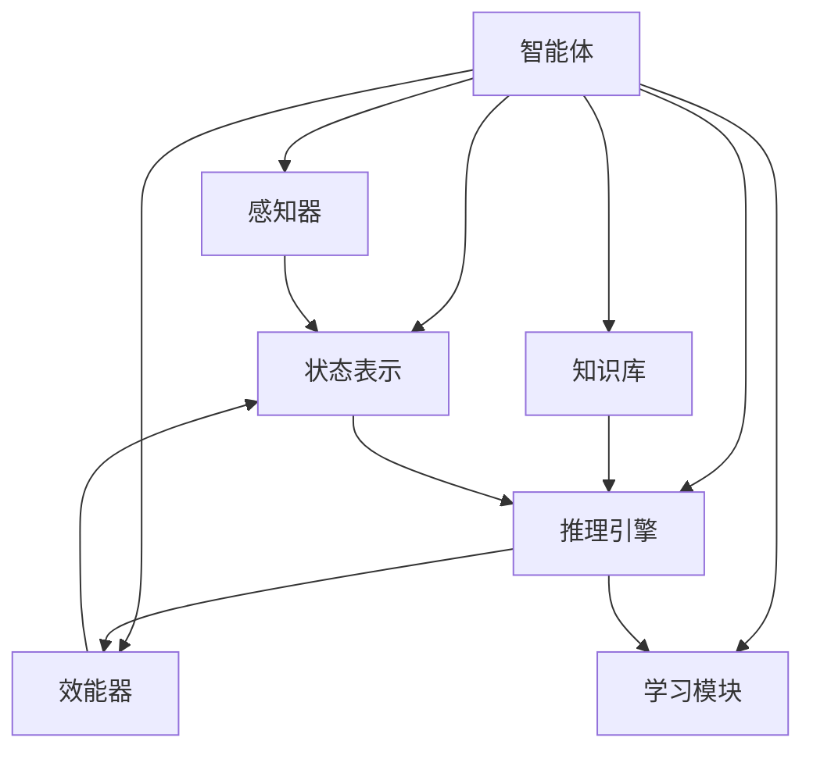

# AI Agent: AI的下一个风口 什么是智能体

## 1. 背景介绍

随着人工智能(AI)技术的不断发展,智能体(Agent)正成为AI领域的一个新兴热点。智能体是指能够感知环境、处理信息、做出决策并采取行动的自主系统。与传统的AI系统相比,智能体具有更强的自主性、交互性和适应性,可以根据环境的变化做出合理的响应。

近年来,智能体技术在各个领域都取得了长足的进步,例如机器人、自动驾驶、智能助手等。智能体的核心思想是赋予AI系统更多的自主性,使其能够像人类一样,根据环境的变化做出合理的决策和行动。这种新型AI系统具有广阔的应用前景,有望推动AI技术向更高层次发展。

### 1.1 智能体的重要性

智能体技术的兴起,标志着AI领域正在发生一场深刻的范式转变。传统的AI系统更多关注于特定任务的优化,而智能体则致力于构建具有通用智能的系统。这种新型AI系统不仅能够完成特定任务,还能够根据环境的变化做出合理的决策和行动。

智能体技术的发展,将极大推动AI技术向更高层次发展,实现真正的"通用人工智能"(Artificial General Intelligence, AGI)。AGI被认为是AI领域的最高目标,即构建一种能够像人类一样具有广泛认知能力的智能系统。智能体技术为实现AGI奠定了坚实的理论和技术基础。

### 1.2 智能体的挑战

尽管智能体技术前景广阔,但其发展过程中也面临着诸多挑战。首先,构建智能体系统需要综合多种AI技术,如机器学习、知识表示、规划与决策、自然语言处理等,这对系统的设计和实现提出了很高的要求。

其次,智能体需要具备强大的感知、推理和决策能力,能够从复杂的环境中获取信息、建立知识模型、制定行动策略。这需要智能体具有足够的计算能力和算法支持。

此外,智能体的行为决策往往涉及到伦理、安全等问题,需要确保智能体的行为符合人类的价值观和伦理准则。这对智能体的设计和开发提出了新的挑战。

## 2. 核心概念与联系

### 2.1 智能体的定义

智能体(Agent)是指能够感知环境、处理信息、做出决策并采取行动的自主系统。智能体通过感知器(Sensors)获取环境信息,通过效能器(Actuators)对环境进行操作,并根据设定的目标(Goals)做出合理的行为决策。

智能体的核心思想是赋予AI系统更多的自主性,使其能够像人类一样,根据环境的变化做出合理的决策和行动。这种新型AI系统不仅能够完成特定任务,还能够根据环境的变化做出合理的响应。

### 2.2 智能体与传统AI系统的区别

传统的AI系统更多关注于特定任务的优化,例如计算机视觉、自然语言处理等。这些系统通常是基于规则或机器学习模型,专注于解决特定的问题。

而智能体则致力于构建具有通用智能的系统,能够像人类一样,根据环境的变化做出合理的决策和行动。智能体不仅需要具备特定任务的能力,还需要具备感知、推理、规划、学习等多种认知能力,并能够协调这些能力完成复杂的任务。

因此,智能体技术的发展,标志着AI领域正在发生一场深刻的范式转变,从专注于特定任务的优化,转向构建具有通用智能的系统。

### 2.3 智能体的核心组成部分

一个典型的智能体系统通常包括以下几个核心组成部分:

1. **感知器(Sensors)**: 用于获取环境信息,例如视觉、听觉、触觉等传感器。
2. **效能器(Actuators)**: 用于对环境进行操作,例如机器人的机械臂、车辆的控制系统等。
3. **状态表示(State Representation)**: 用于描述智能体当前的状态和环境状态。
4. **知识库(Knowledge Base)**: 存储智能体的背景知识和经验。
5. **推理引擎(Reasoning Engine)**: 根据当前状态、知识库和目标,推理出合理的行为决策。
6. **学习模块(Learning Module)**: 使智能体能够从经验中学习,不断优化自身的决策策略。

这些组成部分相互协作,使智能体能够感知环境、处理信息、做出决策并采取行动,从而实现自主的行为。

## 3. 核心算法原理具体操作步骤

智能体的核心算法原理主要包括以下几个方面:

### 3.1 马尔可夫决策过程(Markov Decision Process, MDP)

马尔可夫决策过程是智能体决策的基础理论模型。它将智能体的决策问题建模为一个由状态(State)、行动(Action)、转移概率(Transition Probability)和奖励(Reward)组成的四元组。

在每个时间步,智能体根据当前状态选择一个行动,然后环境根据转移概率转移到下一个状态,并给出相应的奖励。智能体的目标是找到一个策略(Policy),使得在长期内获得的累积奖励最大化。

MDP的具体操作步骤如下:

1. 定义状态空间(State Space)和行动空间(Action Space)。
2. 确定状态转移概率(Transition Probability),即在当前状态执行某个行动后,转移到下一个状态的概率。
3. 设计奖励函数(Reward Function),定义在每个状态下执行某个行动所获得的即时奖励。
4. 选择一种算法(如价值迭代、策略迭代、Q-Learning等)求解最优策略。
5. 根据最优策略,智能体在每个时间步选择相应的行动。

### 3.2 强化学习算法

强化学习是智能体学习的一种重要范式,它允许智能体通过与环境的交互,不断尝试和学习,以获得最大的累积奖励。

常见的强化学习算法包括:

1. **Q-Learning**: 基于价值函数的无模型强化学习算法,通过不断更新状态-行动对的Q值,逐步学习到最优策略。
2. **深度Q网络(Deep Q-Network, DQN)**: 将Q-Learning与深度神经网络相结合,用于解决高维状态空间的问题。
3. **策略梯度(Policy Gradient)**: 基于策略的强化学习算法,直接学习一个策略函数,使得在该策略下的累积奖励最大化。
4. **Actor-Critic**: 将价值函数和策略函数分开学习,Actor负责选择行动,Critic负责评估行动的好坏。

强化学习算法的具体操作步骤如下:

1. 初始化智能体的策略或价值函数。
2. 在环境中与智能体交互,获取状态、行动和奖励样本。
3. 使用这些样本更新策略或价值函数的参数。
4. 重复步骤2和3,直到策略或价值函数收敛。

### 3.3 多智能体系统(Multi-Agent System, MAS)

在许多实际应用场景中,智能体需要与其他智能体协作或竞争,形成一个多智能体系统。多智能体系统引入了新的挑战,如协作机制、通信协议、资源分配等。

常见的多智能体算法包括:

1. **马尔可夫博弈(Markov Game)**: 将多智能体决策问题建模为一个扩展的马尔可夫决策过程,智能体的行动和奖励都受到其他智能体的影响。
2. **多智能体强化学习(Multi-Agent Reinforcement Learning)**: 将强化学习算法扩展到多智能体场景,智能体通过与环境和其他智能体的交互来学习策略。
3. **多智能体协作算法(Multi-Agent Cooperation Algorithms)**: 设计协作机制和通信协议,使多个智能体能够有效协作完成任务。

多智能体系统的具体操作步骤如下:

1. 定义智能体的状态空间、行动空间和奖励函数。
2. 设计智能体之间的协作或竞争机制。
3. 选择合适的多智能体算法,如马尔可夫博弈、多智能体强化学习等。
4. 训练智能体,使其能够在多智能体环境中做出合理的决策。
5. 在实际应用场景中部署和测试多智能体系统。

## 4. 数学模型和公式详细讲解举例说明

### 4.1 马尔可夫决策过程(MDP)

马尔可夫决策过程是智能体决策的基础理论模型,可以用一个四元组 $\langle S, A, P, R \rangle$ 来表示:

- $S$ 是状态空间(State Space),表示智能体可能处于的所有状态。
- $A$ 是行动空间(Action Space),表示智能体可以执行的所有行动。
- $P(s'|s,a)$ 是状态转移概率(Transition Probability),表示在状态 $s$ 下执行行动 $a$ 后,转移到状态 $s'$ 的概率。
- $R(s,a)$ 是奖励函数(Reward Function),表示在状态 $s$ 下执行行动 $a$ 所获得的即时奖励。

智能体的目标是找到一个策略 $\pi: S \rightarrow A$,使得在该策略下的累积奖励最大化,即:

$$
\max_\pi \mathbb{E}\left[\sum_{t=0}^\infty \gamma^t R(s_t, a_t) \right]
$$

其中 $\gamma \in [0, 1]$ 是折现因子,用于平衡即时奖励和长期奖励的权重。

### 4.2 Q-Learning

Q-Learning 是一种基于价值函数的无模型强化学习算法,它通过不断更新状态-行动对的 Q 值,逐步学习到最优策略。

Q 值 $Q(s,a)$ 表示在状态 $s$ 下执行行动 $a$,然后按照最优策略执行后续行动所能获得的累积奖励。Q-Learning 算法的目标是找到一个 Q 函数,使得对于任意状态-行动对 $(s,a)$,有:

$$
Q(s,a) = \mathbb{E}\left[R(s,a) + \gamma \max_{a'} Q(s',a') \right]
$$

其中 $s'$ 是执行行动 $a$ 后转移到的下一个状态。

Q-Learning 算法的更新规则为:

$$
Q(s,a) \leftarrow Q(s,a) + \alpha \left[ R(s,a) + \gamma \max_{a'} Q(s',a') - Q(s,a) \right]
$$

其中 $\alpha$ 是学习率,控制着更新的幅度。

通过不断与环境交互,获取状态、行动和奖励样本,并根据上述更新规则更新 Q 值,最终 Q 函数将收敛到最优策略对应的 Q 函数。

### 4.3 深度Q网络(Deep Q-Network, DQN)

当状态空间过大时,传统的 Q-Learning 算法将难以应用,因为它需要维护一个巨大的 Q 表。深度Q网络(DQN)将 Q-Learning 与深度神经网络相结合,用于解决高维状态空间的问题。

DQN 使用一个深度神经网络来近似 Q 函数,即 $Q(s,a;\theta) \approx Q^*(s,a)$,其中 $\theta$ 是神经网络的参数。

DQN 的损失函数定义为:

$$
L(\theta) = \mathbb{E}_{(s,a,r,s')\sim D}\left[ \left( r + \gamma \max_{a'} Q(s',a';\theta^-) - Q(s,a;\theta) \right)^2 \right]
$$

其中 $D$ 是经验回放池(Experience Replay Buffer),用于存储智能体与环境交互过程中获得的状态、行动、奖励和下一状态样本。$\theta^-$ 是目标网络(Target Network)的参数,用于稳定训练过程。

通过最小化损失函数,