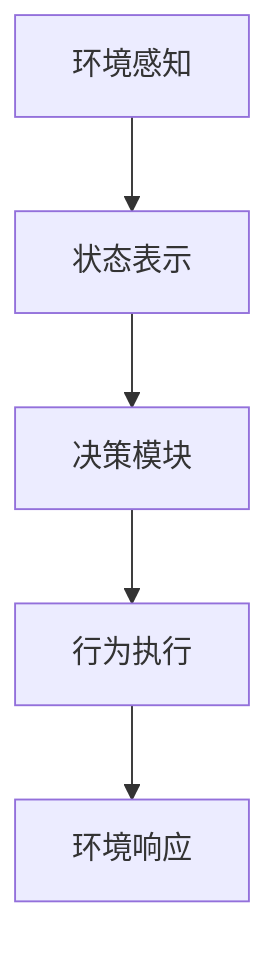

# AI Agent: AI的下一个风口 如何改变用户体验

## 1.背景介绍

### 1.1 人工智能的发展历程

人工智能(Artificial Intelligence, AI)是当代科技发展的核心驱动力之一。自20世纪50年代AI概念被正式提出以来,经历了起起伏伏的发展历程。早期的AI主要集中在基于规则的专家系统和机器学习算法上,取得了一些成果,但也面临着诸多挑战。

21世纪以来,benefiting from大数据、强大计算能力和新兴算法(如深度学习)的支持,AI迎来了新的发展浪潮。从计算机视觉、自然语言处理到决策系统等领域,AI技术不断突破,展现出前所未有的能力。

### 1.2 AI Agent的兴起

在这一背景下,AI Agent(智能代理)的概念应运而生。AI Agent是一种具备自主性、交互性和智能化的软件实体,能够代表用户执行特定任务。相较于传统软件系统,AI Agent具有以下优势:

- 自主性:能够根据环境变化自主做出决策和行为调整
- 交互性:支持多种方式与用户自然交互(语音、文本等)
- 智能化:基于AI算法,提供智能化的服务和决策支持

AI Agent的出现为人机交互注入了新的活力,有望改变人们获取信息、完成任务的方式,提升生活和工作效率。

## 2.核心概念与联系

### 2.1 智能代理的定义

智能代理(Intelligent Agent)是一种能够感知环境,并根据感知做出理性行为以实现既定目标的软件实体。智能代理需要具备以下几个关键特征:

- 自主性(Autonomy):能够在无人监督的情况下独立运行
- 反应性(Reactivity):能够持续感知环境变化并及时作出反应 
- 主动性(Pro-activeness):不仅被动响应环境,还能主动地按照目标采取行动
- 社会能力(Social Ability):能够与人类及其他智能体协作、交互

### 2.2 智能代理的分类

根据具体应用场景和功能,智能代理可分为以下几种类型:

1. **任务型代理**(Task Agents):专注于执行特定任务,如日程管理、旅行安排等。
2. **信息型代理**(Information Agents):帮助用户获取、过滤和管理信息,如新闻聚合、信息推荐等。
3. **协作型代理**(Collaborative Agents):支持多个代理之间的协作,共同完成复杂任务。
4. **智能助手**(Intelligent Assistants):集成多种功能,为用户提供全面的智能化服务支持。

### 2.3 智能代理的关键技术

智能代理的实现离不开以下几种关键技术:

- **自然语言处理**(Natural Language Processing, NLP):实现人机语言交互
- **知识表示与推理**(Knowledge Representation and Reasoning):构建代理的知识库
- **机器学习与规划**(Machine Learning and Planning):实现智能决策和行为规划
- **多智能体系统**(Multi-Agent Systems):支持多个代理之间的协作
- **人机交互技术**(Human-Computer Interaction):优化人机交互体验

## 3.核心算法原理具体操作步骤  

智能代理的核心是基于环境感知做出理性行为的能力。这一过程可概括为感知(Perception)、思考(Thinking)和行动(Acting)三个环节,每个环节均涉及相关算法。



### 3.1 环境感知与状态表示

环境感知是智能代理的基础,通过各种传感器获取环境信息,如视觉、语音、文本等。这些原始数据需要经过预处理,转化为代理可识别的状态表示(State Representation)。

常用的状态表示方法有:

1. **特征向量**(Feature Vectors):将状态映射为一个特征向量
2. **符号逻辑**(Symbolic Logic):使用逻辑语句描述状态
3. **关系模型**(Relational Models):利用实体及其关系表示状态

### 3.2 决策模块

决策模块是智能代理的"大脑",根据当前状态做出行为决策。主流的决策算法包括:

1. **搜索算法**(Search Algorithms):
    - 启发式搜索(A*、IDA*等)
    - 局部搜索(爬山、模拟退火等)
2. **规划算法**(Planning Algorithms):
    - 经典规划(条件规划、层次规划等)
    - 启发式规划(FF、HSP等)
3. **机器学习算法**(Machine Learning):
    - 监督学习(决策树、SVM等)
    - 强化学习(Q-Learning、深度Q网络等)
    - 深度学习(CNN、RNN等)

### 3.3 行为执行与环境响应

根据决策模块的输出,智能代理执行相应的行为,影响外部环境。行为的具体形式可以是:

- 物理动作(机器人运动等)
- 信息输出(文本生成、语音合成等)
- 系统调用(发送指令、修改配置等)

同时,代理需要持续监测环境的变化,形成反馈环,支持下一轮的感知和决策。

## 4.数学模型和公式详细讲解举例说明

智能代理中广泛使用概率模型和优化算法,用于状态估计、行为规划和决策等环节。

### 4.1 马尔可夫决策过程(MDP)

马尔可夫决策过程(Markov Decision Process, MDP)是形式化描述决策序列问题的重要数学模型,被广泛应用于强化学习等领域。一个MDP可以用元组 $\langle S, A, P, R \rangle$ 来表示:

- $S$: 有限状态集合
- $A$: 有限动作集合  
- $P(s' | s, a)$: 状态转移概率,表示在状态$s$执行动作$a$后,转移到状态$s'$的概率
- $R(s, a)$: 奖励函数,表示在状态$s$执行动作$a$获得的即时奖励

在MDP中,目标是找到一个策略(Policy) $\pi: S \rightarrow A$,使得期望的累积奖励最大:

$$
\max_\pi \mathbb{E}\left[ \sum_{t=0}^\infty \gamma^t R(s_t, a_t) \right]
$$

其中$\gamma \in [0, 1]$是折现因子,用于权衡即时奖励和长期奖励。

### 4.2 部分观测马尔可夫决策过程(POMDP)

在现实环境中,智能代理通常无法完全观测到环境的真实状态,只能获取部分观测值。这种情况可以用部分观测马尔可夫决策过程(Partially Observable Markov Decision Process, POMDP)来建模,它在MDP的基础上增加了观测模型:

$$
\langle S, A, P, R, \Omega, O \rangle
$$

- $\Omega$: 有限观测集合
- $O(o | s', a)$: 观测模型,表示在执行动作$a$并转移到状态$s'$后,观测到$o$的概率

由于无法直接获取真实状态,POMDP中的策略需要基于历史观测序列(History) $h_t = \{o_0, a_0, \cdots, o_{t-1}, a_{t-1}, o_t\}$来确定下一步动作:

$$
\pi(h_t) = a_t
$$

POMDP问题通常难以精确解决,需要使用近似算法如点基函数(Point-Based)、蒙特卡罗采样等。

### 4.3 多智能体系统(Multi-Agent Systems)

在复杂环境中,通常需要多个智能代理协同工作。多智能体系统(Multi-Agent Systems)研究如何设计多个代理的行为策略,使它们能够高效协作以完成共同目标。

对于$n$个代理,每个代理$i$的策略可表示为$\pi_i$。当所有代理的策略确定时,就形成了一个策略配置(Policy Profile) $\vec{\pi} = \{\pi_1, \pi_2, \cdots, \pi_n\}$。每个代理的奖励不仅取决于自身策略,还取决于其他代理的策略。

在某些情况下,代理之间可能存在竞争关系,这可以用非零和博弈(Non-Zero-Sum Game)来建模。令$R_i(\vec{\pi})$表示代理$i$在策略配置$\vec{\pi}$下的期望奖励,则博弈的纳什均衡(Nash Equilibrium)定义为:

$$
\vec{\pi}^* = \arg\max_{\vec{\pi}} \min_{i} R_i(\vec{\pi})
$$

即所有代理的策略都是最优响应,无一代理能够单方面偏离均衡获得更高的期望奖励。

## 5.项目实践:代码实例和详细解释说明

为了更好地理解智能代理的原理和实现,我们将通过一个简单的网格世界(Gridworld)示例,演示如何使用强化学习训练一个智能代理。

### 5.1 问题描述

考虑一个$4 \times 4$的网格世界,如下图所示:

```python
gridworld = GridWorld(size=4)
print(gridworld.render())
```

```
+------+------+------+------+
|      |      |      |      |
+------+------+------+------+
|      |      |      |      |
+------+------+------+------+
|      |      |      |      |
+------+------+------+------+
|      |      |      |      |
+------+------+------+------+
```

其中:

- 智能代理(Agent)初始位置为左下角
- 目标状态(Goal)为右上角,到达后获得+1奖励
- 其余状态奖励为0
- 可执行的动作有上下左右四个方向

我们的目标是训练一个策略,使代理能够从任意初始状态出发,找到通往目标状态的最短路径。

### 5.2 强化学习实现

我们将使用Q-Learning算法训练智能代理,Q-Learning是一种常用的无模型强化学习算法,可以直接从环境交互中学习最优策略,无需事先了解环境的转移模型。

Q-Learning维护一个Q函数$Q(s, a)$,表示在状态$s$执行动作$a$后的期望累积奖励。在每一步交互中,Q函数根据下式进行迭代更新:

$$
Q(s_t, a_t) \leftarrow Q(s_t, a_t) + \alpha \left[ r_t + \gamma \max_{a'} Q(s_{t+1}, a') - Q(s_t, a_t) \right]
$$

其中$\alpha$是学习率,$\gamma$是折现因子。

实现代码如下:

```python
import numpy as np

# 初始化Q函数
Q = np.zeros((gridworld.size**2, 4))

# 设置学习参数
alpha = 0.1  # 学习率
gamma = 0.9  # 折现因子
num_episodes = 10000  # 总训练回合数

# Q-Learning训练
for episode in range(num_episodes):
    state = gridworld.reset()  # 重置环境
    done = False
    
    while not done:
        # 选择贪婪动作
        action = np.argmax(Q[state])
        
        # 执行动作并获取反馈
        next_state, reward, done = gridworld.step(action)
        
        # 更新Q函数
        Q[state, action] += alpha * (reward + gamma * np.max(Q[next_state]) - Q[state, action])
        
        state = next_state

# 根据Q函数生成策略
policy = np.argmax(Q, axis=1)
```

经过足够的训练后,我们可以根据学习到的Q函数生成最优策略,并在网格世界中进行测试:

```python
state = gridworld.reset()
print(gridworld.render())

while not gridworld.is_goal(state):
    action = policy[state]
    state, _, _ = gridworld.step(action)
    print(gridworld.render())

print("Goal reached!")
```

```
+------+------+------+------+
|      |      |      |      |
+------+------+------+------+
|      |      |      |      |
+------+------+------+------+
|      |      |      |      |
+------+------+------+------+
| >    |      |      |      |
+------+------+------+------+

+------+------+------+------+
|      |      |      |      |
+------+------+------+------+
|      |      |      |      |
+------+------+------+------+
|      |      |      |      |
+------+------+------+------+
|      | >    |      |      |
+------+------+------+------+

...

+------+------+------+------+
|      |      |      |