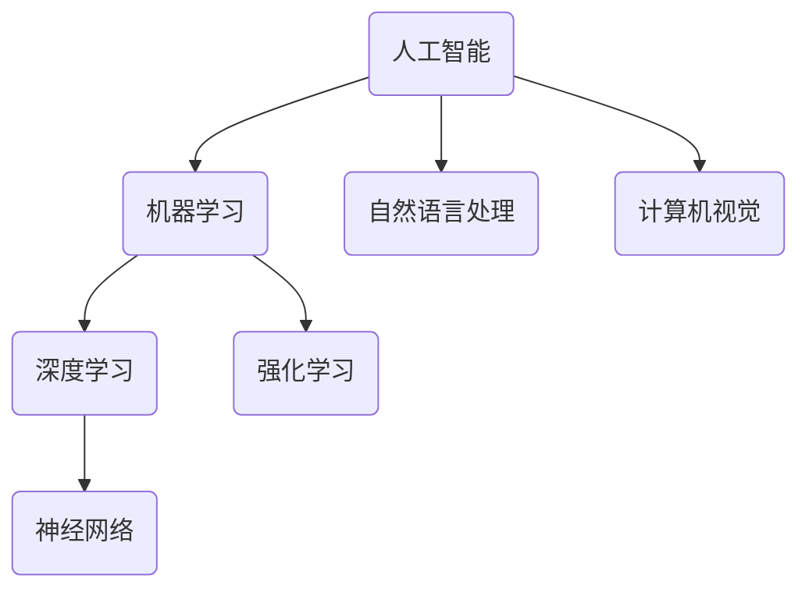
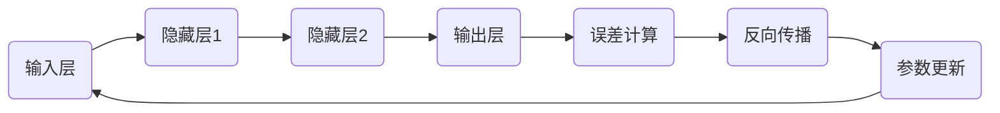
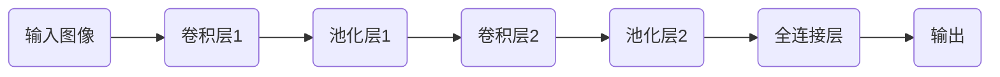
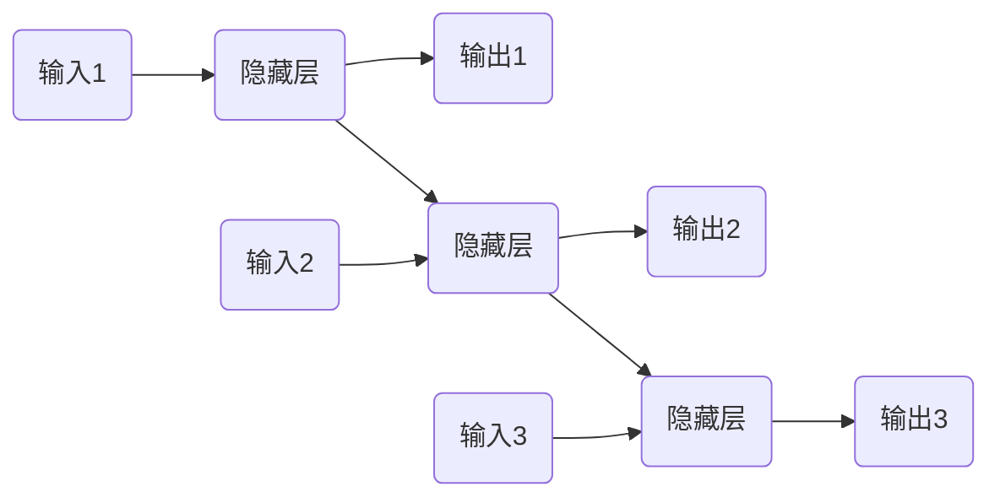
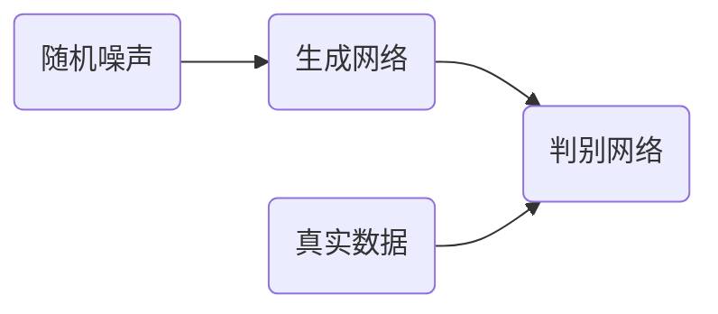

# AI 原理与代码实例讲解

## 1.背景介绍

人工智能(AI)是当前科技领域最热门、发展最快的前沿技术之一。AI的核心目标是让机器具备类似于人类的智能,能够模拟人类的感知、学习、推理和决策等认知过程。近年来,AI技术在图像识别、自然语言处理、决策系统等诸多领域取得了突破性进展,正在深刻影响和改变着人类的生产和生活方式。

AI的发展经历了几个重要阶段:早期的符号主义、连接主义、统计学习等理论奠定了AI的基础;近年来,以深度学习为代表的机器学习技术的兴起,推动了AI的飞速发展。当前,AI已经渗透到了科技、工业、医疗、金融等众多领域,并正在孕育出新的商业模式和应用场景。

## 2.核心概念与联系

AI是一个交叉学科,涉及计算机科学、数学、统计学、心理学等多个领域的理论和方法。AI的核心概念包括:

1. **智能代理**(Intelligent Agent):智能代理是AI系统的基本单元,是感知环境、执行行为的实体。

2. **机器学习**(Machine Learning):机器学习是AI的核心技术之一,旨在让计算机系统基于数据自主学习和获取知识。

3. **深度学习**(Deep Learning):深度学习是机器学习的一个分支,模拟人脑神经网络结构和工作原理,通过多层非线性变换来学习数据特征。

4. **神经网络**(Neural Network):神经网络是深度学习的核心模型,由大量互连的神经元组成,能够从数据中自动学习特征表示。

5. **强化学习**(Reinforcement Learning):强化学习是机器学习的另一个重要分支,旨在让智能体通过与环境的交互,学习获取最大化奖励的策略。

6. **自然语言处理**(Natural Language Processing, NLP):NLP研究如何让计算机系统理解和生成人类语言。

7. **计算机视觉**(Computer Vision):计算机视觉研究如何让计算机系统获取、处理和理解数字图像或视频中包含的信息。

这些核心概念相互关联、相互渗透,共同构成了AI的理论基础和技术体系。

## 3.核心算法原理具体操作步骤

### 3.1 神经网络

神经网络是深度学习的核心模型,模拟了人脑神经元网络的结构和工作原理。一个典型的神经网络由输入层、隐藏层和输出层组成,每层由大量的神经元节点构成。神经网络的工作过程包括:

1. **前向传播**(Forward Propagation):输入数据从输入层开始,经过隐藏层的多次非线性变换,最终到达输出层,得到网络的输出结果。

2. **反向传播**(Backward Propagation):将输出结果与期望目标进行比较,计算误差,并沿着网络连接的反方向,将误差逐层传播回去,更新每个神经元的权重和偏置参数。

3. **参数更新**(Parameter Update):根据误差计算的梯度,使用优化算法(如梯度下降)更新网络中每个神经元的权重和偏置参数。

4. **迭代训练**(Iterative Training):重复上述过程,不断优化网络参数,使得网络输出结果逐渐逼近期望目标。

神经网络的训练过程是一个有监督的学习过程,需要大量的标注数据作为训练样本。通过不断迭代优化,神经网络可以从数据中自动学习出特征表示,并对新的输入数据做出预测或决策。

### 3.2 卷积神经网络

卷积神经网络(Convolutional Neural Network, CNN)是一种针对图像数据的专门设计的神经网络模型,在计算机视觉领域取得了巨大成功。CNN的核心思想是利用卷积操作来提取图像的局部特征,并通过多层卷积和池化操作来逐步提取更高层次的抽象特征。

CNN的基本结构包括:

1. **卷积层**(Convolutional Layer):通过滑动卷积核在图像上进行卷积操作,提取局部特征。

2. **池化层**(Pooling Layer):对卷积层的输出进行下采样,减小特征图的维度,提高模型的鲁棒性。

3. **全连接层**(Fully Connected Layer):将前面提取的高层特征进行整合,用于最终的分类或回归任务。

CNN的训练过程与普通神经网络类似,通过前向传播、反向传播和参数更新来优化网络参数。CNN的优势在于利用卷积操作的局部连接和权重共享,大大减少了网络参数的数量,提高了模型的计算效率和泛化能力。

CNN在图像分类、目标检测、语义分割等计算机视觉任务中表现出色,是当前最成功的深度学习模型之一。

### 3.3 循环神经网络

循环神经网络(Recurrent Neural Network, RNN)是一种专门设计用于处理序列数据(如文本、语音、时间序列等)的神经网络模型。与前馈神经网络不同,RNN在隐藏层之间引入了循环连接,使得网络能够捕捉序列数据中的长期依赖关系。

RNN的核心思想是在每个时间步,将当前输入与上一时间步的隐藏状态进行组合,通过非线性变换得到当前时间步的隐藏状态,并根据隐藏状态输出当前时间步的预测结果。这种循环结构使得RNN能够很好地处理变长序列数据。

RNN的基本计算过程如下:

$$h_t = f_h(x_t, h_{t-1})$$
$$y_t = f_o(h_t)$$

其中,$h_t$表示时间步$t$的隐藏状态,$x_t$表示时间步$t$的输入,$f_h$和$f_o$分别表示隐藏层和输出层的非线性变换函数。

尽管RNN理论上能够捕捉任意长度的序列依赖关系,但在实践中,由于梯度消失或爆炸的问题,RNN难以有效学习长期依赖关系。为了解决这个问题,提出了长短期记忆网络(Long Short-Term Memory, LSTM)和门控循环单元(Gated Recurrent Unit, GRU)等改进的RNN变体。

RNN在自然语言处理、语音识别、机器翻译等序列数据处理任务中发挥着重要作用,是深度学习的另一个核心模型。

### 3.4 生成对抗网络

生成对抗网络(Generative Adversarial Network, GAN)是一种全新的深度学习模型,由生成网络和判别网络组成,两个网络相互对抗、相互博弈,最终达到生成网络生成的数据无法被判别网络识别的状态。

GAN的基本原理是:生成网络从随机噪声中生成假的数据样本,判别网络则努力区分生成的假样本和真实的训练数据。在这个对抗过程中,生成网络不断优化以欺骗判别网络,而判别网络也在不断提高判别能力。两个网络相互驱动、相互促进,最终使得生成网络能够生成逼真的数据样本。

GAN的训练过程可以形式化为一个minimax博弈问题:

$$\min_G \max_D V(D,G) = \mathbb{E}_{x\sim p_\text{data}(x)}[\log D(x)] + \mathbb{E}_{z\sim p_z(z)}[\log(1-D(G(z)))]$$

其中,$G$表示生成网络,$D$表示判别网络,$p_\text{data}$是真实数据的分布,$p_z$是随机噪声的分布。

GAN可以应用于图像生成、语音合成、域适应等广泛的领域,是深度学习中一种具有重大创新意义的模型。

## 4.数学模型和公式详细讲解举例说明

### 4.1 梯度下降

梯度下降(Gradient Descent)是一种常用的优化算法,广泛应用于神经网络的参数优化过程中。梯度下降的基本思想是:沿着目标函数的负梯度方向更新参数,以期找到目标函数的最小值。

对于一个参数为$\theta$的目标函数$J(\theta)$,梯度下降的迭代公式为:

$$\theta_{t+1} = \theta_t - \eta \nabla_\theta J(\theta_t)$$

其中,$\eta$是学习率(learning rate),控制每次迭代的步长大小;$\nabla_\theta J(\theta_t)$是目标函数$J$在$\theta_t$处的梯度。

通过不断迭代,参数$\theta$会朝着目标函数的最小值方向移动,直到收敛或达到停止条件。

在神经网络的训练过程中,目标函数通常是损失函数(Loss Function),例如均方误差损失、交叉熵损失等。通过计算损失函数相对于网络参数(权重和偏置)的梯度,并应用梯度下降算法,可以不断优化网络参数,使得网络输出结果逐渐逼近期望目标。

梯度下降算法虽然简单有效,但也存在一些缺陷,如容易陷入局部最小值、收敛速度慢等。因此,在实际应用中,通常会采用一些改进的优化算法,如动量梯度下降(Momentum)、RMSProp、Adam等,以提高优化效率。

### 4.2 反向传播算法

反向传播(Backpropagation)算法是训练神经网络的核心算法之一,用于计算网络参数相对于损失函数的梯度,从而指导参数的优化方向。

假设一个神经网络有$L$层,第$l$层的输入为$a^{(l-1)}$,权重为$W^{(l)}$,偏置为$b^{(l)}$,激活函数为$f^{(l)}$,则第$l$层的输出$a^{(l)}$可以表示为:

$$z^{(l)} = W^{(l)}a^{(l-1)} + b^{(l)}$$
$$a^{(l)} = f^{(l)}(z^{(l)})$$

假设网络的损失函数为$J(W,b)$,反向传播算法的目标是计算$\frac{\partial J}{\partial W^{(l)}}$和$\frac{\partial J}{\partial b^{(l)}}$,以指导权重和偏置的更新。

反向传播算法包括两个过程:

1. **前向传播**:输入数据经过网络的层层变换,计算出网络的输出和损失函数值。

2. **反向传播**:从输出层开始,依次计算每一层的误差项$\delta^{(l)}$,并利用链式法则计算$\frac{\partial J}{\partial W^{(l)}}$和$\frac{\partial J}{\partial b^{(l)}}$。

对于输出层$L$,误差项$\delta^{(L)}$可以直接由损失函数和输出计算得到。对于隐藏层$l$,误差项$\delta^{(l)}$由上一层的误差项$\delta^{(l+1)}$和当前层的权重$W^{(l