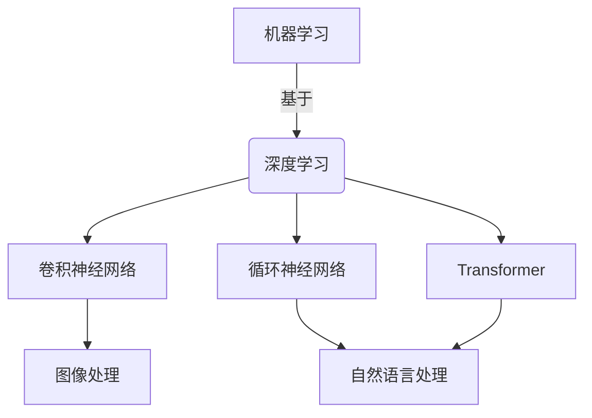

# AIGC从入门到实战：AIGC 赋能行业，产生无数新机会

## 1.背景介绍

### 1.1 什么是AIGC？

AIGC(Artificial Intelligence Generated Content)，即人工智能生成内容，是指利用人工智能技术自动生成文本、图像、音频、视频等多种形式的内容。近年来,AIGC技术取得了长足进步,在各行各业中得到了广泛应用,正在改变着人类的工作和生活方式。

### 1.2 AIGC技术的发展历程

AIGC技术的发展可以追溯到20世纪60年代,当时的机器学习算法为其奠定了基础。21世纪初,深度学习的兴起推动了AIGC技术的飞速发展。近年来,大型语言模型(如GPT-3)和生成式对抗网络(GAN)等技术的出现,使得AIGC在文本、图像等领域取得了突破性进展。

### 1.3 AIGC技术的重要意义

AIGC技术的发展为各行业带来了巨大的机遇和挑战。它可以显著提高内容生产效率,降低成本,同时为人类创作提供辅助,开辟新的创作形式。但同时也引发了版权、隐私等伦理法律问题,需要制定相应的规范和标准。

## 2.核心概念与联系

### 2.1 机器学习

机器学习是AIGC技术的基础,它使计算机能够从数据中自动学习模式,并对新数据做出预测或决策。常见的机器学习算法包括监督学习、非监督学习和强化学习等。

### 2.2 深度学习

深度学习是机器学习的一个分支,它模仿人脑的神经网络结构,通过多层非线性变换对数据进行特征提取和模式识别。深度学习在计算机视觉、自然语言处理等领域取得了巨大成功,是AIGC技术的核心驱动力。

### 2.3 生成式对抗网络(GAN)

GAN是一种基于深度学习的生成模型,由生成器和判别器两部分组成。生成器从随机噪声中生成样本,判别器判断样本是真实数据还是生成数据。通过对抗训练,GAN可以生成逼真的图像、音频等内容。

### 2.4 大型语言模型

大型语言模型(如GPT-3)是一种基于Transformer的自然语言处理模型,通过预训练学习大量文本数据,获得强大的语言理解和生成能力。它们可以用于文本生成、问答、摘要等多种任务,是AIGC文本生成的核心技术。

## 3.核心算法原理具体操作步骤

### 3.1 监督学习算法

监督学习是机器学习中最常见的一种范式,其核心思想是从标注好的训练数据中学习出一个模型,然后对新的未知数据进行预测或分类。常见的监督学习算法包括线性回归、逻辑回归、支持向量机(SVM)、决策树、随机森林等。

1. **数据准备**:收集并清洗训练数据,将其划分为特征(自变量)和标签(因变量)两部分。
2. **特征工程**:对原始特征进行加工,提取更有意义的特征,以提高模型性能。
3. **模型选择**:根据问题的性质和数据的特点,选择合适的算法,如线性回归用于回归问题,逻辑回归用于二分类问题。
4. **模型训练**:使用训练数据,通过优化算法(如梯度下降)调整模型参数,使模型在训练集上达到最优性能。
5. **模型评估**:在保留的测试集上评估模型性能,计算相关指标(如准确率、F1分数等)。
6. **模型调优**:根据评估结果,通过调整超参数、特征选择等方式优化模型性能。
7. **模型应用**:将训练好的模型应用于实际场景,对新的未知数据进行预测或分类。

### 3.2 非监督学习算法

非监督学习是在没有标注数据的情况下,从原始数据中发现内在模式和规律的一种机器学习范式。常见的非监督学习算法包括聚类算法(如K-Means、层次聚类)和降维算法(如主成分分析PCA、t-SNE)等。

1. **数据准备**:收集并清洗原始数据。
2. **特征工程**:对原始特征进行加工,提取更有意义的特征。
3. **算法选择**:根据任务目标选择合适的非监督学习算法,如聚类或降维。
4. **算法应用**:运行选定的算法,对数据进行聚类或降维等操作。
5. **结果评估**:通过可视化或其他方式评估算法结果,判断是否满足需求。
6. **算法调优**:根据评估结果,调整算法超参数,优化算法性能。
7. **结果应用**:将算法结果应用于实际场景,如异常检测、推荐系统等。

### 3.3 生成式对抗网络(GAN)算法

GAN算法由生成器(Generator)和判别器(Discriminator)两部分组成,通过对抗训练的方式,生成器学习生成逼真的样本,判别器学习区分真实样本和生成样本。

1. **数据准备**:收集并准备真实样本数据,如图像、音频等。
2. **网络构建**:设计生成器和判别器网络结构,通常采用卷积神经网络或其他深度学习模型。
3. **初始化**:随机初始化生成器和判别器的网络参数。
4. **对抗训练**:
   - 生成器从随机噪声中生成样本
   - 判别器判断生成样本和真实样本,计算损失函数
   - 反向传播,更新生成器和判别器的参数
   - 重复上述步骤,直至模型收敛
5. **结果评估**:通过可视化或其他指标评估生成样本的质量。
6. **模型调优**:根据评估结果,调整网络结构、超参数等,优化模型性能。
7. **模型应用**:将训练好的生成器应用于实际场景,生成所需的样本。

### 3.4 大型语言模型算法

大型语言模型通常采用基于Transformer的自注意力机制,对大量文本数据进行预训练,学习语言的上下文信息和语义关系,从而获得强大的语言理解和生成能力。

1. **数据准备**:收集并清洗大量文本数据,构建语料库。
2. **模型构建**:设计基于Transformer的语言模型架构,通常包括编码器(Encoder)和解码器(Decoder)两部分。
3. **预训练**:
   - 对语料库进行预处理,构建输入序列和目标序列
   - 采用自监督学习方式(如掩码语言模型MLM、下一句预测NSP等),对模型进行预训练
   - 通过反向传播算法,更新模型参数
4. **微调**:根据具体的下游任务(如文本生成、问答等),对预训练模型进行微调,进一步优化模型性能。
5. **结果评估**:在测试集上评估模型在相关指标(如困惑度、BLEU分数等)上的表现。
6. **模型调优**:根据评估结果,调整模型结构、超参数等,优化模型性能。
7. **模型应用**:将微调后的模型应用于实际场景,完成相应的语言任务。

## 4.数学模型和公式详细讲解举例说明

### 4.1 线性回归

线性回归是一种常见的监督学习算法,用于预测连续型目标变量。它假设目标变量 $y$ 和特征变量 $\boldsymbol{x}$ 之间存在线性关系,可以表示为:

$$y = \boldsymbol{w}^T\boldsymbol{x} + b$$

其中 $\boldsymbol{w}$ 是权重向量, $b$ 是偏置项。训练目标是通过最小化均方误差损失函数:

$$L(\boldsymbol{w}, b) = \frac{1}{2n}\sum_{i=1}^n (y_i - \boldsymbol{w}^T\boldsymbol{x}_i - b)^2$$

来学习最优的 $\boldsymbol{w}$ 和 $b$,其中 $n$ 是训练样本数量。

通常采用梯度下降法进行优化,对 $\boldsymbol{w}$ 和 $b$ 进行迭代更新:

$$\boldsymbol{w} \leftarrow \boldsymbol{w} - \alpha\frac{\partial L}{\partial \boldsymbol{w}}$$
$$b \leftarrow b - \alpha\frac{\partial L}{\partial b}$$

其中 $\alpha$ 是学习率,用于控制更新步长。

**示例**:假设我们要预测房屋价格,特征变量包括房屋面积、卧室数量等,目标变量是房屋价格。通过线性回归,我们可以学习出特征变量与房屋价格之间的线性关系,从而对新房屋的价格进行预测。

### 4.2 逻辑回归

逻辑回归是一种常用的分类算法,适用于二分类问题。它通过对线性回归的输出结果进行 Sigmoid 函数转换,将输出值映射到 (0, 1) 区间,作为样本属于正类的概率估计:

$$\hat{y} = \sigma(\boldsymbol{w}^T\boldsymbol{x} + b) = \frac{1}{1 + e^{-(\boldsymbol{w}^T\boldsymbol{x} + b)}}$$

其中 $\sigma(\cdot)$ 是 Sigmoid 函数。通过设置阈值(通常为 0.5),将概率值转换为二值输出,即:

$$y = \begin{cases}
1, & \text{if }\hat{y} \geq 0.5 \\
0, & \text{if }\hat{y} < 0.5
\end{cases}$$

训练目标是最小化交叉熵损失函数:

$$L(\boldsymbol{w}, b) = -\frac{1}{n}\sum_{i=1}^n [y_i\log\hat{y}_i + (1 - y_i)\log(1 - \hat{y}_i)]$$

同样采用梯度下降法进行优化。

**示例**:假设我们要判断一封电子邮件是否为垃圾邮件,特征变量包括邮件主题、正文关键词等,目标变量为二值标签(垃圾邮件或正常邮件)。通过逻辑回归,我们可以学习出特征变量与邮件类型之间的映射关系,从而对新邮件进行分类。

### 4.3 支持向量机(SVM)

支持向量机是一种常用的分类算法,其基本思想是在高维空间中寻找一个超平面,将不同类别的样本分开,同时使得超平面与最近样本点的距离(即间隔)最大化。

对于线性可分的二分类问题,SVM 寻找的超平面方程为:

$$\boldsymbol{w}^T\boldsymbol{x} + b = 0$$

其中 $\boldsymbol{w}$ 是超平面的法向量, $b$ 是偏置项。训练目标是最大化间隔 $\gamma$,即:

$$\begin{array}{cl}
\underset{\boldsymbol{w}, b}{\text{max}} & \gamma \\
\text{s.t.} & y_i(\boldsymbol{w}^T\boldsymbol{x}_i + b) \geq \gamma, \quad i = 1, 2, \dots, n
\end{array}$$

这可以等价地转化为以下凸优化问题:

$$\begin{array}{cl}
\underset{\boldsymbol{w}, b}{\text{min}} & \frac{1}{2}\|\boldsymbol{w}\|^2 \\
\text{s.t.} & y_i(\boldsymbol{w}^T\boldsymbol{x}_i + b) \geq 1, \quad i = 1, 2, \dots, n
\end{array}$$

对于线性不可分的情况,可以引入核技巧,将样本映射到高维空间,使其在高维空间中线性可分。常用的核函数包括线性核、多项式核和高斯核等。

**示例**:假设我们要对手写数字图像进行分类,特征变量是图像像素值,目标变量是数字标签。通过 SVM,我们可以在高维