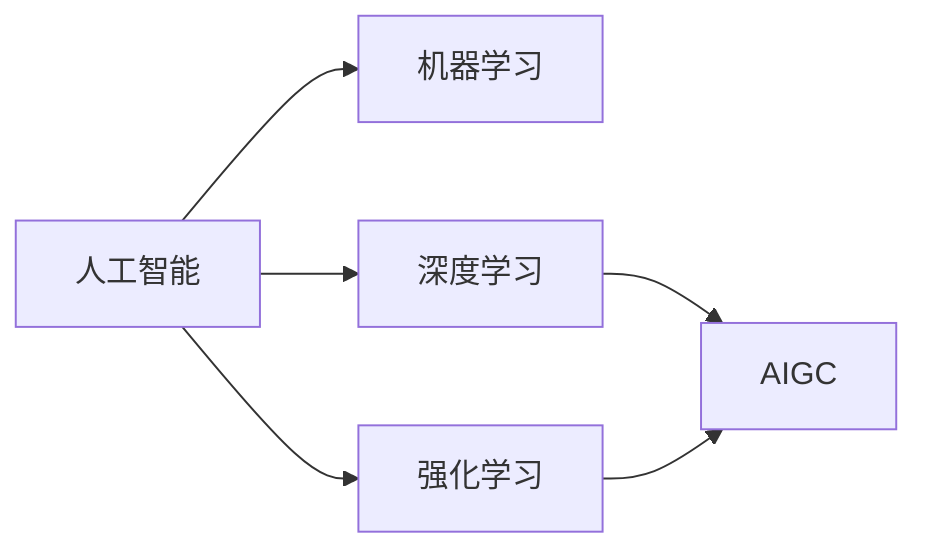

## 1.背景介绍

人工智能 (AI) 已经成为我们日常生活中不可或缺的一部分，无论是在自动驾驶汽车，还是在我们的手机，电脑，甚至是我们的家庭中，AI都在发挥着重要的作用。然而，AI的发展并非一蹴而就，它的发展经历了从起步，发展，到成熟的过程。这个过程中，我们可以看到AI的变迁，从最初的基于规则的系统，到现在的深度学习，再到未来可能的人工智能通用计算 (AIGC)，这是一个充满挑战和机遇的过程。

## 2.核心概念与联系

在开始讨论AIGC之前，我们需要理解几个核心的概念，包括AI，深度学习，和AIGC。AI是一个广泛的领域，包括了机器学习，深度学习，强化学习等多个子领域。深度学习是AI的一个重要分支，它通过模拟人脑的工作方式，使用神经网络来进行学习和预测。而AIGC则是AI的未来，它是一种可以自我学习，自我改进，并能在任何领域进行高效计算的AI。



## 3.核心算法原理具体操作步骤

在深度学习中，最常见的算法是反向传播算法 (Backpropagation)。这个算法的基本思想是，通过计算输出层的误差，然后反向传播这个误差，更新每一层的权重，从而达到优化模型的目的。在AIGC中，我们需要的不仅仅是优化模型，还需要模型能够自我学习，自我改进，这就需要更复杂的算法，例如元学习 (Meta-Learning)。元学习的目标是让AI能够学习如何学习，这样AI就能在面对新的任务或者环境时，能够快速适应并提高其性能。

## 4.数学模型和公式详细讲解举例说明

在深度学习中，我们常常使用梯度下降法来优化我们的模型。梯度下降法的基本原理是，我们首先计算损失函数的梯度，然后沿着梯度的反方向更新我们的参数，从而达到减小损失函数的目的。具体来说，如果我们的损失函数为 $L$，参数为 $\theta$，那么参数的更新公式为：

$$\theta = \theta - \alpha \nabla L(\theta)$$

其中，$\alpha$ 是学习率，$\nabla L(\theta)$ 是损失函数的梯度。

在AIGC中，我们可能需要使用更复杂的优化方法，例如自适应学习率的优化方法。这些方法能够根据参数的历史更新情况，自动调整学习率，从而达到更好的优化效果。

## 5.项目实践：代码实例和详细解释说明

在实际的项目中，我们可以使用Python的深度学习库，例如TensorFlow或者PyTorch，来实现我们的模型。以下是一个使用TensorFlow实现的简单的深度学习模型的例子：

```python
import tensorflow as tf
from tensorflow.keras import layers

model = tf.keras.Sequential()
model.add(layers.Dense(64, activation='relu'))
model.add(layers.Dense(64, activation='relu'))
model.add(layers.Dense(10, activation='softmax'))

model.compile(optimizer=tf.keras.optimizers.Adam(0.01),
              loss='categorical_crossentropy',
              metrics=['accuracy'])

# Assume `x_train` & `y_train` are the features and labels for 1000 training examples
model.fit(x_train, y_train, epochs=10, batch_size=32)
```

在这个例子中，我们首先定义了一个顺序模型，然后添加了两个隐藏层和一个输出层。然后我们定义了优化器，损失函数，和评价指标，最后我们使用训练数据来训练我们的模型。

## 6.实际应用场景

AI和AIGC可以应用在许多领域，例如自动驾驶，医疗诊断，金融预测，以及游戏等等。在自动驾驶中，AI可以帮助我们识别路标，行人，以及其他车辆，并做出正确的驾驶决策。在医疗诊断中，AI可以帮助医生分析医疗影像，从而提高诊断的准确性和效率。在金融预测中，AI可以帮助我们预测股票的走势，从而做出更好的投资决策。在游戏中，AI可以用来创建更智能的NPC，提高游戏的挑战性和趣味性。

## 7.工具和资源推荐

在学习和实践AI和AIGC的过程中，有许多优秀的资源可以帮助我们。例如，"Deep Learning" 是一本非常好的书，它详细介绍了深度学习的基本概念和方法。另外，Coursera上的 "Deep Learning Specialization" 课程也是一个非常好的学习资源。在实践方面，Python的深度学习库，例如TensorFlow和PyTorch，都是非常好的工具。另外，Google的Colab提供了免费的GPU资源，可以帮助我们训练复杂的深度学习模型。

## 8.总结：未来发展趋势与挑战

AI的发展正在加速，从最初的基于规则的系统，到现在的深度学习，再到未来可能的AIGC，我们可以看到AI的潜力和可能性。然而，AI的发展也面临着许多挑战，例如如何保证AI的公平性，透明性，以及安全性等。尽管如此，我相信，随着技术的进步，我们将能够克服这些挑战，实现AI的广泛应用和普及。

## 9.附录：常见问题与解答

在这个部分，我会列出一些关于AI和AIGC的常见问题，以及我的答案。我希望这些问题和答案能够帮助读者更好地理解AI和AIGC。

Q: 什么是AIGC？

A: AIGC是人工智能通用计算的简称，它是一种可以自我学习，自我改进，并能在任何领域进行高效计算的AI。

Q: AIGC和深度学习有什么区别？

A: 深度学习是AI的一个重要分支，它通过模拟人脑的工作方式，使用神经网络来进行学习和预测。而AIGC则是AI的未来，它不仅需要能够学习和预测，还需要能够自我学习，自我改进。

Q: AIGC有哪些应用？

A: AIGC可以应用在许多领域，例如自动驾驶，医疗诊断，金融预测，以及游戏等等。在这些领域，AIGC可以帮助我们解决更复杂，更具挑战性的问题。

作者：禅与计算机程序设计艺术 / Zen and the Art of Computer Programming