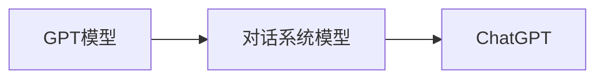

## 1.背景介绍

在人工智能的发展历程中，自然语言处理（NLP）始终是一个重要的研究领域。近年来，随着深度学习技术的发展，NLP领域取得了一些重要的突破，其中，OpenAI的GPT系列模型（Generative Pre-training Transformer）是最具代表性的成果之一。本文将重点探讨ChatGPT，这是一种基于GPT的对话系统模型，它已经在各种场合展示了其强大的能力。

## 2.核心概念与联系

ChatGPT是一种基于GPT的对话系统模型，它的设计目标是生成自然、连贯和有意义的对话。ChatGPT的核心思想是利用GPT的生成能力，通过大量的对话数据训练，使模型学习到人类的对话方式，从而能够生成符合人类语言习惯的对话。



## 3.核心算法原理具体操作步骤

ChatGPT的训练过程大致可以分为两个阶段：预训练和微调。

### 3.1 预训练

在预训练阶段，模型首先在大量的文本数据上进行训练，学习到语言的基本规律。这部分训练数据来源于互联网，包括各种类型的文本，如新闻、书籍、网页等。

### 3.2 微调

在微调阶段，模型在特定的对话数据上进行训练，学习到对话的规律。这部分训练数据来源于人工标注的对话数据。

通过这两个阶段的训练，ChatGPT模型可以生成符合人类语言习惯的对话。

## 4.数学模型和公式详细讲解举例说明

GPT模型的基础是Transformer模型，其主要组成部分是自注意力机制（self-attention mechanism）和位置编码（position encoding）。下面我们来详细解释这两部分。

### 4.1 自注意力机制

自注意力机制的主要思想是计算输入序列中每个元素对其他元素的影响。具体来说，对于一个输入序列$x_1, x_2, ..., x_n$，自注意力机制首先计算每个元素$x_i$对其他元素$x_j$的注意力权重$a_{ij}$，然后用这些权重对输入序列进行加权求和，得到新的序列。注意力权重$a_{ij}$的计算公式如下：

$$
a_{ij} = \frac{exp(e_{ij})}{\sum_{k=1}^{n}exp(e_{ik})}
$$

其中，$e_{ij}$是元素$x_i$和$x_j$的相关性，通常通过一个线性变换和一个非线性激活函数计算得到。

### 4.2 位置编码

由于自注意力机制没有考虑元素的顺序，因此，GPT模型引入了位置编码来解决这个问题。具体来说，GPT模型为每个位置$i$分配一个向量$p_i$，并将其加到对应位置的元素上。位置编码的计算公式如下：

$$
p_i = (sin(i), cos(i), sin(2i), cos(2i), ..., sin(ni), cos(ni))
$$

## 5.项目实践：代码实例和详细解释说明

在实际应用中，我们可以使用OpenAI提供的GPT-3 API来实现ChatGPT。下面是一个简单的例子：

```python
import openai

openai.api_key = 'your-api-key'

response = openai.ChatCompletion.create(
  model="gpt-3.5-turbo",
  messages=[
        {"role": "system", "content": "You are a helpful assistant."},
        {"role": "user", "content": "Who won the world series in 2020?"},
    ]
)

print(response['choices'][0]['message']['content'])
```

在这个例子中，我们首先设置了API密钥，然后调用了ChatCompletion接口，发送了一个对话消息。最后，我们打印出了模型的回复。

## 6.实际应用场景

ChatGPT在许多应用场景中都有很好的表现，例如：

- 客服机器人：ChatGPT可以用来自动回答用户的问题，提高客服效率。
- 虚拟助手：ChatGPT可以作为虚拟助手，帮助用户完成各种任务。
- 在线教育：ChatGPT可以用来提供个性化的在线教育服务。

## 7.工具和资源推荐

如果你对ChatGPT感兴趣，以下是一些推荐的工具和资源：

- OpenAI GPT-3 API：OpenAI提供的GPT-3 API，可以方便地使用GPT模型。
- Hugging Face Transformers：一个开源的NLP库，包含了许多预训练的模型，包括GPT系列模型。
- "Attention is All You Need"：这是Transformer模型的原始论文，详细介绍了自注意力机制和位置编码。

## 8.总结：未来发展趋势与挑战

尽管ChatGPT已经取得了显著的成果，但仍然存在一些挑战，例如模型的解释性、对话的连贯性等。在未来，我们期待看到更多的研究来解决这些问题，并进一步提升ChatGPT的性能。

## 9.附录：常见问题与解答

- Q: ChatGPT如何生成对话？
- A: ChatGPT通过学习大量的对话数据，学习到人类的对话方式，然后用这些知识来生成对话。

- Q: ChatGPT的训练数据来自哪里？
- A: ChatGPT的训练数据来自互联网，包括各种类型的文本，如新闻、书籍、网页等。

作者：禅与计算机程序设计艺术 / Zen and the Art of Computer Programming