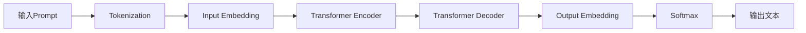
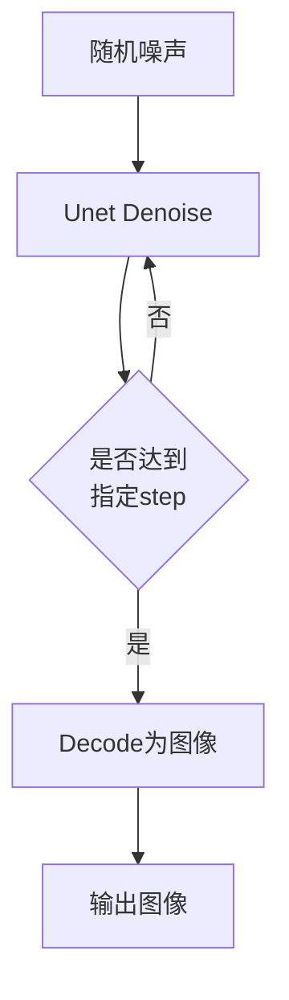

# AIGC从入门到实战：焦虑：AIGC 时代下的职业该如何规划

## 1.背景介绍
### 1.1 AIGC的兴起
近年来,人工智能生成内容(AIGC)技术取得了突破性进展。从OpenAI的GPT-3到Stable Diffusion,AIGC模型展现出了惊人的内容生成能力,引发了人们对于这一技术的广泛关注和讨论。

### 1.2 AIGC对就业的影响  
AIGC技术的发展,一方面为内容创作、设计、编程等领域带来了巨大的生产力提升,另一方面也引发了人们对就业前景的担忧。有人担心AIGC会取代一些传统工作岗位,导致失业率上升。这种焦虑在当下尤为明显。

### 1.3 职业规划的必要性
面对AIGC带来的机遇和挑战,个人职业发展规划显得尤为重要。只有主动拥抱变化,提升自身能力,才能在这一轮技术革命中立于不败之地。本文将重点探讨AIGC时代下,个人职业发展的策略和路径。

## 2.核心概念与联系
### 2.1 AIGC的定义与分类
AIGC是利用人工智能技术自动生成各类内容(文本、图像、音视频等)的技术统称。其中,以语言模型和扩散模型为代表的两大类模型发挥着重要作用。

### 2.2 AIGC与传统内容生产的区别
与传统的人工内容生产相比,AIGC具有生产效率高、成本低、创意多样等优势。但另一方面,AIGC生成的内容在准确性、逻辑性等方面还有待提高,仍需要人工把关和优化。

### 2.3 AIGC对职业的影响
AIGC对内容创作、设计、客服等岗位的影响最为直接,有一定的替代效应。但同时,AIGC的应用也催生了prompt engineer、数据标注、AI伦理审核等新兴岗位。总的来看,AIGC将改变岗位的技能需求,但不会导致大规模失业。

## 3.核心算法原理具体操作步骤
### 3.1 AIGC的技术原理
AIGC的核心是利用深度学习算法,通过海量数据训练,构建能够生成内容的AI模型。其中,Transformer结构是主流的模型架构。

### 3.2 文本生成的流程
以文本生成为例,其主要流程包括:



### 3.3 图像生成的流程
图像生成的主流方法是扩散模型,其流程如下:



## 4.数学模型和公式详细讲解举例说明
### 4.1 Transformer的核心公式
Transformer的核心是自注意力机制(Self-Attention),其公式为:

$$Attention(Q,K,V) = softmax(\frac{QK^T}{\sqrt{d_k}})V$$

其中,$Q$,$K$,$V$分别是query,key,value向量,$d_k$为向量维度。

### 4.2 Softmax函数
Softmax函数用于将一组实数转化为概率分布,公式为:

$$Softmax(x_i) = \frac{e^{x_i}}{\sum_{j=1}^n e^{x_j}}$$

其中,$x_i$为第$i$个元素,$n$为向量长度。Softmax保证了输出的概率之和为1。

### 4.3 交叉熵损失函数
训练语言模型通常使用交叉熵损失函数,公式为:

$$Loss = -\sum_{i=1}^n y_i \log(p_i)$$

其中,$y_i$为真实标签(one-hot形式),$p_i$为预测概率。交叉熵刻画了预测分布与真实分布的差异。

## 5.项目实践：代码实例和详细解释说明
下面以PyTorch实现一个简单的AIGC文本生成模型:

```python
import torch
import torch.nn as nn

class Generator(nn.Module):
    def __init__(self, vocab_size, embed_dim, hidden_dim):
        super().__init__()
        self.embedding = nn.Embedding(vocab_size, embed_dim)
        self.rnn = nn.GRU(embed_dim, hidden_dim, batch_first=True)  
        self.fc = nn.Linear(hidden_dim, vocab_size)
        
    def forward(self, x, h=None):
        x = self.embedding(x)
        out, h = self.rnn(x, h)  
        out = self.fc(out)
        return out, h
        
model = Generator(vocab_size=1000, embed_dim=64, hidden_dim=128)
criterion = nn.CrossEntropyLoss()
optimizer = torch.optim.Adam(model.parameters(), lr=1e-3)

for epoch in range(num_epochs):
    for x, y in data_loader:
        optimizer.zero_grad()
        y_pred, _ = model(x)      
        loss = criterion(y_pred.view(-1, vocab_size), y.view(-1))
        loss.backward()
        optimizer.step()
```

这里使用了一个简单的RNN模型作为生成器。模型主要包含三个部分:
- `Embedding`层:将token id映射为连续向量表示
- `GRU`层:学习序列特征,捕捉上下文信息  
- `Linear`层:将隐藏状态映射为每个token的概率分布

训练时,使用`Adam`优化器最小化交叉熵损失。生成时,只需要给定一个初始token,然后反复预测下一个token,即可得到生成的文本序列。

## 6.实际应用场景
AIGC技术在诸多领域都有广泛应用,例如:

### 6.1 智能写作助手
AIGC可以作为写作助手,协助人类完成文案、文章、剧本等的创作。比如Jasper.ai等工具,可以根据简单的主题描述,自动生成一篇完整的文章。

### 6.2 虚拟客服/数字人
AIGC可以用于构建个性化的虚拟客服或数字人,提供智能化的客户服务。相比传统的客服系统,AIGC驱动的虚拟客服能够进行更加自然流畅的多轮对话交互。

### 6.3 游戏内容生成
AIGC可以自动生成游戏中的地图、任务、NPC对话等内容,极大地提升了游戏开发效率。例如《无光之海》就大量使用了AI生成的游戏素材。

### 6.4 教育内容制作
AIGC可以自动生成教学案例、习题、解析等教育内容,为在线教育平台提供了海量的个性化学习资源。

## 7.工具和资源推荐
对于有志于从事AIGC研究和应用的个人,这里推荐一些学习资源:

### 7.1 开源项目
- [Hugging Face Transformers](https://github.com/huggingface/transformers):包含主流NLP模型的开源库
- [Stable Diffusion](https://github.com/CompVis/stable-diffusion):开源的图像生成模型
- [DALL·E Mini](https://github.com/borisdayma/dalle-mini):开源的图文生成模型

### 7.2 在线课程
- [deeplearning.ai的NLP专项课程](https://www.deeplearning.ai/programs/natural-language-processing-specialization/)
- [fast.ai的Practical Deep Learning for Coders](https://course.fast.ai/) 

### 7.3 书籍
- 《Attention Is All You Need》:Transformer的原始论文
- 《Generative Deep Learning》:生成式深度学习的入门教材

## 8.总结：未来发展趋势与挑战
### 8.1 AIGC的发展趋势
未来,AIGC技术将向着多模态、个性化、实时交互的方向发展。同时,AIGC与传统内容创作的结合也将更加紧密,形成人机协作的新范式。

### 8.2 面临的挑战
AIGC的发展仍面临诸多挑战:
- 知识获取与融合:如何让AIGC模型获取并理解更广泛的世界知识
- 生成内容的可控性:如何引导模型生成符合人类偏好的内容
- 伦理与安全:如何避免AIGC生成有害、虚假、偏见的内容

### 8.3 个人职业发展建议
面对AIGC带来的变革,个人职业发展需要注意以下几点:
- 拥抱变化,保持开放心态,主动学习AIGC相关知识和技能
- 发挥人类的独特优势,注重创造力、同理心、批判性思维等能力的培养
- 积极参与到人机协作的工作方式中,用AIGC提升自身的生产力

总之,AIGC是一把双刃剑,关键是要学会与之共舞。在这个过程中,保持积极乐观的心态,不断提升自我,就能在变革的浪潮中立于不败之地。

## 9.附录：常见问题与解答
### 9.1 AIGC会取代人类的工作吗?
AIGC会改变一些工作的形态,但不会完全取代人类。AIGC所擅长的是重复性、模式化的任务,而人类在创造力、同理心、决策力等方面有着独特优势。未来更可能是人机协同的模式。

### 9.2 个人如何学习AIGC技术? 
学习AIGC需要扎实的机器学习和深度学习基础。可以从吴恩达的《Machine Learning》和《Deep Learning》系列课程入手,再深入学习《Natural Language Processing》和《Generative Adversarial Networks》等专题课程。同时,多动手实践,参与Kaggle竞赛和开源项目,是提升AIGC实战能力的有效途径。

### 9.3 AIGC领域有哪些职业方向?
AIGC相关的职位主要有算法研究员、应用研究员、前沿产品经理、prompt策划、数据标注等。算法研究员侧重于模型和算法的创新;应用研究员侧重于将AIGC技术落地到具体场景;前沿产品经理负责AIGC产品的规划设计;prompt策划专门为AIGC模型编写输入指令;数据标注人员负责构建AIGC模型训练所需的数据集。个人可以根据自身背景和兴趣,选择合适的发展方向。

作者：禅与计算机程序设计艺术 / Zen and the Art of Computer Programming