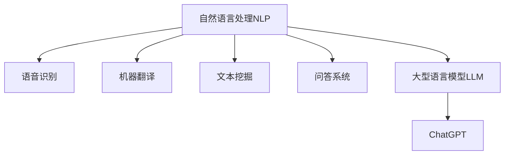
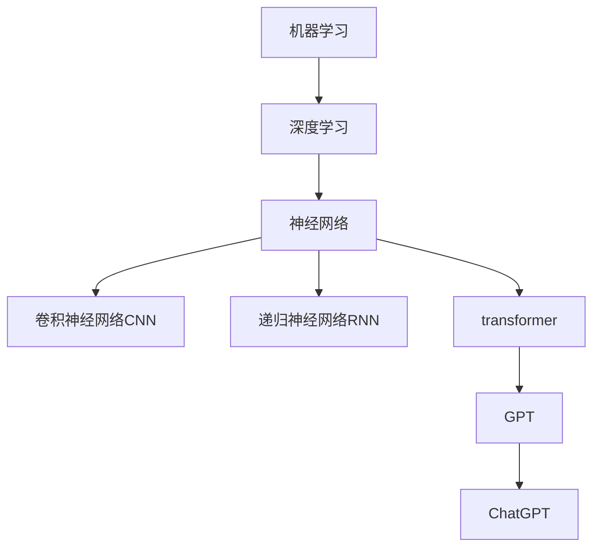
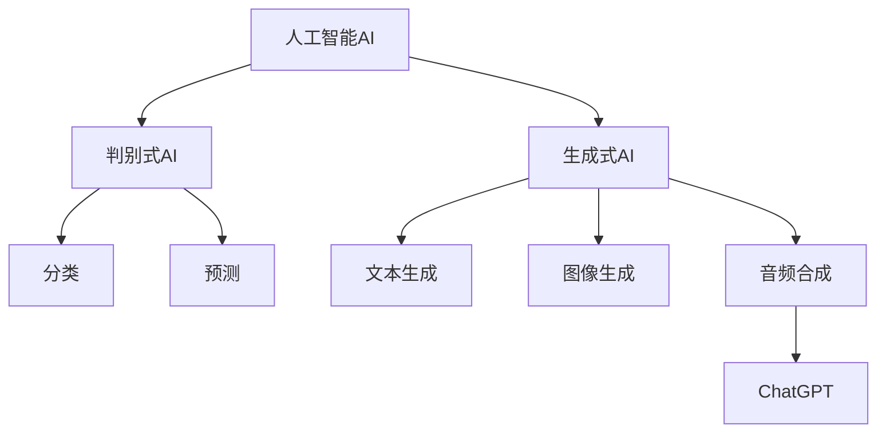
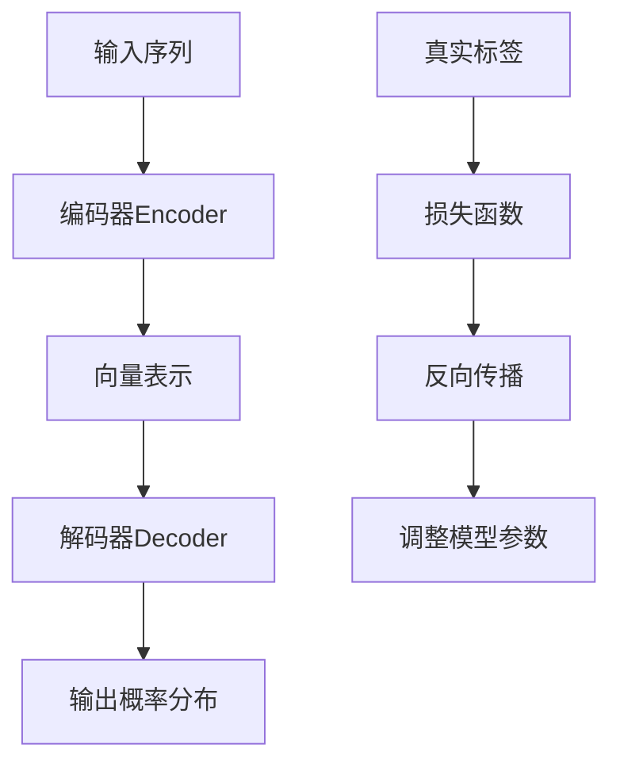

# AIGC从入门到实战：白也诗无敌，飘然思不群：ChatGPT，博学、"聪明"的好助手

## 1.背景介绍

### 1.1 人工智能的崛起

人工智能(Artificial Intelligence, AI)是当代最具革命性和颠覆性的技术之一。近年来,AI的发展突飞猛进,尤其是在自然语言处理、计算机视觉、决策系统等领域取得了令人瞩目的成就。AI技术正在深刻影响和改变着我们的生活、工作和社会。

### 1.2 AIGC的兴起

AI生成式内容(AI-Generated Content, AIGC)是AI技术在内容生成领域的一个重要应用。AIGC可以自动生成文本、图像、音频、视频等多种形式的内容,大大提高了内容生产的效率和质量。随着深度学习、自然语言处理等技术的不断进步,AIGC的能力也在不断增强。

### 1.3 ChatGPT的崭露头角

ChatGPT是OpenAI公司于2022年11月推出的一款基于GPT-3.5语言模型的对话式AI助手。它具有强大的自然语言理解和生成能力,可以根据用户的输入,生成流畅、连贯、富有洞见的回复。ChatGPT在问世后便引起了广泛关注,被誉为"博学、聪明的好助手"。

## 2.核心概念与联系

### 2.1 自然语言处理(NLP)

自然语言处理(Natural Language Processing, NLP)是人工智能的一个重要分支,旨在使计算机能够理解和生成人类语言。NLP技术包括语音识别、机器翻译、文本挖掘、问答系统等。ChatGPT就是基于NLP技术,特别是大型语言模型(Large Language Model, LLM),实现了出色的自然语言理解和生成能力。



### 2.2 深度学习与神经网络

深度学习(Deep Learning)是机器学习的一个分支,它基于人工神经网络,通过对大量数据的训练,自动学习数据的特征和规律。深度学习在图像识别、语音识别、自然语言处理等领域表现出色。大型语言模型如GPT-3、ChatGPT等,都是基于深度学习技术训练而成。



### 2.3 生成式AI与判别式AI

AI技术可以分为生成式AI(Generative AI)和判别式AI(Discriminative AI)两大类。判别式AI主要用于分类、预测等任务,如图像分类、垃圾邮件检测等。而生成式AI则是生成新的内容,如文本生成、图像生成、音频合成等。ChatGPT作为一款基于大型语言模型的对话式AI助手,属于生成式AI的范畴。



## 3.核心算法原理具体操作步骤

### 3.1 transformer架构

ChatGPT的核心算法是基于transformer的自注意力机制(Self-Attention)。transformer架构由编码器(Encoder)和解码器(Decoder)两部分组成。编码器将输入序列编码为向量表示,解码器则根据编码器的输出和上一个时间步的输出,生成新的输出序列。


### 3.2 自注意力机制

自注意力机制是transformer架构的核心,它允许模型在生成序列时,同时关注输入序列中的所有位置。每个位置的输出由其与所有位置的输入的加权和计算得到,权重则由注意力分数决定。这种机制使得模型能够有效地捕获长距离依赖关系。

$$\mathrm{Attention}(Q, K, V) = \mathrm{softmax}(\frac{QK^T}{\sqrt{d_k}})V$$

其中,$Q$为查询(Query)向量,$K$为键(Key)向量,$V$为值(Value)向量,$d_k$为缩放因子。

### 3.3 掩码自回归语言模型

ChatGPT采用了掩码自回归语言模型(Masked Auto-Regressive Language Model)的训练方式。在训练过程中,模型会根据上文生成下一个词的概率分布,并与真实标签进行对比,通过反向传播算法不断调整模型参数,最小化损失函数。这种训练方式使得模型能够生成连贯、流畅的文本。



### 3.4 模型微调

为了使ChatGPT在特定领域表现更好,OpenAI还对预训练模型进行了进一步的微调(Fine-tuning)。微调是在大规模预训练模型的基础上,利用特定领域的数据对模型进行额外的训练,以使模型更加专注于该领域的任务。这种transfer learning的方式可以大幅提高模型的性能。

## 4.数学模型和公式详细讲解举例说明

### 4.1 transformer中的缩放点积注意力

transformer模型中使用了缩放点积注意力(Scaled Dot-Product Attention)机制,它是自注意力机制的一种具体实现形式。缩放点积注意力的计算公式如下:

$$\mathrm{Attention}(Q, K, V) = \mathrm{softmax}(\frac{QK^T}{\sqrt{d_k}})V$$

其中:

- $Q$为查询(Query)向量,表示当前需要处理的输入
- $K$为键(Key)向量,表示输入序列中的每个位置
- $V$为值(Value)向量,表示输入序列中每个位置对应的值
- $d_k$为缩放因子,用于防止点积过大导致softmax函数的梯度较小

计算过程包括三个步骤:

1. 计算查询$Q$与每个键$K$的点积,得到未缩放的分数向量
2. 将未缩放的分数向量除以缩放因子$\sqrt{d_k}$,得到缩放后的分数向量
3. 对缩放后的分数向量执行softmax操作,得到注意力权重向量,并与值向量$V$相乘,得到最终的注意力输出

例如,假设$Q=[0.1, 0.2, 0.3]$,$K=[[0.4, 0.5], [0.6, 0.7], [0.8, 0.9]]$,$V=[[1.0, 1.1], [1.2, 1.3], [1.4, 1.5]]$,且$d_k=2$,则:

1. 计算未缩放的分数向量: $[0.1 \times 0.4 + 0.2 \times 0.6 + 0.3 \times 0.8, 0.1 \times 0.5 + 0.2 \times 0.7 + 0.3 \times 0.9] = [0.62, 0.68]$
2. 缩放分数向量: $[0.62/\sqrt{2}, 0.68/\sqrt{2}] = [0.439, 0.481]$
3. softmax得到注意力权重: $\mathrm{softmax}([0.439, 0.481]) = [0.472, 0.528]$
4. 计算注意力输出: $0.472 \times [1.0, 1.1] + 0.528 \times [1.2, 1.3] = [1.114, 1.222]$

通过缩放点积注意力机制,transformer模型可以有效地捕获输入序列中不同位置之间的依赖关系,从而生成更加连贯、合理的输出序列。

### 4.2 transformer中的多头注意力

为了进一步提高transformer模型的表现,引入了多头注意力(Multi-Head Attention)机制。多头注意力将查询、键和值向量进行线性变换,得到多组新的查询、键和值向量,然后分别计算这些向量组的缩放点积注意力,最后将所有注意力输出进行拼接。

具体计算过程如下:

1. 线性变换得到查询、键和值向量组:

$$\begin{aligned}
Q_i &= QW_i^Q \\
K_i &= KW_i^K \\
V_i &= VW_i^V
\end{aligned}$$

其中,$W_i^Q$,$W_i^K$,$W_i^V$为可训练的权重矩阵,用于线性变换。

2. 对每组查询、键和值向量计算缩放点积注意力:

$$\mathrm{head}_i = \mathrm{Attention}(Q_i, K_i, V_i)$$

3. 拼接所有注意力头的输出:

$$\mathrm{MultiHead}(Q, K, V) = \mathrm{Concat}(\mathrm{head}_1, \ldots, \mathrm{head}_h)W^O$$

其中,$W^O$为另一个可训练的权重矩阵,用于将拼接后的向量映射到最终的输出空间。

多头注意力机制可以让模型从不同的子空间获取不同的信息,提高了模型的表达能力和泛化性能。

## 5.项目实践：代码实例和详细解释说明

以下是一个使用PyTorch实现transformer模型的简单示例,包括编码器(Encoder)、解码器(Decoder)和多头注意力(MultiHeadAttention)模块。

```python
import torch
import torch.nn as nn
import math

class MultiHeadAttention(nn.Module):
    def __init__(self, d_model, num_heads):
        super(MultiHeadAttention, self).__init__()
        self.d_model = d_model
        self.num_heads = num_heads
        self.head_dim = d_model // num_heads

        self.q_linear = nn.Linear(d_model, d_model)
        self.k_linear = nn.Linear(d_model, d_model)
        self.v_linear = nn.Linear(d_model, d_model)
        self.out_linear = nn.Linear(d_model, d_model)

    def forward(self, q, k, v, mask=None):
        batch_size = q.size(0)

        q = self.q_linear(q).view(batch_size, -1, self.num_heads, self.head_dim).transpose(1, 2)
        k = self.k_linear(k).view(batch_size, -1, self.num_heads, self.head_dim).transpose(1, 2)
        v = self.v_linear(v).view(batch_size, -1, self.num_heads, self.head_dim).transpose(1, 2)

        scores = torch.matmul(q, k.transpose(-2, -1)) / math.sqrt(self.head_dim)
        if mask is not None:
            scores = scores.masked_fill(mask == 0, -1e9)
        attn_weights = nn.Softmax(dim=-1)(scores)
        out = torch.matmul(attn_weights, v).transpose(1, 2).contiguous().view(batch_size, -1, self.d_model)
        out = self.out_linear(out)
        return out

class EncoderLayer(nn.Module):
    def __init__(self, d_model, num_heads, ff_dim, dropout=0.1):
        super(EncoderLayer, self).__init__()
        self.attn = MultiHeadAttention(d_model, num_heads)
        self.ff = nn.Sequential(
            nn.Linear(d_model, ff_dim),
            nn.ReLU(),
            nn.Dropout(dropout),
            nn.Linear(ff_dim, d_model),
            nn.Dropout(dropout)
        )
        self.norm1 = nn.LayerNorm(d_model)
        self.norm2 = nn.LayerNorm(d_model)

    def forward(self, x, src_mask=None):
        residual = x
        x = self.norm1(x + self.attn(x, x, x, src_mask))
        residual = x
        x = self.norm2(x + self.ff(x))
        return x

class Encoder(nn.Module):
    def __init__(self, d_model, num_layers, num_heads, ff_dim, dropout=0.1):
        super(Encoder, self).__init__()
        self.layers = nn.ModuleList([EncoderLayer