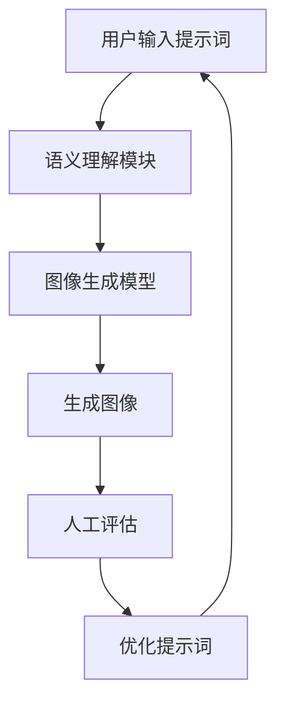

# AIGC从入门到实战：绘制美丽小姐姐的提示词写作技巧

## 1.背景介绍

### 1.1 AIGC的兴起

人工智能生成内容(AIGC)近年来迅速兴起,成为科技领域的一股新风潮。AIGC技术利用深度学习等人工智能算法,可以生成图像、视频、音频、文本等多种形式的内容。其中,AIGC图像生成技术备受关注,能够根据用户输入的文字描述生成逼真的图像,为创意设计、视觉艺术等领域带来全新可能。

### 1.2 提示词的重要性

在AIGC图像生成过程中,提示词(Prompt)扮演着关键作用。提示词是用户对期望生成图像的文字描述,它决定了生成图像的主题、风格、构图等诸多方面。优秀的提示词能够指导AI模型生成出更加符合预期、更加精美的图像作品。因此,掌握提示词的写作技巧,对于发挥AIGC图像生成的潜力至关重要。

### 1.3 美丽小姐姐图像生成的挑战

生成美丽小姐姐形象的图像是AIGC图像生成中一个颇具挑战的领域。这不仅需要准确描述小姐姐的外表特征,还需要捕捉她们独特的气质和魅力。同时,还要注意避免生成不当内容。因此,撰写高质量的提示词对于成功生成理想中的美丽小姐姐形象至关重要。

## 2.核心概念与联系

### 2.1 AIGC图像生成的核心概念

1. **生成对抗网络(GAN)**:AIGC图像生成的核心技术,由生成器和判别器两部分组成。生成器负责生成图像,判别器评估生成图像的真实性,两者相互对抗以优化生成效果。

2. **扩散模型**:近年来兴起的新型AIGC图像生成技术,通过学习图像数据的概率分布,再逆向采样生成图像。相比GAN,扩散模型生成图像质量更高、过程更加稳定。

3. **文本到图像(Text-to-Image)**:根据文本描述生成对应图像的任务,是AIGC图像生成的核心应用场景。

4. **提示词(Prompt)**:用于描述期望生成图像的文本输入,对生成结果有决定性影响。

5. **语义理解**:AI模型需要理解提示词中的语义信息,包括对象、属性、动作、场景等,并将其正确映射到生成图像中。

### 2.2 提示词写作与其他概念的联系

提示词写作技巧与AIGC图像生成的多个核心概念密切相关:

- **生成对抗网络**:提示词作为生成器的输入,会直接影响生成图像的内容和质量。
- **扩散模型**:提示词的语义信息被编码为条件,指导模型进行逆向采样生成图像。
- **文本到图像**:提示词是文本到图像任务的输入,决定了生成图像的主题和风格。
- **语义理解**:优秀的提示词需要准确表达语义,有利于模型正确理解和生成所需图像。

掌握提示词写作技巧,可以最大限度发挥AIGC图像生成模型的潜能,生成出更加精美、符合预期的图像作品。

## 3.核心算法原理具体操作步骤

### 3.1 AIGC图像生成的基本流程

AIGC图像生成的基本流程如下:



1. 用户输入文本提示词,描述期望生成的图像内容。
2. 语义理解模块解析提示词,提取关键语义信息,如对象、属性、动作等。
3. 图像生成模型(如GAN、扩散模型)根据语义信息生成图像。
4. 人工评估生成图像的质量,并对提示词进行优化。
5. 重复以上步骤,直到生成满意的图像为止。

### 3.2 提示词优化的迭代过程

由于AIGC图像生成是一个探索性的过程,通常需要多次迭代优化提示词,才能生成理想的图像。提示词优化的具体步骤如下:

1. **初始提示词**:根据需求编写初始提示词。
2. **生成图像**:将初始提示词输入AIGC图像生成模型,生成图像。
3. **人工评估**:人工评估生成图像的质量,包括内容、构图、细节等方面。
4. **优化提示词**:根据评估结果,优化提示词的内容和表达方式。
5. **重复生成**:将优化后的提示词输入模型,重复生成图像。
6. **评估和调整**:持续评估生成图像,必要时继续优化提示词,直到满意为止。

这个迭代过程需要耐心和经验积累。通过不断尝试和优化,可以逐步掌握撰写高质量提示词的诀窍。

## 4.数学模型和公式详细讲解举例说明

### 4.1 生成对抗网络(GAN)

生成对抗网络(GAN)是AIGC图像生成的核心技术之一,由生成器(Generator)和判别器(Discriminator)两部分组成。生成器从随机噪声输入中生成图像,判别器则评估生成图像的真实性。两者相互对抗、不断优化,以期生成更加逼真的图像。GAN的数学原理可用下式表示:

$$\min_G \max_D V(D,G) = \mathbb{E}_{x\sim p_\text{data}(x)}[\log D(x)] + \mathbb{E}_{z\sim p_z(z)}[\log(1-D(G(z)))]$$

其中:
- $G$是生成器,将随机噪声$z$映射为图像$G(z)$
- $D$是判别器,评估图像$x$的真实性得分$D(x)$
- $p_\text{data}(x)$是真实图像数据的分布
- $p_z(z)$是随机噪声$z$的分布,通常为高斯分布

生成器$G$和判别器$D$相互对抗,目标是找到一个Nash均衡,使得生成图像$G(z)$无法被判别器$D$识别为假图像。

### 4.2 扩散模型

扩散模型是近年来兴起的新型AIGC图像生成技术,通过学习图像数据的概率分布,再逆向采样生成图像。其数学原理基于一个马尔可夫链,将图像$x_0$逐步添加高斯噪声,得到一系列噪声图像$x_1, x_2, \cdots, x_T$。生成过程则是从纯噪声$x_T$出发,逐步去噪,最终生成图像$x_0$。

扩散模型的核心是学习从$x_t$到$x_{t-1}$的概率$q(x_{t-1}|x_t)$,即每一步去噪的条件概率。在已知$x_T$的条件下,整个生成过程可表示为:

$$p_\theta(x_0|x_T) = \prod_{t=1}^T q_\theta(x_{t-1}|x_t, x_T)$$

其中$\theta$是模型参数。通过最大化$p_\theta(x_0|x_T)$,模型可以学会从纯噪声$x_T$生成高质量图像$x_0$。

在实际应用中,扩散模型通常结合提示词进行条件生成。提示词的语义信息被编码为条件$c$,模型学习的是条件概率$q_\theta(x_{t-1}|x_t, c)$,从而生成符合提示词描述的图像。

### 4.3 示例:生成美丽小姐姐头像

假设我们希望生成一张"一位长发飘飘、眼睛明亮、嘴角微笑的美丽小姐姐"的头像图像。对应的提示词可以是:

"A beautiful young lady with long flowing hair, bright eyes, and a slight smile on her lips."

将这个提示词输入AIGC图像生成模型(如基于GAN或扩散模型),模型会首先理解提示词的语义,提取关键信息:

- 对象:美丽小姐姐(young lady)
- 属性:长发飘飘(long flowing hair)、眼睛明亮(bright eyes)、嘴角微笑(slight smile)

然后,模型会根据这些语义信息生成图像。对于GAN,生成器会尝试生成满足这些条件的图像,判别器则评估生成图像的真实性,两者不断对抗优化。对于扩散模型,则是从纯噪声出发,逐步去噪生成图像,同时将提示词的语义信息作为条件约束生成过程。

通过多次迭代优化提示词,我们最终可以得到一张符合预期的美丽小姐姐头像图像。

## 5.项目实践:代码实例和详细解释说明

虽然AIGC图像生成技术日新月异,但目前主流的开源模型和工具大多基于Python生态系统。以下是一个使用广受欢迎的Stable Diffusion模型生成图像的Python代码示例:

```python
# 导入必要的库
from diffusers import StableDiffusionPipeline
import torch

# 加载Stable Diffusion模型和tokenizer
model_id = "runwayml/stable-diffusion-v1-5"
pipe = StableDiffusionPipeline.from_pretrained(model_id, torch_dtype=torch.float16)

# 设置提示词和其他参数
prompt = "A beautiful young lady with long flowing hair, bright eyes, and a slight smile on her lips, highly detailed, 8k resolution, cinematic lighting"
negative_prompt = "ugly, deformed, disfigured, mutilated, extra limbs, poorly drawn hands, poorly drawn feet, poorly drawn face, out of frame, extra arms, extra legs, mutated hands, mutated feet, vag, boobs, nude, nsfw"
num_images = 1
guidance_scale = 7.5
num_inference_steps = 50

# 生成图像
images = pipe(prompt, negative_prompt=negative_prompt, num_images_per_prompt=num_images, guidance_scale=guidance_scale, num_inference_steps=num_inference_steps)

# 保存生成的图像
for i, image in enumerate(images.images):
    image.save(f"output_{i}.png")
```

代码解释:

1. 导入必要的库,包括Diffusers库(用于加载和运行Stable Diffusion模型)和PyTorch库。
2. 加载预训练的Stable Diffusion模型和tokenizer。这里使用了runwayml提供的版本。
3. 设置提示词(prompt)、反向提示词(negative_prompt)和其他参数,如生成图像数量、指导权重(guidance_scale)和推理步数(num_inference_steps)。
4. 调用pipe函数,将提示词和参数输入Stable Diffusion模型,生成图像。
5. 保存生成的图像到本地文件。

需要注意的是,上述代码仅为示例,在实际使用中可能需要根据具体情况进行调整和优化。同时,也可以尝试其他AIGC图像生成模型和工具,探索不同的功能和效果。

## 6.实际应用场景

### 6.1 创意设计和视觉艺术

AIGC图像生成技术为创意设计和视觉艺术领域带来了全新可能。设计师和艺术家可以利用提示词快速生成各种风格的图像素材,为创作提供无限灵感。例如,可以生成各种奇幻场景、人物形象、产品设计等,大大缩短了创作周期。

### 6.2 游戏和虚拟现实

在游戏和虚拟现实领域,AIGC图像生成技术可以用于生成逼真的游戏场景、角色模型等资源,提升游戏的视觉体验。同时,也可以根据用户输入的提示词实时生成个性化的游戏内容,增强沉浸感和互动性。

### 6.3 广告和营销

广告和营销领域对视觉内容的需求旺盛,AIGC图像生成技术可以快速生成各种风格的广告图像、产品图像等,提高工作效率。同时,也可以根据目标受众生成个性化的视觉内容,提升营销效果。

### 6.4 教育和培训

在教育和培训领域,AIGC图像生成技术可以生成各种示例图像、场景图像等,辅助教学和培训。例如,可以生成解剖结构图像、历史场景重现等,为学习者提供直