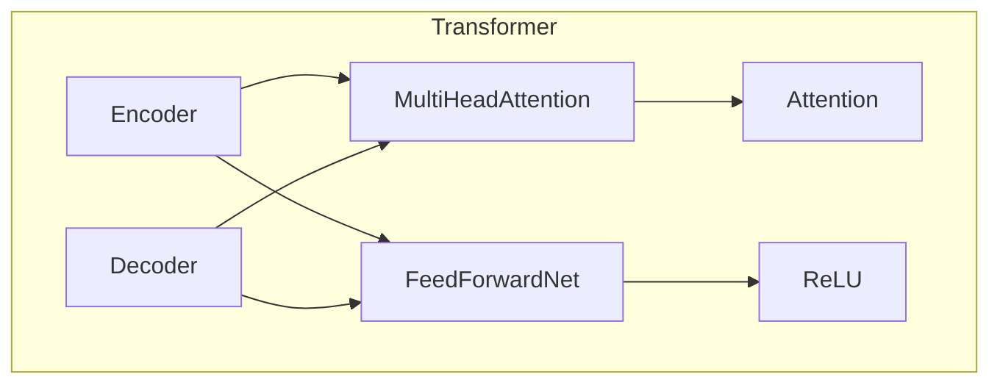
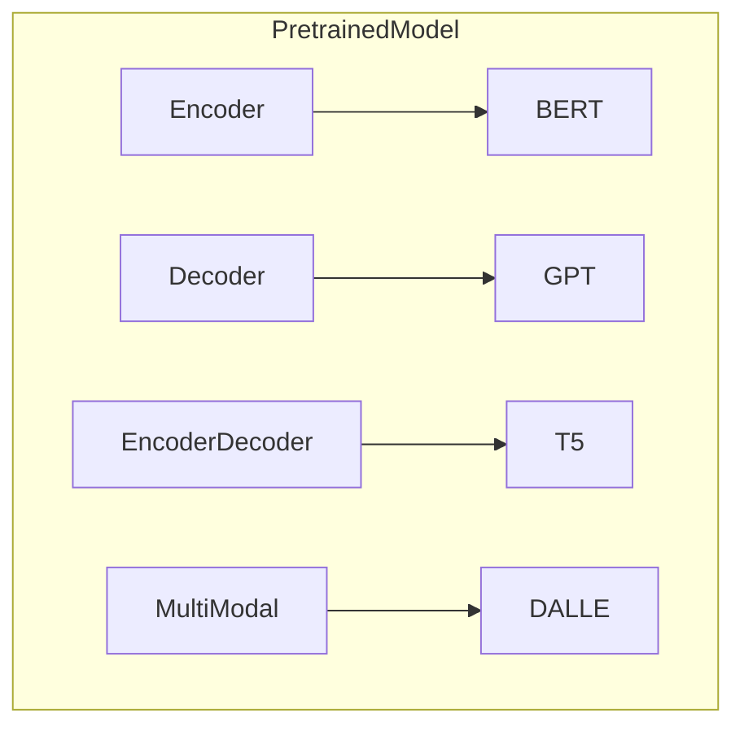
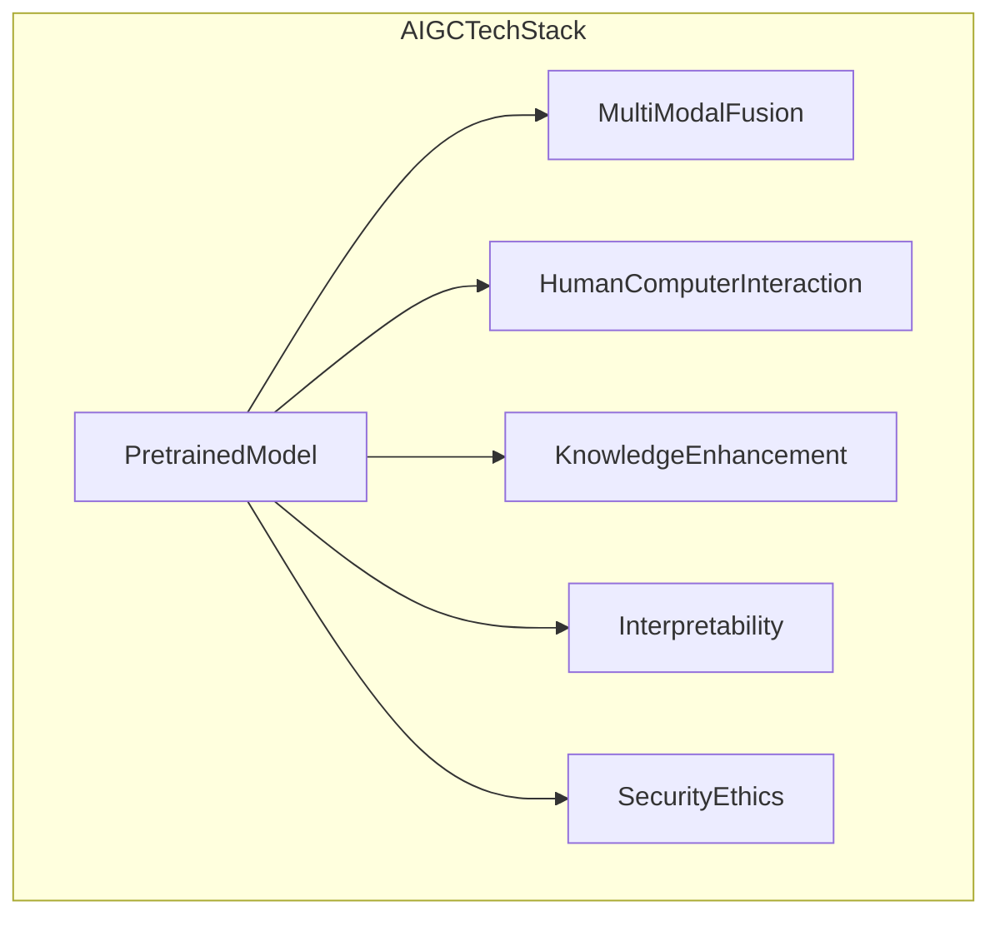
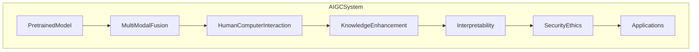

# AIGC从入门到实战：远近高低各不同：Transformer 和预训练模型是什么？

## 1.背景介绍

### 1.1 人工智能的发展历程

人工智能(Artificial Intelligence, AI)是一门研究如何使机器模拟人类智能行为的学科。自20世纪50年代问世以来,人工智能经历了几个重要的发展阶段。

- 早期阶段(1950s-1960s):专家系统、博弈论等传统AI技术。
- 知识驱动阶段(1970s-1980s):知识表示、推理、规划等符号主义AI技术。
- 统计学习阶段(1990s-2000s):机器学习、神经网络等数据驱动AI技术。
- 深度学习阶段(2010s-至今):卷积神经网络、循环神经网络等深度学习技术。

### 1.2 人工智能的新时代

2010年以来,深度学习技术取得了突破性进展,推动了人工智能进入一个新的时代。这个新时代被称为"AIGC时代"(AI Generated Content,人工智能生成内容)。AIGC技术可以生成图像、视频、音频、文本等多种形式的内容,极大地扩展了人工智能的应用范围。

AIGC技术的核心是大型预训练模型(Large Pre-trained Models)。这些模型通过在海量数据上进行预训练,学习到了丰富的知识和能力,可以用于多种下游任务。其中,Transformer模型是预训练模型的基础架构,GPT、BERT等都是基于Transformer的变体。

### 1.3 AIGC的应用前景

AIGC技术正在渗透到各行各业,催生出新的商业模式和应用场景:

- 内容创作:辅助人工创作图像、视频、文案等内容。
- 教育培训:生成个性化学习资源,提供智能辅导。
- 客户服务:智能客服机器人,提供7x24小时服务。
- 办公协作:自动生成会议纪要、简报、邮件等文档。
- 医疗健康:辅助诊断、智能问答等。
- ......

AIGC将极大提高人类的生产力,释放创造力,开启人机协作的新时代。

## 2.核心概念与联系  

### 2.1 Transformer

Transformer是一种全新的基于注意力机制(Attention Mechanism)的神经网络架构,由谷歌的几位科学家在2017年提出。它主要用于自然语言处理(NLP)任务,如机器翻译、文本生成等。

Transformer架构的核心组件是多头注意力层(Multi-Head Attention)和前馈神经网络(Feed-Forward Neural Network),通过层与层之间的残差连接(Residual Connection)和层归一化(Layer Normalization)操作来构建编码器(Encoder)和解码器(Decoder)。

相比传统的基于RNN或CNN的序列模型,Transformer架构具有以下优势:

1. 并行计算能力强,可以加速训练。
2. 长距离依赖建模能力强。
3. 可解释性更好,注意力分数可视化。

Transformer架构在机器翻译、文本生成等自然语言处理任务上取得了卓越的成绩,成为了后来大型预训练模型的基础架构。

### 2.2 预训练模型

预训练模型(Pre-trained Model)指的是在大规模无标注语料库上先进行预训练,得到通用的语言表示能力,再将这个能力迁移(Transfer)到下游任务上进行微调(Fine-tune)的模型。

预训练模型的思想源于迁移学习(Transfer Learning),通过在大数据上预先学习获得良好的模型初始化,然后在小数据集上进行微调,可以提高模型的泛化性能。

预训练模型按照训练目标和架构可分为以下几类:

- 编码器模型(BERT等):掌握双向语义表示能力,适用于文本分类、序列标注等任务。
- 解码器模型(GPT等):掌握生成式建模能力,适用于文本生成、对话等任务。  
- 编码器-解码器模型(T5等):融合了上述两种能力,可用于多种任务。
- 多模态模型(DALL-E等):除了文本,还支持图像、视频等其他模态的表示和生成。

这些预训练模型在自然语言处理、计算机视觉等领域取得了卓越的成绩,推动了AIGC技术的发展。

### 2.3 AIGC技术栈

AIGC技术栈整合了多种人工智能技术,包括但不限于:

- 预训练模型:提供通用的知识表示和生成能力。
- 多模态融合:融合文本、图像、语音等多种模态信息。
- 人机交互:支持自然语言、语音等多种交互方式。
- 知识增强:融入外部知识库,增强模型能力。
- 可解释性:提供模型决策的可解释性说明。
- 安全与伦理:确保模型输出的安全性和合规性。

只有将这些技术有机结合,才能构建出真正智能、安全、可控的AIGC系统。

## 3.核心算法原理具体操作步骤

### 3.1 Transformer模型原理

Transformer模型的核心是Self-Attention机制,它能够直接对输入序列中任意两个单词之间的关系进行建模。

具体来说,Self-Attention的计算过程如下:

1. 线性投影:将输入序列 $X = (x_1, x_2, ..., x_n)$ 分别通过三个线性变换得到 Query(Q)、Key(K)和Value(V)向量。

$$Q = XW_Q, K = XW_K, V = XW_V$$

2. 注意力计算:对每个 Query 向量 $q_i$,计算其与所有 Key 向量的相似度得分,并通过 Softmax 函数归一化得到 Attention 权重 $\alpha_{ij}$。

$$\alpha_{ij} = \text{Softmax}(\frac{q_i \cdot k_j}{\sqrt{d_k}})$$

3. 加权求和:将 Attention 权重与 Value 向量加权求和,得到注意力表示 $z_i$。

$$z_i = \sum_{j=1}^{n} \alpha_{ij}v_j$$

4. 多头注意力:将上述过程重复执行 h 次(多头),并将所有头的结果拼接起来。

$$\text{MultiHead}(Q, K, V) = \text{Concat}(\text{head}_1, ..., \text{head}_h)W^O$$

通过Self-Attention,Transformer可以有效捕捉输入序列中长距离依赖关系,并支持高度并行化计算,从而提高了模型的性能。

### 3.2 预训练模型训练过程

预训练模型的训练过程分为两个阶段:预训练(Pre-training)和微调(Fine-tuning)。

1. **预训练阶段**

   - 目标:在大规模无标注语料库上学习通用的语言表示能力。
   - 方法:掌握上下文语义表示能力(如BERT的Masked LM)和生成式建模能力(如GPT的语言模型)。
   - 训练数据:通常使用Wikipedia、书籍、网页等海量文本数据。

2. **微调阶段**  

   - 目标:将预训练模型中学习到的语言表示能力迁移到特定的下游任务上。  
   - 方法:在有标注的任务数据集上,对预训练模型的部分层进行微调。
   - 训练数据:针对特定任务的标注数据集,如文本分类、阅读理解等。

通过两阶段训练,预训练模型可以先在大数据上学习通用知识,再将这些知识迁移到小数据的特定任务上,从而提高了模型的泛化能力。

### 3.3 AIGC系统架构

一个完整的AIGC系统架构通常包括以下几个核心模块:

1. **预训练模型模块**:加载和运行大型预训练模型,提供基础的生成和理解能力。
2. **多模态融合模块**:融合文本、图像、语音等多种模态的输入和输出。
3. **人机交互模块**:支持自然语言、语音等多种交互方式,实现人机对话。
4. **知识增强模块**:整合外部知识库,增强模型的知识水平。
5. **可解释性模块**:提供模型输出的可解释性说明和理由。
6. **安全与伦理模块**:过滤不当、违规的输出,确保模型输出的安全性和合规性。
7. **应用模块**:针对特定场景开发相应的应用,如内容创作、智能问答等。

这些模块相互配合,共同构建了一个智能、安全、可控的AIGC系统。

## 4.数学模型和公式详细讲解举例说明

### 4.1 注意力机制(Attention Mechanism)

注意力机制是Transformer模型的核心,它能够自适应地捕捉输入序列中不同位置元素之间的关系。

给定一个长度为 $n$ 的输入序列 $X = (x_1, x_2, ..., x_n)$,注意力机制的计算过程如下:

1. 线性投影:将输入序列 $X$ 分别通过三个线性变换得到 Query(Q)、Key(K)和Value(V)向量。

$$Q = XW_Q, K = XW_K, V = XW_V$$

其中 $W_Q, W_K, W_V$ 分别是可学习的权重矩阵。

2. 注意力计算:对每个 Query 向量 $q_i$,计算其与所有 Key 向量的相似度得分,并通过 Softmax 函数归一化得到 Attention 权重 $\alpha_{ij}$。

$$\alpha_{ij} = \text{Softmax}(\frac{q_i \cdot k_j}{\sqrt{d_k}})$$

其中 $d_k$ 是 Key 向量的维度,用于对注意力分数进行缩放。

3. 加权求和:将 Attention 权重与 Value 向量加权求和,得到注意力表示 $z_i$。

$$z_i = \sum_{j=1}^{n} \alpha_{ij}v_j$$

通过注意力机制,模型可以自适应地捕捉输入序列中任意两个位置元素之间的关系,从而更好地建模长距离依赖。

### 4.2 多头注意力(Multi-Head Attention)

单一的注意力机制可能会过于简单,无法充分捕捉输入序列中的复杂关系。因此,Transformer引入了多头注意力机制,将注意力分成多个"头部"进行计算,再将所有头部的结果拼接起来。

具体来说,多头注意力的计算过程如下:

1. 线性投影:将 Query、Key 和 Value 分别投影到 $h$ 个子空间,得到 $h$ 组 $Q^i, K^i, V^i$。

$$\begin{aligned}
Q^i &= QW_Q^i \\
K^i &= KW_K^i \\
V^i &= VW_V^i
\end{aligned}$$

2. 注意力计算:对每一个头部 $i$,计算其注意力表示 $\text{head}_i$。

$$\text{head}_i = \text{Attention}(Q^i, K^i, V^i)$$

3. 拼接:将所有头部的结果拼接起来,并通过一个线性变换得到最终的多头注意力表示。

$$\text{MultiHead}(Q, K, V) = \text{Concat}(\text{head}_1, ..., \text{head}_h)W^O$$

通过多头注意力机制,模型可以从不同的子空间捕捉输入序列中的不同关系,从而提高了模型的表示能力。

### 4.3 