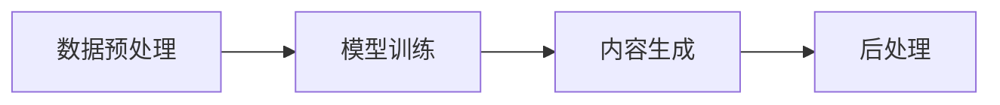

## 1. 背景介绍

随着人工智能技术的飞速发展，AIGC（Artificial Intelligence Generated Content，人工智能生成内容）已经成为了一个热门的研究领域。AIGC技术能够自动化生成文本、图像、音乐等内容，极大地推动了创意产业的发展。本文将深入探讨AIGC的原理，并通过代码实例详细讲解其实现过程。

## 2. 核心概念与联系

AIGC系统通常包括数据预处理、模型训练、内容生成和后处理四个核心环节。数据预处理负责将原始数据转换为模型可理解的格式；模型训练则是通过大量数据训练出能够生成内容的模型；内容生成环节利用训练好的模型生成新的内容；后处理则对生成的内容进行优化和调整，以满足特定的需求。



## 3. 核心算法原理具体操作步骤

AIGC的核心算法通常基于深度学习，尤其是生成对抗网络（GANs）和变分自编码器（VAEs）。以下是GANs的具体操作步骤：

1. 初始化生成器（Generator）和判别器（Discriminator）网络。
2. 生成器接收随机噪声，生成虚假数据。
3. 判别器评估真实数据和虚假数据，并尝试区分它们。
4. 通过反向传播算法更新生成器和判别器的权重。
5. 重复步骤2-4，直到判别器无法区分真假数据。

## 4. 数学模型和公式详细讲解举例说明

以GANs为例，其核心是一个零和博弈问题，其数学模型可以表示为：

$$
\min_{G}\max_{D}V(D, G) = \mathbb{E}_{x\sim p_{data}(x)}[\log D(x)] + \mathbb{E}_{z\sim p_{z}(z)}[\log(1 - D(G(z)))]
$$

其中，$D(x)$是判别器输出的数据$x$为真实数据的概率，$G(z)$是生成器根据输入噪声$z$生成的数据。

## 5. 项目实践：代码实例和详细解释说明

以TensorFlow和Keras为基础，以下是一个简单的GANs代码实例：

```python
from tensorflow.keras.models import Sequential
from tensorflow.keras.layers import Dense
from tensorflow.keras.optimizers import Adam

# 构建生成器模型
def build_generator():
    model = Sequential()
    model.add(Dense(units=128, input_dim=100, activation='relu'))
    model.add(Dense(units=512, activation='relu'))
    model.add(Dense(units=1024, activation='relu'))
    model.add(Dense(units=784, activation='sigmoid'))
    return model

# 构建判别器模型
def build_discriminator():
    model = Sequential()
    model.add(Dense(units=1024, input_dim=784, activation='relu'))
    model.add(Dense(units=512, activation='relu'))
    model.add(Dense(units=256, activation='relu'))
    model.add(Dense(units=1, activation='sigmoid'))
    return model

# 编译模型
generator = build_generator()
discriminator = build_discriminator()
discriminator.compile(loss='binary_crossentropy', optimizer=Adam())

# GANs模型
discriminator.trainable = False
gan_input = Input(shape=(100,))
x = generator(gan_input)
gan_output = discriminator(x)
gan = Model(inputs=gan_input, outputs=gan_output)
gan.compile(loss='binary_crossentropy', optimizer=Adam())
```

## 6. 实际应用场景

AIGC技术在多个领域都有广泛的应用，例如自动新闻报道、游戏内容生成、个性化广告、艺术创作等。

## 7. 工具和资源推荐

- TensorFlow和Keras：用于构建和训练深度学习模型的库。
- PyTorch：另一个流行的深度学习框架。
- GANs Zoo：收集了各种GANs变体的资源列表。

## 8. 总结：未来发展趋势与挑战

AIGC的未来发展趋势是向着更高的生成质量、更强的泛化能力和更低的计算成本方向发展。同时，如何确保生成内容的合法性和道德性也是一个重要的挑战。

## 9. 附录：常见问题与解答

Q1: AIGC技术是否会取代人类创作者？
A1: AIGC技术更多是作为人类创作者的辅助工具，而不是替代者。

Q2: AIGC生成的内容的版权归谁所有？
A2: 这是一个复杂的法律问题，目前还没有统一的答案。

作者：禅与计算机程序设计艺术 / Zen and the Art of Computer Programming