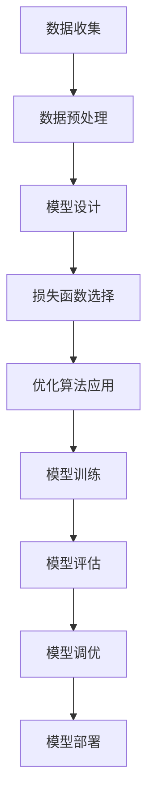
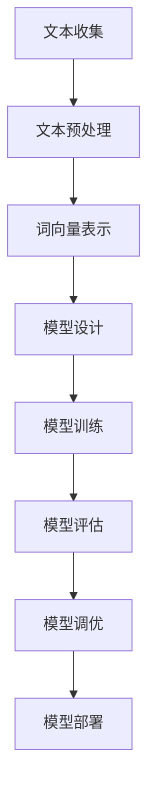
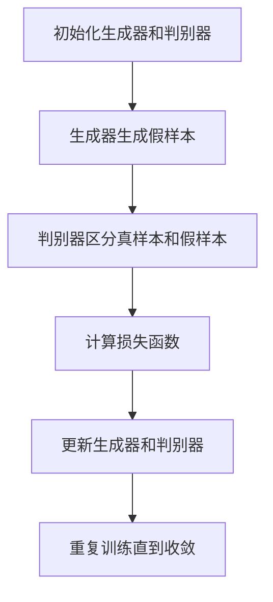
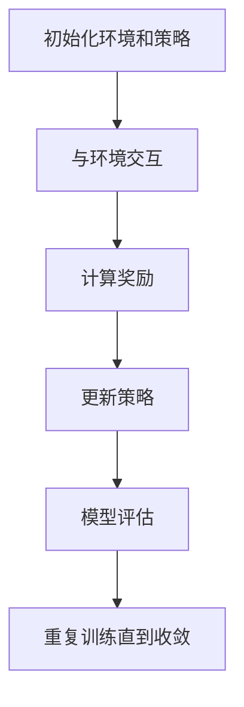
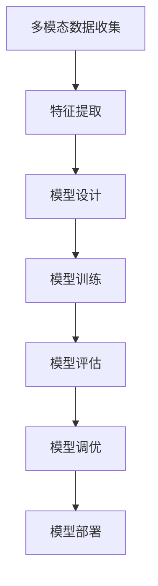

# AIGC学习资源：开启AIGC学习之旅

## 1.背景介绍

人工智能生成内容（AIGC，Artificial Intelligence Generated Content）是近年来迅速崛起的技术领域。AIGC利用深度学习、自然语言处理和计算机视觉等技术，自动生成文本、图像、音频和视频等多种形式的内容。随着大数据和计算能力的提升，AIGC在内容创作、娱乐、教育、医疗等领域展现出巨大的潜力。

AIGC的核心在于其能够模拟人类的创作过程，通过学习大量数据，生成具有创意和实用价值的内容。无论是自动撰写新闻报道、生成艺术作品，还是创建虚拟角色，AIGC都在不断突破技术和应用的边界。

## 2.核心概念与联系

### 2.1 深度学习

深度学习是AIGC的基础技术之一。它通过多层神经网络对数据进行特征提取和模式识别，从而实现复杂任务的自动化。深度学习在图像识别、语音识别和自然语言处理等领域取得了显著成果。

### 2.2 自然语言处理（NLP）

自然语言处理是AIGC生成文本内容的关键技术。NLP通过对语言的理解和生成，实现自动翻译、文本摘要、情感分析等功能。近年来，基于Transformer架构的模型（如GPT-3）在NLP领域取得了突破性进展。

### 2.3 生成对抗网络（GAN）

生成对抗网络是AIGC生成图像和视频内容的重要技术。GAN由生成器和判别器两个神经网络组成，通过相互对抗的方式，生成高质量的图像和视频。GAN在图像生成、图像修复和风格迁移等方面有广泛应用。

### 2.4 强化学习

强化学习通过与环境的交互，学习最优策略以实现目标。AIGC可以利用强化学习生成动态内容，如游戏中的智能角色和自动驾驶中的决策系统。

### 2.5 多模态学习

多模态学习结合了文本、图像、音频和视频等多种数据形式，实现跨模态内容生成。多模态学习在虚拟现实、增强现实和智能助手等领域有重要应用。

## 3.核心算法原理具体操作步骤

### 3.1 深度学习模型训练

深度学习模型的训练过程包括数据预处理、模型设计、损失函数选择和优化算法应用。以下是一个典型的深度学习模型训练流程：



### 3.2 自然语言处理模型训练

NLP模型的训练过程包括文本预处理、词向量表示、模型设计和训练。以下是一个典型的NLP模型训练流程：



### 3.3 生成对抗网络训练

GAN的训练过程包括生成器和判别器的交替训练。以下是一个典型的GAN训练流程：



### 3.4 强化学习训练

强化学习的训练过程包括环境交互、奖励计算、策略更新和模型评估。以下是一个典型的强化学习训练流程：



### 3.5 多模态学习训练

多模态学习的训练过程包括多模态数据收集、特征提取、模型设计和训练。以下是一个典型的多模态学习训练流程：



## 4.数学模型和公式详细讲解举例说明

### 4.1 深度学习中的反向传播算法

反向传播算法是深度学习模型训练的核心。其基本思想是通过计算损失函数相对于模型参数的梯度，逐步调整参数以最小化损失函数。反向传播算法的数学公式如下：

$$
\frac{\partial L}{\partial \theta} = \frac{\partial L}{\partial y} \cdot \frac{\partial y}{\partial \theta}
$$

其中，$L$ 是损失函数，$\theta$ 是模型参数，$y$ 是模型输出。

### 4.2 自然语言处理中的词向量表示

词向量表示是NLP中的重要技术。通过将词语映射到高维向量空间，可以捕捉词语之间的语义关系。常用的词向量表示方法包括Word2Vec和GloVe。Word2Vec的数学公式如下：

$$
P(w_O | w_I) = \frac{\exp(v_{w_O} \cdot v_{w_I})}{\sum_{w \in V} \exp(v_w \cdot v_{w_I})}
$$

其中，$w_O$ 是目标词，$w_I$ 是上下文词，$v$ 是词向量，$V$ 是词汇表。

### 4.3 生成对抗网络中的损失函数

GAN的损失函数包括生成器的损失和判别器的损失。生成器的目标是最大化判别器对假样本的误判概率，判别器的目标是最大化对真样本和假样本的区分能力。GAN的损失函数如下：

$$
L_D = -\mathbb{E}_{x \sim p_{data}(x)}[\log D(x)] - \mathbb{E}_{z \sim p_z(z)}[\log(1 - D(G(z)))]
$$

$$
L_G = -\mathbb{E}_{z \sim p_z(z)}[\log D(G(z))]
$$

其中，$D$ 是判别器，$G$ 是生成器，$x$ 是真实样本，$z$ 是噪声向量。

### 4.4 强化学习中的Q学习算法

Q学习算法是强化学习中的一种重要方法。其基本思想是通过更新状态-动作值函数（Q函数），找到最优策略。Q学习算法的更新公式如下：

$$
Q(s, a) \leftarrow Q(s, a) + \alpha [r + \gamma \max_{a'} Q(s', a') - Q(s, a)]
$$

其中，$s$ 是当前状态，$a$ 是当前动作，$r$ 是奖励，$\alpha$ 是学习率，$\gamma$ 是折扣因子，$s'$ 是下一状态，$a'$ 是下一动作。

### 4.5 多模态学习中的联合表示

多模态学习通过联合表示将不同模态的数据映射到同一向量空间，从而实现跨模态内容生成。联合表示的数学公式如下：

$$
h = f(x_1, x_2, \ldots, x_n)
$$

其中，$h$ 是联合表示向量，$x_i$ 是第$i$种模态的数据，$f$ 是联合表示函数。

## 5.项目实践：代码实例和详细解释说明

### 5.1 深度学习项目实例

以下是一个使用TensorFlow实现的深度学习图像分类项目实例：

```python
import tensorflow as tf
from tensorflow.keras import layers, models
import numpy as np

# 数据加载和预处理
(train_images, train_labels), (test_images, test_labels) = tf.keras.datasets.cifar10.load_data()
train_images, test_images = train_images / 255.0, test_images / 255.0

# 模型设计
model = models.Sequential([
    layers.Conv2D(32, (3, 3), activation='relu', input_shape=(32, 32, 3)),
    layers.MaxPooling2D((2, 2)),
    layers.Conv2D(64, (3, 3), activation='relu'),
    layers.MaxPooling2D((2, 2)),
    layers.Conv2D(64, (3, 3), activation='relu'),
    layers.Flatten(),
    layers.Dense(64, activation='relu'),
    layers.Dense(10)
])

# 模型编译
model.compile(optimizer='adam',
              loss=tf.keras.losses.SparseCategoricalCrossentropy(from_logits=True),
              metrics=['accuracy'])

# 模型训练
model.fit(train_images, train_labels, epochs=10, 
          validation_data=(test_images, test_labels))

# 模型评估
test_loss, test_acc = model.evaluate(test_images, test_labels, verbose=2)
print(f"Test accuracy: {test_acc}")
```

### 5.2 自然语言处理项目实例

以下是一个使用Transformers库实现的文本生成项目实例：

```python
from transformers import GPT2LMHeadModel, GPT2Tokenizer

# 模型和分词器加载
model_name = 'gpt2'
model = GPT2LMHeadModel.from_pretrained(model_name)
tokenizer = GPT2Tokenizer.from_pretrained(model_name)

# 文本生成函数
def generate_text(prompt, max_length=50):
    inputs = tokenizer.encode(prompt, return_tensors='pt')
    outputs = model.generate(inputs, max_length=max_length, num_return_sequences=1)
    text = tokenizer.decode(outputs[0], skip_special_tokens=True)
    return text

# 示例文本生成
prompt = "人工智能生成内容的未来"
generated_text = generate_text(prompt)
print(generated_text)
```

### 5.3 生成对抗网络项目实例

以下是一个使用PyTorch实现的GAN图像生成项目实例：

```python
import torch
import torch.nn as nn
import torch.optim as optim
from torchvision import datasets, transforms
from torch.utils.data import DataLoader

# 数据加载和预处理
transform = transforms.Compose([
    transforms.ToTensor(),
    transforms.Normalize((0.5,), (0.5,))
])
train_dataset = datasets.MNIST(root='./data', train=True, transform=transform, download=True)
train_loader = DataLoader(train_dataset, batch_size=64, shuffle=True)

# 生成器模型设计
class Generator(nn.Module):
    def __init__(self):
        super(Generator, self).__init__()
        self.main = nn.Sequential(
            nn.Linear(100, 256),
            nn.ReLU(True),
            nn.Linear(256, 512),
            nn.ReLU(True),
            nn.Linear(512, 1024),
            nn.ReLU(True),
            nn.Linear(1024, 28*28),
            nn.Tanh()
        )

    def forward(self, x):
        return self.main(x).view(-1, 1, 28, 28)

# 判别器模型设计
class Discriminator(nn.Module):
    def __init__(self):
        super(Discriminator, self).__init__()
        self.main = nn.Sequential(
            nn.Linear(28*28, 1024),
            nn.LeakyReLU(0.2, inplace=True),
            nn.Linear(1024, 512),
            nn.LeakyReLU(0.2, inplace=True),
            nn.Linear(512, 256),
            nn.LeakyReLU(0.2, inplace=True),
            nn.Linear(256, 1),
            nn.Sigmoid()
        )

    def forward(self, x):
        return self.main(x.view(-1, 28*28))

# 模型实例化
generator = Generator()
discriminator = Discriminator()

# 损失函数和优化器
criterion = nn.BCELoss()
optimizer_g = optim.Adam(generator.parameters(), lr=0.0002)
optimizer_d = optim.Adam(discriminator.parameters(), lr=0.0002)

# 训练过程
num_epochs = 50
for epoch in range(num_epochs):
    for i, (images, _) in enumerate(train_loader):
        # 训练判别器
        real_labels = torch.ones(images.size(0), 1)
        fake_labels = torch.zeros(images.size(0), 1)
        outputs = discriminator(images)
        d_loss_real = criterion(outputs, real_labels)
        z = torch.randn(images.size(0), 100)
        fake_images = generator(z)
        outputs = discriminator(fake_images.detach())
        d_loss_fake = criterion(outputs, fake_labels)
        d_loss = d_loss_real + d_loss_fake
        optimizer_d.zero_grad()
        d_loss.backward()
        optimizer_d.step()

        # 训练生成器
        z = torch.randn(images.size(0), 100)
        fake_images = generator(z)
        outputs = discriminator(fake_images)
        g_loss = criterion(outputs, real_labels)
        optimizer_g.zero_grad()
        g_loss.backward()
        optimizer_g.step()

    print(f"Epoch [{epoch+1}/{num_epochs}], d_loss: {d_loss.item()}, g_loss: {g_loss.item()}")
```

### 5.4 强化学习项目实例

以下是一个使用OpenAI Gym和Stable Baselines实现的强化学习项目实例：

```python
import gym
from stable_baselines3 import PPO

# 环境创建
env = gym.make('CartPole-v1')

# 模型创建
model = PPO('MlpPolicy', env, verbose=1)

# 模型训练
model.learn(total_timesteps=10000)

# 模型评估
obs = env.reset()
for _ in range(1000):
    action, _states = model.predict(obs)
    obs, rewards, done, info = env.step(action)
    env.render()
    if done:
        obs = env.reset()
env.close()
```

### 5.5 多模态学习项目实例

以下是一个使用Transformers库实现的多模态学习项目实例：

```python
from transformers import ViltProcessor, ViltForQuestionAnswering
import requests
from PIL import Image

# 模型和处理器加载
model_name = 'dandelin/vilt-b32-finetuned-vqa'
processor = ViltProcessor.from_pretrained(model_name)
model = ViltForQuestionAnswering.from_pretrained(model_name)

# 图像加载
url = 'https://example.com/image.jpg'
image = Image.open(requests.get(url, stream=True).raw)

# 问题定义
question = "这张图片中有多少只猫？"

# 输入处理
inputs = processor(image, question, return_tensors="pt")

# 模型推理
outputs = model(**inputs)
answer = processor.decode(outputs.logits.argmax(-1))
print(f"Answer: {answer}")
```

## 6.实际应用场景

### 6.1 内容创作

AIGC在内容创作领域有广泛应用。自动撰写新闻报道、生成小说和诗歌、创作音乐和绘画等，AIGC可以大幅提高创作效率，激发创意。

### 6.2 娱乐和游戏

AIGC在娱乐和游戏领域的应用包括生成虚拟角色、创建游戏场景、编写游戏剧情等。通过AIGC，游戏开发者可以快速生成高质量的内容，提升玩家体验。

### 6.3 教育和培训

AIGC在教育和培训领域的应用包括自动生成教学材料、创建虚拟实验室、设计个性化学习路径等。AIGC可以根据学生的学习情况，提供定制化的教学内容，提高学习效果。

### 6.4 医疗和健康

AIGC在医疗和健康领域的应用包括生成医学影像报告、创建虚拟病人、设计个性化治疗方案等。AIGC可以辅助医生进行诊断和治疗，提高医疗服务质量。

### 6.5 营销和广告

AIGC在营销和广告领域的应用包括生成广告文案、设计广告图像、创建个性化营销方案等。AIGC可以根据用户的兴趣和行为，提供精准的营销内容，提高广告效果。

## 7.工具和资源推荐

### 7.1 深度学习框架

- TensorFlow：谷歌开发的开源深度学习框架，支持多种平台和设备。
- PyTorch：Facebook开发的开源深度学习框架，具有灵活性和易用性。

### 7.2 自然语言处理工具

- Transformers：Hugging Face开发的开源NLP库，支持多种预训练模型。
- SpaCy：开源NLP库，提供高效的文本处理和分析工具。

### 7.3 生成对抗网络工具

- GAN Lab：谷歌开发的交互式GAN学习工具，帮助理解GAN的工作原理。
- PyTorch-GAN：开源的PyTorch GAN实现，提供多种GAN模型和示例。

### 7.4 强化学习工具

- OpenAI Gym：开源的强化学习环境库，提供多种模拟环境。
- Stable Baselines：开源的强化学习库，提供多种强化学习算法实现。

### 7.5 多模态学习工具

- VILBERT：微软开发的多模态学习模型，支持图像和文本的联合表示。
- CLIP：OpenAI开发的多模态学习模型，支持图像和文本的联合表示和检索。

## 8.总结：未来发展趋势与挑战

AIGC作为一项前沿技术，未来有着广阔的发展前景。随着大数据和计算能力的不断提升，AIGC将在更多领域展现