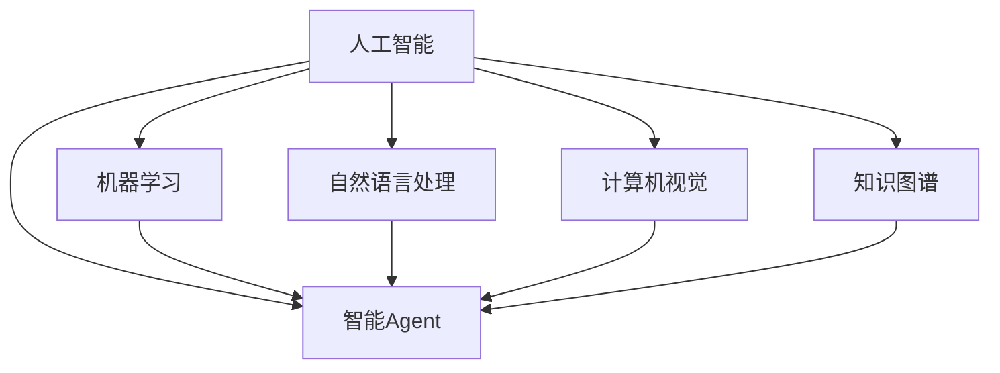

# AI人工智能 Agent：在智能医疗中的应用

## 1. 背景介绍

### 1.1 人工智能在医疗领域的发展现状

人工智能技术在医疗领域的应用正在蓬勃发展。从医学影像分析、药物研发到辅助诊断和个性化治疗，AI正在深刻改变着传统医疗模式。据统计，全球医疗AI市场规模预计将从2020年的49亿美元增长到2027年的454亿美元，年复合增长率高达44.9%。

### 1.2 智能Agent技术概述

智能Agent是人工智能的一个重要分支，它是一种能够感知环境、做出决策并采取行动以实现特定目标的自主实体。智能Agent具有自主性、社交能力、反应性和主动性等特点，能够与环境进行交互，并根据环境的变化做出适应性调整。

### 1.3 智能Agent在医疗领域应用的意义

将智能Agent技术引入医疗领域，有望显著提升医疗服务的效率和质量。智能医疗Agent可以辅助医生进行疾病诊断、治疗方案制定、药物推荐等，减轻医生的工作负担。同时，Agent还可以为患者提供个性化的健康管理服务，如健康监测、生活方式指导、慢病管理等，提高患者的生活质量。

## 2. 核心概念与联系

### 2.1 智能Agent的核心概念

- **自主性**：Agent能够独立地感知环境、推理决策和执行任务，无需人工干预。
- **社交能力**：Agent能够与人类或其他Agent进行交互和协作，理解并执行指令。  
- **反应性**：Agent能够实时感知环境变化并做出相应反应。
- **主动性**：Agent能够主动采取行动以实现预定目标。
- **适应性**：Agent能够根据环境变化调整自身行为以适应新情况。

### 2.2 智能医疗Agent的关键技术

- **自然语言处理(NLP)**：让Agent能够理解人类语言，进行语义分析和对话交互。
- **知识图谱**：构建医学领域知识库，赋予Agent全面的医学知识。
- **机器学习**：通过数据训练优化Agent的决策和预测能力。  
- **计算机视觉**：让Agent能够分析医学影像，辅助疾病诊断。
- **可解释性**：让Agent的决策过程透明可解释，增强医患信任。

### 2.3 智能Agent与其他AI技术的关系



智能Agent是人工智能的一个重要分支，它与机器学习、自然语言处理、计算机视觉、知识图谱等AI技术密切相关。Agent需要运用这些技术来感知环境、分析数据、构建知识、做出决策。同时，其他AI技术的发展也推动了智能Agent的不断进步。

## 3. 核心算法原理具体操作步骤

### 3.1 强化学习算法

强化学习是智能Agent的核心算法之一。其基本原理是Agent通过与环境的交互，根据环境反馈的奖励或惩罚来优化自身的策略，以获得最大的累积奖励。下面是强化学习的基本步骤：

1. 初始化Agent的策略参数
2. 重复以下步骤直到满足终止条件：
   1. Agent根据当前策略选择一个动作
   2. 环境根据动作给出反馈(下一个状态和奖励)
   3. Agent根据反馈更新策略参数
   4. 当前状态转移到下一个状态
3. 输出优化后的策略

常见的强化学习算法包括Q-learning、SARSA、DQN等。以Q-learning为例，其核心是通过迭代更新状态-动作值函数Q(s,a)来找到最优策略：

$$Q(s,a) \leftarrow Q(s,a)+\alpha [r+\gamma \max _{a^{\prime}} Q\left(s^{\prime}, a^{\prime}\right)-Q(s,a)]$$

其中，$s$为当前状态，$a$为在状态$s$下采取的动作，$r$为环境反馈的即时奖励，$s'$为执行动作$a$后转移到的下一个状态，$\alpha$为学习率，$\gamma$为折扣因子。

### 3.2 知识图谱构建

构建高质量的医疗知识图谱是智能医疗Agent的基础。以下是知识图谱构建的一般步骤：

1. 知识获取：从结构化和非结构化数据源中提取医疗知识
2. 知识表示：将获取的知识转换为三元组(实体、关系、实体)形式
3. 知识融合：消除知识的冗余、歧义和矛盾，提高知识的准确性
4. 知识存储：将知识以图数据库的形式存储，支持高效查询和推理
5. 知识应用：利用知识图谱支持智能问答、辅助决策等应用

在此基础上，还可以利用知识图谱嵌入等技术将知识表示为低维向量，便于神经网络等机器学习模型处理和学习。

## 4. 数学模型和公式详细讲解举例说明

### 4.1 马尔可夫决策过程(MDP)

马尔可夫决策过程是强化学习的基础，用于描述Agent与环境交互的数学模型。一个MDP由以下元素组成：

- 状态集合$S$
- 动作集合$A$ 
- 状态转移概率$P(s'|s,a)$
- 奖励函数$R(s,a)$
- 折扣因子$\gamma \in [0,1]$

Agent的目标是找到一个策略$\pi(a|s)$，使得在该策略下获得的期望累积奖励最大化：

$$\pi^{*}=\arg \max _{\pi} \mathbb{E}\left[\sum_{t=0}^{\infty} \gamma^{t} R\left(s_{t}, a_{t}\right) | \pi\right]$$

其中，$s_t$和$a_t$分别表示在时刻$t$的状态和动作。

以医疗诊断为例，状态可以表示患者的各项生理指标，动作可以表示诊断结果或治疗方案，奖励可以根据诊断/治疗的准确性来设置。Agent的目标是学习一个诊断/治疗策略，使得患者的健康状态最优。

### 4.2 知识图谱嵌入

知识图谱嵌入旨在学习知识图谱中实体和关系的低维向量表示，以便于后续的机器学习任务。TransE是一种经典的知识图谱嵌入模型，其核心思想是让每个三元组(h,r,t)满足以下条件：

$$\mathbf{h}+\mathbf{r} \approx \mathbf{t}$$

其中，$\mathbf{h}$、$\mathbf{r}$、$\mathbf{t}$分别表示头实体、关系、尾实体对应的向量。模型通过最小化以下损失函数来学习向量表示：

$$\mathcal{L}=\sum_{(h, r, t) \in S} \sum_{\left(h^{\prime}, r, t^{\prime}\right) \in S^{\prime}}[\gamma+d(\mathbf{h}+\mathbf{r}, \mathbf{t})-d(\mathbf{h^{\prime}}+\mathbf{r}, \mathbf{t^{\prime}})]_{+}$$

其中，$S$为正样本三元组集合，$S'$为负样本三元组集合，$\gamma$为间隔，$d$为距离度量(如欧氏距离)，$[x]_+$表示$\max(0,x)$。

以医疗知识图谱为例，可以学习疾病、症状、药物、治疗方法等实体以及它们之间关系的向量表示。这种表示可以用于后续的疾病诊断、药物推荐等任务中。

## 5. 项目实践：代码实例和详细解释说明

下面以PyTorch实现一个简单的强化学习Agent为例，展示智能Agent的编程实现。该Agent使用Q-learning算法在一个虚拟的医疗诊断环境中学习诊断策略。

```python
import torch
import torch.nn as nn
import torch.optim as optim
import numpy as np

# 定义Q网络
class QNetwork(nn.Module):
    def __init__(self, state_dim, action_dim):
        super(QNetwork, self).__init__()
        self.fc1 = nn.Linear(state_dim, 64)
        self.fc2 = nn.Linear(64, 64)
        self.fc3 = nn.Linear(64, action_dim)

    def forward(self, x):
        x = torch.relu(self.fc1(x))
        x = torch.relu(self.fc2(x))
        x = self.fc3(x)
        return x

# 定义Agent
class QLearningAgent:
    def __init__(self, state_dim, action_dim, lr, gamma, epsilon):
        self.action_dim = action_dim
        self.q_network = QNetwork(state_dim, action_dim)
        self.optimizer = optim.Adam(self.q_network.parameters(), lr=lr)
        self.gamma = gamma  # 折扣因子
        self.epsilon = epsilon  # 探索率

    def select_action(self, state):
        if np.random.uniform() < self.epsilon:
            action = np.random.choice(self.action_dim)
        else:
            state = torch.tensor(state, dtype=torch.float32)
            q_values = self.q_network(state)
            action = torch.argmax(q_values).item()
        return action

    def update(self, state, action, reward, next_state, done):
        state = torch.tensor(state, dtype=torch.float32)
        next_state = torch.tensor(next_state, dtype=torch.float32)
        q_values = self.q_network(state)
        next_q_values = self.q_network(next_state)
        target = reward + self.gamma * torch.max(next_q_values) * (1 - done)
        loss = nn.MSELoss()(q_values[action], target.detach())
        self.optimizer.zero_grad()
        loss.backward()
        self.optimizer.step()

# 训练Agent
def train_agent(agent, env, num_episodes, max_steps):
    for episode in range(num_episodes):
        state = env.reset()
        for step in range(max_steps):
            action = agent.select_action(state)
            next_state, reward, done, _ = env.step(action)
            agent.update(state, action, reward, next_state, done)
            state = next_state
            if done:
                break
        print(f"Episode {episode+1}: Reward = {step+1}")

# 创建环境和Agent
env = MedicalDiagnosisEnv()  # 自定义的医疗诊断环境
state_dim = env.observation_space.shape[0]
action_dim = env.action_space.n
agent = QLearningAgent(state_dim, action_dim, lr=0.001, gamma=0.99, epsilon=0.1)

# 训练Agent
train_agent(agent, env, num_episodes=1000, max_steps=100)
```

代码说明：

1. 定义了一个简单的Q网络`QNetwork`，用于估计状态-动作值函数Q(s,a)。
2. 定义了一个Q-learning Agent`QLearningAgent`，包含动作选择和Q值更新的方法。
3. `select_action`方法根据ε-greedy策略选择动作，以平衡探索和利用。
4. `update`方法根据Q-learning算法更新Q网络的参数。
5. `train_agent`函数实现了Agent的训练过程，与环境交互并更新Q网络。
6. 创建了一个自定义的医疗诊断环境`MedicalDiagnosisEnv`(代码未给出)，Agent在该环境中学习诊断策略。
7. 训练Agent进行医疗诊断任务，输出每个episode的累积奖励。

以上代码展示了如何使用PyTorch实现一个简单的强化学习Agent，并应用于医疗诊断任务。实际应用中，还需要根据具体问题设计合适的状态表示、动作空间和奖励函数，并使用更高级的强化学习算法。

## 6. 实际应用场景

智能医疗Agent在医疗健康领域有广泛的应用前景，下面列举几个具体的应用场景：

### 6.1 智能诊断助手

智能诊断Agent可以辅助医生进行疾病诊断。Agent通过分析患者的症状、体征、检验检查结果等信息，给出可能的疾病列表和相应的置信度。医生可以参考Agent的诊断建议，结合自己的经验做出最终诊断。这种人机协作的诊断模式可以提高诊断的准确率和效率。

### 6.2 个性化治疗方案推荐

智能治疗方案推荐Agent可以为患者提