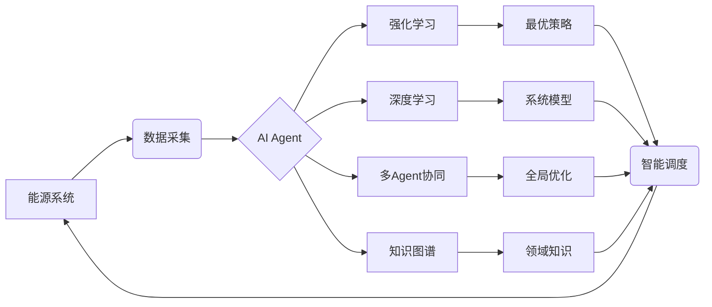
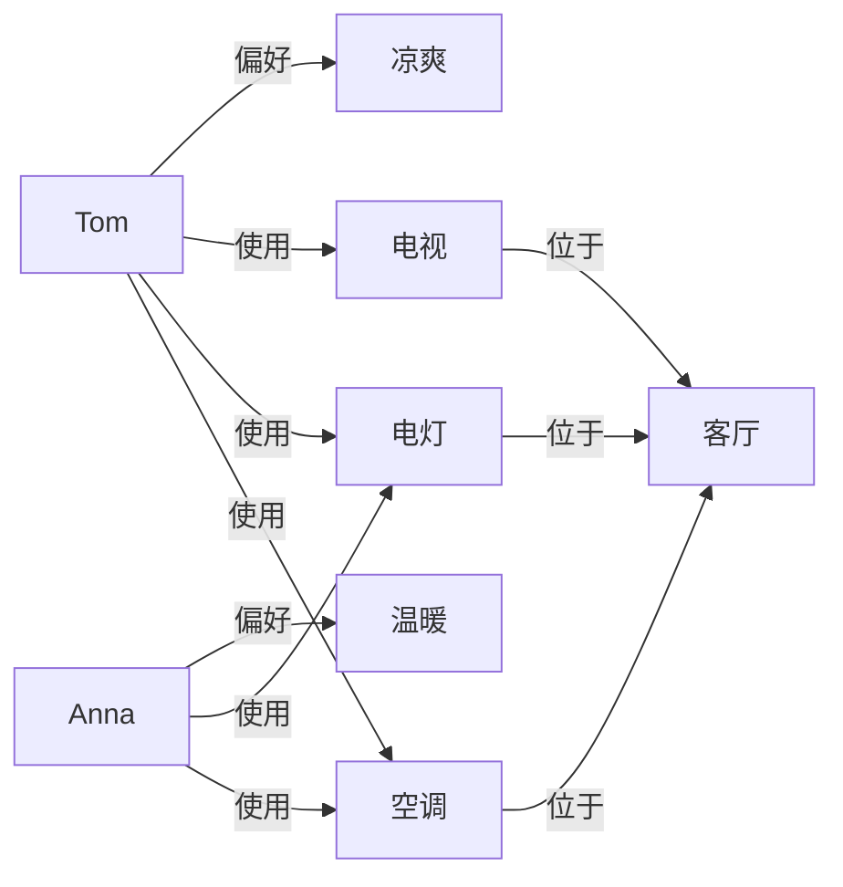

# AI人工智能 Agent：在节能减排中的应用

## 1. 背景介绍
### 1.1 全球气候变化与能源危机
全球气候变化已经成为人类面临的重大挑战之一。温室气体排放导致的全球变暖,正在对地球生态系统和人类社会产生深远影响。与此同时,化石能源的日益枯竭也引发了全球性的能源危机。面对气候变化和能源短缺的双重压力,节能减排已成为全人类的共同责任。

### 1.2 人工智能技术的发展
近年来,人工智能(Artificial Intelligence, AI)技术取得了长足进步。机器学习、深度学习、强化学习等算法不断突破,使得AI系统在感知、认知、决策等方面的能力大幅提升。AI正在广泛应用于工业、农业、交通、能源等诸多领域,展现出巨大的发展潜力。

### 1.3 AI助力节能减排
面对气候变化和能源危机的严峻形势,AI技术为节能减排提供了新的解决方案。通过对能源系统的智能优化与控制,AI可以显著提高能源利用效率,减少能源浪费,从而达到节能减排的目的。本文将重点探讨AI Agent技术在节能减排中的应用,分析其核心原理、关键算法,并结合实际案例,展望AI赋能节能减排的美好前景。

## 2. 核心概念与联系
### 2.1 Agent的定义与特征
Agent是人工智能领域的一个重要概念,它指代能够感知环境并作出决策以实现特定目标的自主实体。一个典型的Agent通常具有以下特征:
- 自主性:能够独立地感知环境,并根据自身的知识与目标做出决策。
- 社会性:能够与环境中的其他Agent进行交互与协作。 
- 反应性:能够对环境的变化做出及时反应。
- 主动性:能够主动地执行任务以实现目标。
- 连续性:能够持续运行,适应动态变化的环境。

### 2.2 AI Agent 与节能减排
AI Agent技术为节能减排带来了新的契机。通过对能源系统进行建模,并利用机器学习算法对系统参数进行优化,AI Agent可以对能源系统实现智能调度与控制,在保证系统性能的同时最小化能耗。此外,多个AI Agent还可以通过协同优化,在更大范围内实现节能减排。

### 2.3 AI Agent 的关键技术
实现智能节能的AI Agent需要融合多种人工智能技术,其中尤为关键的包括:
- 强化学习:通过即时奖励指导Agent学习最优策略,实现系统的在线优化控制。
- 深度学习:利用深度神经网络从海量数据中提取特征,构建高精度的系统模型。
- 多Agent协同学习:通过Agent间的协同优化,在更大范围实现全局最优的节能效果。
- 知识图谱:将能源领域知识形式化为机器可理解的知识图谱,增强Agent的领域认知能力。

下图展示了一个典型的AI Agent节能系统的技术架构:

## 3. 核心算法原理具体操作步骤
### 3.1 强化学习
强化学习是实现AI Agent智能决策的核心算法。其基本原理是通过即时奖励指导Agent学习最优策略。具体步骤如下:
1. 定义状态空间S、动作空间A和奖励函数R。
2. Agent根据当前状态$s_t$,选择一个动作$a_t$。
3. 环境根据动作$a_t$,给出下一个状态$s_{t+1}$和即时奖励$r_t$。
4. Agent根据$s_t$、$a_t$、$r_t$和$s_{t+1}$更新策略函数$\pi$。
5. 重复步骤2-4,直到收敛到最优策略$\pi^*$。

常用的强化学习算法包括Q-Learning、SARSA、DQN等。以Q-Learning为例,其更新策略函数的公式为:

$$Q(s_t,a_t) \leftarrow Q(s_t,a_t)+\alpha[r_t+\gamma \max_a Q(s_{t+1},a)-Q(s_t,a_t)]$$

其中$\alpha$为学习率,$\gamma$为折扣因子。

### 3.2 深度学习
深度学习是AI模型构建的重要工具。通过构建多层神经网络,深度学习可以从海量数据中自动提取特征,实现对复杂系统的精准建模。以卷积神经网络(CNN)为例,其前向传播过程可描述为:

$$h_i=f(\sum_j w_{ij}*x_j+b_i)$$

其中$h_i$为第$i$个神经元的输出,$f$为激活函数,$w_{ij}$为权重,$b_i$为偏置。

深度学习在AI Agent中的主要应用包括:
- 基于历史数据训练系统模型,用于状态预测与策略评估。
- 将深度神经网络作为强化学习的策略网络和价值网络,实现端到端的策略学习。

### 3.3 多Agent协同学习
在大规模节能场景中,往往需要多个AI Agent的协同优化。多Agent协同学习的目标是通过Agent间的分工与合作,在全局范围内实现最优的节能效果。其核心在于设计有效的协同机制,使得各Agent能够在局部决策的同时兼顾全局利益。 

常见的多Agent协同学习方法包括:
- 博弈论:将多Agent协同视为博弈问题,通过均衡求解实现整体最优。
- 集中式控制:设置中心控制器统筹协调各Agent的行为决策。
- 分布式控制:Agent通过局部交互(如价格信号)实现分布式的协同优化。

以基于博弈论的多Agent协同为例,其数学模型可表示为:

$$\max_{a_i} \sum_i U_i(a_i,a_{-i}), \forall i=1,2,...,N$$

其中$U_i$为第$i$个Agent的效用函数,$a_i$和$a_{-i}$分别为第$i$个Agent的动作和其他Agent的联合动作。纳什均衡是该博弈的一个重要解概念,即:

$$U_i(a_i^*,a_{-i}^*) \geq U_i(a_i,a_{-i}^*), \forall a_i \neq a_i^*, \forall i$$

### 3.4 知识图谱
知识图谱是将领域知识以图网络的形式进行表示和存储的技术。通过构建能源领域的知识图谱,可以增强AI Agent对节能场景的理解和认知能力。知识图谱的核心要素包括:
- 实体:表示概念、对象等可独立存在的事物。
- 关系:表示实体之间的联系。
- 属性:表示实体的特征与数值。

能源领域知识图谱的构建流程通常包括:
1. 知识抽取:从能源领域文献、报告等非结构化数据中抽取实体、关系和属性。
2. 知识融合:消歧重复实体,建立实体间的等价关联。
3. 知识加工:补全缺失属性,推理隐含关系。
4. 知识存储:采用图数据库等技术实现知识的高效存储与检索。

AI Agent可以利用知识图谱增强对节能场景的理解,例如:
- 根据设备实体的属性与关系,推断其能效特征。  
- 利用能源流关系,分析节能的关键节点。
- 利用设备故障的先验知识,优化系统运行策略。

## 4. 数学模型和公式详细讲解举例说明
本节将以一个简单的家庭智能节能场景为例,详细讲解AI Agent中的关键数学模型与公式。

### 4.1 强化学习模型
假设我们的目标是优化家庭的空调设置,以在满足舒适度的同时最小化能耗。我们可以将该问题建模为一个马尔可夫决策过程(MDP):
- 状态$s$:室内温度、湿度、室外温度等环境参数。
- 动作$a$:空调的设定温度与风速。
- 奖励$r$:结合能耗与舒适度的综合效用。

其中,环境状态转移概率$P(s'|s,a)$服从物理定律,而即时奖励$R(s,a)$可以根据能耗与舒适度函数设计,例如:

$$R(s,a)=-\alpha P(a)-\beta |T(a)-T_{target}|$$

其中$P(a)$为动作$a$下的能耗,$T(a)$为动作$a$下的室温,$T_{target}$为目标室温,$\alpha$和$\beta$为平衡因子。

我们的目标是寻找最优策略$\pi^*$以最大化累积奖励:

$$\pi^*=\arg\max_{\pi} \mathbb{E}[\sum_{t=0}^{\infty} \gamma^t r_t|\pi]$$

其中$\gamma$为折扣因子。我们可以通过Q-Learning等强化学习算法,通过不断的试错与反馈来逼近最优策略。

### 4.2 深度学习模型
在上述MDP中,状态转移概率$P(s'|s,a)$是未知的。我们可以通过深度学习来构建状态转移模型。假设我们采集了大量的历史数据$D=\{(s_i,a_i,s_i')\}$,则可以训练一个深度神经网络$f_{\theta}$来拟合状态转移:

$$s'=f_{\theta}(s,a)$$

其中$\theta$为神经网络参数。我们可以通过最小化均方误差损失函数来优化模型:

$$L(\theta)=\frac{1}{|D|}\sum_{(s,a,s')\in D} ||f_{\theta}(s,a)-s'||^2$$

在训练好状态转移模型后,我们就可以利用模型进行策略评估与改进,例如通过模型预测未来状态,从而选择长期回报最优的动作。

### 4.3 多Agent协同模型
在家庭智能节能场景中,往往涉及多个设备的协同优化,如空调、照明、热水器等。我们可以为每个设备设计一个AI Agent,并通过博弈论实现多Agent的协同。

假设有$N$个节能设备,每个设备的效用函数为:

$$U_i(a_i,a_{-i})=R_i(a_i,a_{-i})-C_i(a_i)$$

其中$R_i$为设备$i$在联合动作$(a_i,a_{-i})$下的节能收益,$C_i$为设备$i$采取动作$a_i$的成本。

多Agent博弈的纳什均衡为:

$$U_i(a_i^*,a_{-i}^*) \geq U_i(a_i,a_{-i}^*), \forall a_i \neq a_i^*, \forall i$$

即没有任何一个Agent有动机单方面改变均衡点的策略。我们可以通过Best Response动态、Fictitious Play等博弈算法来求解该均衡,实现多Agent的协同优化。

### 4.4 知识图谱模型
在家庭节能场景中,我们可以构建一个简单的知识图谱,包含设备、房间、用户等实体,以及它们之间的位置、使用、偏好等关系。一个简单的知识图谱示例如下:

AI Agent可以利用该知识图谱进行逻辑推理与决策优化。例如:
- 根据用户的偏好,调整空调的目标温度。
- 根据设备与房间的位置关系,优化协同控制策略。
- 根据设备的使用关系,预测未来的负荷需求。

通过知识图谱与其他AI技术的结合,可以进一步增强Agent在节能场景中