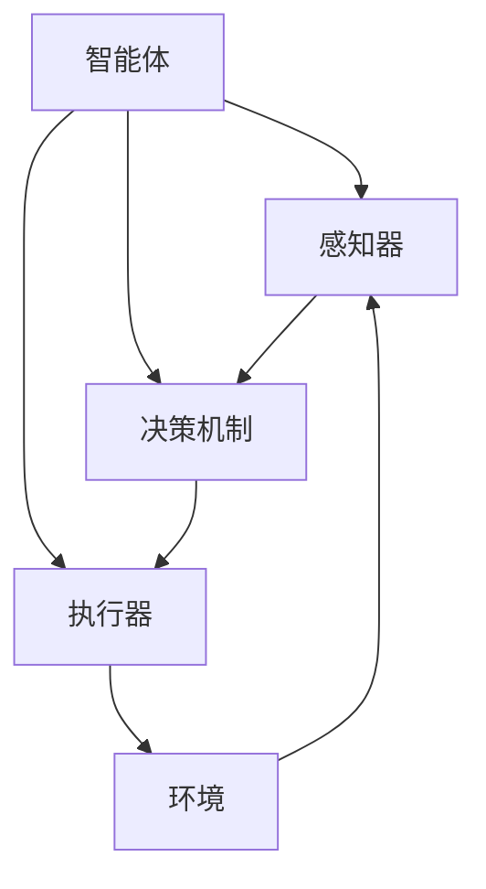

# AI 人工智能 Agent：基础理论解析

## 1. 背景介绍

### 1.1 人工智能的兴起

人工智能(Artificial Intelligence, AI)是当代科技发展的前沿领域,近年来受到了前所未有的关注和投资。随着计算能力的不断提升、大数据时代的到来以及机器学习算法的飞速发展,人工智能技术在各个领域展现出了广阔的应用前景,包括计算机视觉、自然语言处理、决策系统、机器人技术等。

### 1.2 智能体(Agent)的重要性

在人工智能系统中,智能体(Agent)扮演着核心角色。智能体是指能够感知环境、处理信息、做出决策并执行行为的自主实体。它是人工智能系统与外部世界交互的桥梁,决定了系统的智能水平和行为表现。因此,研究和设计高效、鲁棒的智能体理论和架构,对于推动人工智能技术的发展至关重要。

## 2. 核心概念与联系

### 2.1 智能体的定义

智能体可以被形式化定义为一个感知-思考-行为(Perceive-Think-Act)的系统,它通过感知器(Sensors)获取环境状态,基于内部知识库和决策机制选择行为,并通过执行器(Actuators)在环境中采取行动。

### 2.2 智能体的类型

根据智能体与环境的交互方式,可以将智能体分为以下几种类型:

1. **简单反射智能体(Simple Reflex Agent)**: 基于当前感知的条件-行为规则做出反应,不需要内部状态。
2. **基于模型的反射智能体(Model-based Reflex Agent)**: 利用环境模型跟踪局部状态,根据状态做出反应。
3. **基于目标的智能体(Goal-based Agent)**: 基于目标函数评估可能的行为序列,选择最优序列执行。
4. **基于效用的智能体(Utility-based Agent)**: 根据效用函数评估行为序列的期望效用,选择最大化效用的行为。
5. **学习智能体(Learning Agent)**: 通过感知序列和反馈信号,自主学习优化行为策略。

### 2.3 智能体的架构

智能体架构描述了智能体的基本组成部分及其交互方式,是设计和实现智能体系统的关键。典型的智能体架构包括:

1. **反应架构(Reactive Architecture)**
2. **层次架构(Hierarchical Architecture)**
3. **混合架构(Hybrid Architecture)**
4. **行为架构(Behavior-based Architecture)**
5. **BDI架构(Belief-Desire-Intention Architecture)**

不同的架构适用于不同的应用场景和智能体类型,设计时需要权衡各种因素,如计算复杂度、鲁棒性、可解释性等。



## 3. 核心算法原理具体操作步骤

### 3.1 简单反射智能体

简单反射智能体是最基本的智能体类型,它根据当前感知到的环境状态,通过条件-行为规则直接选择相应的行为。该类智能体不需要维护内部状态,算法实现非常简单高效,但也存在一些局限性,如无法处理部分序列决策问题。

简单反射智能体算法步骤:

1. 获取当前环境状态
2. 在条件-行为规则库中查找与当前状态匹配的规则
3. 执行匹配规则对应的行为

```python
def simple_reflex_agent(percept):
    rule = lookup(percept, rule_book)
    action = rule.action
    return action
```

### 3.2 基于模型的反射智能体

基于模型的反射智能体在简单反射智能体的基础上,增加了对环境状态的跟踪和更新。它维护一个内部状态模型,根据当前感知和状态模型,结合条件-行为规则选择行为。这种智能体可以处理需要状态记忆的序列决策问题。

基于模型的反射智能体算法步骤:

1. 获取当前环境状态感知
2. 从内部状态模型获取当前状态
3. 在条件-行为规则库中查找与当前状态和感知匹配的规则
4. 执行匹配规则对应的行为
5. 根据行为和感知,更新内部状态模型

```python
def model_based_reflex_agent(percept):
    state = update_state(state, percept)
    rule = lookup(state, percept, rule_book)
    action = rule.action
    state = update_state(state, action, percept)
    return action
```

### 3.3 基于目标的智能体

基于目标的智能体通过搜索可能的行为序列,找到能够达成目标状态的最优序列并执行。这种智能体需要明确目标状态的表示,并对可能的行为序列进行评估,因此具有更强的决策能力,但也付出了更高的计算代价。

基于目标的智能体算法步骤:

1. 获取当前环境状态和目标状态
2. 生成所有可能的行为序列
3. 对每个行为序列进行模拟,评估其是否能够达到目标状态
4. 选择能够达成目标的最优行为序列
5. 执行行为序列的第一个行为

```python
def goal_based_agent(percept, goal):
    state = update_state(state, percept)
    action_sequences = generate_sequences(state, goal)
    best_sequence = evaluate_sequences(action_sequences, goal)
    action = best_sequence[0]
    state = update_state(state, action, percept)
    return action
```

## 4. 数学模型和公式详细讲解举例说明

在人工智能智能体的研究中,数学模型和公式扮演着重要角色,为智能体的设计、分析和优化提供了理论基础和量化工具。

### 4.1 马尔可夫决策过程(MDP)

马尔可夫决策过程(Markov Decision Process, MDP)是描述智能体与环境交互的重要数学模型。MDP由一个五元组 $(S, A, P, R, \gamma)$ 组成,其中:

- $S$ 是有限的状态集合
- $A$ 是有限的行为集合
- $P(s' | s, a)$ 是状态转移概率,表示在状态 $s$ 执行行为 $a$ 后,转移到状态 $s'$ 的概率
- $R(s, a, s')$ 是回报函数,表示在状态 $s$ 执行行为 $a$ 后,转移到状态 $s'$ 的即时回报
- $\gamma \in [0, 1)$ 是折现因子,用于权衡即时回报和长期回报的重要性

在 MDP 中,智能体的目标是找到一个策略 $\pi: S \rightarrow A$,使得期望的累积折现回报最大化:

$$
\max_{\pi} \mathbb{E}\left[\sum_{t=0}^{\infty} \gamma^t R(s_t, a_t, s_{t+1}) | \pi\right]
$$

其中 $s_0$ 是初始状态, $a_t = \pi(s_t)$, $s_{t+1} \sim P(s_{t+1} | s_t, a_t)$。

### 4.2 值函数和贝尔曼方程

值函数(Value Function)是评估一个状态或状态-行为对的长期价值的函数。在 MDP 中,我们定义状态值函数 $V^{\pi}(s)$ 和行为值函数 $Q^{\pi}(s, a)$ 如下:

$$
V^{\pi}(s) = \mathbb{E}_{\pi}\left[\sum_{t=0}^{\infty} \gamma^t R(s_t, a_t, s_{t+1}) | s_0 = s\right]
$$

$$
Q^{\pi}(s, a) = \mathbb{E}_{\pi}\left[\sum_{t=0}^{\infty} \gamma^t R(s_t, a_t, s_{t+1}) | s_0 = s, a_0 = a\right]
$$

值函数满足贝尔曼方程(Bellman Equations):

$$
V^{\pi}(s) = \sum_{a \in A} \pi(a | s) \sum_{s' \in S} P(s' | s, a) \left[R(s, a, s') + \gamma V^{\pi}(s')\right]
$$

$$
Q^{\pi}(s, a) = \sum_{s' \in S} P(s' | s, a) \left[R(s, a, s') + \gamma \sum_{a' \in A} \pi(a' | s') Q^{\pi}(s', a')\right]
$$

贝尔曼方程为求解最优策略提供了理论基础,如值迭代(Value Iteration)和策略迭代(Policy Iteration)等算法都是基于此。

### 4.3 Q-Learning 算法

Q-Learning 是一种著名的强化学习算法,用于在没有环境模型的情况下,通过与环境的在线交互来学习最优策略。Q-Learning 算法基于贝尔曼最优方程:

$$
Q^*(s, a) = \mathbb{E}\left[R(s, a, s') + \gamma \max_{a'} Q^*(s', a') | s, a\right]
$$

算法通过不断更新 $Q$ 值函数,使其逼近最优 $Q^*$ 函数。更新规则如下:

$$
Q(s_t, a_t) \leftarrow Q(s_t, a_t) + \alpha \left[R(s_t, a_t, s_{t+1}) + \gamma \max_{a} Q(s_{t+1}, a) - Q(s_t, a_t)\right]
$$

其中 $\alpha$ 是学习率。通过不断探索和利用,Q-Learning 算法可以最终收敛到最优策略。

## 5. 项目实践: 代码实例和详细解释说明

为了更好地理解智能体的实现,我们将通过一个简单的网格世界(Gridworld)示例,演示如何使用 Python 编写一个基于值迭代的智能体。

### 5.1 问题描述

在一个 4x4 的网格世界中,智能体的目标是从起点(0,0)到达终点(3,3)。网格中还有两个陷阱位置(1,1)和(3,2),智能体落入陷阱将受到惩罚。智能体可以执行上下左右四个基本行为,每一步行走获得-1的即时回报,到达终点获得+10的回报,落入陷阱获得-10的回报。我们的目标是通过值迭代算法求解该问题的最优策略。

### 5.2 代码实现

```python
import numpy as np

# 定义网格世界
WORLD = np.array([
    [0, -1, -1, -1],
    [-1, -10, -1, -1],
    [-1, -1, -1, -1],
    [-1, -10, -1, 10]
])

# 定义行为集合
ACTIONS = ['U', 'D', 'L', 'R']

# 定义状态转移函数
def transition(state, action):
    row, col = state
    if action == 'U':
        new_row = max(0, row - 1)
    elif action == 'D':
        new_row = min(3, row + 1)
    elif action == 'L':
        new_col = max(0, col - 1)
    else:
        new_col = min(3, col + 1)
    new_state = (new_row, new_col)
    reward = WORLD[new_row, new_col]
    return new_state, reward

# 值迭代算法
def value_iteration(world, actions, gamma=0.9, theta=1e-6):
    states = [(i, j) for i in range(world.shape[0]) for j in range(world.shape[1])]
    value = np.zeros(world.shape)
    
    while True:
        delta = 0
        for state in states:
            old_value = value[state]
            action_values = []
            for action in actions:
                new_state, reward = transition(state, action)
                action_values.append(reward + gamma * value[new_state])
            value[state] = max(action_values)
            delta = max(delta, abs(value[state] - old_value))
        if delta < theta:
            break
    
    policy = {}
    for state in states:
        action_values = []
        for action in actions:
            new_state, reward = transition(state, action)
            action_values.append(reward + gamma * value[new_state])
        policy[state] = actions[np.argmax(action_values)]
    
    return value, policy

# 执行值迭代算法
value, policy = value_iteration(WORLD, ACTIONS)

# 输出结果
print("Value Function:")
print(value)
print("\nOptimal Policy:")
for state in [(i, j) for i in range(4) for j in range(4)]:
    print(f"State {state}: {policy[state]}")
```

### 5.3 代码解释

1. 首先定义了网格世界的环境,使用一个 4x4 的 NumPy 数组表示,其中元素值表示在