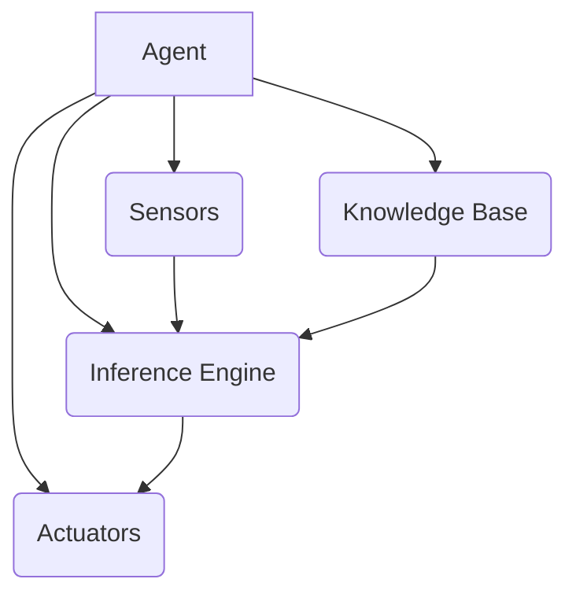
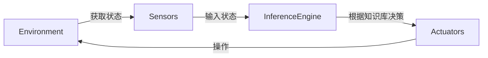
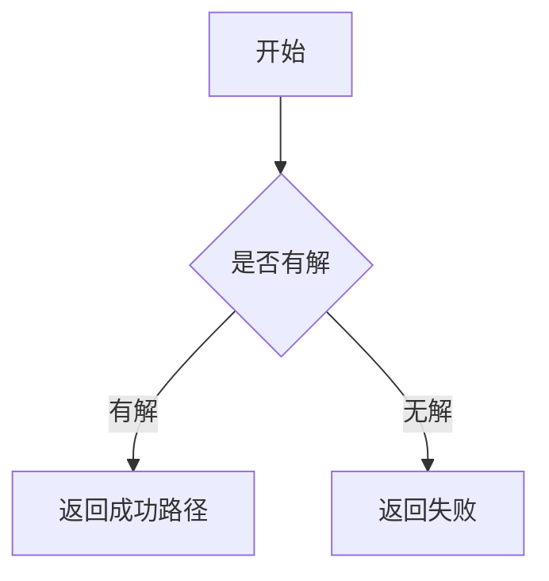

# AI人工智能 Agent：对国家安全的影响

## 1.背景介绍

### 1.1 人工智能的发展历程

人工智能(Artificial Intelligence, AI)是当代科技发展的前沿领域,已经渗透到了我们生活的方方面面。从20世纪50年代人工智能的概念被正式提出,到上世纪90年代机器学习算法的兴起,再到本世纪初深度学习技术的飞速发展,人工智能已经取得了令人瞩目的进步。

### 1.2 人工智能 Agent 的概念

在人工智能领域,Agent(智能体)是一个重要的概念。Agent可以被定义为能够感知环境,并根据感知做出决策和行动的自主系统。随着人工智能技术的不断演进,智能Agent的能力也在不断提升,已经能够执行越来越复杂的任务。

### 1.3 人工智能对国家安全的影响

人工智能技术的快速发展给国家安全带来了巨大的机遇和挑战。一方面,智能Agent可以被应用于军事领域、网络安全、公共安全等,提高国家的防御和反制能力;另一方面,人工智能技术也可能被滥用,对国家安全构成新的威胁。因此,正确认识和评估人工智能对国家安全的影响,制定相应的政策和对策,是当前及未来的一项重大课题。

## 2.核心概念与联系

### 2.1 人工智能 Agent

人工智能Agent是具有一定自主性的软件或硬件系统,能够感知环境、处理信息、做出决策并采取行动。Agent通常包含以下几个核心组成部分:

- 感知器(Sensors):用于获取环境信息
- 执行器(Actuators):用于对环境进行操作
- 知识库(Knowledge Base):存储Agent的知识
- 推理引擎(Inference Engine):根据知识库进行推理决策



### 2.2 Agent与环境的交互

Agent与环境之间是一个持续的交互过程。Agent通过感知器获取环境状态,将状态输入到推理引擎,推理引擎根据知识库做出决策,控制执行器对环境进行操作,环境状态发生变化,循环往复。



### 2.3 Agent类型

根据Agent的特点和功能,可以将其分为以下几种类型:

- 简单反射Agent:只对当前感知作出反射性响应
- 基于模型的Agent:利用环境模型进行规划和决策
- 基于目标的Agent:具有明确目标,为实现目标而行动
- 基于效用的Agent:旨在最大化某种效用函数
- 学习Agent:能够通过经验改进自身行为

## 3.核心算法原理具体操作步骤  

### 3.1 搜索算法

搜索是人工智能中的一个核心问题,也是Agent做出决策的基础。常见的搜索算法有:

#### 3.1.1 无信息搜索

- 广度优先搜索(BFS)
- 深度优先搜索(DFS)
- 迭代加深搜索(IDS)

#### 3.1.2 有信息搜索

- 贪婪最佳优先搜索
- A*搜索
- 双向A*搜索

以A*搜索算法为例,其步骤如下:

1) 将起点加入开放列表
2) 重复以下步骤:
    a) 从开放列表中取出f(n)最小的节点n
    b) 如果n是目标节点,返回成功
    c) ExpandNode(n),将所有邻节点加入开放列表
    d) 重新计算开放列表中每个节点的f(n)值
3) 如果开放列表为空,返回失败

其中,f(n)=g(n)+h(n), g(n)是从起点到n的实际代价,h(n)是从n到目标的估计代价。



### 3.2 机器学习算法

机器学习是Agent获取知识和技能的重要途径,主要算法有:

#### 3.2.1 监督学习

- K近邻算法
- 决策树
- 支持向量机
- 神经网络

#### 3.2.2 无监督学习 

- 聚类算法
- 关联规则挖掘

#### 3.2.3 强化学习

- Q-Learning
- Sarsa
- 策略梯度算法

以Q-Learning算法为例,其核心思想是:

1) 初始化Q(s,a)表格
2) 对每个episode:
    a) 初始化状态s
    b) 重复以下步骤,直到达到终止状态:
        i) 根据当前Q值选择行为a
        ii) 执行a,得到回报r和新状态s'
        iii) 更新Q(s,a)值
        iv) 令s=s'
3) 直到收敛

其中Q(s,a)表示在状态s执行行为a后的期望回报。更新公式为:

$$Q(s,a) \leftarrow Q(s,a) + \alpha(r + \gamma\max_{a'}Q(s',a') - Q(s,a))$$

其中,α为学习率,γ为折扣因子。

```mermaid
graph TD
    A[初始化] --> B{是否终止}
    B -->|是| C[返回]
    B -->|否| D[选择行为a]
    D --> E[执行a,获取r,s']
    E --> F[更新Q(s,a)]
    F --> G[s=s']
    G --> B
```

## 4.数学模型和公式详细讲解举例说明

人工智能中有许多重要的数学模型和公式,下面对几个核心模型进行详细讲解。

### 4.1 马尔可夫决策过程

马尔可夫决策过程(Markov Decision Process, MDP)是强化学习和规划领域的一个基础模型。一个MDP可以用一个5元组(S, A, P, R, γ)来描述:

- S是状态集合
- A是行为集合  
- P是状态转移概率,P(s'|s,a)表示在状态s执行行为a后转移到状态s'的概率
- R是回报函数,R(s,a)表示在状态s执行行为a后获得的即时回报
- γ∈[0,1]是折扣因子,用于权衡即时回报和长期回报

在MDP中,Agent的目标是找到一个策略π:S→A,使得期望回报最大:

$$\max_\pi \mathbb{E}\left[\sum_{t=0}^\infty \gamma^t R(s_t, a_t)\right]$$

其中,期望是关于P(s'|s,a)的期望。

作为例子,考虑一个机器人在网格世界中导航的任务。网格世界中有障碍物、目标点和陷阱,机器人需要从起点导航到目标点,同时避开障碍物和陷阱。这可以建模为一个MDP:

- 状态S是机器人在网格中的位置
- 行为A是机器人可以执行的移动操作(上下左右)
- P(s'|s,a)是在状态s执行行为a后,转移到状态s'的概率
- R(s,a)是在状态s执行行为a后获得的回报,例如到达目标点获得正回报,落入陷阱获得负回报
- γ控制了对即时回报和长期回报的权衡

通过求解这个MDP,Agent可以找到一个最优策略,指导机器人安全高效地到达目标点。

### 4.2 贝叶斯网络

贝叶斯网络是一种概率图模型,广泛应用于因果推理、诊断和预测等领域。一个贝叶斯网络由两部分组成:

- 有向无环图G,节点表示随机变量
- 每个节点的条件概率分布P(X|Parents(X))

在给定了G和所有条件概率分布后,可以计算出任意联合概率分布:

$$P(X_1,\ldots,X_n) = \prod_{i=1}^n P(X_i|Parents(X_i))$$

作为例子,考虑以下一个简单的学生成绩预测问题:

```mermaid
graph LR
    A(智力)-- -->B(学习努力程度)
    A-- -->C(家庭收入)
    B-- -->D(考试分数)
    C-- -->D
```

上图是一个贝叶斯网络,节点表示随机变量,有向边表示因果关系。给定了这个网络结构和每个节点的条件概率分布,例如P(B|A),P(C|A),P(D|B,C),我们就可以计算出P(D),即考试分数的概率分布。

在现实中,贝叶斯网络可以应用于医疗诊断、风险评估、系统故障诊断等领域,为决策提供有力支持。

### 4.3 马尔可夫链

马尔可夫链是一种特殊的随机过程,具有"无后效性",即下一状态的条件概率分布只依赖于当前状态,而与过去状态无关。

设{X_t}是一个离散时间随机过程,其状态空间为S。如果对任意t≥0,有:

$$P(X_{t+1}=j|X_t=i,X_{t-1}=i_{t-1},\ldots,X_0=i_0)=P(X_{t+1}=j|X_t=i)$$

则称{X_t}是一个马尔可夫链。上式中,P(X_{t+1}=j|X_t=i)称为转移概率,记为P_{ij}。

马尔可夫链广泛应用于随机游走、排队论、基因遗传等问题中。作为例子,考虑一个网页排名系统,每个网页被视为一个状态,链接就是状态之间的转移。设P_{ij}表示从网页i转移到网页j的概率,则根据马尔可夫链的性质,网页j的排名只与其直接链入网页有关,而与更远的网页无关。

通过分析马尔可夫链的稳态分布π,可以得到网页的重要性排名:

$$\pi_j = \sum_{i\in S}\pi_iP_{ij}$$

这就是Google的PageRank算法的核心思想。

## 5.项目实践:代码实例和详细解释说明

为了加深对人工智能Agent的理解,下面给出一个简单的Python实现示例。

### 5.1 环境

我们考虑一个简单的网格世界环境,Agent需要从起点导航到目标点。网格世界中可能存在障碍物和陷阱,分别用"X"和"H"表示。Agent可以执行上下左右四种移动操作。

```python
import numpy as np

class GridWorld:
    def __init__(self, grid):
        self.grid = grid
        self.agent_pos = self.find_start()
        self.goal_pos = self.find_goal()

    def find_start(self):
        for i in range(self.grid.shape[0]):
            for j in range(self.grid.shape[1]):
                if self.grid[i, j] == 'S':
                    return (i, j)
        return None

    def find_goal(self):
        for i in range(self.grid.shape[0]):
            for j in range(self.grid.shape[1]):
                if self.grid[i, j] == 'G':
                    return (i, j)
        return None

    def move(self, action):
        i, j = self.agent_pos
        if action == 'U':
            new_pos = (max(0, i - 1), j)
        elif action == 'D':
            new_pos = (min(self.grid.shape[0] - 1, i + 1), j)
        elif action == 'L':
            new_pos = (i, max(0, j - 1))
        elif action == 'R':
            new_pos = (i, min(self.grid.shape[1] - 1, j + 1))
        else:
            raise ValueError(f'Invalid action: {action}')

        if self.grid[new_pos] == 'X':
            return self.agent_pos, -1, False
        elif self.grid[new_pos] == 'H':
            return self.agent_pos, -10, False
        elif self.grid[new_pos] == 'G':
            return new_pos, 10, True

        self.agent_pos = new_pos
        return self.agent_pos, -1, False

grid = np.array([['S', ' ', ' ', ' '],
                 [' ', 'X', ' ', ' '],
                 [' ', ' ', ' ', ' '],
                 [' ', 'H', ' ', 'G']])

env = GridWorld(grid)
```

上面的代码定义了一个GridWorl