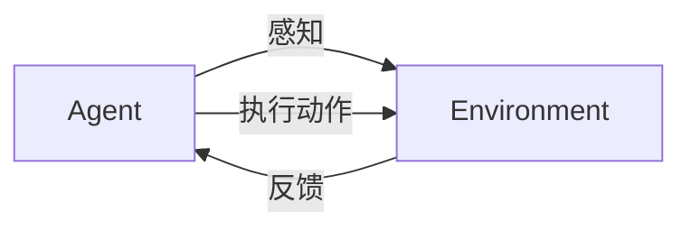

# AI人工智能 Agent：环境建模与模拟

## 1. 背景介绍
### 1.1 人工智能的发展历程
#### 1.1.1 人工智能的起源与早期发展
#### 1.1.2 人工智能的黄金时期
#### 1.1.3 人工智能的低谷与复兴

### 1.2 Agent与环境交互的重要性
#### 1.2.1 Agent的定义与特点  
#### 1.2.2 环境对Agent的影响
#### 1.2.3 Agent与环境交互的意义

### 1.3 环境建模与模拟的必要性
#### 1.3.1 现实世界环境的复杂性
#### 1.3.2 环境建模与模拟的优势
#### 1.3.3 环境建模与模拟在AI领域的应用

## 2. 核心概念与联系
### 2.1 Agent的组成与分类
#### 2.1.1 Agent的感知器
#### 2.1.2 Agent的决策器
#### 2.1.3 Agent的执行器
#### 2.1.4 Agent的分类

### 2.2 环境的类型与特点
#### 2.2.1 确定性环境与不确定性环境
#### 2.2.2 完全可观测环境与部分可观测环境 
#### 2.2.3 静态环境与动态环境
#### 2.2.4 离散环境与连续环境

### 2.3 环境建模的方法
#### 2.3.1 状态空间表示法
#### 2.3.2 马尔可夫决策过程(MDP)
#### 2.3.3 动态贝叶斯网络(DBN)
#### 2.3.4 因果模型

### 2.4 Agent与环境交互的框架
#### 2.4.1 感知-决策-执行循环
#### 2.4.2 强化学习框架
#### 2.4.3 模仿学习框架



## 3. 核心算法原理具体操作步骤
### 3.1 马尔可夫决策过程(MDP)求解
#### 3.1.1 值迭代算法
#### 3.1.2 策略迭代算法
#### 3.1.3 蒙特卡洛方法
#### 3.1.4 时序差分学习(TD)

### 3.2 部分可观测马尔可夫决策过程(POMDP)求解  
#### 3.2.1 信念状态更新
#### 3.2.2 基于值迭代的POMDP求解
#### 3.2.3 基于策略搜索的POMDP求解

### 3.3 深度强化学习算法
#### 3.3.1 Deep Q-Network(DQN) 
#### 3.3.2 Deep Deterministic Policy Gradient(DDPG)
#### 3.3.3 Proximal Policy Optimization(PPO)
#### 3.3.4 Soft Actor-Critic(SAC)

### 3.4 多Agent强化学习算法
#### 3.4.1 Independent Q-Learning
#### 3.4.2 Joint Action Learning 
#### 3.4.3 Decentralized Actor, Centralized Critic(DACC)
#### 3.4.4 Multi-Agent Deep Deterministic Policy Gradient(MADDPG)

## 4. 数学模型和公式详细讲解举例说明
### 4.1 马尔可夫决策过程(MDP)的数学定义
一个MDP可以表示为一个五元组 $\langle S,A,P,R,\gamma \rangle$，其中：
- $S$ 是有限的状态集合
- $A$ 是有限的动作集合  
- $P$ 是状态转移概率矩阵，$P(s'|s,a)$ 表示在状态 $s$ 下执行动作 $a$ 后转移到状态 $s'$ 的概率
- $R$ 是奖励函数，$R(s,a)$ 表示在状态 $s$ 下执行动作 $a$ 获得的即时奖励
- $\gamma \in [0,1]$ 是折扣因子，表示未来奖励的重要程度

求解MDP的目标是寻找一个最优策略 $\pi^*$，使得从任意初始状态 $s_0$ 开始，Agent执行该策略获得的期望累积奖励最大化：

$$\pi^* = \arg\max_{\pi} \mathbb{E}\left[\sum_{t=0}^{\infty} \gamma^t R(s_t,\pi(s_t)) | s_0\right]$$

### 4.2 值迭代算法
值迭代算法通过迭代更新状态值函数 $V(s)$ 来求解最优策略。状态值函数表示从状态 $s$ 开始，执行最优策略获得的期望累积奖励。

值迭代的更新公式为：

$$V_{k+1}(s) = \max_{a} \left[ R(s,a) + \gamma \sum_{s'} P(s'|s,a) V_k(s') \right]$$

其中 $k$ 表示迭代次数。重复进行值迭代直到收敛，即 $\max_{s} |V_{k+1}(s) - V_k(s)| < \epsilon$，其中 $\epsilon$ 是一个很小的正数。

收敛后的最优策略为：

$$\pi^*(s) = \arg\max_{a} \left[ R(s,a) + \gamma \sum_{s'} P(s'|s,a) V^*(s') \right]$$

### 4.3 Deep Q-Network(DQN)算法
DQN算法使用深度神经网络来逼近动作值函数 $Q(s,a)$，即在状态 $s$ 下执行动作 $a$ 获得的期望累积奖励。

DQN的损失函数定义为：

$$L(\theta) = \mathbb{E}_{(s,a,r,s') \sim D} \left[ \left( r + \gamma \max_{a'} Q(s',a';\theta^-) - Q(s,a;\theta) \right)^2 \right]$$

其中 $\theta$ 是当前网络的参数，$\theta^-$ 是目标网络的参数，$D$ 是经验回放缓存。

DQN的训练过程如下：
1. 初始化当前网络 $Q(s,a;\theta)$ 和目标网络 $Q(s,a;\theta^-)$
2. 初始化经验回放缓存 $D$
3. 对于每个Episode：
   - 初始化初始状态 $s_0$
   - 对于每个时间步 $t$：
     - 根据 $\epsilon$-贪婪策略选择动作 $a_t$
     - 执行动作 $a_t$，观察奖励 $r_t$ 和下一状态 $s_{t+1}$
     - 将转移 $(s_t,a_t,r_t,s_{t+1})$ 存储到 $D$ 中
     - 从 $D$ 中随机采样一个批次的转移 $(s,a,r,s')$
     - 计算目标值 $y = r + \gamma \max_{a'} Q(s',a';\theta^-)$
     - 最小化损失 $L(\theta) = (y - Q(s,a;\theta))^2$，更新当前网络参数 $\theta$
     - 每隔一定步数将当前网络参数 $\theta$ 复制给目标网络参数 $\theta^-$
   - Episode结束，开始下一个Episode

## 5. 项目实践：代码实例和详细解释说明
### 5.1 基于OpenAI Gym的环境模拟
OpenAI Gym是一个用于开发和比较强化学习算法的工具包。它提供了各种标准化的环境，如Atari游戏、机器人控制等。下面是一个使用Gym进行CartPole环境模拟的代码示例：

```python
import gym

env = gym.make('CartPole-v1') 
observation = env.reset()

for _ in range(1000):
    env.render()
    action = env.action_space.sample() 
    observation, reward, done, info = env.step(action)
    if done:
        observation = env.reset()

env.close()
```

代码解释：
- `gym.make('CartPole-v1')` 创建了一个CartPole环境的实例
- `env.reset()` 重置环境，返回初始观测值
- `env.render()` 渲染环境，即在屏幕上显示环境的图形界面
- `env.action_space.sample()` 从动作空间中随机采样一个动作
- `env.step(action)` 执行动作，返回新的观测值、奖励、是否结束以及其他信息
- `env.close()` 关闭环境

### 5.2 使用DQN算法求解CartPole问题
下面是使用DQN算法求解CartPole问题的代码示例（基于PyTorch实现）：

```python
import gym
import math
import random
import numpy as np
import matplotlib.pyplot as plt
from collections import namedtuple
from itertools import count

import torch
import torch.nn as nn
import torch.optim as optim
import torch.nn.functional as F

env = gym.make('CartPole-v1').unwrapped

# 定义超参数
BATCH_SIZE = 128
GAMMA = 0.999
EPS_START = 0.9
EPS_END = 0.05
EPS_DECAY = 200
TARGET_UPDATE = 10

# 定义转移元组和经验回放缓存
Transition = namedtuple('Transition', ('state', 'action', 'next_state', 'reward'))

class ReplayMemory(object):
    def __init__(self, capacity):
        self.capacity = capacity
        self.memory = []
        self.position = 0

    def push(self, *args):
        if len(self.memory) < self.capacity:
            self.memory.append(None)
        self.memory[self.position] = Transition(*args)
        self.position = (self.position + 1) % self.capacity

    def sample(self, batch_size):
        return random.sample(self.memory, batch_size)

    def __len__(self):
        return len(self.memory)

# 定义DQN网络
class DQN(nn.Module):
    def __init__(self, h, w, outputs):
        super(DQN, self).__init__()
        self.conv1 = nn.Conv2d(3, 16, kernel_size=5, stride=2)
        self.bn1 = nn.BatchNorm2d(16)
        self.conv2 = nn.Conv2d(16, 32, kernel_size=5, stride=2)
        self.bn2 = nn.BatchNorm2d(32)
        self.conv3 = nn.Conv2d(32, 32, kernel_size=5, stride=2)
        self.bn3 = nn.BatchNorm2d(32)

        def conv2d_size_out(size, kernel_size = 5, stride = 2):
            return (size - (kernel_size - 1) - 1) // stride  + 1
        convw = conv2d_size_out(conv2d_size_out(conv2d_size_out(w)))
        convh = conv2d_size_out(conv2d_size_out(conv2d_size_out(h)))
        linear_input_size = convw * convh * 32
        self.head = nn.Linear(linear_input_size, outputs)

    def forward(self, x):
        x = F.relu(self.bn1(self.conv1(x)))
        x = F.relu(self.bn2(self.conv2(x)))
        x = F.relu(self.bn3(self.conv3(x)))
        return self.head(x.view(x.size(0), -1))

# 定义训练函数
def optimize_model():
    if len(memory) < BATCH_SIZE:
        return
    transitions = memory.sample(BATCH_SIZE)
    batch = Transition(*zip(*transitions))

    non_final_mask = torch.tensor(tuple(map(lambda s: s is not None, batch.next_state)), device=device, dtype=torch.bool)
    non_final_next_states = torch.cat([s for s in batch.next_state if s is not None])
    
    state_batch = torch.cat(batch.state)
    action_batch = torch.cat(batch.action)
    reward_batch = torch.cat(batch.reward)

    state_action_values = policy_net(state_batch).gather(1, action_batch)

    next_state_values = torch.zeros(BATCH_SIZE, device=device)
    next_state_values[non_final_mask] = target_net(non_final_next_states).max(1)[0].detach()
    expected_state_action_values = (next_state_values * GAMMA) + reward_batch

    loss = F.smooth_l1_loss(state_action_values, expected_state_action_values.unsqueeze(1))

    optimizer.zero_grad()
    loss.backward()
    for param in policy_net.parameters():
        param.grad.data.clamp_(-1, 1)
    optimizer.step()

# 训练DQN模型
num_episodes = 500
device = torch.device("cuda" if torch.cuda.is_available() else "cpu")
em = ReplayMemory(10000)
olicy_net = DQN(env.observation_space.shape[0], env.action_space.n).to(device)
rget_net = DQN(env.observation_space.shape[0], env.action_space.n).to(device)
rget_net.load_state_dict(policy_net.state_dict())
rget_net.eval()

ptimizer = optim.RMSprop(policy_net.parameters())

or i_episode in range(num_episodes):
   state = env.reset()
   state = torch.from_numpy(state).float().unsqueeze(0).to(device)
   for t in count():
       action = select_action(state)
       next_state, reward, done, _ = env.step(action.item())
       