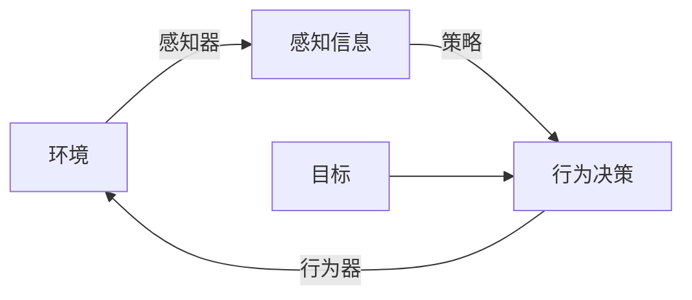

## 1.背景介绍

在当前的技术环境中，人工智能（AI）已经成为一个无处不在的存在。从我们的手机到我们的汽车，甚至是我们的家庭，AI都在为我们的生活带来改变。在这个趋势的推动下，AI代理（AI Agents）的概念也应运而生。AI代理是一种能够感知环境并根据其目标进行自我驱动的实体。这种实体可以是一个软件程序，如一个智能助手，或者是一个机器人。在本文中，我们将深入探讨AI代理工作流的基本概念和理解，以及如何在实际项目中应用这些概念。

## 2.核心概念与联系

AI代理工作流主要包括以下几个核心概念：

- **环境（Environment）**：AI代理所处的环境，可以是物理环境，也可以是虚拟环境。
- **感知器（Perceptors）**：用于感知环境的设备或软件，例如摄像头、麦克风、温度传感器等。
- **行为器（Actuators）**：用于在环境中执行操作的设备或软件，例如机器人的手臂、自动驾驶汽车的马达等。
- **目标（Goals）**：AI代理需要达成的目标，比如导航到特定的位置，识别出特定的物体等。
- **策略（Policies）**：根据环境的感知信息，决定如何达成目标的行为策略。

这些概念之间的关系可以用下面的Mermaid流程图表示：



## 3.核心算法原理具体操作步骤

AI代理的核心算法原理主要包括以下几个步骤：

1. **感知环境**：AI代理通过感知器收集环境的信息，这些信息可以是图像、声音、温度等各种形式。
2. **理解环境**：AI代理需要对收集到的信息进行理解，这通常需要使用到机器学习和深度学习等技术。
3. **制定策略**：根据理解的结果，AI代理需要制定出达成目标的策略。这个策略可以是预先编程的，也可以是通过学习得到的。
4. **执行行动**：最后，AI代理通过行为器在环境中执行行动，以达成目标。

## 4.数学模型和公式详细讲解举例说明

在AI代理的工作流中，有一个核心的数学模型是马尔科夫决策过程（Markov Decision Process，MDP）。MDP是一种用来描述决策问题的数学模型，它假设环境的下一个状态只依赖于当前状态和采取的行动，而与之前的状态和行动无关。

MDP可以用一个四元组$(S, A, P, R)$来描述，其中：

- $S$是状态的集合。
- $A$是行动的集合。
- $P$是状态转移概率，$P(s'|s, a)$表示在状态$s$下采取行动$a$后转移到状态$s'$的概率。
- $R$是奖励函数，$R(s, a, s')$表示在状态$s$下采取行动$a$并转移到状态$s'$后获得的奖励。

在这个模型中，AI代理的目标是找到一个策略$\pi$，使得长期累积奖励的期望值最大：

$$
\pi^* = \arg\max_\pi E\left[\sum_{t=0}^\infty \gamma^t R(s_t, a_t, s_{t+1}) | \pi\right]
$$

其中，$\gamma$是折扣因子，用于调节即时奖励和未来奖励的权重。

## 5.项目实践：代码实例和详细解释说明

在Python中，我们可以使用OpenAI的Gym库来实现一个简单的AI代理。以下是一个使用Q-learning算法的例子：

```python
import gym
import numpy as np

# 创建环境
env = gym.make('FrozenLake-v0')

# 初始化Q-table
Q = np.zeros([env.observation_space.n, env.action_space.n])

# 设置参数
alpha = 0.5
gamma = 0.95
epsilon = 0.1
num_episodes = 5000

# Q-learning算法
for i_episode in range(num_episodes):
    # 初始化状态
    state = env.reset()

    for t in range(100):
        # 选择行动
        if np.random.uniform(0, 1) < epsilon:
            action = env.action_space.sample()
        else:
            action = np.argmax(Q[state, :])

        # 执行行动
        next_state, reward, done, info = env.step(action)

        # 更新Q-table
        Q[state, action] = (1 - alpha) * Q[state, action] + alpha * (reward + gamma * np.max(Q[next_state, :]))

        # 更新状态
        state = next_state

        if done:
            break
```

## 6.实际应用场景

AI代理在许多实际应用场景中都有广泛的应用，包括但不限于：

- **自动驾驶**：自动驾驶汽车就是一个典型的AI代理，它能够感知环境（通过摄像头、雷达等设备），理解环境（通过深度学习等技术），制定策略（通过路径规划等算法），并执行行动（通过马达等设备）。
- **智能家居**：智能家居设备，如智能音箱、智能灯泡等，也可以看作是AI代理。它们可以感知环境（例如通过声音、光线等），理解用户的需求（通过语音识别等技术），并执行相应的行动（如播放音乐、调整灯光等）。

## 7.工具和资源推荐

- **OpenAI Gym**：OpenAI Gym是一个用于开发和比较强化学习算法的工具库，它提供了许多预定义的环境，可以方便地用于实验和测试。
- **TensorFlow**：TensorFlow是一个开源的机器学习框架，它提供了许多用于构建和训练神经网络的工具，非常适合用于实现AI代理的理解环境和制定策略的部分。

## 8.总结：未来发展趋势与挑战

AI代理的发展趋势是朝着更智能、更自主的方向发展。随着深度学习等技术的发展，AI代理的理解环境和制定策略的能力将越来越强。同时，随着物联网等技术的发展，AI代理的感知环境和执行行动的能力也将越来越强。

然而，AI代理的发展也面临着许多挑战，包括但不限于：

- **安全性**：AI代理的行动可能会对环境产生实际影响，如何确保其行动的安全性是一个重要的问题。
- **隐私性**：AI代理需要收集大量的环境信息，如何保护用户的隐私是另一个重要的问题。
- **可解释性**：AI代理的决策过程通常是不透明的，如何提高其可解释性是一个挑战。

## 9.附录：常见问题与解答

1. **AI代理和普通的软件有什么区别？**

    AI代理不仅能够执行预定义的任务，而且能够根据环境的变化自我调整，以达成预设的目标。这种自我调整的能力是通过机器学习等技术实现的。

2. **AI代理的工作流程是怎样的？**

    AI代理的工作流程主要包括感知环境、理解环境、制定策略和执行行动四个步骤。

3. **如何评估AI代理的性能？**

    评估AI代理的性能通常需要定义一个或多个目标，并根据AI代理达成这些目标的效率和效果来评估其性能。

作者：禅与计算机程序设计艺术 / Zen and the Art of Computer Programming