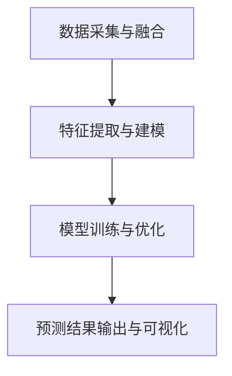

# AI人工智能代理工作流 AI Agent WorkFlow：在重大事件预测中的应用

## 1.背景介绍

### 1.1 重大事件预测的重要性

在当今快节奏的世界中,各种重大事件如自然灾害、金融危机、政治动荡等随时可能发生,对社会、经济和人民生活造成巨大影响。及时准确地预测这些重大事件的发生及其影响,对于政府、企业和个人来说都至关重要。有效的预测可以帮助相关部门制定应对策略,采取必要的预防措施,从而最大程度地减少损失。

### 1.2 传统预测方法的局限性  

传统的重大事件预测方法主要依赖于人工分析和统计模型,存在以下几个主要局限:

1. 数据量庞大,人工分析效率低下
2. 统计模型缺乏动态调整能力,难以适应复杂多变的环境
3. 预测准确性和时效性不足,难以满足实际需求

### 1.3 AI人工智能代理工作流的优势

AI人工智能技术的发展为重大事件预测提供了新的解决方案。AI代理工作流通过整合多种人工智能技术,如机器学习、自然语言处理、知识图谱等,可以高效地处理海量异构数据,动态构建预测模型,从而显著提高预测的准确性和时效性。

## 2.核心概念与联系

### 2.1 AI代理(Agent)

AI代理是AI人工智能系统的核心组成部分,负责感知环境、决策行为、执行任务。在重大事件预测中,AI代理需要具备以下几个关键能力:

1. 数据采集与融合
2. 特征提取与建模
3. 模型训练与优化
4. 预测结果输出与可视化

### 2.2 工作流(Workflow)

工作流是指将多个任务按特定顺序组织起来的过程,以实现预定目标。AI代理工作流将上述关键能力有机组合,形成一个端到端的流程,高效完成重大事件预测任务。



### 2.3 人工智能技术集成

AI代理工作流集成了多种先进的人工智能技术,包括但不限于:

1. 机器学习: 支持向量机、决策树、深度学习等
2. 自然语言处理: 命名实体识别、情感分析等
3. 知识图谱: 实体关联、语义推理等
4. 计算机视觉: 目标检测、图像分类等

这些技术的融合应用,赋予了AI代理工作流强大的数据处理和预测建模能力。

## 3.核心算法原理具体操作步骤  

### 3.1 数据采集与融合

#### 3.1.1 数据来源

重大事件预测所需数据来源广泛,包括:

1. 结构化数据: 政府统计数据、金融交易数据等
2. 半结构化数据: 新闻报道、社交媒体数据等
3. 非结构化数据: 卫星遥感图像、视频流数据等

#### 3.1.2 数据采集

针对不同类型的数据源,需要采用不同的采集方式:

1. 结构化数据: 数据库查询、API调用等
2. 半结构化数据: 网络爬虫、RSS订阅等  
3. 非结构化数据: 传感器接入、视频流采集等

#### 3.1.3 数据融合

由于数据源的异构性,需要对采集到的原始数据进行清洗、转换和融合,以构建统一的数据集:

1. 数据清洗: 去重、填补缺失值、格式转换等
2. 数据转换: 文本分词、图像矢量化等
3. 数据融合: 特征级融合、决策级融合等

### 3.2 特征提取与建模

#### 3.2.1 特征提取

从融合后的数据集中提取有效特征是构建预测模型的关键步骤。常用的特征提取方法包括:

1. 统计特征: 均值、方差、相关系数等
2. 领域特征: 基于专家知识设计的特征
3. 自动特征: 通过算法自动学习特征表示

#### 3.2.2 特征选择

由于特征空间往往很大,需要采用特征选择算法从中挑选出对预测任务最为重要的特征子集,以提高模型效率和泛化能力。常用的特征选择算法有:

1. 过滤式方法: 基于统计量评分特征重要性
2. 包裹式方法: 反复训练评估不同特征子集  
3. 嵌入式方法: 在模型训练过程中自动选择特征

#### 3.2.3 建模方法

根据提取和选择出的特征,可以采用不同的机器学习算法构建预测模型:

1. 监督学习: 逻辑回归、支持向量机、决策树等
2. 非监督学习: 聚类分析、主成分分析等
3. 深度学习: 卷积神经网络、递归神经网络等

### 3.3 模型训练与优化

#### 3.3.1 训练数据准备

将数据集划分为训练集、验证集和测试集,用于模型训练、调参和评估。

#### 3.3.2 模型训练

采用迭代式训练方法,如梯度下降等,基于训练数据不断优化模型参数,使模型在验证集上的性能不断提高。

#### 3.3.3 模型优化

引入正则化、dropout等技术,防止模型过拟合;
采用模型集成等方法,提升单一模型的泛化能力。

#### 3.3.4 模型评估

在保留的测试集上评估最终模型的性能指标,如准确率、召回率、F1值等,检验模型的实际预测能力。

### 3.4 预测结果输出与可视化

#### 3.4.1 预测结果输出

将模型对新的输入数据进行预测,输出结构化的预测结果,如事件发生的概率、影响范围等。

#### 3.4.2 结果可视化

通过可视化技术,以图表、地图等形式直观展现预测结果,方便人工分析和决策。

#### 3.4.3 模型更新

根据新的数据和反馈,持续优化和更新模型,使其能够适应环境的变化,保持较高的预测精度。

## 4.数学模型和公式详细讲解举例说明

### 4.1 特征提取

#### 4.1.1 文本特征

对于文本数据,常用TF-IDF算法提取特征向量:

$$\mathrm{tfidf}(w, d, D) = \mathrm{tf}(w, d) \times \log\dfrac{|D|}{|\{d' \in D : w \in d'\}|}$$

其中,$\mathrm{tf}(w, d)$表示词$w$在文档$d$中出现的频率,$|D|$为语料库中文档总数,$|\{d' \in D : w \in d'\}|$为包含词$w$的文档数量。

#### 4.1.2 图像特征

对于图像数据,可以使用卷积神经网络自动提取特征。以VGG16网络为例,其由13个卷积层和3个全连接层构成:

```python
model = Sequential()
# 卷积层块1
model.add(Conv2D(64, (3, 3), padding='same', activation='relu', input_shape=input_shape))
model.add(Conv2D(64, (3, 3), padding='same', activation='relu'))
model.add(MaxPooling2D((2, 2), strides=(2, 2)))
# 卷积层块2
...
# 全连接层
model.add(Flatten())
model.add(Dense(4096, activation='relu'))
...
model.add(Dense(num_classes, activation='softmax'))
```

### 4.2 模型训练

#### 4.2.1 损失函数

对于分类问题,常用的损失函数是交叉熵损失:

$$J(\theta) = -\dfrac{1}{m}\sum\limits_{i=1}^m\sum\limits_{k=1}^Ky_{k}^{(i)}\log\dfrac{e^{\theta_k^Tx^{(i)}}}{\sum_{j=1}^Ke^{\theta_j^Tx^{(i)}}}\tag{4}$$

其中,$m$为训练样本数,$y_k^{(i)}$为样本$i$的真实标签,$\theta$为模型参数。

#### 4.2.2 优化算法

常用的优化算法有梯度下降、动量梯度下降、RMSProp等,以梯度下降为例:

$$\theta := \theta - \alpha\nabla_\theta J(\theta)$$

其中,$\alpha$为学习率,$\nabla_\theta J(\theta)$为损失函数关于$\theta$的梯度。

### 4.3 模型评估

#### 4.3.1 混淆矩阵

对于二分类问题,常用混淆矩阵来计算评估指标:

```
          Predicted
         +        -
Actual + TP       FN
       - FP       TN
```

- 准确率=$\dfrac{TP+TN}{TP+FN+FP+TN}$
- 精确率=$\dfrac{TP}{TP+FP}$  
- 召回率=$\dfrac{TP}{TP+FN}$
- $F1=2*\dfrac{精确率*召回率}{精确率+召回率}$

#### 4.3.2 ROC曲线

ROC曲线展示了不同阈值下的真正例率(TPR)和假正例率(FPR)之间的关系,曲线下面积(AUC)越大,模型性能越好。

$$TPR=\dfrac{TP}{TP+FN}, FPR=\dfrac{FP}{FP+TN}$$

## 5.项目实践:代码实例和详细解释说明 

以下是一个使用Python和TensorFlow构建的简单AI代理工作流示例,用于预测某城市是否会发生严重空气污染。

### 5.1 数据准备

我们使用开源的北京PM2.5数据集,包含2010年至2014年期间的气象数据和PM2.5浓度值。

```python
import pandas as pd

# 读取数据
data = pd.read_csv('beijing_pm25.csv')

# 数据预处理
data = data.dropna(axis=0, how='any') # 删除含有缺失值的行
features = data.columns[:-1] # 特征列
label = data.columns[-1] # 标签列

# 将标签二值化
pm25 = data[label].values
pm25[pm25 > 50] = 1 
pm25[pm25 <= 50] = 0
```

### 5.2 特征工程

我们选取温度、压强、湿度等气象指标作为特征,并对数据进行标准化处理。

```python
from sklearn.preprocessing import StandardScaler

# 标准化特征数据
X = data[features].values
y = pm25
X_scaled = StandardScaler().fit_transform(X)
```

### 5.3 模型构建

我们使用TensorFlow构建一个简单的前馈神经网络模型。

```python
import tensorflow as tf

# 占位符
X = tf.placeholder(tf.float32, [None, n_features])
y = tf.placeholder(tf.int64, [None])

# 模型参数
W1 = tf.get_variable("W1", [n_features, 8], initializer=tf.random_normal_initializer())
b1 = tf.get_variable("b1", [8], initializer=tf.constant_initializer(0))
W2 = tf.get_variable("W2", [8, 1], initializer=tf.random_normal_initializer())
b2 = tf.get_variable("b2", [1], initializer=tf.constant_initializer(0))

# 前向传播
z1 = tf.nn.relu(tf.matmul(X, W1) + b1)
y_pred = tf.squeeze(tf.matmul(z1, W2) + b2, axis=1)

# 损失函数和优化器
loss = tf.reduce_mean(tf.nn.sigmoid_cross_entropy_with_logits(labels=tf.cast(y, tf.float32), logits=y_pred))
optimizer = tf.train.AdamOptimizer().minimize(loss)
```

### 5.4 模型训练与评估

我们使用训练集训练模型,并在测试集上评估模型性能。

```python
# 训练模型
n_epochs = 1000
batch_size = 64
n_batches = len(X_train) // batch_size

with tf.Session() as sess:
    sess.run(tf.global_variables_initializer())
    for epoch in range(n_epochs):
        for batch in range(n_batches):
            X_batch = X_train[batch*batch_size:(batch+1)*batch_size]
            y_batch = y_train[batch*batch_size:(batch+1)*batch_size]
            _, loss_val = sess.run([optimizer, loss], feed_dict={X: X_batch, y: y_batch})
        if epoch % 100 