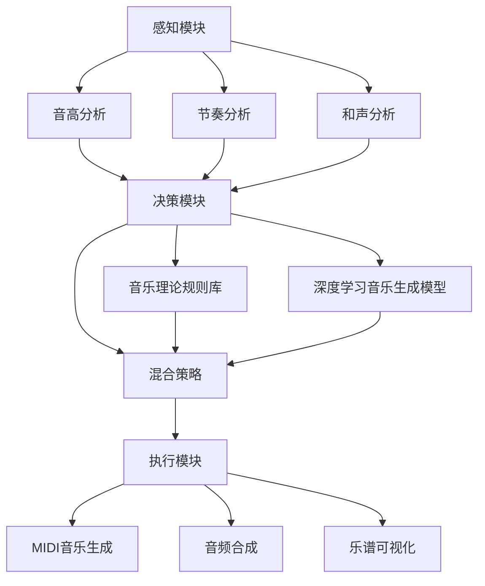

# AI人工智能代理工作流 AI Agent WorkFlow：在音乐创作中的应用

## 1. 背景介绍
### 1.1 人工智能在音乐领域的发展
#### 1.1.1 早期的音乐人工智能
#### 1.1.2 深度学习时代的音乐AI
#### 1.1.3 音乐AI的商业化应用

### 1.2 AI代理工作流的概念
#### 1.2.1 什么是AI代理
#### 1.2.2 AI代理的特点和优势  
#### 1.2.3 AI代理在不同领域的应用

### 1.3 将AI代理工作流应用于音乐创作的意义
#### 1.3.1 提高音乐创作效率
#### 1.3.2 拓展音乐创作的可能性
#### 1.3.3 降低音乐创作门槛

## 2. 核心概念与联系
### 2.1 AI代理的组成要素
#### 2.1.1 感知模块
#### 2.1.2 决策模块
#### 2.1.3 执行模块

### 2.2 音乐创作中的关键要素
#### 2.2.1 音高
#### 2.2.2 节奏
#### 2.2.3 和声
#### 2.2.4 编曲

### 2.3 AI代理工作流与音乐创作要素的映射关系
#### 2.3.1 感知模块与音乐要素的对应
#### 2.3.2 决策模块与音乐创作规则的对应
#### 2.3.3 执行模块与音乐输出形式的对应

## 3. 核心算法原理具体操作步骤
### 3.1 基于规则的音乐生成算法
#### 3.1.1 音乐理论规则的形式化表示
#### 3.1.2 规则匹配与音乐片段生成
#### 3.1.3 基于规则的音乐生成算法的局限性

### 3.2 基于深度学习的音乐生成算法
#### 3.2.1 循环神经网络（RNN）在音乐生成中的应用
#### 3.2.2 生成对抗网络（GAN）在音乐生成中的应用
#### 3.2.3 变分自编码器（VAE）在音乐生成中的应用

### 3.3 融合规则与深度学习的混合音乐生成算法
#### 3.3.1 规则约束下的深度学习音乐生成
#### 3.3.2 深度学习辅助的规则音乐生成
#### 3.3.3 混合算法的优势与挑战

## 4. 数学模型和公式详细讲解举例说明
### 4.1 马尔可夫链在音乐生成中的应用
#### 4.1.1 马尔可夫链的数学定义
#### 4.1.2 马尔可夫链在音乐序列建模中的应用
#### 4.1.3 马尔可夫链音乐生成的案例分析

### 4.2 RNN在音乐生成中的数学原理
#### 4.2.1 RNN的数学定义与前向传播过程
#### 4.2.2 LSTM与GRU等RNN变体在音乐生成中的应用
#### 4.2.3 RNN音乐生成的损失函数与优化算法

### 4.3 GAN在音乐生成中的数学原理
#### 4.3.1 GAN的数学定义与博弈过程
#### 4.3.2 WGAN、CGAN等GAN变体在音乐生成中的应用
#### 4.3.3 GAN音乐生成的训练技巧与稳定性分析

## 5. 项目实践：代码实例和详细解释说明
### 5.1 基于Magenta的AI音乐创作项目
#### 5.1.1 Magenta简介及其音乐模型
#### 5.1.2 使用Magenta生成音乐的代码实例
#### 5.1.3 Magenta生成音乐的效果分析与改进

### 5.2 基于深度学习框架的AI音乐创作项目
#### 5.2.1 使用TensorFlow构建音乐生成模型
#### 5.2.2 使用PyTorch构建音乐生成模型 
#### 5.2.3 不同框架实现的音乐生成模型比较

### 5.3 音乐创作AI代理工作流的端到端实现
#### 5.3.1 音乐数据的收集与预处理
#### 5.3.2 音乐生成模型的训练与优化
#### 5.3.3 音乐生成模型的部署与应用

## 6. 实际应用场景
### 6.1 AI辅助音乐创作平台
#### 6.1.1 基于Web的在线AI音乐创作平台
#### 6.1.2 AI音乐创作插件与DAW集成
#### 6.1.3 移动端AI音乐创作应用

### 6.2 游戏与影视行业中的AI音乐创作
#### 6.2.1 游戏配乐的AI自动生成
#### 6.2.2 电影与电视剧配乐的AI辅助创作
#### 6.2.3 AI音乐在VR/AR场景中的应用

### 6.3 音乐教育中的AI应用
#### 6.3.1 AI音乐作曲教学助手
#### 6.3.2 AI音乐理论知识推荐系统
#### 6.3.3 基于AI的音乐练习反馈系统

## 7. 工具和资源推荐
### 7.1 开源音乐AI项目
#### 7.1.1 Magenta
#### 7.1.2 MuseGAN
#### 7.1.3 DeepBach

### 7.2 音乐AI相关的数据集
#### 7.2.1 MAESTRO
#### 7.2.2 Lakh MIDI Dataset
#### 7.2.3 NSynth Dataset

### 7.3 音乐AI社区与学习资源
#### 7.3.1 Magenta社区
#### 7.3.2 AI音乐创作在线课程
#### 7.3.3 音乐AI相关的学术会议与期刊

## 8. 总结：未来发展趋势与挑战
### 8.1 音乐AI的发展趋势
#### 8.1.1 多模态音乐生成
#### 8.1.2 交互式音乐创作
#### 8.1.3 个性化音乐推荐与生成

### 8.2 音乐AI面临的挑战
#### 8.2.1 音乐创作的主观性与评估难题
#### 8.2.2 音乐版权与伦理问题
#### 8.2.3 音乐AI的可解释性与可控性

### 8.3 音乐AI的未来展望
#### 8.3.1 人机协作的音乐创作模式
#### 8.3.2 音乐AI在其他艺术领域的拓展应用
#### 8.3.3 音乐AI对音乐产业的影响与变革

## 9. 附录：常见问题与解答
### 9.1 音乐AI是否会取代人类音乐创作者？
### 9.2 如何评估音乐AI生成作品的质量与创新性？
### 9.3 音乐AI的发展对音乐教育有何影响？
### 9.4 如何平衡音乐AI的发展与音乐版权保护？
### 9.5 音乐AI的发展对传统音乐产业有何冲击与机遇？

以上是一个AI代理工作流在音乐创作中应用的Mermaid流程图。首先，感知模块对输入的音乐数据进行分析，提取音高、节奏和和声等特征。然后，决策模块综合考虑音乐理论规则库和深度学习音乐生成模型，通过混合策略生成新的音乐片段。最后，执行模块将生成的音乐片段转化为MIDI格式，进行音频合成和乐谱可视化，输出最终的音乐创作结果。

AI代理工作流在音乐创作中的应用是一个充满机遇与挑战的研究方向。通过将人工智能技术与音乐理论知识相结合，AI代理能够辅助音乐创作者提高效率、拓展创作思路，同时也为音乐教育和音乐产业带来新的变革。然而，音乐创作的主观性、音乐版权与伦理问题、音乐AI的可解释性与可控性等挑战仍需要在未来的研究中加以解决。

展望未来，音乐AI有望实现更加智能化、个性化和交互式的音乐创作体验。人机协作的音乐创作模式将成为主流，音乐AI也将在其他艺术领域得到拓展应用。同时，音乐AI的发展也将对传统音乐产业格局产生深远影响，推动音乐产业的转型升级。

总之，AI代理工作流在音乐创作中的应用是一个充满想象力和创新潜力的领域。通过不断探索和完善音乐AI技术，我们有望实现更加智能、高效、个性化的音乐创作，为人类的音乐文化发展注入新的活力。

作者：禅与计算机程序设计艺术 / Zen and the Art of Computer Programming