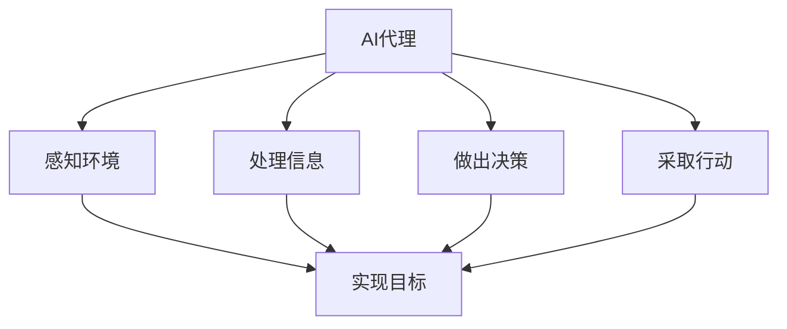
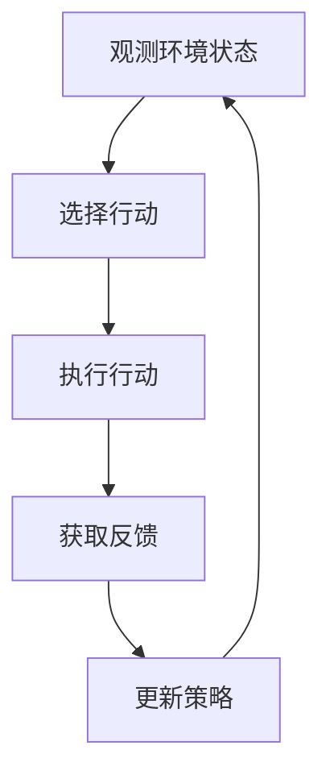

# AI人工智能代理工作流AI Agent WorkFlow：AI代理在供应链管理中的创新运用

## 1.背景介绍

### 1.1 供应链管理的重要性

在当今快节奏的商业环境中，供应链管理扮演着至关重要的角色。它是指有效地规划、实施和控制从原材料采购到最终产品交付给客户的整个流程。有效的供应链管理可以提高效率、降低成本、提升客户满意度,并为企业带来竞争优势。

### 1.2 供应链管理面临的挑战

然而,供应链管理也面临着诸多挑战,例如:

- 复杂的供应网络
- 不确定的需求波动
- 全球化经营带来的物流挑战
- 实时数据整合和决策制定的困难

### 1.3 人工智能(AI)的崛起

人工智能技术的飞速发展为解决这些挑战提供了新的契机。AI代理作为人工智能在供应链管理领域的一种创新应用,正在引领供应链管理的变革。

## 2.核心概念与联系

### 2.1 什么是AI代理?

AI代理是一种自主的软件实体,能够感知环境、处理信息、做出决策并采取行动,以实现预定目标。在供应链管理中,AI代理可以执行各种任务,如需求预测、库存优化、路线规划等。



### 2.2 AI代理与传统方法的区别

相比于传统的供应链管理方法,AI代理具有以下优势:

- 自主性:能够独立做出决策和行动
- 实时性:可以实时处理数据并快速响应
- 智能性:利用机器学习等技术持续优化决策
- 可扩展性:可轻松扩展以处理更复杂的场景

### 2.3 AI代理在供应链管理中的应用

AI代理可应用于供应链管理的各个环节,包括但不限于:

- 需求预测与规划
- 库存管理与控制  
- 运输路线优化
- 供应商管理
- 风险管理

## 3.核心算法原理具体操作步骤

AI代理的核心是一系列算法,用于感知、学习、决策和行动。下面将介绍其中的几种关键算法。

### 3.1 强化学习算法

强化学习是一种基于反馈的机器学习范式,AI代理通过与环境的交互来学习如何做出最优决策。它包括以下主要步骤:

1. **观测环境状态**:代理观测当前环境状态
2. **选择行动**:根据策略选择行动
3. **执行行动**:在环境中执行选择的行动
4. **获取反馈**:观测环境的新状态和奖励信号
5. **更新策略**:根据反馈更新决策策略



这种试错迭代的过程最终可以让AI代理学习到最优策略。

### 3.2 深度学习算法

深度学习算法可用于从大量数据中自动提取特征,并对复杂模式进行建模,是供应链预测和优化的有力工具。常用的深度学习算法包括:

- **卷积神经网络(CNN)**: 适用于图像和时序数据处理,可用于需求预测。
- **长短期记忆网络(LSTM)**: 一种循环神经网络,擅长处理序列数据,可用于时间序列预测。
- **生成对抗网络(GAN)**: 可用于生成合成数据,增强模型的泛化能力。

### 3.3 优化算法

优化算法旨在寻找最优解,在供应链管理中可用于库存优化、路径规划等任务。常见的优化算法有:

- **线性规划**: 适用于在线性约束条件下寻找最优解。
- **整数规划**: 求解包含整数变量的优化问题。
- **启发式算法**: 如遗传算法、蚁群算法等,用于求解NP难问题的近似最优解。

### 3.4 多智能体系统

复杂供应链系统通常涉及多个利益相关者,需要多个AI代理协同工作。多智能体系统研究如何让多个代理通过协作或竞争来实现整体目标。相关算法包括:

- **协作过滤算法**: 利用其他代理的经验来加速学习。
- **拍卖算法**: 通过拍卖机制实现资源的分配。
- **博弈论算法**: 研究代理在存在利益冲突时的行为策略。

## 4.数学模型和公式详细讲解举例说明 

### 4.1 马尔可夫决策过程(MDP)

马尔可夫决策过程是强化学习问题的数学模型,由一个五元组 $(S, A, P, R, \gamma)$ 组成:

- $S$ 是状态空间的集合
- $A$ 是代理可选动作的集合  
- $P(s' \vert s, a)$ 是状态转移概率,表示在状态 $s$ 下执行动作 $a$ 后转移到状态 $s'$ 的概率
- $R(s, a, s')$ 是在状态 $s$ 执行动作 $a$ 后转移到状态 $s'$ 时获得的奖励
- $\gamma \in [0, 1)$ 是折现因子,用于权衡当前和未来奖励的重要性

目标是找到一个策略 $\pi: S \rightarrow A$,使得期望的累积折现奖励最大:

$$
\max_\pi \mathbb{E}\left[ \sum_{t=0}^\infty \gamma^t R(s_t, a_t, s_{t+1}) \right]
$$

其中 $s_0$ 是初始状态, $a_t = \pi(s_t)$, $s_{t+1} \sim P(\cdot \vert s_t, a_t)$。

### 4.2 Q-Learning算法

Q-Learning是一种无模型的强化学习算法,可以直接从环境交互中学习最优策略,不需要事先了解MDP的转移概率和奖励函数。

算法维护一个Q函数 $Q(s, a)$,表示在状态 $s$ 下执行动作 $a$ 后可获得的期望累积奖励。在每个时间步,代理根据当前Q值选择动作,并根据实际获得的奖励更新Q值:

$$
Q(s_t, a_t) \leftarrow Q(s_t, a_t) + \alpha \left[ r_t + \gamma \max_{a'} Q(s_{t+1}, a') - Q(s_t, a_t) \right]
$$

其中 $\alpha$ 是学习率,控制新信息对Q值的影响程度。通过不断探索和利用,Q函数最终会收敛到最优策略。

### 4.3 供应链需求预测模型

我们可以将供应链需求预测建模为时间序列预测问题。假设过去 $n$ 个时间步的需求量为 $\{x_1, x_2, \ldots, x_n\}$,我们希望预测未来 $m$ 个时间步的需求量 $\{x_{n+1}, x_{n+2}, \ldots, x_{n+m}\}$。

一种常见的深度学习模型是长短期记忆网络(LSTM),它能够有效捕获长期依赖关系:

$$
\begin{aligned}
f_t &= \sigma(W_f \cdot [h_{t-1}, x_t] + b_f) \\
i_t &= \sigma(W_i \cdot [h_{t-1}, x_t] + b_i) \\
\tilde{C}_t &= \tanh(W_C \cdot [h_{t-1}, x_t] + b_C) \\
C_t &= f_t \odot C_{t-1} + i_t \odot \tilde{C}_t \\
o_t &= \sigma(W_o \cdot [h_{t-1}, x_t] + b_o) \\
h_t &= o_t \odot \tanh(C_t)
\end{aligned}
$$

其中 $f_t, i_t, o_t$ 分别是遗忘门、输入门和输出门, $C_t$ 是细胞状态,用于控制信息的流动。训练后的LSTM可用于对新输入序列进行需求预测。

## 5.项目实践:代码实例和详细解释说明

为了更好地理解AI代理在供应链管理中的应用,我们将通过一个简化的Python示例来演示如何使用强化学习优化库存管理策略。

### 5.1 问题描述

假设我们有一家零售商,需要决定每周订购多少单位的某种商品。如果订购量过多,会产生额外的库存成本;如果订购量过少,可能会导致销售损失。我们的目标是找到一个策略,在给定的需求分布下,最大化预期收益。

### 5.2 环境设置

我们首先定义环境,包括状态空间、动作空间、奖励函数和需求分布。

```python
import numpy as np

# 状态空间为当前库存量
MAX_INVENTORY = 100
STATES = np.arange(MAX_INVENTORY + 1)

# 动作空间为订购量
ACTIONS = np.arange(MAX_INVENTORY + 1)

# 需求分布服从泊松分布
LAMBDA = 10  # 泊松分布参数

# 成本和收益参数
HOLDING_COST = 1
STOCKOUT_COST = 10
REVENUE = 20
```

### 5.3 Q-Learning实现

接下来,我们使用Q-Learning算法来学习最优策略。

```python
import random

# Q函数初始化为0
Q = np.zeros((MAX_INVENTORY + 1, MAX_INVENTORY + 1))

# 学习参数
ALPHA = 0.1  # 学习率
GAMMA = 0.99  # 折现因子
EPISODES = 10000  # 训练回合数

# 训练过程
for episode in range(EPISODES):
    state = random.randint(0, MAX_INVENTORY)  # 初始状态
    done = False
    
    while not done:
        action = np.argmax(Q[state, :])  # 选择Q值最大的动作
        
        # 执行动作并获取奖励
        demand = np.random.poisson(LAMBDA)
        next_state = max(0, state - demand) + action
        reward = min(state, demand) * REVENUE - HOLDING_COST * next_state - STOCKOUT_COST * max(0, demand - state)
        
        # 更新Q值
        Q[state, action] += ALPHA * (reward + GAMMA * np.max(Q[next_state, :]) - Q[state, action])
        
        state = next_state
        
        # 检查是否结束回合
        if state == MAX_INVENTORY:
            done = True

# 最优策略
policy = np.argmax(Q, axis=1)
```

在训练过程中,代理通过与环境交互来更新Q函数。每个回合,代理根据当前Q值选择动作,观测到新状态和奖励后,使用Q-Learning更新规则来修正Q值。经过足够的训练后,Q函数将收敛到最优值,对应的策略就是最优订购策略。

### 5.4 结果分析

我们可以可视化最优策略,并分析其性能。

```python
import matplotlib.pyplot as plt

# 绘制最优策略
plt.plot(STATES, policy)
plt.xlabel('Inventory Level')
plt.ylabel('Order Quantity')
plt.title('Optimal Policy')
plt.show()

# 模拟测试最优策略的表现
total_reward = 0
state = random.randint(0, MAX_INVENTORY)
for _ in range(1000):
    action = policy[state]
    demand = np.random.poisson(LAMBDA)
    next_state = max(0, state - demand) + action
    reward = min(state, demand) * REVENUE - HOLDING_COST * next_state - STOCKOUT_COST * max(0, demand - state)
    total_reward += reward
    state = next_state

print(f'Average reward per period: {total_reward / 1000:.2f}')
```

上述代码将输出最优策略图像,并模拟测试最优策略在1000个时间步内的平均奖励。通过调整成本参数,我们可以观察策略的变化,从而优化库存管理决策。

## 6.实际应用场景

AI代理在供应链管理中有广泛的应用前景,下面列举了一些典型场景:

### 6.1 需求预测与规划

利用深度学习模型(如LSTM)对未来需求进行准确预测,有助于制定生产计划、采购计划和运输计划,提高供应链的响应能力。

### 6.2 智能库存管理

基于强化学习的AI代理可以动态调整库存策略,