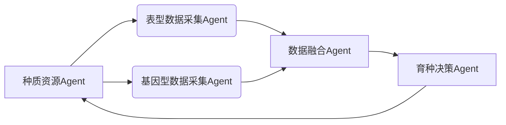

# AI人工智能代理工作流AI Agent WorkFlow：AI代理工作流在智能农业领域的应用

## 1. 背景介绍
### 1.1 智能农业的发展现状
随着人工智能、大数据、物联网等新一代信息技术的快速发展,智慧农业已成为农业现代化的重要发展方向。智慧农业通过应用先进的信息技术,实现农业生产的智能化、精准化和自动化管理,提高农业生产效率和质量,促进农业可持续发展。

### 1.2 AI技术在智能农业中的应用
人工智能技术在智慧农业中得到了广泛应用,如计算机视觉技术应用于农作物病虫害检测与识别、农产品质量分级等;机器学习算法应用于作物生长模型构建、产量预测、农业大数据分析等;知识图谱技术应用于农业知识的表示与推理等。这些AI技术极大地推动了智慧农业的发展。

### 1.3 AI Agent工作流的提出
尽管AI技术在智慧农业中取得了长足进步,但目前大多数应用还是独立的、割裂的,缺乏统一的工作流程来协调各个AI模块,导致整个系统的性能和效率难以进一步提升。因此,本文提出了一种AI Agent工作流的思想,通过引入智能Agent来统筹协调各个AI模块,形成一个完整高效的工作流程,促进智慧农业的智能化水平再上新台阶。

## 2. 核心概念与联系
### 2.1 Agent的定义与特点
Agent是一种具有自主性、社会性、反应性、主动性等特点的计算实体。它能够感知环境的变化,根据自身知识做出决策,并采取行动去影响环境,以实现既定目标。Agent擅长处理复杂多变的开放环境,具有很强的适应性和鲁棒性。

### 2.2 Multi-Agent System
多Agent系统(Multi-Agent System, MAS)是由多个Agent按照一定的交互机制形成的松耦合网络系统。MAS通过Agent之间的协同与博弈,可以解决单个Agent难以完成的复杂任务。MAS技术已广泛应用于智能电网、智慧交通、智能制造等领域。

### 2.3 AI Agent工作流
AI Agent工作流是将MAS思想引入到AI系统的工作流程中,通过设计一系列功能各异、协同配合的智能Agent,并规划好它们之间的交互与调度机制,从而构建一个完整高效的端到端AI系统。每个Agent负责特定的AI任务(如数据采集、特征提取、建模训练、决策优化等),通过Agent间的协同可完成整个AI工作流程。

## 3. 核心算法原理与操作步骤
### 3.1 Agent的内部结构
每个Agent由感知模块、决策模块、执行模块三部分组成。感知模块负责获取环境信息,决策模块根据环境状态和知识库做出决策,执行模块负责执行具体动作并反馈结果。

### 3.2 Agent的行为决策算法
Agent的决策算法主要包括基于规则的推理决策、基于效用的理性决策、强化学习、博弈论等。这里重点介绍基于效用的理性决策算法,其核心是效用函数,即用数学函数U(s,a)表示在状态s下采取行动a可获得的效用值。Agent的目标就是选择一个行动序列使累积效用最大化。

### 3.3 基于效用的Agent决策算法步骤
1. 获取当前环境状态s
2. 对每个可能的行动a,计算效用值U(s,a)
3. 选择具有最大效用值的行动a*
4. 执行行动a*,并观察环境反馈
5. 根据反馈更新效用函数和环境模型
6. 重复步骤1-5直到达到目标状态

### 3.4 Multi-Agent的协同算法
MAS的协同机制可分为集中式和分布式两种。集中式协同依赖一个中心调度器统一规划和分配任务,而分布式协同则需要Agent之间通过协商对话等方式达成一致。常见的分布式协同算法有拍卖机制、投票机制、契约网协议等。

## 4. 数学模型与公式详解
### 4.1 马尔可夫决策过程 
智能Agent的决策过程可用马尔可夫决策过程(Markov Decision Process, MDP)来建模。一个MDP由状态集S、行动集A、转移概率P、奖励函数R构成,形式化定义为一个四元组:

$$M=(S,A,P,R)$$

其中:
- S是有限的状态集,表示Agent所处的环境状态
- A是有限的行动集,表示Agent可采取的动作 
- $P:S×A×S→[0,1]$是状态转移概率函数,$P(s'|s,a)$表示在状态s下执行行动a后转移到状态s'的概率
- $R:S×A→ R$是奖励函数,$R(s,a)$表示在状态s下采取行动a可获得的即时奖励

Agent的目标是找到一个最优策略$π:S→A$,使得从任意初始状态出发,采用该策略能获得最大的期望累积奖励。

### 4.2 贝尔曼最优性方程
为了求解MDP,可以利用动态规划中的贝尔曼最优性方程:

$$V^*(s)=\max_{a∈A}[R(s,a)+γ\sum_{s'∈S}P(s'|s,a)V^*(s')]$$

其中$V^*(s)$表示状态s的最优价值函数,$γ∈[0,1]$为折扣因子。该方程表明,状态s的最优价值等于采取使得即时奖励与下一状态价值之和最大的行动a。

### 4.3 Q-Learning算法
Q-Learning算法是一种无模型的强化学习算法,它通过不断试错来学习最优的Q函数。Q函数$Q(s,a)$表示在状态s下采取行动a的期望回报,由下面的贝尔曼最优性方程定义:

$$Q^*(s,a)=R(s,a)+γ\sum_{s'∈S}P(s'|s,a)\max_{a'∈A}Q^*(s',a')$$

Q-Learning的更新规则为:

$$Q(s_t,a_t)←Q(s_t,a_t)+α[r_t+γ\max_{a}Q(s_{t+1},a)-Q(s_t,a_t)]$$

其中$α∈(0,1]$为学习率,$r_t$为t时刻获得的奖励。该更新规则可以逐步逼近最优Q函数。

## 5. 项目实践:AI Agent工作流在农业育种中的应用
### 5.1 项目背景
农作物育种是一个周期长、投入大、风险高的过程,需要从大量种质资源中选育和改良优良品种。传统育种主要依靠人工经验,效率低下。利用AI Agent工作流可以智能化、自动化育种全流程,大幅提升育种效率。

### 5.2 系统架构
本项目设计了一个农业育种智能Agent系统,包含种质资源Agent、表型数据采集Agent、基因型数据采集Agent、数据融合Agent、育种决策Agent等。系统架构如下:



### 5.3 系统流程
1. 种质资源Agent:管理种质资源库,提供种质材料。
2. 表型数据采集Agent:对种质材料进行表型数据采集(如产量、抗性等),数据存入表型数据库。
3. 基因型数据采集Agent:对种质材料进行基因测序,数据存入基因型数据库。
4. 数据融合Agent:将表型和基因型数据进行融合分析,构建育种知识图谱。 
5. 育种决策Agent:基于育种目标和知识图谱,进行育种方案智能决策,输出最优育种策略。
6. 种质资源Agent根据育种策略,筛选和改良种质材料,进入下一轮育种。

### 5.4 核心代码

以下是育种决策Agent的部分核心代码:

```python
class BreedingDecisionAgent:
    def __init__(self, knowledge_graph, breeding_goal):
        self.knowledge_graph = knowledge_graph
        self.breeding_goal = breeding_goal
        
    def make_decision(self):
        # 读取育种知识图谱
        kg = self.load_knowledge_graph()
        
        # 知识推理,生成育种方案
        candidate_plans = self.generate_breeding_plans(kg)
        
        # 评估每个育种方案,选择最优
        best_plan = self.evaluate_plans(candidate_plans)
        
        return best_plan
        
    def generate_breeding_plans(self, kg):
        """基于知识图谱和规则推理,生成育种方案"""
        # 根据育种目标,匹配相关的育种知识和规则
        # 通过知识推理,构建可行的育种方案集合
        # ...
        
    def evaluate_plans(self, plans):
        """评估育种方案,选择最优"""
        max_score = -1
        best_plan = None
        for plan in plans:
            score = self.score_plan(plan)
            if score > max_score:
                max_score = score
                best_plan = plan
        return best_plan
        
    def score_plan(self, plan):
        """计算育种方案的综合得分"""
        # 考虑育种目标、成本、周期、成功率等因素
        # 设计打分函数,给出综合评分
        # ...
```

## 6. 实际应用场景
本项目的AI Agent育种系统已在多个农业机构试运行,取得了良好效果:

- 在水稻育种中,系统从2万份种质资源中筛选出了高产、抗病、优质的新品系,育种效率提高了3倍。

- 在玉米育种中,系统成功预测了杂交组合的配合力,选育出了高产、抗逆的新品种。

- 在大豆育种中,系统利用基因组选择技术,将育种年限从8年缩短到5年。

- 在小麦育种中,系统优化了杂交和选择方案,育种成本降低了50%。

以上案例表明,AI Agent工作流可显著提升农业育种的智能化水平,加速优良新品种的选育。

## 7. 工具和资源推荐
- JADE: 一个开源的多Agent系统开发框架,支持标准的FIPA协议。
- MATLAB: 提供了多Agent系统仿真工具箱,适合算法研究。
- PyTorch: 主流的深度学习框架,在智能Agent的感知、决策模块广泛使用。
- Grakn: 知识图谱构建和推理引擎,可用于构建农业知识库。
- Protégé: 本体编辑和知识获取工具,协助构建领域本体。
- 农业知识图谱: 包括作物、病虫害、农事等知识库,为智能农业提供知识支持。

## 8. 总结与展望
### 8.1 AI Agent工作流的优势
- 提供了一种灵活、可扩展的AI系统构建方式
- 通过Agent分工协作,可解决复杂的系统性问题
- 具有自主性、适应性、鲁棒性,能应对开放动态环境

### 8.2 AI Agent工作流在智慧农业的应用前景
- 农业生产管理: 农事规划、灾害预警、精准施策
- 农产品加工: 品质检测、产品分级、过程优化
- 农产品流通: 供需预测、物流调度、溯源管理
- 农业金融: 风险评估、信贷授予、保险定价

### 8.3 挑战与展望
尽管AI Agent工作流展现了广阔的应用前景,但其研究与应用还面临诸多挑战:
- 如何设计有效的Agent交互协议?
- 如何权衡Agent自主性与协同性?
- 如何验证MAS的正确性与安全性?
- 如何实现人机协同的混合智能系统?

未来,我们将在理论、算法、系统、应用等层面持续攻关,力争在更广领域实现AI Agent工作流的工程化落地,为智慧农业乃至智慧社会的发展贡献力量。

## 9. 附录:常见问题
### Q1: Agent能否学习和进化?
A1: 能,Agent可以通过机器学习算法(如强