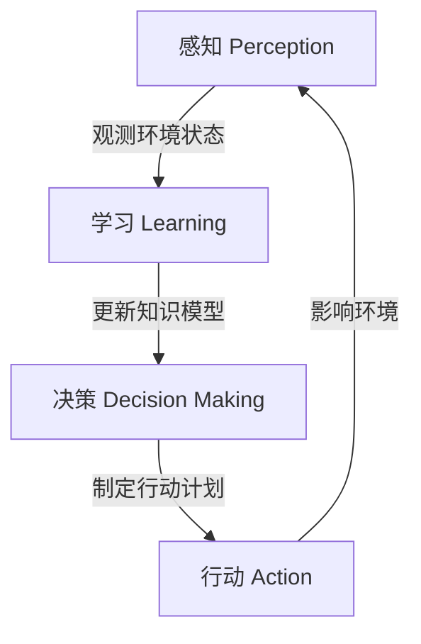

# AI人工智能代理工作流 AI Agent WorkFlow：学习与适应的算法框架

## 1.背景介绍

### 1.1 人工智能代理的重要性

在当今快速发展的数字时代,人工智能(AI)技术已经渗透到各个领域,成为推动创新和效率的关键驱动力。作为人工智能系统的核心组成部分,智能代理(Intelligent Agent)扮演着至关重要的角色。它们是自主的软件实体,能够感知环境、处理信息、做出决策并采取行动,以实现预定的目标。

智能代理广泛应用于各种场景,如机器人控制、游戏AI、个人助理、自动驾驶汽车等。它们需要具备学习和适应能力,以便根据动态环境做出智能响应。因此,设计高效、可靠的AI代理工作流程至关重要,以确保代理能够有效地学习、决策和执行任务。

### 1.2 AI代理工作流的挑战

尽管AI代理具有巨大的潜力,但在实现高度智能和自主性的过程中,仍然面临着诸多挑战:

1. **环境复杂性**: 真实世界环境通常是高度动态和不确定的,代理需要能够处理各种意外情况和变化。
2. **知识表示**: 如何有效地表示和组织代理所需的知识,以支持决策和学习过程。
3. **学习效率**: 代理需要从有限的经验中快速学习,并能够泛化到新的情况。
4. **决策制定**: 在动态环境中做出最优决策,权衡多个目标和约束条件。
5. **行为规划**: 将高层次决策转化为一系列可执行的低层次行动。
6. **交互和协作**: 代理需要与人类或其他代理进行有效的交互和协作。

### 1.3 本文主旨

本文将介绍一种综合性的AI代理工作流算法框架,旨在解决上述挑战。该框架将学习、决策和执行过程有机地结合在一起,使代理能够在动态环境中高效地学习和适应。我们将探讨该框架的核心概念、算法原理、数学模型,并通过实例和应用场景说明其实现和应用。

## 2.核心概念与联系

### 2.1 AI代理工作流概述

AI代理工作流是一个循环过程,包括感知(Perception)、学习(Learning)、决策(Decision Making)和行动(Action)四个关键阶段,如下图所示:



1. **感知(Perception)**: 代理从环境中获取观测数据,如视觉、声音、传感器读数等。
2. **学习(Learning)**: 基于观测数据和过去的经验,代理更新其内部知识模型,提高对环境的理解。
3. **决策(Decision Making)**: 根据当前知识模型和目标,代理制定行动计划。
4. **行动(Action)**: 代理执行行动计划,影响环境的状态。

这个循环持续进行,代理通过不断学习和适应来提高其智能水平。

### 2.2 关键模块

为了实现高效的AI代理工作流,我们需要设计以下几个关键模块:

1. **知识表示模块**: 用于表示和组织代理的知识,包括环境模型、任务模型和规划模型等。
2. **学习模块**: 负责从观测数据和经验中学习,更新知识模型。
3. **决策模块**: 根据知识模型和目标,制定行动计划。
4. **执行模块**: 将决策转化为具体的行动序列,并在环境中执行。
5. **交互模块**: 支持代理与人类或其他代理进行交互和协作。

这些模块相互协作,共同驱动AI代理工作流的运行。

## 3.核心算法原理具体操作步骤  

### 3.1 知识表示

知识表示是AI代理工作流的基础。我们采用基于概率的表示方法,使用贝叶斯网络(Bayesian Network)来建模环境、任务和规划过程。

贝叶斯网络是一种基于概率论的图形模型,由节点(表示随机变量)和有向边(表示条件概率关系)组成。它能够有效地捕捉变量之间的因果关系和不确定性。

在我们的框架中,贝叶斯网络用于表示以下几个关键模型:

1. **环境模型**: 描述环境状态及其转换规律。
2. **任务模型**: 表示代理的目标和约束条件。
3. **规划模型**: 捕捉行动序列与结果之间的关系。

通过这些模型的相互作用,代理可以推理出在特定环境状态下采取何种行动最有利于实现目标。

### 3.2 学习算法

学习模块的核心是从观测数据和经验中更新贝叶斯网络模型的参数,提高模型的准确性。我们采用了两种主要的学习算法:

1. **参数学习**: 使用期望最大化(EM)算法来估计贝叶斯网络中的条件概率参数。
2. **结构学习**: 通过约束基于得分的搜索算法(如GES、MCMC等)来学习网络结构。

参数学习用于根据新的观测数据来调整现有模型的参数,而结构学习则在没有先验结构知识的情况下,从数据中发现变量之间的依赖关系。

此外,我们还采用了基于经验的学习方法,如强化学习、案例库学习等,来增强代理的决策和规划能力。

### 3.3 决策算法

决策模块需要根据当前知识模型和目标,制定出最优的行动计划。我们采用了基于效用的决策理论方法,将问题建模为马尔可夫决策过程(MDP)或部分可观测马尔可夫决策过程(POMDP)。

在MDP中,代理需要选择一系列行动来最大化预期效用(如奖励之和)。我们使用了基于价值迭代和策略迭代的经典动态规划算法,如价值迭代、策略迭代、Q-Learning等。

对于部分可观测的情况(POMDP),代理无法直接获取环境的完整状态,需要基于观测序列来估计隐藏状态。我们采用了基于点估计的算法(如QMDP、PBVI等)和基于采样的蒙特卡罗方法(如PBSM、PERSEUS等)。

此外,我们还引入了启发式搜索算法(如A*、AO*等)和基于案例的规划方法,以提高决策效率和鲁棒性。

### 3.4 执行与监控

执行模块负责将决策转化为具体的行动序列,并在环境中执行。我们采用了分层规划和行动调度的方法,将高层次的决策分解为一系列低层次的原子行动。

在执行过程中,代理需要持续监控环境状态和行动效果,以检测和处理意外情况。我们使用了基于模型的执行监控和基于学习的异常检测方法,当检测到偏差时,代理可以重新规划或调整行动。

此外,我们还引入了反馈机制,将执行结果作为新的观测数据输入到学习模块,以不断改进知识模型。

## 4.数学模型和公式详细讲解举例说明

在本节中,我们将详细介绍AI代理工作流框架中使用的一些关键数学模型和公式。

### 4.1 贝叶斯网络

贝叶斯网络是一种基于概率论的图形模型,用于表示随机变量之间的条件独立性和因果关系。它由一个有向无环图(DAG)和一组条件概率分布(CPD)组成。

对于一个包含n个节点的贝叶斯网络,我们可以使用链式法则来计算联合概率分布:

$$P(X_1, X_2, \dots, X_n) = \prod_{i=1}^n P(X_i | \text{Parents}(X_i))$$

其中,$ \text{Parents}(X_i) $表示节点$X_i$的父节点集合。

在学习过程中,我们需要估计每个节点的条件概率分布(CPD)参数。对于离散变量,我们可以使用多项式分布;对于连续变量,我们可以使用高斯分布或其他合适的分布。

例如,对于一个包含两个离散变量$X$和$Y$的简单贝叶斯网络,其CPD可以表示为:

$$P(X) = \theta_X$$
$$P(Y|X) = \theta_{Y|X}$$

其中,$\theta_X$和$\theta_{Y|X}$是需要从数据中估计的参数。

### 4.2 马尔可夫决策过程(MDP)

马尔可夫决策过程(MDP)是一种用于建模序列决策问题的数学框架。它由一组状态$S$、一组行动$A$、状态转移概率$P(s'|s,a)$和奖励函数$R(s,a,s')$组成。

在MDP中,代理的目标是找到一个策略$\pi: S \rightarrow A$,使得预期总奖励最大化:

$$\max_\pi \mathbb{E}\left[ \sum_{t=0}^\infty \gamma^t R(s_t, a_t, s_{t+1}) \right]$$

其中,$\gamma \in [0,1)$是折现因子,用于权衡即时奖励和长期奖励。

我们可以使用价值函数$V^\pi(s)$来表示在状态$s$下,按照策略$\pi$执行所能获得的预期总奖励:

$$V^\pi(s) = \mathbb{E}_\pi \left[ \sum_{t=0}^\infty \gamma^t R(s_t, a_t, s_{t+1}) | s_0 = s \right]$$

同样,我们也可以定义状态-行动值函数$Q^\pi(s,a)$,表示在状态$s$下采取行动$a$,之后按照策略$\pi$执行所能获得的预期总奖励。

通过求解Bellman方程,我们可以找到最优策略$\pi^*$及其对应的最优值函数$V^*(s)$和$Q^*(s,a)$。

### 4.3 部分可观测马尔可夫决策过程(POMDP)

在现实环境中,代理通常无法获取环境的完整状态信息,只能依赖于部分观测。这种情况可以用部分可观测马尔可夫决策过程(POMDP)来建模。

POMDP由一组状态$S$、一组行动$A$、一组观测$O$、状态转移概率$P(s'|s,a)$、观测概率$P(o|s',a)$和奖励函数$R(s,a)$组成。

与MDP不同,POMDP中代理无法直接获取当前状态$s_t$,只能观测到$o_t$。因此,代理需要维护一个belief状态$b_t$,表示对当前状态的概率分布估计:

$$b_t(s) = P(s_t = s | o_1, o_2, \dots, o_t, a_1, a_2, \dots, a_{t-1})$$

在POMDP中,代理的目标是找到一个策略$\pi: \mathcal{B} \rightarrow A$,将belief状态映射到行动,以最大化预期总奖励:

$$\max_\pi \mathbb{E}\left[ \sum_{t=0}^\infty \gamma^t R(b_t, a_t) \right]$$

其中,$R(b_t, a_t) = \sum_{s \in S} b_t(s) R(s, a_t)$是在belief状态$b_t$下采取行动$a_t$的预期即时奖励。

解决POMDP问题的一种常用方法是通过值迭代算法,如PBVI(Point-Based Value Iteration)和PERSEUS等。

### 4.4 案例

让我们考虑一个简单的机器人导航任务,其中机器人需要在一个二维网格世界中从起点导航到目标点。

我们可以使用以下状态变量来建模这个问题:

- $X$和$Y$: 机器人在网格中的坐标位置
- $G_x$和$G_y$: 目标点的坐标位置
- $O$: 机器人的方向(上/下/左/右)

机器人可以执行以下行动:

- 前进一步
- 左转90度
- 右转90度

我们可以使用一个简单的贝叶斯网络来表示环境模型,如下所示:

```mermaid
graph LR