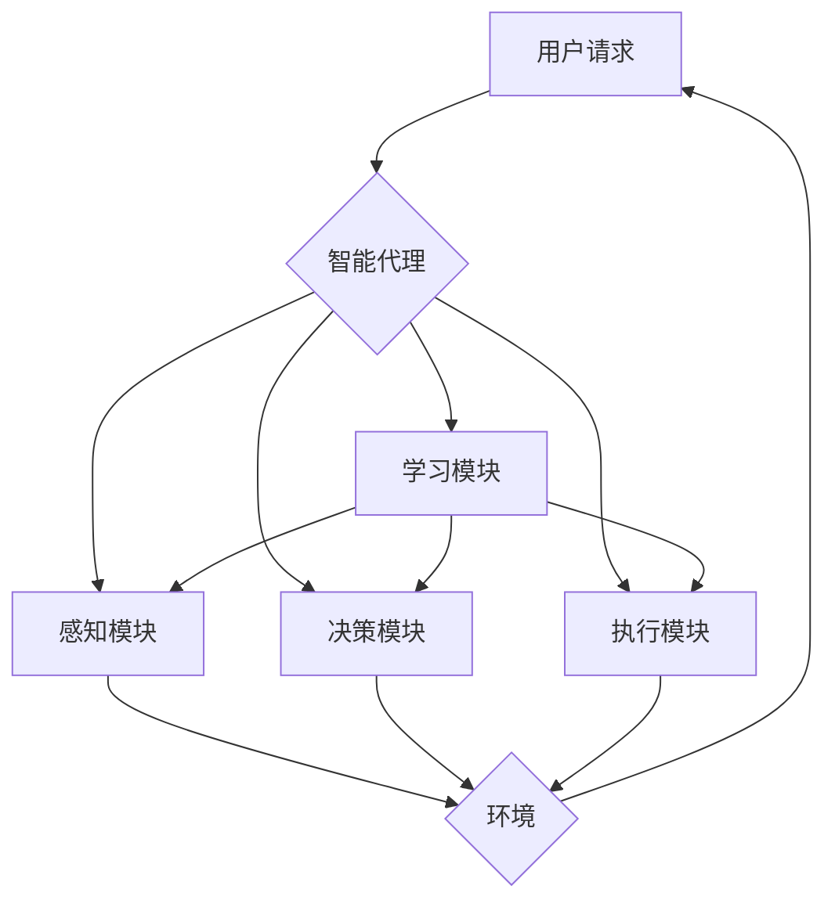

# AI人工智能代理工作流AI Agent WorkFlow：智能代理在公共服务系统中的应用

## 1. 背景介绍

随着人工智能技术的飞速发展，智能代理(Intelligent Agent)在各个领域得到了广泛应用。特别是在公共服务系统中，引入智能代理可以大大提升服务效率和质量，为民众提供更加智能化、个性化的服务体验。本文将深入探讨AI人工智能代理工作流在公共服务系统中的应用，阐述其核心概念、关键技术、实践案例以及未来发展趋势与挑战。

### 1.1 智能代理的定义与特点
#### 1.1.1 智能代理的定义
#### 1.1.2 智能代理的主要特点
#### 1.1.3 智能代理与传统软件系统的区别

### 1.2 公共服务系统的现状与挑战
#### 1.2.1 公共服务系统的概念与范畴  
#### 1.2.2 传统公共服务系统面临的问题
#### 1.2.3 智能化转型的必要性

### 1.3 智能代理在公共服务系统中的应用前景
#### 1.3.1 提升服务效率与质量
#### 1.3.2 实现个性化、精准化服务
#### 1.3.3 降低运营成本

## 2. 核心概念与联系

### 2.1 智能代理的组成要素
#### 2.1.1 感知模块
#### 2.1.2 决策模块 
#### 2.1.3 执行模块
#### 2.1.4 学习模块

### 2.2 多智能代理系统
#### 2.2.1 多智能代理系统的定义
#### 2.2.2 多智能代理系统的优势
#### 2.2.3 多智能代理系统的协同机制

### 2.3 AI Agent WorkFlow
#### 2.3.1 AI Agent WorkFlow的定义
#### 2.3.2 AI Agent WorkFlow的关键要素
#### 2.3.3 AI Agent WorkFlow的设计原则

下面是AI Agent WorkFlow的核心概念原理架构图（使用Mermaid绘制）：



## 3. 核心算法原理具体操作步骤

### 3.1 智能代理的感知算法
#### 3.1.1 基于规则的感知算法
#### 3.1.2 基于机器学习的感知算法
#### 3.1.3 感知信息的预处理

### 3.2 智能代理的决策算法
#### 3.2.1 基于规则的决策算法
#### 3.2.2 基于强化学习的决策算法 
#### 3.2.3 多智能代理的协同决策算法

### 3.3 智能代理的执行算法
#### 3.3.1 任务分解与规划
#### 3.3.2 路径规划与导航
#### 3.3.3 动作控制与反馈

### 3.4 智能代理的学习算法  
#### 3.4.1 监督学习算法
#### 3.4.2 无监督学习算法
#### 3.4.3 强化学习算法

## 4. 数学模型和公式详细讲解举例说明

### 4.1 马尔可夫决策过程(MDP)
马尔可夫决策过程是强化学习的重要理论基础，用于为智能代理的决策提供数学模型。一个MDP由状态集合$S$、动作集合$A$、转移概率$P$和奖励函数$R$组成，可以表示为一个四元组：

$$MDP=<S,A,P,R>$$

其中，$P$表示状态转移概率，$P(s'|s,a)$表示在状态$s$下执行动作$a$后转移到状态$s'$的概率；$R$表示奖励函数，$R(s,a)$表示在状态$s$下执行动作$a$获得的即时奖励。

智能代理的目标是最大化长期累积奖励，即找到最优策略$\pi^*$：

$$\pi^*=\arg\max_{\pi} E[\sum_{t=0}^{\infty}\gamma^t R(s_t,a_t)]$$

其中，$\gamma \in [0,1]$为折扣因子，用于平衡即时奖励和长期奖励。

### 4.2 Q-Learning算法
Q-Learning是一种常用的无模型强化学习算法，用于估计状态-动作值函数$Q(s,a)$。Q-Learning的更新规则如下：

$$Q(s_t,a_t) \leftarrow Q(s_t,a_t)+\alpha[r_{t+1}+\gamma \max_a Q(s_{t+1},a)-Q(s_t,a_t)]$$

其中，$\alpha \in (0,1]$为学习率，控制每次更新的步长；$r_{t+1}$为在状态$s_t$下执行动作$a_t$后获得的即时奖励；$\max_a Q(s_{t+1},a)$为下一状态$s_{t+1}$下的最大Q值。

通过不断迭代更新Q值，智能代理最终可以收敛到最优策略。在实际应用中，常采用 $\epsilon$-贪婪策略进行探索，以平衡探索和利用。

### 4.3 深度强化学习算法
传统的Q-Learning在状态空间和动作空间较大时面临维度灾难问题。深度强化学习通过引入深度神经网络来逼近Q函数，有效解决了这一问题。常用的深度强化学习算法包括DQN、DDPG、A3C等。

以DQN为例，其核心思想是使用深度神经网络$Q(s,a;\theta)$来逼近Q函数，损失函数定义为：

$$L(\theta)=E[(r+\gamma \max_{a'}Q(s',a';\theta^-)-Q(s,a;\theta))^2]$$

其中，$\theta^-$为目标网络的参数，用于计算TD目标。通过最小化损失函数，不断更新$Q$网络的参数$\theta$，最终得到最优策略。

## 5. 项目实践：代码实例和详细解释说明

下面以Python语言为例，给出基于Q-Learning的智能代理决策模块的简要实现：

```python
import numpy as np

class QLearningAgent:
    def __init__(self, state_size, action_size, learning_rate=0.1, discount_factor=0.9, epsilon=0.1):
        self.state_size = state_size
        self.action_size = action_size
        self.learning_rate = learning_rate
        self.discount_factor = discount_factor
        self.epsilon = epsilon
        self.q_table = np.zeros((state_size, action_size))

    def choose_action(self, state):
        if np.random.uniform() < self.epsilon:
            action = np.random.choice(self.action_size)
        else:
            action = np.argmax(self.q_table[state])
        return action

    def learn(self, state, action, reward, next_state):
        q_predict = self.q_table[state, action]
        q_target = reward + self.discount_factor * np.max(self.q_table[next_state])
        self.q_table[state, action] += self.learning_rate * (q_target - q_predict)
```

上述代码实现了一个基于Q-Learning的智能代理，主要包括以下几个部分：

1. 初始化函数`__init__`，用于设置状态空间大小、动作空间大小、学习率、折扣因子和探索率等参数，并初始化Q表。

2. 动作选择函数`choose_action`，根据当前状态和 $\epsilon$-贪婪策略选择动作，以平衡探索和利用。

3. 学习函数`learn`，根据当前状态、动作、奖励和下一状态，利用Q-Learning的更新规则更新Q表，不断优化策略。

在实际应用中，可以根据具体问题的特点，对上述代码进行适当修改和扩展，如引入深度神经网络、优化探索策略等，以进一步提升智能代理的决策性能。

## 6. 实际应用场景

智能代理在公共服务系统中有广泛的应用前景，下面列举几个典型场景：

### 6.1 智能客服系统
传统的客服系统往往需要大量人工坐席，响应时间长、服务质量参差不齐。引入智能代理后，可以实现7x24小时不间断服务，通过自然语言处理、知识图谱等技术，快速准确地理解用户需求，提供个性化的解答和服务，大大提升用户体验。

### 6.2 智慧政务平台
智慧政务平台通过引入智能代理，可以为民众提供更加便捷、高效的政务服务。智能代理可以根据用户的特点和需求，主动推荐相关政策和服务，引导用户办理各类业务，提高政务服务的精准度和覆盖面。

### 6.3 智能交通调度系统
在智能交通调度系统中，智能代理可以实时感知道路状况，优化调度策略，缓解交通拥堵，提高通行效率。多智能代理之间还可以协同工作，实现区域内的全局优化，为出行者提供更加舒适、便捷的交通服务。

### 6.4 智慧医疗平台
智慧医疗平台中的智能代理可以为患者提供智能导诊、在线问诊等服务，初步判断病情，给出就医建议。同时还可以协助医生进行辅助诊断，提供个性化的治疗方案，提高医疗服务的效率和质量。

## 7. 工具和资源推荐

### 7.1 开发工具
- Python: 主流的人工智能编程语言，生态系统丰富，适合智能代理的开发。
- JADE: 一个开源的多智能代理开发框架，提供了灵活的通信和协同机制。
- TensorFlow: 由Google开发的端到端开源机器学习平台，支持各种深度学习模型的构建和训练。

### 7.2 学习资源
- 《人工智能：一种现代的方法》：经典的人工智能教材，系统介绍了智能代理的相关理论和方法。
- 《深度强化学习》：深入探讨深度强化学习的理论基础和前沿进展，适合有一定基础的读者。
- 《多智能体系统》：系统介绍了多智能体系统的基本概念、理论和应用，是学习多智能代理的入门佳作。

### 7.3 开放数据集
- 智能客服对话数据集：包含大量真实的用户-客服对话数据，可用于训练智能客服代理。
- 交通轨迹数据集：包含出租车、公交车等交通工具的历史轨迹数据，可用于训练智能交通调度代理。
- 电子病历数据集：包含大量去隐私化的电子病历数据，可用于训练智能医疗代理。

## 8. 总结：未来发展趋势与挑战

AI人工智能代理工作流在公共服务系统中展现出广阔的应用前景，未来的发展趋势主要体现在以下几个方面：

### 8.1 智能代理的通用化
目前的智能代理大多针对特定领域和任务进行设计，通用性不足。未来将致力于研究更加通用的智能代理架构和算法，实现跨领域、跨任务的灵活应用。

### 8.2 多模态感知与决策
传统智能代理主要基于单一模态（如文本）进行感知和决策，难以全面理解用户需求。融合语音、视觉、触觉等多种模态信息，有助于智能代理做出更加准确、合理的判断。

### 8.3 群体智能协同
随着智能代理数量的增加，单个智能代理的能力有限，需要多个智能代理协同工作，发挥群体智能。研究智能代理间的通信、协商与合作机制，构建高效的群智系统，将是未来的重要方向。

### 8.4 安全与隐私保护
智能代理需要收集和处理大量用户数据，可能涉及用户隐私和数据安全问题。如何在保证服务质量的同时，最大限度保护用户隐私，是智能代理发展过程中必须面对的挑战。

### 8.5 人机协作与共生
智能代理并非要取代人类，而是要与人类和谐共处、协同工作。如何设计更加自然、友好的人机交互方式，构建人机协作与共生的生态系统，将是未来的一个重要课题。

## 9. 附录：常见问题与解答

### 9.1 智能代理和传统软件系