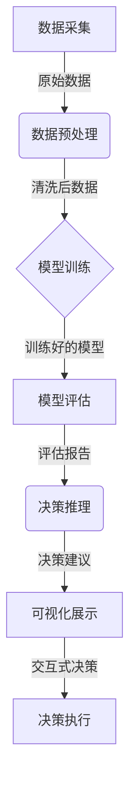

# AI人工智能代理工作流AI Agent Workflow：智能代理在决策支持系统中的应用

## 1.背景介绍

### 1.1 决策支持系统概述

在当今瞬息万变的商业环境中,企业和组织面临着越来越多的复杂决策。为了做出明智的决策,需要收集和分析大量信息,并权衡各种因素和风险。这就是决策支持系统(Decision Support Systems, DSS)应运而生的原因。

决策支持系统是一种基于计算机的信息系统,旨在帮助决策者收集、组织和分析与决策相关的数据,从而提高决策的质量和效率。它通过整合数据、模型和分析工具,为决策者提供必要的信息支持,帮助他们更好地理解问题、评估备选方案并做出最佳决策。

### 1.2 智能代理的兴起

随着人工智能(AI)和机器学习(ML)技术的不断发展,智能代理(Intelligent Agents)开始在决策支持系统中发挥越来越重要的作用。智能代理是一种具有自主性、响应性、主动性和持续性的软件实体,能够感知环境、处理信息、推理决策并执行行动。

智能代理可以通过自动化的方式收集和处理大量数据,并利用机器学习算法从中发现隐藏的模式和洞察。它们还可以模拟人类决策过程,评估备选方案并提供建议,从而协助决策者做出更加明智的决策。

### 1.3 AI代理工作流的重要性

在决策支持系统中,智能代理通常需要执行一系列复杂的任务,如数据采集、数据预处理、模型训练、模型评估、决策推理等。为了确保这些任务能够高效、协调地执行,需要设计一个合理的AI代理工作流(AI Agent Workflow)。

AI代理工作流定义了智能代理在决策支持系统中的行为和交互模式,规范了各个任务的执行顺序和依赖关系。它不仅有助于提高系统的效率和可靠性,还能够促进不同组件之间的协作,实现更加智能化的决策支持。

## 2.核心概念与联系

### 2.1 智能代理

智能代理是一种自主的软件实体,能够感知环境、处理信息、推理决策并执行行动。它具有以下几个核心特征:

1. **自主性(Autonomy)**: 智能代理能够在一定程度上自主地做出决策和采取行动,而不需要人类的直接干预。
2. **响应性(Reactivity)**: 智能代理能够感知环境的变化,并及时做出相应的响应。
3. **主动性(Proactiveness)**: 智能代理不仅能够响应环境的变化,还能够根据自身的目标和知识主动采取行动。
4. **持续性(Continuity)**: 智能代理是一个持续运行的过程,能够持续地执行任务和维护自身的状态。

在决策支持系统中,智能代理通常扮演以下几个角色:

1. **数据采集代理**: 从各种数据源收集相关数据,进行数据清洗和预处理。
2. **模型训练代理**: 基于采集的数据训练机器学习模型,进行模型评估和优化。
3. **决策推理代理**: 利用训练好的模型对备选方案进行评估,提供决策建议。
4. **可视化代理**: 将分析结果以直观的方式呈现给决策者,支持交互式决策。

### 2.2 AI代理工作流

AI代理工作流定义了智能代理在决策支持系统中的行为和交互模式,规范了各个任务的执行顺序和依赖关系。它通常包括以下几个核心组成部分:

1. **任务(Tasks)**: 智能代理需要执行的具体任务,如数据采集、数据预处理、模型训练、模型评估、决策推理等。
2. **控制流(Control Flow)**: 定义任务之间的执行顺序和依赖关系,确保任务能够按照正确的顺序执行。
3. **数据流(Data Flow)**: 规定任务之间的数据传递方式,确保数据能够在不同任务之间顺利流转。
4. **错误处理(Error Handling)**: 处理任务执行过程中可能出现的异常和错误情况,确保系统的健壮性和可靠性。
5. **监控和日志(Monitoring and Logging)**: 监控任务的执行状态,记录相关日志信息,方便调试和优化。
6. **并行执行(Parallel Execution)**: 支持多个任务的并行执行,提高系统的效率和吞吐量。

合理设计AI代理工作流不仅能够提高决策支持系统的效率和可靠性,还能够促进不同组件之间的协作,实现更加智能化的决策支持。

### 2.3 Mermaid流程图

为了更好地理解AI代理工作流的概念,我们可以使用Mermaid流程图进行可视化表示。下面是一个简单的AI代理工作流示例:

在这个示例中,AI代理工作流包括以下几个主要任务:

1. 数据采集: 从各种数据源收集原始数据。
2. 数据预处理: 对原始数据进行清洗和转换,得到可用于模型训练的数据。
3. 模型训练: 基于清洗后的数据训练机器学习模型。
4. 模型评估: 对训练好的模型进行评估,生成评估报告。
5. 决策推理: 利用评估后的模型对备选方案进行评估,提供决策建议。
6. 可视化展示: 将决策建议以直观的方式呈现给决策者,支持交互式决策。
7. 决策执行: 根据决策者的选择执行相应的决策行动。

这个流程图清晰地展示了各个任务之间的执行顺序和数据依赖关系,有助于理解AI代理工作流的整体结构和运行机制。

## 3.核心算法原理具体操作步骤

在AI代理工作流中,各个任务通常会涉及多种算法和技术,下面我们将重点介绍其中几个核心算法的原理和具体操作步骤。

### 3.1 数据预处理算法

数据预处理是AI代理工作流中一个关键的环节,旨在从原始数据中提取出高质量的特征,为后续的模型训练和决策推理奠定基础。常见的数据预处理算法包括:

1. **缺失值处理**:
   - 删除含有缺失值的样本或特征
   - 使用均值/中位数/最频繁值等统计量填充缺失值
   - 使用机器学习模型(如K近邻、决策树等)预测缺失值

2. **异常值处理**:
   - 基于统计量(如3σ原则)识别并移除异常值
   - 使用分位数等健壮统计量替换异常值
   - 使用聚类算法(如DBSCAN)识别并处理异常值

3. **特征缩放**:
   - 最小-最大归一化(Min-Max Normalization)
   - 标准化(Standardization)
   - 对数变换(Log Transformation)

4. **特征编码**:
   - 一热编码(One-Hot Encoding)
   - 标签编码(Label Encoding)
   - 目标编码(Target Encoding)

5. **特征选择**:
   - 过滤式方法(如相关系数、卡方检验等)
   - 包裹式方法(如递归特征消除等)
   - 嵌入式方法(如LASSO回归等)

6. **特征构造**:
   - 多项式特征
   - 交互特征
   - 基于领域知识的特征衍生

数据预处理算法的具体操作步骤因算法而异,但通常包括以下几个步骤:

1. 数据加载和探索性分析
2. 确定预处理目标和方法
3. 实现预处理算法
4. 应用预处理算法转换数据
5. 评估预处理效果

### 3.2 模型训练算法

在AI代理工作流中,模型训练是一个核心环节,旨在基于预处理后的数据构建高质量的机器学习模型。常见的模型训练算法包括:

1. **监督学习算法**:
   - 线性模型(如线性回归、逻辑回归等)
   - 决策树模型(如决策树、随机森林等)
   - 支持向量机(SVM)
   - 神经网络(如多层感知机、卷积神经网络等)

2. **无监督学习算法**:
   - 聚类算法(如K-Means、层次聚类等)
   - 降维算法(如主成分分析、t-SNE等)
   - 关联规则挖掘
   - 主题模型(如潜在语义分析等)

3. **强化学习算法**:
   - 价值函数近似(如Q-Learning、Sarsa等)
   - 策略梯度方法(如策略梯度、Actor-Critic等)
   - 模型预测控制(如AlphaGo等)

4. **集成学习算法**:
   - boosting算法(如AdaBoost、梯度提升树等)
   - bagging算法(如随机森林、Bagging等)
   - stacking算法(如堆叠泛化等)

模型训练算法的具体操作步骤通常包括以下几个步骤:

1. 划分训练集、验证集和测试集
2. 选择合适的模型和超参数
3. 构建模型并进行训练
4. 在验证集上评估模型性能
5. 调整超参数并重复训练
6. 在测试集上评估最终模型性能

### 3.3 决策推理算法

决策推理是AI代理工作流中的另一个关键环节,旨在基于训练好的模型对备选方案进行评估,并提供决策建议。常见的决策推理算法包括:

1. **多准则决策分析(MCDA)**:
   - 加权求和模型(WSM)
   - 加权乘积模型(WPM)
   - analyticalhierarchyprocess(AHP)
   - analyticnetworkprocess(ANP)

2. **约束优化算法**:
   - 线性规划
   - 整数规划
   - 非线性规划
   - 动态规划

3. **启发式搜索算法**:
   - Hill Climbing
   - Simulated Annealing
   - Tabu Search
   - 遗传算法

4. **规则推理系统**:
   - 基于规则的专家系统
   - 案例推理
   - 模糊推理系统

5. **决策树算法**:
   - 分类和回归树(CART)
   - C4.5
   - ID3
   - 随机森林

决策推理算法的具体操作步骤通常包括以下几个步骤:

1. 定义决策目标和约束条件
2. 收集和准备相关数据
3. 选择合适的决策推理算法
4. 构建决策模型并进行推理
5. 评估备选方案并生成决策建议
6. 与决策者交互并执行决策

## 4.数学模型和公式详细讲解举例说明

在AI代理工作流中,数学模型和公式扮演着重要的角色,为各种算法和技术提供了理论基础。下面我们将详细讲解几个常见的数学模型和公式。

### 4.1 线性回归模型

线性回归是一种广泛应用的监督学习算法,旨在从数据中学习出目标变量和一个或多个自变量之间的线性关系。线性回归模型可以表示为:

$$y = \theta_0 + \theta_1x_1 + \theta_2x_2 + ... + \theta_nx_n + \epsilon$$

其中:
- $y$是目标变量
- $x_1, x_2, ..., x_n$是自变量
- $\theta_0, \theta_1, ..., \theta_n$是模型参数
- $\epsilon$是随机误差项

通常使用最小二乘法来估计模型参数,即最小化以下目标函数:

$$J(\theta) = \frac{1}{2m}\sum_{i=1}^m(h_\theta(x^{(i)}) - y^{(i)})^2$$

其中:
- $m$是训练样本数量
- $h_\theta(x^{(i)})$是模型对第$i$个样本的预测值
-