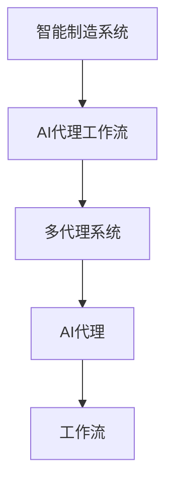

# AI人工智能代理工作流AI Agent WorkFlow：智能代理在工业制造系统中的应用

## 1.背景介绍

### 1.1 工业制造系统的挑战

在当今快节奏的工业制造环境中,企业面临着多重挑战。首先,市场需求的多样化和个性化要求制造商提供更加灵活和高效的生产线。其次,生产过程中存在着大量的复杂数据和信息,需要进行实时监控和智能分析,以确保产品质量和生产效率。此外,传统的制造系统往往缺乏智能化和自动化,导致效率低下,人工操作成本高昂。

### 1.2 人工智能在制造业的应用前景

人工智能(AI)技术的快速发展为解决上述挑战提供了新的契机。AI代理可以作为智能系统在制造环境中执行各种任务,包括数据采集、实时监控、决策优化、自动控制等。通过将AI代理集成到制造系统中,可以实现智能化、自动化和优化,从而提高生产效率、降低成本、提升产品质量。

### 1.3 AI代理工作流概述

AI代理工作流(AI Agent Workflow)是一种将AI技术应用于工业制造系统的方法。它包括多个AI代理协同工作,执行不同的任务,并通过有效的工作流程进行协调和管理。AI代理工作流可以实现端到端的智能制造,从原材料采购到产品交付,全程自动化和优化。

## 2.核心概念与联系

### 2.1 AI代理(AI Agent)

AI代理是一种基于AI技术的智能软件实体,能够感知环境、处理数据、做出决策并执行相应的行为。在制造系统中,AI代理可以部署在各个环节,如生产计划、质量检测、设备维护等,执行特定的任务。

### 2.2 智能制造系统(Intelligent Manufacturing System)

智能制造系统是一种集成了AI、物联网、大数据等先进技术的制造系统。它可以实现自动化、智能化和优化,提高生产效率和产品质量。AI代理工作流是实现智能制造系统的关键技术之一。

### 2.3 工作流(Workflow)

工作流是一系列有序的任务或活动,用于完成特定的业务目标。在AI代理工作流中,不同的AI代理执行不同的任务,并按照预定义的流程进行协调和管理。

### 2.4 多代理系统(Multi-Agent System)

多代理系统是由多个AI代理组成的分布式智能系统。每个代理都具有特定的功能和知识,通过协作和交互来解决复杂的问题。AI代理工作流实际上是一种特殊的多代理系统。

### 2.5 核心概念关系

AI代理是智能制造系统的基本单元,通过工作流的协调和管理,多个AI代理组成了多代理系统,共同实现了智能制造的目标。



## 3.核心算法原理具体操作步骤

AI代理工作流的核心算法原理包括以下几个方面:

### 3.1 AI代理决策算法

AI代理需要根据感知到的环境信息做出合理的决策,并执行相应的行为。常用的决策算法包括:

1. 规则推理算法:基于预定义的规则集进行推理决策。
2. 机器学习算法:通过训练数据建立决策模型,如决策树、神经网络等。
3. 强化学习算法:通过试错和奖惩机制,不断优化决策策略。

### 3.2 多代理协作算法

多个AI代理需要协调工作,完成复杂的任务。常用的协作算法包括:

1. 契约网协议(Contract Net Protocol):代理通过竞标的方式分配任务。
2. 分布式约束优化(Distributed Constraint Optimization):代理通过协商解决约束问题。
3. 拍卖算法(Auction Algorithms):代理通过竞价机制分配资源。

### 3.3 工作流管理算法

工作流管理算法负责协调和管理AI代理之间的任务流程,包括:

1. 工作流建模:使用工作流描述语言(如BPMN)定义流程模型。
2. 工作流执行:根据模型执行和监控工作流。
3. 工作流优化:通过机器学习等技术优化工作流性能。

### 3.4 算法具体操作步骤

1. 定义AI代理的功能和决策算法。
2. 构建多代理协作模型,设计协作算法。
3. 建立工作流模型,确定工作流管理算法。
4. 将AI代理、协作算法和工作流管理算法集成到制造系统中。
5. 收集数据,训练和优化AI模型。
6. 实时监控和调整工作流,确保系统高效运行。

## 4.数学模型和公式详细讲解举例说明

### 4.1 马尔可夫决策过程(MDP)

马尔可夫决策过程(Markov Decision Process, MDP)是强化学习中常用的数学模型,可以用于描述AI代理的决策问题。MDP由以下几个要素组成:

- 状态集合 $S$
- 行为集合 $A$
- 转移概率 $P(s'|s,a)$,表示在状态 $s$ 执行行为 $a$ 后,转移到状态 $s'$ 的概率
- 奖励函数 $R(s,a,s')$,表示在状态 $s$ 执行行为 $a$ 后,转移到状态 $s'$ 所获得的奖励

MDP的目标是找到一个最优策略 $\pi^*(s)$,使得期望累积奖励最大化:

$$\max_\pi \mathbb{E}\left[\sum_{t=0}^\infty \gamma^t R(s_t,a_t,s_{t+1})\right]$$

其中 $\gamma$ 是折现因子,用于平衡即时奖励和长期奖励。

### 4.2 Q-Learning算法

Q-Learning是一种常用的强化学习算法,可以用于求解MDP的最优策略。算法的核心思想是通过不断更新状态-行为值函数 $Q(s,a)$,逐步逼近最优值函数 $Q^*(s,a)$。

Q-Learning算法的更新规则为:

$$Q(s_t,a_t) \leftarrow Q(s_t,a_t) + \alpha \left[r_t + \gamma \max_{a'}Q(s_{t+1},a') - Q(s_t,a_t)\right]$$

其中 $\alpha$ 是学习率,控制更新幅度。

通过不断迭代更新,Q-Learning算法可以逐步找到最优策略 $\pi^*(s) = \arg\max_a Q^*(s,a)$。

### 4.3 契约网协议(Contract Net Protocol)

契约网协议是一种常用的多代理协作算法,可以用于任务分配和资源分配。算法的基本流程如下:

1. 管理者代理广播任务通知。
2. 参与者代理根据自身能力和资源情况,向管理者代理发送投标。
3. 管理者代理根据预定义的评估标准,选择最优投标者,并将任务分配给它。
4. 被选中的参与者代理执行任务,其他参与者代理继续等待新的任务通知。

契约网协议可以用数学模型进行形式化描述,并通过优化算法提高任务分配的效率和公平性。

### 4.4 工作流建模

工作流建模是将业务流程用形式化的语言描述出来,以便于执行和优化。常用的工作流描述语言包括:

- BPMN(Business Process Model and Notation):基于图形符号的工作流建模语言。
- BPEL(Business Process Execution Language):基于XML的可执行工作流语言。

工作流模型可以用图论进行数学表示,例如使用有向图 $G=(V,E)$ 表示工作流,其中 $V$ 是活动节点集合, $E$ 是控制流边集合。

通过图论算法和优化技术,可以对工作流模型进行分析和优化,提高工作流的效率和可靠性。

## 5.项目实践:代码实例和详细解释说明

以下是一个使用Python和RLlib库实现的Q-Learning算法示例,用于训练一个AI代理在简单的制造环境中优化生产计划。

```python
import gym
import numpy as np
from ray.rllib.agents.ppo import PPOTrainer

# 定义制造环境
class ManufacturingEnv(gym.Env):
    def __init__(self):
        self.state = 0  # 初始状态
        self.action_space = gym.spaces.Discrete(2)  # 动作空间(0:不生产, 1:生产)
        self.observation_space = gym.spaces.Discrete(10)  # 观测空间(0-9:库存水平)

    def reset(self):
        self.state = 0
        return self.state

    def step(self, action):
        # 执行动作
        if action == 1:
            self.state = min(self.state + 1, 9)  # 生产,库存上升
        else:
            self.state = max(self.state - 1, 0)  # 不生产,库存下降

        # 计算奖励
        if self.state == 4:  # 库存水平为4时,奖励最高
            reward = 1
        else:
            reward = -abs(self.state - 4) / 5  # 离目标越远,奖励越低

        done = False  # 该环境无终止状态
        return self.state, reward, done, {}

# 创建环境和代理
env = ManufacturingEnv()
agent = PPOTrainer(env=ManufacturingEnv)

# 训练代理
for _ in range(1000):
    agent.train()

# 测试代理
state = env.reset()
rewards = 0
for _ in range(100):
    action = agent.compute_action(state)
    state, reward, done, _ = env.step(action)
    rewards += reward

print(f"累积奖励: {rewards}")
```

上述代码定义了一个简单的制造环境 `ManufacturingEnv`。环境的状态表示当前库存水平(0-9),动作表示是否生产(0或1)。当库存水平为4时,奖励最高;离目标越远,奖励越低。

使用RLlib库中的PPOTrainer创建了一个强化学习代理,并在该环境中进行训练。经过1000次迭代后,代理已经学会了在该环境中获取较高的累积奖励。

该示例展示了如何使用强化学习算法训练AI代理,以优化制造系统中的决策过程。在实际应用中,环境和奖励函数会更加复杂,但基本思路是相似的。

## 6.实际应用场景

AI代理工作流在工业制造系统中有广泛的应用前景,包括但不限于以下几个场景:

### 6.1 智能生产计划与调度

AI代理可以根据市场需求、资源约束等因素,智能制定生产计划和调度方案。通过优化算法和机器学习模型,AI代理能够提高生产效率,降低浪费,实现精益生产。

### 6.2 预测性维护

利用传感器采集的设备数据,AI代理可以实时监测设备状态,预测潜在故障,并提前安排维护,避免设备突然停机造成的损失。这种预测性维护可以大幅提高设备利用率和生产线稳定性。

### 6.3 质量控制与缺陷检测

AI代理可以通过计算机视觉、图像处理等技术,实现自动化的质量检测和缺陷识别。这不仅提高了检测精度和效率,还减少了人工操作的成本和误差。

### 6.4 能源优化与节约

AI代理可以监测制造过程中的能源消耗,并优化能源利用策略,从而实现节能减排。同时,AI代理还可以优化供应链和物流,降低运输能耗。

### 6.5 人机协作

在一些需要人工参与的制造环节,AI代理可以与人类工人协作,提供智能辅助和决策支持。这种人机协作可以发挥人机各自的优势,提高工作效率和质量。

## 7.工具和资源推荐

在开发和部署AI代理工作流系统时,可以使用以下工具和资源:

### 7.1 AI开发框架

- TensorFlow: Google开源的机器学习框架,支持多种算法和模型。
- PyTorch: Facebook开源的机器学习框架,具有良好的Python集成性。
- RLlib: Ray项目中的强化学习库,支持多种算法和分布式训练。

### 