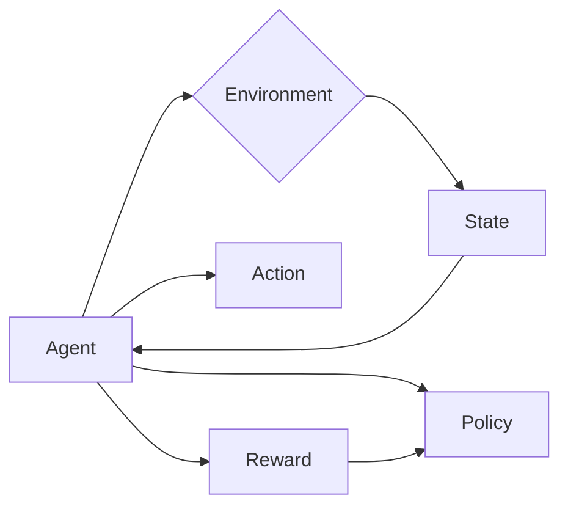
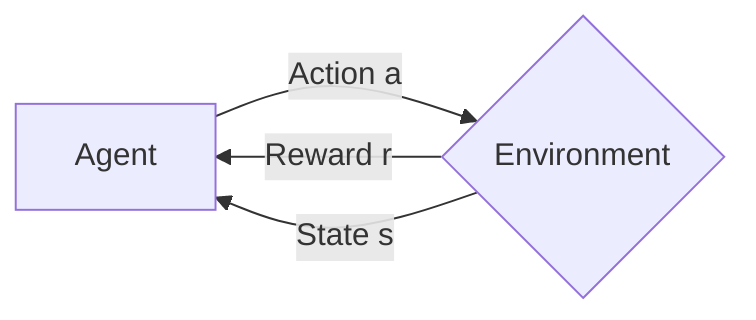

# AI人工智能代理工作流AI Agent WorkFlow：智能代理在行业研究系统中的应用

## 1. 背景介绍

人工智能（AI）技术的快速发展正在深刻影响着各行各业。在行业研究领域，AI技术的应用也日益广泛，特别是AI智能代理（Agent）在行业研究系统中的应用备受关注。AI智能代理能够模拟人类专家的分析和决策能力，通过对海量数据的挖掘和分析，为行业研究提供更加智能化、精准化的支持。

本文将重点探讨AI人工智能代理工作流（AI Agent Workflow）在行业研究系统中的应用。我们将从AI智能代理的核心概念出发，分析其内在联系，并重点阐述AI智能代理的工作流程和算法原理。同时，我们还将通过数学模型和代码实例，详细说明AI智能代理的实现过程。此外，本文还将讨论AI智能代理在实际行业研究场景中的应用，并提供相关的工具和资源推荐。最后，我们将展望AI智能代理技术的未来发展趋势和面临的挑战。

### 1.1 AI智能代理概述

AI智能代理是一种能够感知环境、自主学习和决策的人工智能系统。它通过对环境的感知和交互，不断学习和优化自身的行为策略，以实现特定的目标。AI智能代理通常由感知、决策、执行等多个模块组成，能够处理复杂的任务和问题。

### 1.2 行业研究中的痛点

传统的行业研究通常依赖于人工分析和经验判断，存在效率低下、主观性强等问题。随着数据量的爆发式增长，传统的研究方法已经难以应对海量、多源、异构数据带来的挑战。因此，亟需引入先进的AI技术，提升行业研究的智能化水平。

### 1.3 AI智能代理在行业研究中的应用价值

AI智能代理能够有效解决行业研究中的痛点，为研究工作带来诸多价值：

1. 自动化数据处理：AI智能代理可以自动收集、清洗、集成海量的异构数据，大大减轻研究人员的工作负担。

2. 智能化分析决策：AI智能代理能够利用机器学习算法，从数据中自动提取特征，构建预测模型，实现智能化的分析和决策。

3. 提高研究效率：AI智能代理能够7*24小时不间断工作，处理效率远超人工，可显著提升研究效率。

4. 发现隐藏洞见：AI智能代理擅长从海量数据中发现人眼难以察觉的关联和模式，有助于发现新的研究机会点。

## 2. 核心概念与联系

要深入理解AI智能代理工作流，首先需要了解其中的几个核心概念：

### 2.1 Agent

Agent即智能代理，是一个可以感知环境并作出行动的自主实体。它具有一定的目标，能够基于自身的知识和策略做出决策。在行业研究系统中，Agent通常以软件程序的形式存在。

### 2.2 环境

环境是Agent所处的外部世界，提供Agent赖以生存的条件。在行业研究场景下，环境通常由各类数据库、知识库、外部API等信息源组成。Agent通过与环境的交互来感知外部世界的变化。

### 2.3 状态

状态是环境在某一时刻的完整描述，包含了Agent做决策所需的所有信息。在行业研究中，状态可以是当前的市场行情、竞争对手动向、技术发展趋势等。

### 2.4 行动

行动是Agent对环境施加影响的方式，如数据采集、报告生成、趋势预测等。Agent根据当前状态和自身策略选择合适的行动。

### 2.5 策略

策略定义了Agent的决策逻辑，即基于当前状态选择下一步行动的规则。优化策略是提升Agent性能的关键。

### 2.6 奖励

奖励是对Agent行为的评价，引导Agent朝着目标优化。在行业研究中，奖励可以是预测的准确率、分析的深度广度等。

下图展示了以上核心概念之间的关系：



## 3. 核心算法原理具体操作步骤

AI智能代理的核心算法主要包括两大类：基于规则的算法和基于学习的算法。下面我们重点介绍基于强化学习的智能代理算法。

### 3.1 强化学习概述

强化学习是一种重要的机器学习范式，旨在使Agent学会在环境中采取最优行动以获得最大累积奖励。与监督学习和非监督学习不同，强化学习不需要预先准备标注数据，而是通过Agent与环境的交互来学习最优策略。

### 3.2 马尔可夫决策过程

马尔可夫决策过程（Markov Decision Process，MDP）为强化学习提供了理论基础。MDP由状态集合S、行动集合A、状态转移概率P、奖励函数R和折扣因子γ组成，形式化定义为一个五元组：<S, A, P, R, γ>。

- S表示有限的状态集； 
- A表示有限的行动集；
- P是状态转移概率，定义从状态s采取行动a到达状态s'的概率P(s'|s,a)；
- R是奖励函数，R(s,a)表示在状态s下采取行动a获得的即时奖励；
- γ∈[0,1]是折扣因子，用于平衡即时奖励和长期奖励。

在MDP中，Agent与环境交互的过程可以用下图表示：



### 3.3 Q-Learning算法

Q-Learning是一种经典的无模型、异策略的强化学习算法，通过学习行动-价值函数Q(s,a)来寻找最优策略。Q(s,a)表示在状态s下采取行动a的长期期望回报。

Q-Learning的核心思想是利用贝尔曼方程来迭代更新Q值：

$$Q(s,a) \leftarrow Q(s,a) + \alpha [r + \gamma \max_{a'}Q(s',a') - Q(s,a)]$$

其中，α是学习率，r是即时奖励，γ是折扣因子，s'是采取行动a后到达的下一个状态。

Q-Learning的具体操作步骤如下：

1. 初始化Q(s,a)，对所有s∈S, a∈A, 令Q(s,a)=0

2. 重复下述步骤，直至收敛：

   - 初始化状态s
   - 重复下述步骤，直至s为终止状态：
     - 基于ε-greedy策略选择行动a
     - 执行行动a，观察奖励r和下一状态s'
     - 更新Q(s,a)：$Q(s,a) \leftarrow Q(s,a) + \alpha [r + \gamma \max_{a'}Q(s',a') - Q(s,a)]$
     - s ← s'

3. 输出最优策略：$\pi^*(s) = \arg\max_a Q(s,a)$

## 4. 数学模型和公式详细讲解举例说明

为了更好地理解Q-Learning算法，下面我们通过一个简单的例子来详细说明其中的数学模型和公式。

假设一个智能代理要在如下所示的网格世界中寻找最优路径：

```
+---+---+---+
| S |   |   |
+---+---+---+
|   |   | X |
+---+---+---+
|   |   | G |
+---+---+---+
```

其中，S表示起点，G表示目标，X表示障碍物。Agent在每个位置有4个可选行动：上、下、左、右。每走一步获得-1的即时奖励，到达目标位置获得+10的奖励。

我们可以将这个网格世界建模为一个MDP：

- 状态集合S：网格中的所有非障碍位置，共9个状态
- 行动集合A：{上, 下, 左, 右}
- 状态转移概率P：
  - 在非边界状态，执行合法行动后100%转移到相邻状态
  - 在边界状态，执行非法行动（如向右走出边界）后仍停留在原状态
- 奖励函数R：
  - 到达目标状态G，获得+10的奖励
  - 其他每走一步，获得-1的奖励
- 折扣因子γ：设为0.9

接下来，我们使用Q-Learning算法来学习这个网格世界的最优策略。

初始化Q值表：

|   状态   | 上  | 下  | 左  | 右  |
|:-------:|:---:|:---:|:---:|:---:|
| (0, 0) |  0  |  0  |  0  |  0  |
| (0, 1) |  0  |  0  |  0  |  0  |
| (0, 2) |  0  |  0  |  0  |  0  |
| (1, 0) |  0  |  0  |  0  |  0  |
| (1, 1) |  0  |  0  |  0  |  0  |
| (2, 0) |  0  |  0  |  0  |  0  |
| (2, 1) |  0  |  0  |  0  |  0  |
| (2, 2) |  0  |  0  |  0  |  0  |

设置学习率α=0.1，折扣因子γ=0.9，ε=0.1（ε-greedy策略的参数）。

重复训练过程，直至Q值收敛。以下是其中一次更新Q值的计算过程：

假设当前状态为(0,0)，Agent选择向右走，到达新状态(0,1)，获得即时奖励-1。

$$Q((0,0),右) \leftarrow Q((0,0),右) + \alpha [r + \gamma \max_{a'}Q((0,1),a') - Q((0,0),右)]$$

代入各项参数值：

$$Q((0,0),右) \leftarrow 0 + 0.1 [-1 + 0.9 \max(0,0,0,0) - 0] = -0.1$$

经过多轮迭代更新后，Q值表收敛到稳定值：

|   状态   | 上  | 下  | 左  | 右  |
|:-------:|:---:|:---:|:---:|:---:|
| (0, 0) | 5.03 | 4.01 | 4.29 | 5.66 |
| (0, 1) | 5.72 | 4.39 | 5.03 | 6.44 |
| (0, 2) | 6.50 | 5.15 | 5.72 | 7.24 |
| (1, 0) | 3.94 | 3.31 | 4.01 | 5.15 |
| (1, 1) | 4.58 | 3.94 | 4.39 | 0.00 |
| (2, 0) | 2.50 | 2.08 | 3.31 | 4.39 |
| (2, 1) | 3.31 | 10.00 | 3.94 | 5.15 |
| (2, 2) | 0.00 | 0.00 | 0.00 | 0.00 |

最终，我们得到最优策略为：

```
+---+---+---+
| > | > | ^ |
+---+---+---+
| ^ | > | X |
+---+---+---+
| ^ | ^ | G |
+---+---+---+
```

Agent从起点S出发，依次向右、向右、向上，即可到达目标位置G，获得最大累积奖励。

## 5. 项目实践：代码实例和详细解释说明

下面我们使用Python实现一个简单的Q-Learning智能代理，并应用于上述网格世界示例中。

```python
import numpy as np

# 定义网格世界环境
class GridWorld:
    def __init__(self):
        self.grid = np.array([
            [0, 0, 0], 
            [0, 0, -1],
            [0, 1, 0]
        ])
        self.start = (0, 0)
        self.goal = (2, 1)
        self.state = self.start
        
    def reset(self):
        self.state = self.start
        return self.state
    
    def step(self, action):
        i, j = self.state
        if action == 0:  # 上
            i = max(i - 1, 0)
        elif action == 1:  # 下
            i = min(i + 1, 2)
        elif action == 2:  # 左
            j = max(j - 1, 0)
        elif action == 3:  # 右
            j = min(