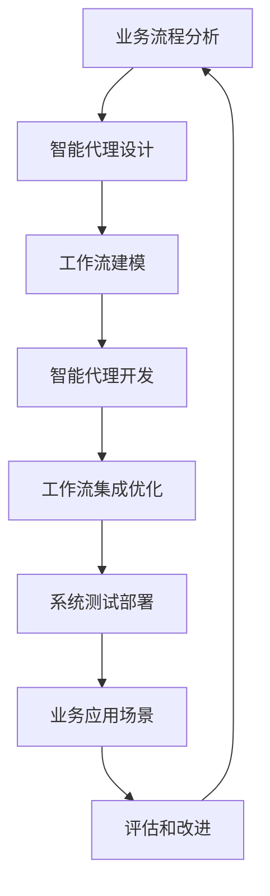

# AI人工智能代理工作流AI Agent WorkFlow：智能代理在金融系统中的应用

## 1. 背景介绍
### 1.1 人工智能在金融领域的应用现状
#### 1.1.1 智能投资顾问和交易系统
#### 1.1.2 风险管理和欺诈检测
#### 1.1.3 客户服务和个性化推荐
### 1.2 智能代理技术的发展
#### 1.2.1 智能代理的定义和特点 
#### 1.2.2 智能代理在不同领域的应用
#### 1.2.3 智能代理在金融系统中的潜力
### 1.3 AI Agent工作流的概念
#### 1.3.1 工作流的定义和组成
#### 1.3.2 AI Agent工作流的特点和优势
#### 1.3.3 AI Agent工作流在金融系统中的应用前景

## 2. 核心概念与联系
### 2.1 智能代理Agent
#### 2.1.1 智能代理的定义和属性
#### 2.1.2 智能代理的分类和功能
#### 2.1.3 智能代理在金融系统中的角色
### 2.2 工作流Workflow
#### 2.2.1 工作流的定义和特点
#### 2.2.2 工作流的组成要素和模型
#### 2.2.3 工作流在金融业务中的应用
### 2.3 AI Agent工作流
#### 2.3.1 AI Agent工作流的定义
#### 2.3.2 AI Agent工作流的架构和组成
#### 2.3.3 AI Agent工作流与传统工作流的区别

## 3. 核心算法原理具体操作步骤
### 3.1 智能代理的决策算法 
#### 3.1.1 基于规则的决策算法
#### 3.1.2 基于强化学习的决策算法
#### 3.1.3 基于深度学习的决策算法
### 3.2 工作流的建模和优化算法
#### 3.2.1 工作流建模方法和工具
#### 3.2.2 工作流优化的目标和约束
#### 3.2.3 工作流优化算法和策略
### 3.3 AI Agent工作流的构建步骤
#### 3.3.1 业务流程分析和建模
#### 3.3.2 智能代理的设计和开发
#### 3.3.3 工作流的集成和优化
#### 3.3.4 系统的测试和部署

## 4. 数学模型和公式详细讲解举例说明
### 4.1 马尔可夫决策过程MDP
#### 4.1.1 MDP的定义和组成
#### 4.1.2 MDP在智能代理决策中的应用
#### 4.1.3 MDP模型的求解方法
### 4.2 强化学习模型
#### 4.2.1 Q-Learning模型
#### 4.2.2 Deep Q-Network模型
#### 4.2.3 Policy Gradient模型  
### 4.3 工作流建模的数学表示
#### 4.3.1 Petri网模型
#### 4.3.2 状态机模型
#### 4.3.3 基于规则的模型

## 5. 项目实践：代码实例和详细解释说明
### 5.1 智能代理的开发框架和工具
#### 5.1.1 JADE框架介绍和使用示例
#### 5.1.2 TensorFlow和Keras的应用
#### 5.1.3 OpenAI Gym环境的搭建
### 5.2 工作流引擎的选择和集成
#### 5.2.1 Activiti工作流引擎介绍
#### 5.2.2 Activiti与Spring Boot的集成
#### 5.2.3 Activiti工作流的设计和部署
### 5.3 AI Agent工作流的案例实践
#### 5.3.1 智能风控系统的设计和实现
#### 5.3.2 智能投资决策系统的开发
#### 5.3.3 个性化金融服务的实现

## 6. 实际应用场景
### 6.1 银行业务流程自动化
#### 6.1.1 贷款审批流程优化
#### 6.1.2 反洗钱智能监控
#### 6.1.3 智能客户服务
### 6.2 保险理赔流程智能化
#### 6.2.1 保险理赔流程自动化
#### 6.2.2 智能风险评估和定价
#### 6.2.3 个性化保险产品推荐
### 6.3 智能投资和资产管理
#### 6.3.1 智能投资组合管理
#### 6.3.2 智能交易执行系统
#### 6.3.3 智能风险控制和预警

## 7. 工具和资源推荐
### 7.1 智能代理开发工具
#### 7.1.1 JADE框架
#### 7.1.2 TensorFlow和Keras
#### 7.1.3 OpenAI Gym
### 7.2 工作流引擎和建模工具
#### 7.2.1 Activiti工作流引擎
#### 7.2.2 BPMN建模工具
#### 7.2.3 Petri网建模工具
### 7.3 行业案例和开源项目
#### 7.3.1 银行业智能化转型案例
#### 7.3.2 保险业智能化应用案例 
#### 7.3.3 开源的AI Agent工作流项目

## 8. 总结：未来发展趋势与挑战
### 8.1 AI Agent工作流的发展趋势
#### 8.1.1 智能化和自动化程度不断提高
#### 8.1.2 多Agent协作和互操作性增强
#### 8.1.3 与区块链等新兴技术的融合
### 8.2 AI Agent工作流面临的挑战
#### 8.2.1 智能代理的可解释性和可信性
#### 8.2.2 工作流的动态适应和演化能力
#### 8.2.3 数据隐私和安全问题
### 8.3 未来研究和应用方向
#### 8.3.1 AI Agent工作流的标准化
#### 8.3.2 人机协作的智能工作流
#### 8.3.3 跨领域的AI Agent工作流应用

## 9. 附录：常见问题与解答
### 9.1 如何选择合适的智能代理开发框架？
### 9.2 如何设计和优化AI Agent工作流？
### 9.3 如何评估AI Agent工作流的性能和效果？
### 9.4 如何处理AI Agent工作流中的异常和错误？
### 9.5 如何确保AI Agent工作流的安全性和合规性？

智能代理与工作流相结合，形成AI Agent工作流，为金融系统的智能化升级提供了新的思路和方案。本文从背景介绍、核心概念、算法原理、数学模型、项目实践、应用场景等多个角度，对AI Agent工作流在金融领域的应用进行了全面深入的探讨。

在技术层面，智能代理的决策算法，如基于规则、强化学习和深度学习的算法，以及工作流的建模优化算法，如Petri网、状态机等，为AI Agent工作流的实现提供了理论基础和技术支撑。马尔可夫决策过程MDP、Q-Learning、DQN等数学模型和算法，在智能代理和工作流的设计优化中发挥着关键作用。

项目实践方面，JADE、TensorFlow、Keras、OpenAI Gym等开发框架和工具，以及Activiti等工作流引擎，为AI Agent工作流的开发和部署提供了便利。通过案例实践，如智能风控、智能投资决策、个性化金融服务等，展现了AI Agent工作流在银行、保险、资产管理等金融场景中的应用价值和巨大潜力。

展望未来，AI Agent工作流将向着智能化和自动化程度不断提高、多Agent协作、与区块链等新兴技术深度融合的方向发展。同时也面临着智能代理可解释性、工作流适应性、数据隐私安全等挑战。未来亟需在AI Agent工作流的标准化、人机协作、跨领域应用等方面开展更深入的研究和实践探索。

AI Agent工作流代表着金融系统智能化变革的重要方向，将人工智能、智能代理、工作流等前沿技术与金融场景深度结合，驱动金融业务流程的智能化重塑，为客户提供更加智能、高效、个性化的金融服务，推动金融行业的变革和创新发展。

作者：禅与计算机程序设计艺术 / Zen and the Art of Computer Programming