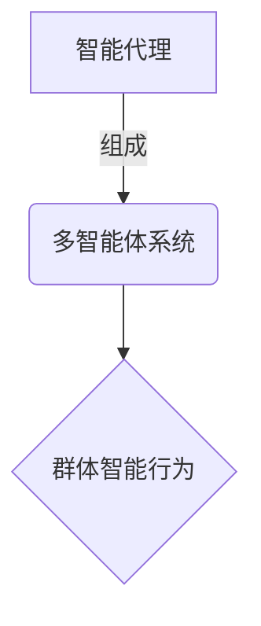
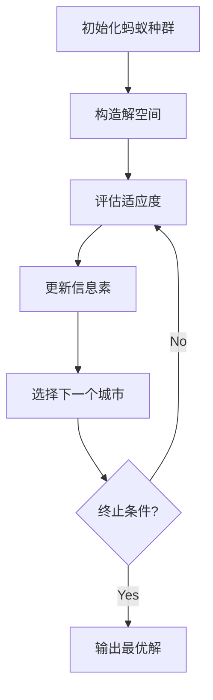
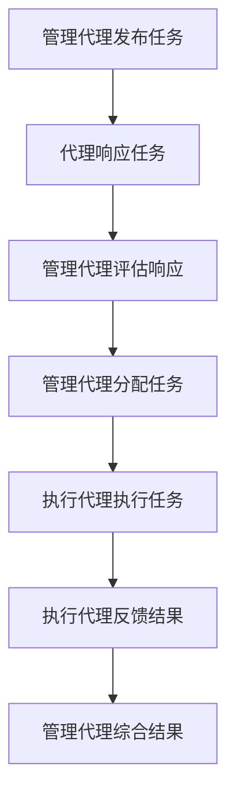

# AI人工智能代理工作流AI Agent WorkFlow：智能代理的群体行为分析与指导

## 1.背景介绍

### 1.1 智能代理的兴起

随着人工智能(AI)和机器学习(ML)技术的不断发展,智能代理系统正在各个领域中广泛应用。智能代理是一种自主的软件实体,能够根据环境状态和预定目标做出理性决策并采取行动。它们被赋予了感知、规划、推理和执行的能力,可以代表人类或其他系统执行特定任务。

智能代理的概念源于分布式人工智能(Distributed AI)和多智能体系统(Multi-Agent Systems)的研究。早期的智能代理主要应用于有限领域,如游戏AI、机器人控制等。随着计算能力和算法的进步,智能代理现在可以处理更加复杂的问题,如决策支持、资源优化、协作等。

### 1.2 群体智能代理的重要性

在现实世界中,许多复杂的系统和问题都涉及多个智能代理的互动和协作。单个智能代理的能力往往是有限的,而通过形成一个多智能体系统,代理们可以相互协调、共享信息和资源,从而解决更加棘手的问题。

群体智能代理的研究关注代理之间的协作机制、通信协议、任务分配、冲突解决等方面。它探讨了如何让代理群体产生"集体智能",使整个系统的表现超过单个代理的简单叠加。这对于构建复杂的分布式系统、多机器人系统、智能交通系统等具有重要意义。

## 2.核心概念与联系

### 2.1 智能代理

智能代理是一种具有自主性的软件实体,能够感知环境、处理信息、做出决策并采取行动,以实现特定目标。一个智能代理通常包括以下几个核心组件:

- 感知器(Sensors):用于获取环境数据和状态信息。
- 效能器(Actuators):用于对环境执行实际操作。
- 知识库(Knowledge Base):存储代理的信念、目标和行为规则等知识。
- 推理引擎(Reasoning Engine):根据知识库中的规则对感知数据进行推理,生成行为计划。

智能代理的行为可以基于不同的架构和算法,如反应规划(Reactive Planning)、实用推理(Practical Reasoning)、机器学习等。

### 2.2 多智能体系统(Multi-Agent Systems)

多智能体系统由多个智能代理组成,代理之间可以相互作用、协作或竞争,以解决复杂的问题。多智能体系统的研究涉及以下几个关键方面:

- 代理协作:代理如何通过通信、协商等机制相互协作以完成共同目标。
- 任务分配:如何有效地将任务分配给不同的代理,以最大化整体效率。
- 资源分配:如何公平分配有限的资源,避免代理之间的资源竞争。
- 协调与冲突解决:如何协调代理的行为,解决潜在的冲突和不一致性。
- 组织结构:代理如何组织成层级结构或网络结构,以实现高效的协作。

多智能体系统可以应用于各种领域,如智能制造、智能交通、智能电网、机器人系统等。

### 2.3 群体智能(Swarm Intelligence)

群体智能是一种底层代理通过本地互动而产生整体智能行为的现象。这种行为模式常见于自然界,如蚂蚁集群、鸟群、蜂群等。群体智能算法通常具有以下几个特点:

- 分散性:系统由许多简单代理组成,没有集中控制或全局模型。
- 自组织:代理通过本地互动自发形成有序的群体行为模式。
- 鲁棒性:系统对单个代理的失效具有容错能力。
- 可扩展性:可以通过增加代理的数量来提高系统的能力。

常见的群体智能算法包括蚁群优化(Ant Colony Optimization)、粒子群优化(Particle Swarm Optimization)、人工蜂群算法(Artificial Bee Colony)等,广泛应用于优化、路径规划、机器人系统等领域。

这三个概念相互关联且存在一定的包含关系。智能代理是构成多智能体系统的基本单元,而多智能体系统则可以展现出类似于群体智能的集体行为模式。

## 3.核心算法原理具体操作步骤

### 3.1 群体智能算法原理

群体智能算法通常模拟自然界中简单个体通过本地互动而产生复杂群体行为的过程。这些算法的核心思想是:

1. 初始化一组代理(粒子、蚂蚁等),代表潜在解的种群。
2. 评估每个代理的适应度(目标函数值)。
3. 根据一定的规则,更新代理的状态(位置、路径等)。
4. 代理通过信息素、邻居交互等机制进行本地通信和协作。
5. 重复步骤2-4,直到满足终止条件(收敛、达到最大迭代次数等)。
6. 输出最优解及其适应度。

不同的群体智能算法在具体实现上有所区别,但都遵循上述基本框架。以蚁群优化算法为例,具体操作步骤如下:

1. 初始化一组蚂蚁,随机分布在城市之间。
2. 构建解空间,即所有可能的城市排列组合。
3. 计算每只蚂蚁的路径长度(适应度函数)。
4. 根据蚂蚁走过的路径,在对应的边上释放信息素,信息素浓度越高,该路径被选择的概率就越大。
5. 每只蚂蚁根据信息素浓度概率选择下一个城市。
6. 重复步骤3-5,直到所有蚂蚁完成一次循环。
7. 判断是否满足终止条件(最大迭代次数或收敛),如果是则输出最优解,否则回到步骤3。

### 3.2 多智能体系统协作算法

在多智能体系统中,代理之间需要通过协作来完成共同的目标。常见的协作算法包括:

1. **基于约束的协作**:代理根据全局约束条件(如资源限制、时间限制等)协调行为。
2. **基于协商的协作**:代理通过协商达成一致,如基于契约网协议(Contract Net Protocol)的任务分配。
3. **基于拍卖的协作**:代理通过拍卖机制竞争获得任务或资源。
4. **基于组织的协作**:代理被组织成层级或全能结构,通过组织关系协调行为。

以基于契约网协议的任务分配为例,算法步骤如下:

1. 管理代理发布一个任务。
2. 其他执行代理根据自身能力响应该任务。
3. 管理代理评估各个响应,选择最合适的执行代理。
4. 管理代理将任务分配给被选中的执行代理。
5. 执行代理完成任务。
6. 执行代理将结果反馈给管理代理。
7. 管理代理综合所有结果,完成整个任务。

## 4.数学模型和公式详细讲解举例说明

在群体智能和多智能体系统中,通常需要建立数学模型来描述和优化代理的行为。以下是一些常见的数学模型和公式:

### 4.1 马尔可夫决策过程(Markov Decision Process)

马尔可夫决策过程(MDP)是一种描述序贯决策过程的数学框架,常用于强化学习和智能体决策建模。一个MDP可以用元组 $\langle S, A, P, R \rangle$ 来表示:

- $S$ 是状态集合
- $A$ 是动作集合
- $P(s'|s,a)$ 是状态转移概率,表示在状态 $s$ 执行动作 $a$ 后,转移到状态 $s'$ 的概率
- $R(s,a)$ 是回报函数,表示在状态 $s$ 执行动作 $a$ 获得的即时回报

代理的目标是找到一个策略 $\pi: S \rightarrow A$,使得期望的累积回报最大化:

$$
\max_\pi \mathbb{E}\left[\sum_{t=0}^\infty \gamma^t R(s_t, a_t)\right]
$$

其中 $\gamma \in [0, 1]$ 是折现因子,用于平衡即时回报和长期回报的权衡。

### 4.2 潜在场(Potential Fields)

潜在场模型常用于机器人路径规划和群体运动建模。在这种模型中,代理被看作是受到虚拟力场影响的粒子。力场由目标点产生的吸引力场和障碍物产生的排斥力场组成。代理的运动方向由合力决定:

$$
\vec{F}_{total} = \vec{F}_{att} + \vec{F}_{rep}
$$

其中,吸引力场可以用指数函数或高斯函数来建模:

$$
\vec{F}_{att}(q) = \xi \cdot (\vec{q}_{goal} - \vec{q}) \cdot e^{-\beta \|\vec{q}_{goal} - \vec{q}\|}
$$

排斥力场可以用反指数函数或高斯函数来建模:

$$
\vec{F}_{rep}(q) = -\eta \cdot \left(\frac{1}{\rho(\vec{q}, \vec{q}_{obs})}\right)^2 \cdot \frac{\vec{q} - \vec{q}_{obs}}{\|\vec{q} - \vec{q}_{obs}\|}
$$

其中 $\xi$、$\beta$、$\eta$ 是调节参数, $\rho(\vec{q}, \vec{q}_{obs})$ 表示代理与障碍物之间的最短距离。

### 4.3 信息素模型(Pheromone Model)

信息素模型广泛应用于蚁群优化算法中,用于模拟蚂蚁释放和感知信息素的过程。假设有 $m$ 只蚂蚁, $n$ 个城市,城市之间的距离为 $d_{ij}$,蚂蚁 $k$ 从城市 $i$ 转移到城市 $j$ 的概率为:

$$
p_{ij}^k = \frac{[\tau_{ij}]^\alpha \cdot [\eta_{ij}]^\beta}{\sum\limits_{l \in \text{allowed}_k} [\tau_{il}]^\alpha \cdot [\eta_{il}]^\beta}
$$

其中:

- $\tau_{ij}$ 表示边 $(i, j)$ 上的信息素浓度
- $\eta_{ij} = \frac{1}{d_{ij}}$ 表示启发式信息,即边的可见性
- $\alpha$ 和 $\beta$ 分别是信息素重要程度和启发式重要程度的参数
- $\text{allowed}_k$ 是蚂蚁 $k$ 在当前城市能够选择的下一个城市集合

在每一代迭代结束后,信息素浓度会根据蚂蚁的路径进行更新:

$$
\tau_{ij} \leftarrow (1 - \rho) \cdot \tau_{ij} + \sum_k \Delta\tau_{ij}^k
$$

其中:

- $\rho$ 是信息素挥发率
- $\Delta\tau_{ij}^k = \begin{cases}\frac{Q}{L_k} & \text{若蚂蚁 $k$ 经过边 $(i, j)$} \\ 0 & \text{否则}\end{cases}$
- $Q$ 是一个常数,表示信息素增量
- $L_k$ 是蚂蚁 $k$ 的路径长度

通过这种方式,较短路径上的信息素浓度会不断增加,从而吸引更多的蚂蚁选择该路径,最终收敛到最优解。

以上