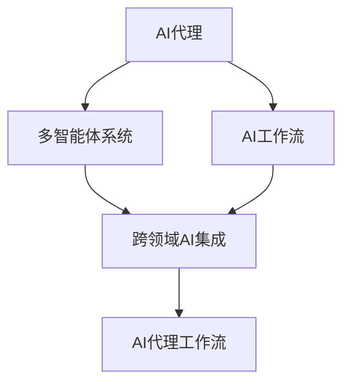

# AI人工智能代理工作流AI Agent WorkFlow：跨领域自主AI代理的集成

## 1. 背景介绍

### 1.1 人工智能的发展历程

人工智能(Artificial Intelligence, AI)自1956年达特茅斯会议提出以来，经历了从早期的符号主义、专家系统，到90年代的统计学习和神经网络，再到近十年来的深度学习和强化学习等多个发展阶段。当前，AI正朝着通用人工智能(Artificial General Intelligence, AGI)的方向迈进，力图构建具备类人的感知、认知、决策和执行能力的智能系统。

### 1.2 AI应用领域不断拓展

随着AI技术的不断进步，其应用领域也在不断扩大。从早期的游戏、自然语言处理等特定领域，到如今的无人驾驶、智能制造、金融科技、智慧医疗、智能安防等几乎覆盖社会生活的方方面面。AI正在深刻影响和重塑人类社会的生产和生活方式。

### 1.3 AI发展面临的挑战

尽管AI取得了长足的进步，但在通用智能、可解释性、鲁棒性、安全性、伦理道德等方面仍面临诸多挑战。如何打破不同AI系统间的壁垒，实现AI能力的互联互通、协同增强，构建开放、灵活、可扩展的AI生态，是业界和学界亟待解决的问题。

## 2. 核心概念与联系

### 2.1 AI代理(Agent)

Agent是一个可感知环境并采取行动的自主实体。它根据对环境的感知，结合自身知识和目标，自主地做出决策并付诸行动，通过与环境的交互来完成特定任务或目标。

### 2.2 多智能体系统(Multi-Agent System)

多个Agent在同一环境下协同工作，通过分工协作来解决复杂问题，构成了多智能体系统。每个Agent负责不同的子任务，通过通信协调来实现全局目标。多智能体系统具有分布式、自组织、协同等特点。

### 2.3 AI工作流(Workflow)

把多个AI模型和服务组织成一个端到端的任务处理流程，定义它们之间的数据依赖关系、控制逻辑和执行顺序，形成AI工作流。通过编排多个AI能力，可以解决更加复杂的现实问题。

### 2.4 跨领域AI集成

不同领域的AI模型在知识表示、学习范式、评价指标等方面存在差异。跨领域AI集成旨在打通不同AI模型间的壁垒，实现知识的迁移和融合，发挥多个AI模型的协同效应，从而构建更加通用和强大的AI系统。

### 2.5 AI代理工作流

AI代理工作流是多智能体系统、AI工作流、跨领域AI集成等概念的综合体现。它通过将不同领域的AI代理组织成工作流的形式，明确定义代理间的交互接口和协议，实现多个AI代理的互联互通和协同工作，从而构建开放、灵活、可扩展的AI应用系统。

下面是以上概念之间关系的 Mermaid 流程图：



## 3. 核心算法原理具体操作步骤

### 3.1 AI代理的构建

1. 定义代理的感知、决策和执行模块的接口规范
2. 根据具体任务选择合适的机器学习算法，如深度学习、强化学习等，构建代理模型
3. 利用仿真环境或真实数据对代理模型进行训练优化
4. 将训练好的模型封装成代理，提供标准化的调用接口

### 3.2 多智能体协同

1. 针对具体问题，将其划分为多个子任务，每个子任务分配给一个代理负责
2. 设计代理间的通信协议，定义通信内容、方式和时序
3. 构建多智能体系统，实现代理间的信息交换和行为协调
4. 设计全局目标函数，协调多个代理的局部决策，优化整体性能

### 3.3 AI工作流构建 

1. 分析具体应用场景，梳理端到端的任务处理流程
2. 将流程划分为多个关键步骤，每个步骤对应一个AI模型或服务
3. 定义不同步骤间的数据依赖关系和执行顺序，形成有向无环图(DAG)
4. 选择合适的工作流引擎，如Airflow、Kubeflow等，编排AI工作流
5. 提供人机交互界面，支持工作流的启动、监控、异常处理等

### 3.4 跨领域AI集成

1. 分析不同AI模型的知识表示、学习范式、数据格式等异构性
2. 设计知识融合和转换机制，如迁移学习、元学习等，实现模型间的适配
3. 定义统一的数据交换格式和调用接口，屏蔽模型实现差异
4. 构建AI模型库，涵盖多个领域的预训练模型，支持灵活组合和调用

### 3.5 AI代理工作流集成

1. 针对具体应用，梳理涉及的AI任务和领域
2. 根据任务特点，选择和训练合适的AI代理模型
3. 利用多智能体协同机制，实现不同代理间的分工与合作
4. 将各个代理的能力组织成AI工作流，定义代理间的数据流和控制流
5. 利用跨领域AI集成技术，打通不同领域代理模型间的壁垒
6. 搭建AI代理工作流集成平台，提供统一的开发、部署、监控等功能

## 4. 数学模型和公式详细讲解举例说明

### 4.1 马尔可夫决策过程(MDP)

MDP是强化学习的基础，用于描述智能体与环境的交互过程。它由状态集合$S$、动作集合$A$、转移概率$P$、奖励函数$R$和折扣因子$\gamma$构成。

在每个时间步$t$，智能体根据当前状态$s_t \in S$采取动作$a_t \in A$，环境根据转移概率$P(s_{t+1}|s_t,a_t)$转移到新状态$s_{t+1}$，同时给予智能体奖励$r_t=R(s_t,a_t)$。

智能体的目标是最大化累积奖励的期望，即找到最优策略$\pi^*$：

$$\pi^* = \arg\max_{\pi} \mathbb{E}[\sum_{t=0}^{\infty} \gamma^t r_t | \pi]$$

其中$\pi(a|s)$表示在状态$s$下选择动作$a$的概率。

### 4.2 Q-learning算法

Q-learning是一种常用的无模型强化学习算法，用于估计状态-动作值函数$Q(s,a)$，即在状态$s$下采取动作$a$的长期累积奖励期望。

Q-learning的更新公式为：

$$Q(s_t,a_t) \leftarrow Q(s_t,a_t) + \alpha [r_t + \gamma \max_{a} Q(s_{t+1},a) - Q(s_t,a_t)]$$

其中$\alpha$是学习率，$\gamma$是折扣因子。

根据Q值，智能体可以采取$\epsilon$-贪婪策略选择动作：

$$
a_t=\begin{cases}
\arg\max_{a} Q(s_t,a) & \text{with probability } 1-\epsilon \\
\text{random action} & \text{with probability } \epsilon
\end{cases}
$$

### 4.3 深度Q网络(DQN)

当状态和动作空间较大时，可以用深度神经网络来拟合Q函数，称为DQN。

DQN包含两个神经网络：当前Q网络$Q(s,a;\theta)$和目标Q网络$\hat{Q}(s,a;\theta^-)$，其中$\theta$和$\theta^-$分别表示两个网络的参数。

DQN的损失函数定义为：

$$L(\theta) = \mathbb{E}_{(s_t,a_t,r_t,s_{t+1})\sim D} [(r_t + \gamma \max_{a} \hat{Q}(s_{t+1},a;\theta^-) - Q(s_t,a_t;\theta))^2]$$

其中$D$为经验回放池，用于存储智能体与环境交互的转移数据$(s_t,a_t,r_t,s_{t+1})$。

在训练过程中，通过最小化损失函数$L(\theta)$来更新当前Q网络的参数$\theta$，并定期将其复制给目标Q网络的参数$\theta^-$。

### 4.4 多智能体强化学习(MARL)

在多智能体系统中，每个智能体不仅要考虑自身的行为，还要考虑其他智能体的策略。

以双智能体为例，定义联合动作值函数$Q^i(s,a^i,a^j)$，表示在状态$s$下，智能体$i$采取动作$a^i$、智能体$j$采取动作$a^j$时的长期奖励期望。

智能体$i$的最优策略为：

$$\pi^{i*}(s) = \arg\max_{a^i} \sum_{a^j} \pi^j(a^j|s) Q^i(s,a^i,a^j)$$

其中$\pi^j$为智能体$j$的策略。

MARL算法如MADDPG、QMIX等，通过设计适当的学习目标和通信协议，实现多个智能体的协同学习，得到全局最优的联合策略。

## 5. 项目实践：代码实例和详细解释说明

下面以 Python 和 TensorFlow 为例，展示如何构建一个简单的 DQN 代理，并应用于 CartPole 游戏环境中。

```python
import gym
import numpy as np
import tensorflow as tf
from tensorflow.keras import layers, models, optimizers

class DQNAgent:
    def __init__(self, state_dim, action_dim):
        self.state_dim = state_dim
        self.action_dim = action_dim
        self.gamma = 0.95    # 折扣因子
        self.epsilon = 1.0   # 探索率
        self.epsilon_min = 0.01
        self.epsilon_decay = 0.995
        self.learning_rate = 0.001
        self.memory = []
        self.batch_size = 32
        self.model = self.build_model()
        self.target_model = self.build_model()

    def build_model(self):
        """构建深度Q网络"""
        model = models.Sequential()
        model.add(layers.Dense(24, input_dim=self.state_dim, activation='relu'))
        model.add(layers.Dense(24, activation='relu'))
        model.add(layers.Dense(self.action_dim, activation='linear'))
        model.compile(loss='mse', optimizer=optimizers.Adam(lr=self.learning_rate))
        return model

    def remember(self, state, action, reward, next_state, done):
        """存储经验到回放池"""
        self.memory.append((state, action, reward, next_state, done))

    def choose_action(self, state):
        """根据epsilon-贪婪策略选择动作"""
        if np.random.rand() <= self.epsilon:
            return np.random.choice(self.action_dim)
        else:
            q_values = self.model.predict(state)[0]
            return np.argmax(q_values)

    def replay(self):
        """从回放池中随机采样批量数据，并更新模型"""
        if len(self.memory) < self.batch_size:
            return

        batch = np.random.choice(len(self.memory), self.batch_size, replace=False)
        states, actions, rewards, next_states, dones = zip(*[self.memory[i] for i in batch])
        
        states = np.vstack(states)
        next_states = np.vstack(next_states)

        q_values = self.model.predict(states)
        next_q_values = self.target_model.predict(next_states)

        for i in range(self.batch_size):
            if dones[i]:
                target = rewards[i]
            else:
                target = rewards[i] + self.gamma * np.max(next_q_values[i])
            q_values[i][actions[i]] = target

        self.model.fit(states, q_values, verbose=0)

    def update_target_model(self):
        """定期将当前Q网络的权重复制给目标Q网络"""
        self.target_model.set_weights(self.model.get_weights())

    def update_epsilon(self):
        """随着训练进行，逐渐减小探索率"""
        if self.epsilon > self.epsilon_min:
            self.epsilon *= self.epsilon_decay

def main():
    env = gym.make('CartPole-v1')
    state_dim = env.observation_space.shape[0]
    action_dim = env.action_space.n

    agent = DQNAgent