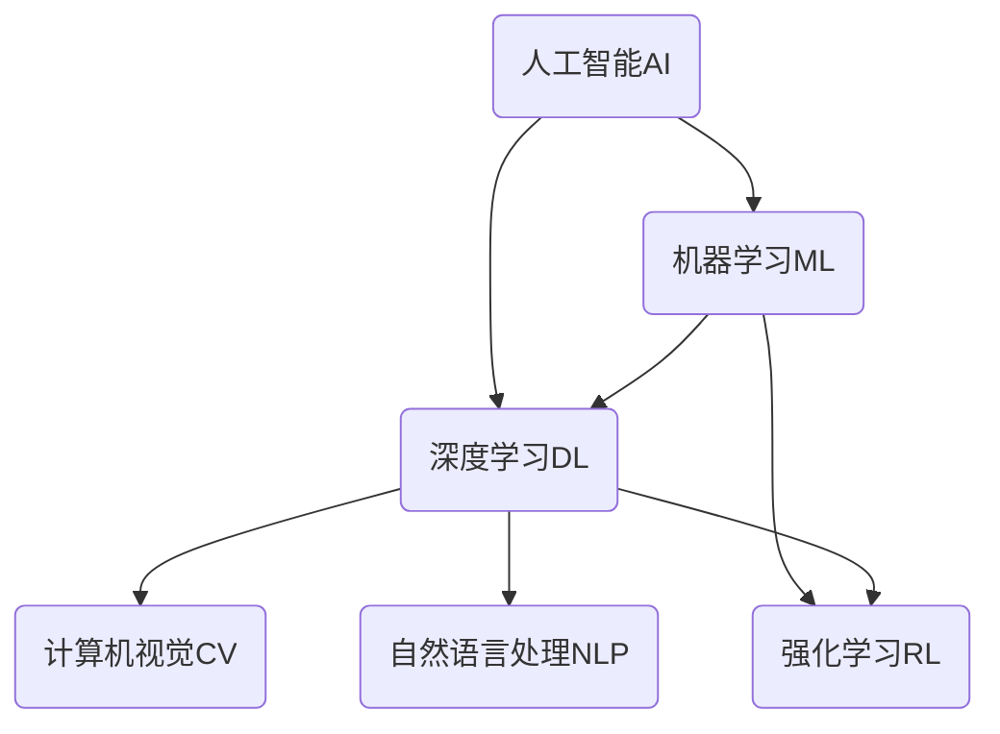

# AI人工智能核心算法原理与代码实例讲解：智能机器

## 1.背景介绍

### 1.1 人工智能的兴起

人工智能(Artificial Intelligence, AI)是当代科技领域最具变革性和颠覆性的技术之一。自20世纪50年代AI概念被正式提出以来,经过数十年的发展,AI已经渗透到了我们生活和工作的方方面面。从语音助手到自动驾驶汽车,从智能推荐系统到医疗诊断,AI无处不在。

随着大数据、云计算、深度学习等技术的飞速发展,AI进入了一个全新的爆发期。强大的算力和海量数据为AI算法的训练提供了坚实基础,使得AI系统能够展现出超乎想象的能力。

### 1.2 AI的重要性

AI的重要性不言而喻。它被视为"新一轮科技革命和产业变革的核心驱动力量"。AI将彻底改变人类的生产生活方式,对经济社会发展产生深远影响。掌握AI技术将决定一个国家在未来的科技实力和国际竞争力。

因此,AI已经成为全球科技竞争的新高地。各国政府和科技巨头都在AI领域投入巨资,争相布局。中国也明确将AI列为新一代战略性产业,制定了面向2030年的AI发展规划。

### 1.3 本文内容与目标读者

本文将系统地介绍AI领域的核心算法原理,并结合大量代码实例进行讲解。我们将从浅入深地剖析经典的AI算法,探讨它们的数学模型、原理和实现细节。

本文面向的读者包括:AI研究人员、算法工程师、AI从业者,以及对AI算法原理感兴趣的开发者。希望本文能为读者提供AI算法的专业知识,增进对AI核心技术的理解。

## 2.核心概念与联系

在深入探讨具体算法之前,我们有必要先梳理一下AI领域的核心概念,并阐明它们之间的联系。这将为后续的算法讲解打下坚实的基础。



### 2.1 人工智能(AI)

人工智能(Artificial Intelligence, AI)是一门致力于研究和开发能够模拟人类智能行为的理论、方法、技术与应用系统的科学。它包含机器学习、计算机视觉、自然语言处理、智能规划、机器人技术等多个子领域。

### 2.2 机器学习(ML)

机器学习(Machine Learning, ML)是数据驱动的人工智能的一个重要分支,它赋予了计算机在没有明确程序的情况下,通过利用数据或以往的经验自动分析获得规律,并利用规律对复杂问题进行建模、预测和决策的能力。

机器学习算法主要分为三大类:

1. **监督学习**(Supervised Learning)
2. **无监督学习**(Unsupervised Learning) 
3. **强化学习**(Reinforcement Learning)

### 2.3 深度学习(DL)

深度学习(Deep Learning, DL)是机器学习的一个子集,它是一种试图通过对数据的表示层次模仿人脑的运行原理来解决问题的方法。深度学习模型可以从原始输入数据中自动学习数据表示特征,并在此基础上完成分类、预测等任务。

深度学习的核心是神经网络(Neural Network),尤其是深度神经网络(Deep Neural Network)。常见的深度神经网络包括卷积神经网络(CNN)、循环神经网络(RNN)等。

### 2.4 计算机视觉(CV)

计算机视觉(Computer Vision, CV)是人工智能领域的一个重要分支,它研究如何构造能够获取、处理、分析和理解数字图像或视频数据的理论和技术方法。

计算机视觉的主要任务包括图像分类、目标检测、语义分割、实例分割、3D重建等。深度学习的兴起使得计算机视觉取得了飞跃式进展。

### 2.5 自然语言处理(NLP)

自然语言处理(Natural Language Processing, NLP)是人工智能的一个分支,它研究计算机与人类自然语言之间相互转换的理论和技术方法。

NLP的主要任务包括文本分类、机器翻译、信息抽取、问答系统、自动摘要等。近年来,深度学习在NLP领域也取得了突破性进展。

### 2.6 强化学习(RL)

强化学习(Reinforcement Learning, RL)是机器学习的一个重要分支,它通过与环境的交互来学习如何在特定环境中获取最大化的预期奖励。

强化学习的典型应用包括机器人控制、游戏AI、对话系统等。AlphaGo战胜人类棋手就是强化学习的杰出成就。

## 3.核心算法原理具体操作步骤

接下来,我们将深入探讨AI领域的几种核心算法,剖析它们的原理、数学模型和具体操作步骤。

### 3.1 线性回归

线性回归是一种常用的监督学习算法,用于预测连续型数值输出。它通过找到自变量和因变量之间的线性关系来进行预测。

#### 3.1.1 算法原理

线性回归试图找到一条最佳拟合直线,使所有样本点到直线的残差平方和最小。这个最优化问题可以通过最小二乘法来求解。

给定一个数据集 $\{(x_i,y_i)\}_{i=1}^{N}$,其中 $x_i$ 是输入特征向量, $y_i$ 是标量输出,线性回归模型可以表示为:

$$y = \theta_0 + \theta_1x_1 + \theta_2x_2 + ... + \theta_nx_n$$

其中 $\theta_i$ 是需要学习的模型参数。目标是找到最优参数 $\theta^*$,使得损失函数最小:

$$\theta^* = \arg\min_\theta \sum_{i=1}^{N}(y_i - \hat{y}_i)^2$$

其中 $\hat{y}_i = \theta_0 + \theta_1x_{i1} + ... + \theta_nx_{in}$ 是模型的预测输出。

#### 3.1.2 算法步骤

线性回归的算法步骤如下:

1. 收集数据集,进行数据预处理(缺失值处理、特征缩放等)
2. 将数据集分为训练集和测试集
3. 初始化模型参数 $\theta$
4. 使用训练集计算损失函数和梯度
5. 使用梯度下降法更新参数 $\theta$
6. 重复步骤4和5,直到收敛或达到最大迭代次数
7. 在测试集上评估模型性能

#### 3.1.3 代码实例(Python)

```python
import numpy as np

# 加载数据
X = ...
y = ...

# 添加偏置项
X = np.hstack((np.ones((X.shape[0], 1)), X))

# 初始化参数
theta = np.zeros(X.shape[1])

# 超参数设置
alpha = 0.01  # 学习率
num_iters = 1000  # 迭代次数

# 梯度下降
for i in range(num_iters):
    y_pred = np.dot(X, theta)
    error = y_pred - y
    grad = np.dot(X.T, error) / X.shape[0]
    theta -= alpha * grad

# 评估模型
y_pred = np.dot(X, theta)
mse = np.mean((y_pred - y) ** 2)
print(f"Mean Squared Error: {mse}")
```

上述代码展示了如何使用梯度下降法实现线性回归模型。我们首先加载数据并初始化参数,然后进行多次迭代,每次计算梯度并更新参数。最后,我们在测试集上评估模型的均方误差(MSE)。

### 3.2 逻辑回归

逻辑回归是一种常用的监督学习算法,用于解决二分类问题。它通过学习输入特征与输出标签之间的对数几率关系,对新的输入数据进行分类。

#### 3.2.1 算法原理

逻辑回归的核心思想是将输入特征的线性组合通过逻辑函数(Sigmoid函数)映射到(0,1)区间,作为样本属于正类的概率估计。

给定一个数据集 $\{(x_i,y_i)\}_{i=1}^{N}$,其中 $x_i$ 是输入特征向量, $y_i \in \{0,1\}$ 是二元类别标签,逻辑回归模型可以表示为:

$$h_\theta(x) = \frac{1}{1 + e^{-\theta^Tx}}$$

其中 $\theta$ 是需要学习的模型参数向量。我们希望找到最优参数 $\theta^*$,使得训练数据的似然函数最大化:

$$\theta^* = \arg\max_\theta \prod_{i=1}^{N}[h_\theta(x_i)]^{y_i}[1-h_\theta(x_i)]^{1-y_i}$$

通常我们最小化似然函数的负对数,也就是损失函数(交叉熵损失):

$$J(\theta) = -\frac{1}{N}\sum_{i=1}^{N}[y_i\log h_\theta(x_i) + (1-y_i)\log(1-h_\theta(x_i))]$$

#### 3.2.2 算法步骤

逻辑回归的算法步骤如下:

1. 收集数据集,进行数据预处理
2. 将数据集分为训练集和测试集 
3. 初始化模型参数 $\theta$
4. 使用训练集计算损失函数和梯度
5. 使用梯度下降法或其他优化算法更新参数 $\theta$
6. 重复步骤4和5,直到收敛或达到最大迭代次数
7. 在测试集上评估模型性能,计算准确率等指标

#### 3.2.3 代码实例(Python)

```python
import numpy as np

# 加载数据
X = ...
y = ...

# 添加偏置项
X = np.hstack((np.ones((X.shape[0], 1)), X))

# 初始化参数
theta = np.zeros(X.shape[1])

# 超参数设置
alpha = 0.01  # 学习率
num_iters = 1000  # 迭代次数

# 梯度下降
for i in range(num_iters):
    y_pred = 1 / (1 + np.exp(-np.dot(X, theta)))
    error = y_pred - y
    grad = np.dot(X.T, error) / X.shape[0]
    theta -= alpha * grad

# 评估模型
y_pred = 1 / (1 + np.exp(-np.dot(X, theta)))
y_pred = np.round(y_pred)
accuracy = np.mean(y_pred == y)
print(f"Accuracy: {accuracy}")
```

上述代码展示了如何使用梯度下降法实现逻辑回归模型。我们首先加载数据并初始化参数,然后进行多次迭代,每次计算梯度并更新参数。最后,我们在测试集上评估模型的准确率。

### 3.3 决策树

决策树是一种常用的监督学习算法,可以用于分类和回归任务。它通过构建树状决策模型,根据输入特征的值对实例进行分类或预测。

#### 3.3.1 算法原理

决策树的构建过程是一个递归的过程,从根节点开始,根据特征的信息增益或信息增益比选择最优特征,将数据集分割成子节点,重复该过程直到满足停止条件。

对于分类任务,决策树通常使用信息增益或信息增益比作为选择特征的标准。信息增益定义为:

$$\text{Gain}(D, a) = \text{Ent}(D) - \sum_{v=1}^{V}\frac{|D^v|}{|D|}\text{Ent}(D^v)$$

其中 $D$ 是当前数据集, $a$ 是特征, $V$ 是特征 $a$ 的所有可能取值, $D^v$ 是 $D$ 根据特征 $a$ 取值 $v$ 分割得到的子集, $\text{Ent}(D)$ 是数据集 $D$ 的信息熵。

对于回归任务,决策树通常使用均方差或平均绝对偏差作为选择特征的标准。