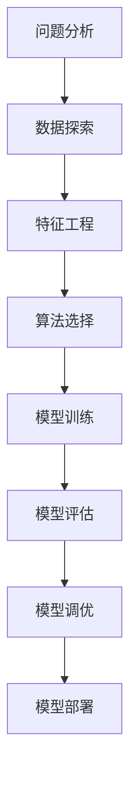

# AI人工智能核心算法原理与代码实例讲解：模型选择

## 1.背景介绍

### 1.1 人工智能的重要性

人工智能(AI)已经成为当今科技领域最热门和最具影响力的话题之一。随着计算能力的不断提高和数据量的激增,AI技术正在快速发展,并被广泛应用于各个领域,包括计算机视觉、自然语言处理、推荐系统、机器人技术等。AI不仅能够提高效率和生产力,还能解决一些人类难以解决的复杂问题。

### 1.2 模型选择的重要性

在AI系统中,模型选择是一个关键环节。模型是AI算法的核心,它决定了系统的性能和效果。选择合适的模型对于解决特定问题至关重要。不同的问题场景需要不同的模型,因此模型选择需要综合考虑多种因素,如数据特征、任务目标、计算资源等。合理的模型选择能够最大限度地发挥AI算法的潜力,提高系统的准确性和效率。

## 2.核心概念与联系  

### 2.1 监督学习与非监督学习

AI模型可以分为监督学习模型和非监督学习模型两大类。

**监督学习**是指利用已标注的训练数据,学习输入和输出之间的映射关系。常见的监督学习任务包括分类、回归等。监督学习模型通常需要大量的标注数据,如图像分类任务需要大量标注好的图片数据。

**非监督学习**则不需要标注数据,它从未标注的原始数据中自动发现数据的内在模式和结构。常见的非监督学习任务包括聚类、降维等。非监督学习模型常用于数据探索和特征提取。

除了监督学习和非监督学习之外,还有一种**半监督学习**,它结合了少量标注数据和大量未标注数据进行训练。半监督学习模型在数据标注成本高的情况下很有用。

### 2.2 模型复杂度与偏差-方差权衡

在选择模型时,需要考虑模型的复杂度。复杂度过高的模型容易过拟合,即对训练数据拟合得太好而无法很好地泛化到新的数据上。复杂度过低的模型则可能欠拟合,无法很好地捕捉数据的内在模式。

偏差-方差权衡理论描述了模型复杂度与模型性能之间的平衡关系。偏差(bias)指模型与真实函数之间的差异,方差(variance)指模型对训练数据扰动的敏感程度。复杂模型往往有较低的偏差但较高的方差,简单模型则相反。我们需要在偏差和方差之间寻找一个合适的平衡点。

### 2.3 正则化

正则化是控制模型复杂度的一种重要技术。它通过在模型的损失函数中加入惩罚项,约束模型的复杂度,从而防止过拟合。常见的正则化方法包括L1正则化(Lasso回归)、L2正则化(Ridge回归)、Dropout等。正则化能够提高模型的泛化能力,是模型选择中不可或缺的一环。

### 2.4 核心概念关系总结

以上几个核心概念相互关联、环环相扣。监督学习和非监督学习决定了模型的基本类型,模型复杂度影响了模型的偏差和方差,正则化则是控制模型复杂度的有效手段。合理平衡这些因素是模型选择的关键所在。

## 3.核心算法原理具体操作步骤

模型选择过程可以概括为以下几个步骤:



### 3.1 问题分析

首先需要明确问题的性质,是监督学习问题还是非监督学习问题。例如,如果需要对图像进行分类,那就是一个监督学习问题;如果需要对用户进行聚类,那就是一个非监督学习问题。

### 3.2 数据探索

接下来需要对数据进行探索性分析,了解数据的基本统计特征、数据分布、缺失值情况等,这将为后续的特征工程和模型选择提供依据。

### 3.3 特征工程

特征工程是数据预处理的重要环节,包括特征选择、特征构造、特征缩放等。好的特征能够提高模型的性能,因此特征工程对模型选择有重要影响。

### 3.4 算法选择

根据问题性质、数据特点和可用的计算资源,选择合适的算法族,如决策树、支持向量机、神经网络等。不同的算法族有不同的适用场景和特点。

### 3.5 模型训练

选定算法后,需要训练模型。这个过程包括划分训练集、验证集和测试集,设置模型超参数,以及使用优化算法进行模型训练。

### 3.6 模型评估

在训练好模型后,需要使用评估指标(如准确率、F1分数、AUC等)对模型进行评估,检验模型在测试集上的泛化能力。评估结果将指导我们是否需要进一步调优模型。

### 3.7 模型调优

如果模型的性能还不理想,可以通过调整超参数、增加训练数据、特征重构、集成学习等方式对模型进行优化,提高模型的性能。

### 3.8 模型部署

当模型的性能满足要求后,就可以将模型部署到实际的生产环境中,并进行持续监控和优化。

以上步骤并非一次性完成,而是一个迭代的循环过程。在实际应用中,我们可能需要多次重复这个过程,不断优化模型。

## 4.数学模型和公式详细讲解举例说明

### 4.1 线性回归

线性回归是一种常见的监督学习算法,用于解决回归问题。它试图找到一个最佳拟合的线性方程来描述自变量和因变量之间的关系。

线性回归的数学模型为:

$$y = w_0 + w_1x_1 + w_2x_2 + ... + w_nx_n$$

其中$y$是因变量,${x_1, x_2, ..., x_n}$是自变量,${w_0, w_1, ..., w_n}$是需要学习的模型参数。

训练线性回归模型的目标是最小化损失函数,常用的损失函数是均方误差(MSE):

$$MSE = \frac{1}{N}\sum_{i=1}^{N}(y_i - \hat{y_i})^2$$

其中$N$是训练样本数量,$y_i$是第$i$个样本的真实值,$\hat{y_i}$是第$i$个样本的预测值。

通过优化算法(如梯度下降)可以找到最小化MSE的模型参数$w$。

线性回归模型简单易用,适用于自变量和因变量之间存在线性关系的场景,如房价预测、销量预测等。但如果存在非线性关系,线性回归的效果就会变差。

### 4.2 逻辑回归

逻辑回归是一种常见的监督学习算法,用于解决分类问题。它将自变量的线性组合输入到Logistic函数(Sigmoid函数)中,将其映射到(0,1)范围内,作为样本属于正类的概率估计值。

二元逻辑回归的数学模型为:

$$P(y=1|x) = \frac{1}{1 + e^{-(w_0 + w_1x_1 + ... + w_nx_n)}}$$

其中$y$是二元类别标签(0或1),$x$是自变量向量,${w_0, w_1, ..., w_n}$是需要学习的模型参数。

对于多分类问题,可以使用Softmax函数将线性组合映射到多个类别的概率上。

训练逻辑回归模型的目标是最大化似然函数(或最小化对数似然损失函数):

$$\ell(w) = -\frac{1}{N}\sum_{i=1}^{N}[y_i\log(\hat{y_i}) + (1-y_i)\log(1-\hat{y_i})]$$

其中$N$是训练样本数量,$y_i$是第$i$个样本的真实标签,$\hat{y_i}$是第$i$个样本属于正类的预测概率。

逻辑回归模型常用于二分类问题,如垃圾邮件分类、疾病诊断等,也可用于多分类问题。它的优点是简单易解释,计算代价低,但对于线性不可分的数据,效果就会变差。

### 4.3 支持向量机

支持向量机(SVM)是一种强大的监督学习模型,可用于分类和回归问题。它的基本思想是在高维特征空间中寻找一个最大边界超平面,将不同类别的样本分开,并最大化边界的间隔。

对于线性可分的二分类问题,SVM试图找到一个超平面:

$$w^Tx + b = 0$$

使得:

$$\begin{cases}
w^Tx_i + b \geq 1, & y_i = 1\\
w^Tx_i + b \leq -1, & y_i = -1
\end{cases}$$

其中$w$是超平面的法向量,$b$是偏移量,$x_i$是第$i$个样本,$y_i$是第$i$个样本的标签(+1或-1)。

对于线性不可分的情况,SVM引入了核技巧,将数据映射到高维特征空间,使其在新空间中线性可分。常用的核函数有线性核、多项式核、高斯核等。

SVM的优点是泛化能力强,可以有效处理高维数据,并且对噪声和outlier有一定的鲁棒性。但当训练数据量很大时,SVM的计算代价较高。

### 4.4 决策树

决策树是一种常用的监督学习模型,可用于分类和回归问题。它通过递归地对特征空间进行分割,构建一个决策树模型。

决策树的构建过程如下:

1. 从根节点开始,对于当前节点的所有样本,计算每个特征的信息增益(或其他指标),选择增益最大的特征作为当前节点的分裂特征。
2. 根据分裂特征的取值,将当前节点的样本分配到子节点。
3. 对于每个子节点,重复步骤1和2,直到满足停止条件(如最大深度、最小样本数等)。

决策树的预测过程是:对于一个新的样本实例,从根节点开始,根据该实例的特征值,一路遍历到叶子节点,将叶子节点的类别作为预测输出。

决策树模型简单易解释,可以很好地处理数值型和类别型特征,并且对缺失值的鲁棒性较好。但决策树也存在过拟合的风险,因此通常需要结合其他技术(如剪枝、随机森林等)来防止过拟合。

以上是几种常见的机器学习模型及其核心数学原理。在实际应用中,我们需要根据具体问题的特点选择合适的模型。

## 5.项目实践:代码实例和详细解释说明

为了更好地理解模型选择的过程,我们将通过一个实际案例来演示。这个案例是基于著名的"泰坦尼克号"乘客存活预测数据集,我们将尝试构建一个分类模型来预测乘客是否能够存活。

### 5.1 数据探索

首先,让我们导入所需的Python库并加载数据集:

```python
import pandas as pd
from sklearn.model_selection import train_test_split

# 加载数据集
data = pd.read_csv('titanic.csv')
```

我们可以使用`data.head()`和`data.describe()`等函数来初步探索数据集的特征和统计信息。

### 5.2 特征工程

接下来,我们需要对数据进行预处理和特征工程。这一步包括填充缺失值、编码类别特征、特征缩放等操作:

```python
from sklearn.preprocessing import LabelEncoder, StandardScaler

# 填充缺失年龄值
data['Age'] = data['Age'].fillna(data['Age'].median())

# 编码类别特征
label_encoder = LabelEncoder()
data['Sex'] = label_encoder.fit_transform(data['Sex'])

# 特征缩放
numeric_features = ['Age', 'Fare']
scaler = StandardScaler()
data[numeric_features] = scaler.