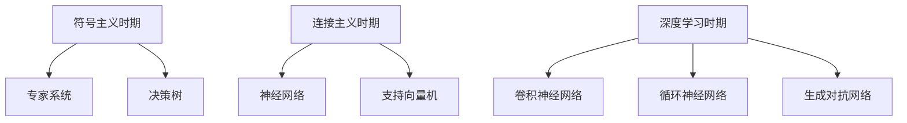
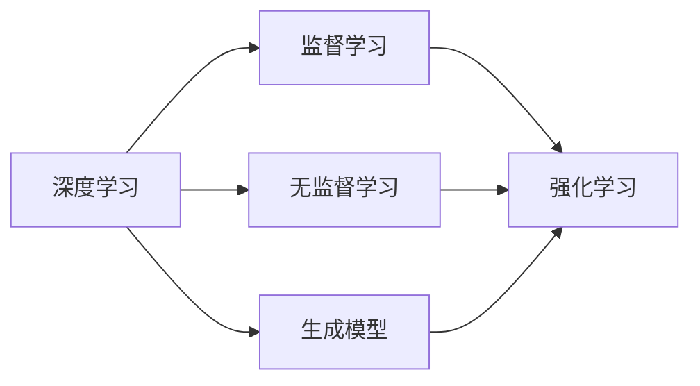
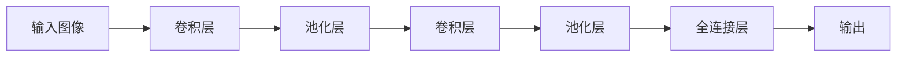

# AI人工智能核心算法原理与代码实例讲解：通用问题求解

## 1.背景介绍

在当今科技飞速发展的时代,人工智能(AI)已经渗透到了我们生活的方方面面。无论是推荐系统、语音识别、图像处理还是游戏AI,都离不开强大的算法支撑。作为通用问题求解的核心,AI算法为各种应用提供了强有力的动力。

人工智能算法的发展经历了从早期的符号主义到现代的连接主义和深度学习的漫长历程。从20世纪50年代开始,AI开始萌芽,逐步发展出专家系统、决策树等算法。进入21世纪后,机器学习、深度学习等新兴技术的兴起,推动了AI算法的飞速发展。

### 1.1 AI算法发展历程



### 1.2 AI算法应用领域

现代AI算法已经广泛应用于各个领域,包括但不限于:

- 计算机视觉: 图像分类、目标检测、语义分割等
- 自然语言处理: 机器翻译、文本生成、情感分析等
- 推荐系统: 个性化推荐、协同过滤等
- 机器人控制: 路径规划、运动控制等
- 游戏AI: 博弈树搜索、强化学习等

## 2.核心概念与联系  

在探讨具体算法之前,我们先来了解一些AI算法中的核心概念和它们之间的关联。

### 2.1 监督学习

监督学习是机器学习中最常见的一种范式。在监督学习中,算法会基于一组已标记的训练数据(输入和期望输出),学习一个函数,从而能够对新的未标记数据做出预测。常见的监督学习算法包括:

- 线性回归
- 逻辑回归
- 决策树
- 支持向量机
- 神经网络

### 2.2 无监督学习

与监督学习不同,无监督学习算法不需要标记数据,它们从未标记的数据中发现潜在的模式和结构。常见的无监督学习算法包括:

- 聚类算法(K-Means、层次聚类等)
- 关联规则挖掘
- 降维算法(PCA、t-SNE等)

### 2.3 强化学习

强化学习是一种基于奖励的学习范式。智能体(Agent)通过与环境交互,采取行动并获得奖励或惩罚,从而学习到一种最优策略。强化学习广泛应用于机器人控制、游戏AI等领域。常见的强化学习算法包括:

- Q-Learning
- Sarsa
- 策略梯度
- 深度Q网络(DQN)

### 2.4 生成模型

生成模型是一类旨在从底层数据分布中生成新的样本的算法。与判别模型(如分类器)不同,生成模型更关注于捕捉数据的概率分布。常见的生成模型包括:

- 高斯混合模型(GMM)
- 隐马尔可夫模型(HMM)
- 变分自编码器(VAE)
- 生成对抗网络(GAN)

### 2.5 核心概念关联

上述核心概念之间存在着密切的联系。例如,监督学习和无监督学习可以作为强化学习的辅助技术,生成模型也可以与其他范式相结合。此外,深度学习作为一种强大的技术,已广泛应用于上述各种学习范式中。



## 3.核心算法原理具体操作步骤

在了解了核心概念之后,我们来深入探讨一些具体的算法原理和操作步骤。

### 3.1 线性回归

线性回归是一种基础的监督学习算法,用于预测连续值目标变量。其基本思想是找到一条最佳拟合直线,使得数据点到直线的残差平方和最小。

算法步骤:

1) 准备数据: 获取自变量 $X$ 和因变量 $y$ 的数据集
2) 定义模型: $y = \theta_0 + \theta_1 x_1 + ... + \theta_n x_n$
3) 定义损失函数: $J(\theta) = \frac{1}{2m}\sum_{i=1}^m(h_\theta(x^{(i)}) - y^{(i)})^2$
4) 使用梯度下降优化: $\theta_j := \theta_j - \alpha \frac{\partial}{\partial \theta_j}J(\theta)$
5) 重复4)直到收敛
6) 使用训练好的模型进行预测

### 3.2 逻辑回归

逻辑回归是一种常用的分类算法,用于预测离散值目标变量。它通过对数几率(logit)函数将输入映射到0到1之间,从而得到概率输出。

算法步骤:

1) 准备数据: 获取特征向量 $X$ 和类别标签 $y$
2) 定义模型: $h_\theta(x) = g(\theta^T x) = \frac{1}{1 + e^{-\theta^T x}}$
3) 定义损失函数: $J(\theta) = -\frac{1}{m}\sum_{i=1}^m[y^{(i)}\log(h_\theta(x^{(i)})) + (1-y^{(i)})\log(1-h_\theta(x^{(i)}))]$
4) 使用梯度下降优化: $\theta_j := \theta_j - \alpha \frac{\partial}{\partial \theta_j}J(\theta)$  
5) 重复4)直到收敛
6) 使用训练好的模型进行分类: $y = \begin{cases} 1 & \text{if } h_\theta(x) \geq 0.5 \\ 0 & \text{otherwise} \end{cases}$

### 3.3 决策树

决策树是一种常用的监督学习算法,可用于分类和回归任务。它通过递归地构建决策树,将特征空间划分为互不相交的区域。

构建决策树的步骤:

1) 从根节点开始
2) 对于每个节点:
    - 计算所有可能的分割点的信息增益/基尼指数
    - 选择最优分割点
3) 重复2)直到满足停止条件(如最大深度、最小样本数等)
4) 构建完整的决策树

使用决策树进行预测:

1) 从根节点开始
2) 对于每个内部节点:
    - 检查对应特征值
    - 根据分割条件移动到子节点
3) 到达叶节点时,返回该节点对应的预测值

### 3.4 支持向量机(SVM)

支持向量机是一种强大的监督学习模型,主要用于分类任务。它的基本思想是在高维空间中构建一个超平面,将不同类别的数据点分开,同时最大化两类数据点到超平面的距离。

SVM算法步骤:

1) 准备数据: 获取特征向量 $X$ 和类别标签 $y$
2) 选择核函数: 线性核、多项式核、高斯核等
3) 构造拉格朗日函数: $L(\alpha) = \sum_{i=1}^N\alpha_i - \frac{1}{2}\sum_{i,j=1}^N\alpha_i\alpha_jy_iy_jK(x_i,x_j)$
4) 使用SMO算法求解对偶问题,获得最优 $\alpha^*$
5) 计算分隔超平面: $w = \sum_{i=1}^N\alpha_i^*y_ix_i, b = y_j - \sum_{i=1}^Ny_i\alpha_i^*K(x_i,x_j)$
6) 对新数据 $x$ 进行预测: $y = \text{sign}(w^Tx + b)$

### 3.5 神经网络

神经网络是一种强大的机器学习模型,可用于各种任务,如分类、回归、聚类等。它模仿生物神经元的工作原理,通过层层传递和变换信息来学习数据的内在规律。

前馈神经网络训练步骤:

1) 准备数据: 获取输入 $X$ 和标签 $y$
2) 初始化网络权重和偏置
3) 前向传播:
    - 计算每层输出: $z^{(l+1)} = W^{(l)}a^{(l)} + b^{(l)}$
    - 计算每层激活值: $a^{(l+1)} = g(z^{(l+1)})$
4) 计算输出层损失函数: $J(W,b)$
5) 反向传播:
    - 计算输出层误差: $\delta^{(n_l)} = \nabla_a^{(n_l)}J(W,b) \odot g'(z^{(n_l)})$
    - 计算隐层误差: $\delta^{(l)} = ((W^{(l)})^T\delta^{(l+1)}) \odot g'(z^{(l)})$
    - 更新权重和偏置: $W^{(l)} := W^{(l)} - \alpha\delta^{(l+1)}(a^{(l)})^T, b^{(l)} := b^{(l)} - \alpha\delta^{(l+1)}$
6) 重复3-5直到收敛
7) 使用训练好的网络进行预测

### 3.6 卷积神经网络(CNN)

卷积神经网络是一种专门设计用于处理网格结构数据(如图像)的神经网络。它通过卷积、池化等操作来提取特征,并最终进行分类或回归。

CNN的基本结构:



CNN的训练过程:

1) 准备数据: 获取输入图像 $X$ 和标签 $y$
2) 初始化卷积核权重和偏置
3) 前向传播:
    - 卷积层: 执行卷积操作提取特征
    - 池化层: 执行池化操作降低特征维度
    - 全连接层: 将特征展平,进行分类/回归
4) 计算输出层损失函数: $J(W,b)$  
5) 反向传播:
    - 计算全连接层误差
    - 反向传播到卷积层和池化层
    - 更新卷积核权重和偏置
6) 重复3-5直到收敛
7) 使用训练好的CNN进行预测

### 3.7 循环神经网络(RNN)

循环神经网络是一种专门设计用于处理序列数据(如文本、语音等)的神经网络。它通过内部循环连接来捕获序列中的长期依赖关系。

RNN的基本结构:

```mermaid
graph LR
    A[输入X_t] --> B[隐藏层h_t]
    B --> C[输出y_t]
    B --> D[隐藏层h_{t+1}]
    D --> B
```

RNN的训练过程:

1) 准备数据: 获取输入序列 $X$ 和标签序列 $y$
2) 初始化RNN权重和偏置
3) 前向传播:
    - 计算每个时间步的隐藏状态: $h_t = f_W(x_t, h_{t-1})$
    - 计算每个时间步的输出: $y_t = g(h_t)$
4) 计算输出序列损失函数: $J(W,b)$
5) 反向传播:
    - 计算每个时间步的误差
    - 反向传播更新权重和偏置
6) 重复3-5直到收敛
7) 使用训练好的RNN进行序列预测

### 3.8 生成对抗网络(GAN)

生成对抗网络是一种用于生成式建模的算法,由生成器网络和判别器网络组成。生成器从潜在空间中采样,生成新的样本;判别器则判断样本是真实数据还是生成数据。两个网络相互对抗,最终达到生成高质量样本的目的。

GAN的训练过程:

1) 初始化生成器 $G$ 和判别器 $D$ 的权重
2) 对于训练迭代:
    - 从真