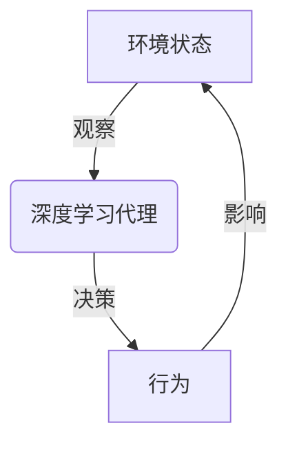
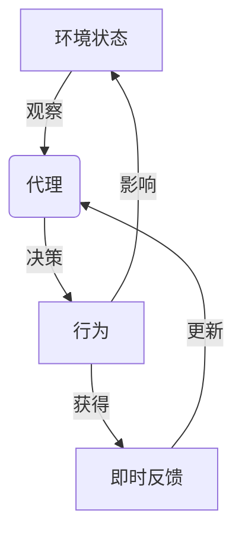
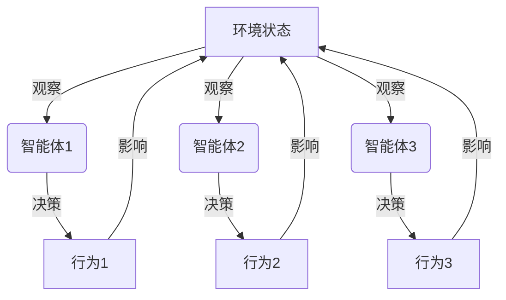

# AI人工智能深度学习算法：智能深度学习代理在电子商务中的应用策略

## 1.背景介绍

### 1.1 电子商务的崛起与挑战

随着互联网技术的不断发展,电子商务已经成为一种主流的商业模式,给人们的生活带来了极大的便利。根据统计数据显示,2022年全球电子商务市场规模已经超过5万亿美元,预计未来几年仍将保持两位数的增长率。然而,电子商务的快速发展也带来了一些新的挑战,例如:

- 信息过载:网上商品种类繁多,消费者很难从海量信息中找到自己真正需要的商品。
- 用户体验差:传统的电商平台只能提供基于关键词搜索的服务,无法真正理解用户的个性化需求。
- 决策困难:面对同类商品的种种选择,消费者往往很难做出理性的购买决策。

### 1.2 人工智能在电子商务中的应用

为了解决上述挑战,人工智能技术应运而生并在电子商务领域得到了广泛应用。利用机器学习、深度学习等技术,电商平台可以更好地理解用户需求、优化商品推荐、提升用户体验。其中,智能深度学习代理(Intelligent Deep Learning Agent)是一种新兴的人工智能技术,它通过构建端到端的深度学习模型,能够自主地从用户行为数据中学习,并做出智能化的决策和行动,为用户提供更加个性化和智能化的服务。

## 2.核心概念与联系

### 2.1 深度学习代理

深度学习代理(Deep Learning Agent)是一种基于深度学习技术的智能体,能够感知环境状态,并根据这些状态通过神经网络模型选择相应的行为,从而达到预期目标。与传统的基于规则的系统不同,深度学习代理能够自主学习,不断优化自身的决策模型。

### 2.2 强化学习

强化学习(Reinforcement Learning)是深度学习代理学习的核心机制。在这种学习范式下,代理通过与环境进行交互,获得即时反馈(奖励或惩罚),并根据这些反馈不断调整自身的策略模型,从而达到最大化长期累积奖励的目标。

### 2.3 多智能体系统

在复杂的电子商务场景中,通常需要多个智能体协同工作,形成一个多智能体系统(Multi-Agent System)。每个智能体负责不同的子任务,通过相互协作来完成整体目标。例如,一个智能体负责商品推荐,另一个智能体负责用户对话交互,它们相互配合为用户提供个性化的购物体验。

## 3.核心算法原理具体操作步骤

智能深度学习代理在电子商务中的应用,主要涉及以下几个关键步骤:

### 3.1 状态表示

首先需要将电子商务场景中的各种信息转换为代理可以理解的状态表示,包括用户的历史行为、商品信息、上下文环境等。常用的状态表示方法有:

- 离散状态表示:将状态离散化为有限个状态值。
- 连续状态表示:使用实数向量表示状态。
- 图像状态表示:将状态信息编码为图像数据。

### 3.2 奖励函数设计

接下来需要设计合理的奖励函数,将代理的行为映射到对应的即时奖励值。奖励函数的设计直接关系到代理的学习目标,需要根据具体的应用场景进行定制。例如在商品推荐场景中,可以将用户的购买行为作为正向奖励,将用户的跳出行为作为负向惩罚。

### 3.3 策略模型构建

利用深度神经网络构建代理的策略模型,该模型接收状态表示作为输入,输出代理在当前状态下可执行的各种行为的概率分布。常用的策略模型有:

- 深度Q网络(DQN):使用Q值估计每个状态-行为对的价值,选择Q值最大的行为。
- 策略梯度(Policy Gradient):直接学习状态到行为的映射策略。
- 演员-评论家(Actor-Critic):将策略模型和价值模型分开训练。

### 3.4 模型训练

使用强化学习算法(如Q-Learning、Sarsa、A3C等)训练策略模型,通过不断的试错与奖惩,让代理逐步学习到最优策略。训练过程中可以采用各种技巧来提升训练效率,如经验回放(Experience Replay)、目标网络(Target Network)、优先经验回放(Prioritized Experience Replay)等。

### 3.5 策略执行与更新

将训练好的策略模型部署到线上系统中,代理根据当前状态执行相应的行为。同时,代理还需要不断地从线上数据中学习,持续优化和更新策略模型,以适应电子商务环境的动态变化。

## 4.数学模型和公式详细讲解举例说明

### 4.1 马尔可夫决策过程

智能代理与环境的交互过程可以用马尔可夫决策过程(Markov Decision Process, MDP)来刻画。MDP通常定义为一个五元组 $\langle\mathcal{S}, \mathcal{A}, \mathcal{P}, \mathcal{R}, \gamma\rangle$:

- $\mathcal{S}$是状态集合
- $\mathcal{A}$是行为集合
- $\mathcal{P}$是状态转移概率,即 $\mathcal{P}_{ss'}^a = \mathbb{P}[S_{t+1}=s'|S_t=s, A_t=a]$
- $\mathcal{R}$是奖励函数,即 $\mathcal{R}_s^a = \mathbb{E}[R_{t+1}|S_t=s, A_t=a]$
- $\gamma \in [0, 1)$是折现因子,用于平衡即时奖励和长期奖励

代理的目标是学习一个策略 $\pi: \mathcal{S} \rightarrow \mathcal{A}$,使得期望的累积折现奖励最大化:

$$
J(\pi) = \mathbb{E}_\pi\left[\sum_{t=0}^\infty \gamma^t R_{t+1}\right]
$$

### 4.2 Q-Learning算法

Q-Learning是一种常用的无模型强化学习算法,它不需要事先知道MDP的转移概率和奖励函数,而是通过与环境的实际交互来学习状态-行为对的价值函数 $Q(s, a)$,并根据这个价值函数来选择行为。

Q-Learning的更新规则为:

$$
Q(s_t, a_t) \leftarrow Q(s_t, a_t) + \alpha\left[r_{t+1} + \gamma\max_a Q(s_{t+1}, a) - Q(s_t, a_t)\right]
$$

其中 $\alpha$ 是学习率,控制了新知识对旧知识的影响程度。

在实际应用中,我们通常使用深度神经网络来逼近 $Q(s, a)$ 函数,这就是深度Q网络(Deep Q-Network, DQN)算法。DQN在 Atari 游戏中取得了突破性的成果,证明了深度强化学习在高维观察空间中的优越性能。

### 4.3 策略梯度算法

除了基于价值函数的算法,我们还可以直接学习策略 $\pi_\theta(a|s)$,这种方法称为策略梯度(Policy Gradient)算法。策略梯度的目标是最大化期望的累积奖励:

$$
J(\theta) = \mathbb{E}_{\pi_\theta}\left[\sum_{t=0}^\infty \gamma^t R_{t+1}\right]
$$

根据策略梯度定理,我们可以计算梯度 $\nabla_\theta J(\theta)$,并使用梯度上升法来更新策略参数 $\theta$:

$$
\nabla_\theta J(\theta) = \mathbb{E}_{\pi_\theta}\left[\sum_{t=0}^\infty \nabla_\theta\log\pi_\theta(a_t|s_t)Q^{\pi_\theta}(s_t, a_t)\right]
$$

其中 $Q^{\pi_\theta}(s_t, a_t)$ 是在策略 $\pi_\theta$ 下,状态 $s_t$ 执行行为 $a_t$ 后的期望累积奖励。

策略梯度算法通常使用参数化的策略模型(如神经网络)来逼近 $\pi_\theta(a|s)$,并根据上述梯度公式来更新模型参数。

### 4.4 演员-评论家算法

演员-评论家(Actor-Critic)算法将策略模型(Actor)和价值函数模型(Critic)分开训练,结合了两者的优点。

- 演员(Actor)模型 $\pi_\theta(a|s)$ 根据策略梯度公式来更新,学习状态到行为的映射策略。
- 评论家(Critic)模型 $V_w(s)$ 根据时序差分(TD)学习来更新,估计每个状态的价值函数。

演员和评论家相互依赖:演员需要评论家提供的价值函数来计算策略梯度,而评论家需要演员生成的行为来计算时序差分目标。

Actor-Critic算法的优点在于同时利用了价值函数和策略梯度的信息,从而可以获得更加稳定和高效的学习过程。

## 5.项目实践:代码实例和详细解释说明

为了更好地理解智能深度学习代理在电子商务中的应用,我们以一个基于DQN算法的商品推荐系统为例,介绍具体的项目实践过程。

### 5.1 问题描述

我们的目标是设计一个智能推荐系统,为电商网站的用户推荐感兴趣的商品。系统的输入是用户的历史浏览记录和购买记录,输出是一个推荐商品列表。我们希望这个推荐系统能够:

1. 理解用户的个性化兴趣偏好
2. 根据用户的当前需求做出精准推荐
3. 提高用户的购买转化率和满意度

### 5.2 状态表示

我们将用户的历史浏览记录和购买记录编码为一个向量,作为状态的表示。具体来说,对于每个商品类别,我们统计用户浏览该类别商品的次数和购买该类别商品的次数,将这两个数值拼接为一个向量。所有商品类别的向量再拼接起来,就形成了最终的状态表示向量。

### 5.3 奖励函数设计

我们将用户的购买行为作为正向奖励,奖励值设置为1。如果用户没有购买而是跳出了推荐页面,则视为负向惩罚,惩罚值设置为-1。其他情况下,奖励值为0。

### 5.4 DQN模型构建

我们使用一个四层的全连接神经网络作为DQN的Q网络,其中输入层的维度等于状态向量的维度,输出层的维度等于可推荐商品的数量(即行为空间的大小)。中间有两层隐藏层,使用ReLU激活函数。

为了提高训练效率和稳定性,我们采用以下技巧:

- 经验回放(Experience Replay):将代理与环境的交互存储在经验池中,并从中随机采样批数据进行训练,避免数据相关性。
- 目标网络(Target Network):使用一个单独的目标网络来计算Q值目标,并定期从Q网络复制参数到目标网络,提高训练稳定性。
- $\epsilon$-贪婪策略(Epsilon-Greedy Policy):在训练过程中,以一定概率 $\epsilon$ 选择随机行为,保证探索空间。

### 5.5 模