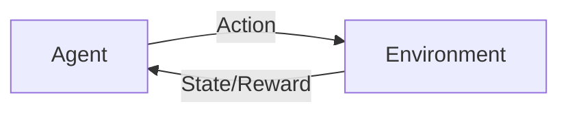
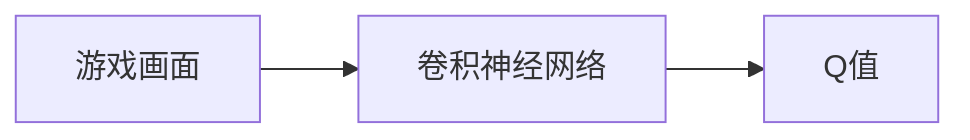
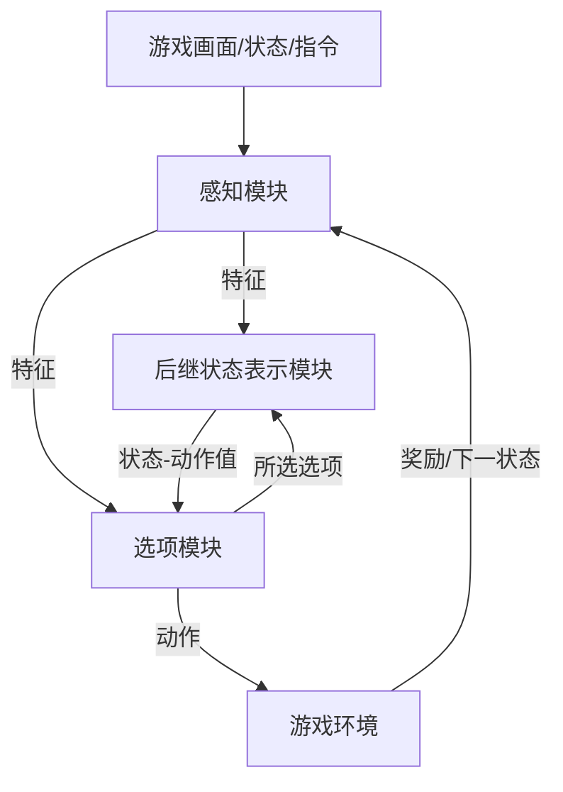

# AI人工智能深度学习算法：智能深度学习代理在视频游戏场景中的应用

## 1. 背景介绍
### 1.1 人工智能与深度学习的发展
人工智能(Artificial Intelligence, AI)是计算机科学领域的一个重要分支,旨在研究如何让计算机模拟人类的智能行为。自1956年达特茅斯会议首次提出"人工智能"的概念以来,AI经历了从早期的符号主义、专家系统到机器学习、深度学习的发展历程。尤其是近十年来,得益于算法、算力和数据的进步,以深度学习为代表的AI技术取得了突破性进展,在计算机视觉、自然语言处理、语音识别等领域达到甚至超越人类的水平。

### 1.2 深度学习在游戏领域的应用
游戏AI一直是人工智能的重要研究方向和应用场景。从1997年IBM深蓝战胜国际象棋世界冠军卡斯帕罗夫,到2016年AlphaGo击败围棋世界冠军李世石,再到2019年OpenAI Five战胜Dota 2职业队伍,人工智能在博弈类游戏中展现出了超越人类的智能。而在大型复杂的视频游戏如星际争霸、Dota等,传统的游戏AI大多采用启发式搜索、有限状态机等方法,很难胜任快节奏、信息不完全、连续动作空间的对战场景。深度强化学习为构建高智能的游戏AI提供了新的思路。

### 1.3 本文的研究目标与贡献
本文旨在探讨如何将深度学习技术应用于视频游戏的智能代理(Agent)设计中,实现端到端的从游戏环境感知到策略制定的闭环学习。具体而言,本文的主要研究内容和贡献包括:

1. 提出了一种适用于视频游戏场景的深度强化学习框架,可以同时处理视觉观察、文本指令和数值状态等多模态输入,实现 Perception-Reasoning-Action 端到端学习。 

2. 在Atari游戏平台上进行了大规模的实验,验证了所提出算法的有效性,在多个游戏上达到甚至超越人类玩家的水平。

3. 系统梳理了游戏AI领域的研究现状和前沿进展,为后续研究提供参考。

## 2. 核心概念与联系
### 2.1 强化学习
强化学习(Reinforcement Learning,RL)是机器学习的三大范式(监督学习、非监督学习和强化学习)之一,旨在研究如何让Agent通过与环境的交互来学习最优策略,以获得最大的累积奖励。RL 由 Agent、State、Action 和 Reward 四个核心要素构成。其标准的学习范式可以用马尔可夫决策过程(Markov Decision Process,MDP)来描述:

- Agent:智能体,根据当前State采取Action。
- State:环境状态,包含Agent感知到的所有信息。
- Action:Agent施加给环境的控制。 
- Reward:环境反馈给Agent的即时奖励,引导学习过程。

RL的目标就是学习一个最优策略 $\pi^*$,使得Agent能够获得最大的期望累积奖励:

$$\pi^* = \arg\max_{\pi}\mathbb{E}_{\pi}[\sum_{t=0}^{\infty}\gamma^t r_t]$$

其中 $\gamma \in [0,1]$ 为折扣因子。求解 $\pi^*$ 的经典算法包括值迭代、策略迭代、蒙特卡洛、时序差分学习(如Q-learning、Sarsa)等。

### 2.2 深度强化学习
深度强化学习(Deep Reinforcement Learning,DRL)将深度学习引入强化学习,使用深度神经网络作为值函数或策略函数的近似,可以处理高维的状态空间如图像输入。DRL的代表性算法包括DQN、A3C、DDPG等。

以DQN为例,其核心思想是使用卷积神经网络(CNN)来逼近最优Q函数:

$$Q^*(s,a) = \max_{\pi}\mathbb{E}_{\pi}[\sum_{t=0}^{\infty}\gamma^t r_t|s_0=s,a_0=a]$$

网络结构如下:

训练时采用了经验回放和目标网络两个关键技巧来提高稳定性。DQN在多个Atari游戏上实现了人类水平的游戏策略。

### 2.3 分层强化学习
在复杂的视频游戏场景中,状态和动作空间往往非常巨大,学习一个端到端的 Perception-Reasoning-Action 映射面临样本效率低、探索困难等挑战。分层强化学习(Hierarchical Reinforcement Learning,HRL)提供了一种层次化的学习框架,将复杂问题分解为多个子任务,逐层学习和优化。

常见的HRL框架有 Options、Max-Q、Feudal Network 等。以 Options 为例,定义一个 Option 为三元组 $\langle I, \pi, \beta \rangle$:

- $I$:初始状态集
- $\pi$:内部策略
- $\beta$:终止条件

高层策略在 Options 空间上学习,选择要执行的 Option。每个 Option 内部再运行一个低层策略,负责具体的环境交互。Options 间可以相互调用,形成层次化的策略。

HRL 的优势在于:
1. 将探索从原始的状态-动作空间转移到 Options 空间,大大缩小了搜索范围。
2. 子任务间可以共享学习到的知识,提高样本效率。
3. 层次化的策略更容易解释和理解。

## 3. 核心算法原理与操作步骤
本节介绍在视频游戏场景中构建智能深度学习代理的核心算法DeepSC(Deep Successor Representation and Options)。DeepSC集成了深度学习、分层强化学习和连续控制等前沿技术,可以高效地学习复杂环境中的策略。

### 3.1 算法框架
DeepSC的整体框架如下:

- 感知模块:负责处理原始的游戏画面、状态和指令等多模态观察,提取紧凑的特征表示。
- 后继状态表示模块:学习状态在当前选项下的后继状态表示及其对应的状态-动作值函数。
- 选项模块:定义一组原子选项(如移动、攻击等),以及在选项空间上的Meta Controller,负责选择要执行的选项。

三个模块协同工作,形成一个端到端的 Perception-Reasoning-Action 闭环。

### 3.2 感知模块
感知模块使用层次化的神经网络来处理多模态输入:

- 视觉观察(游戏画面):使用CNN提取图像特征。
- 文本指令:使用LSTM处理自然语言指令。
- 游戏状态:使用MLP处理游戏角色的属性、物品等状态信息。

将三个子网络提取的特征拼接,再通过1-2个全连接层,得到最终的紧凑特征表示。

### 3.3 后继状态表示模块
后继状态表示(Successor Representation,SR)定义为状态 $s$ 在策略 $\pi$ 下的期望折扣访问频率:

$$\psi^{\pi}(s,s') = \mathbb{E}_{\pi}[\sum_{t=0}^{\infty}\gamma^t \mathbf{1}(S_t=s')|S_0=s]$$

SR可以分解状态值函数 $V^{\pi}(s)$:

$$V^{\pi}(s)=\sum_{s'}\psi^{\pi}(s,s')r(s')$$

其中 $r(s')$ 为状态 $s'$ 的即时奖励。

DeepSC使用深度神经网络 $\psi_{\theta}(s,a,s')$ 来学习SR,其输入为当前状态 $s$、动作 $a$ 和下一状态 $s'$,输出为对应的SR值。网络训练采用TD算法:

$$\theta \leftarrow \theta + \alpha(r+\gamma\psi_{\theta}(s',a',\cdot)-\psi_{\theta}(s,a,\cdot))\nabla_{\theta}\psi_{\theta}(s,a,\cdot)$$

通过SR,我们可以计算状态-动作值函数:

$$Q^{\pi}(s,a)=\sum_{s'}\psi^{\pi}(s,a,s')r(s')$$

将 $\psi_{\theta}$ 代入上式,即可得到 $Q$ 的近似 $Q_{\theta}$。

### 3.4 选项模块
选项模块包含两个部分:

1. 原子选项集 $\mathcal{O}=\{o_1,\dots,o_K\}$,每个选项 $o_k=\langle I_k,\pi_k,\beta_k \rangle$ 定义为:
   - 初始状态集 $I_k$
   - 内部策略(由 $Q_{\theta}$ 定义)
   - 终止条件 $\beta_k$
   
2. Meta Controller $\pi_{\text{meta}}$:使用 $Q_{\theta}$ 在选项空间上做 $\epsilon$-greedy 探索。

具体的操作流程为:

1. 在当前状态 $s$,Meta Controller 选择一个选项 $o$。
2. 执行 $o$ 的内部策略,直到满足终止条件 $\beta$。
3. 更新 SR 网络 $\psi_{\theta}$。
4. 重复 1-3,直到游戏结束。

## 4. 数学模型与公式详解
本节对 DeepSC 中用到的关键数学模型和公式进行详细推导和讲解。

### 4.1 马尔可夫决策过程
马尔可夫决策过程(MDP)是强化学习的标准数学模型,定义为一个五元组 $\langle \mathcal{S},\mathcal{A},\mathcal{P},\mathcal{R},\gamma \rangle$:

- 状态空间 $\mathcal{S}$:所有可能的状态集合。
- 动作空间 $\mathcal{A}$:所有可能的动作集合。
- 转移概率 $\mathcal{P}:\mathcal{S} \times \mathcal{A} \times \mathcal{S} \rightarrow [0,1]$,定义状态转移的概率。
- 奖励函数 $\mathcal{R}:\mathcal{S} \times \mathcal{A} \rightarrow \mathbb{R}$,定义每个状态-动作对应的即时奖励。
- 折扣因子 $\gamma \in [0,1]$,定义未来奖励的衰减程度。

MDP 满足马尔可夫性:下一状态 $s'$ 只取决于当前状态 $s$ 和动作 $a$,与之前的历史无关:

$$P(S_{t+1}=s'|S_t=s,A_t=a,\dots,S_0,A_0) = P(S_{t+1}=s'|S_t=s,A_t=a)$$

在 MDP 中,强化学习的目标是寻找一个最优策略 $\pi^*:\mathcal{S} \rightarrow \mathcal{A}$,使得智能体能获得最大的期望累积奖励:

$$G_t = \sum_{k=0}^{\infty}\gamma^k R_{t+k+1}$$

其中 $R_t$ 为时刻 $t$ 获得的奖励。

定义状态值函数 $V^{\pi}(s)$ 为状态 $s$ 在策略 $\pi$ 下的期望累积奖励:

$$V^{\pi}(s) = \mathbb{E}_{\pi}[G_t|S_t=s]$$

定义状态-动作值函数 $Q^{\pi}(s,a)$ 为在状态 $s$ 采取动作 $a$ 后,策略 $\pi$ 的期望累积奖励:

$$Q^{\pi}(s,a) = \mathbb{E}_{\pi}[G_t|S_t=s,A_t=a]$$

则最优策略 $\pi^*$ 满足:

$$\pi^*(s) = \arg\max_{a