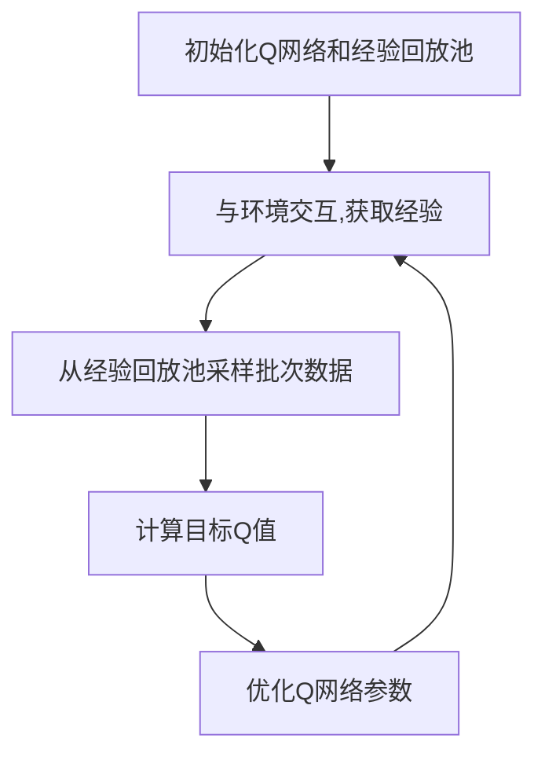
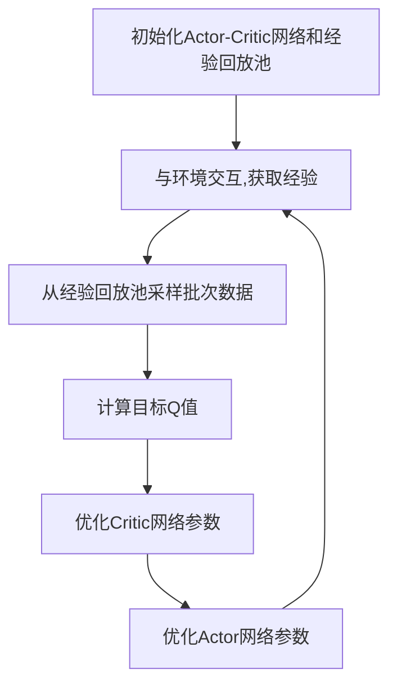

# AI人工智能深度学习算法：智能深度学习代理的代理通信与协作模型概览

## 1.背景介绍

### 1.1 人工智能的崛起

人工智能(AI)是当前科技发展的热点领域之一,其影响力已经渗透到我们生活的方方面面。从语音助手到自动驾驶汽车,从医疗诊断到金融风险评估,人工智能系统正在不断优化和改善我们的生活体验。然而,随着人工智能系统变得越来越复杂,单一智能体的能力已经无法满足现实世界的多样化需求。因此,多智能体系统(Multi-Agent Systems)的概念应运而生。

### 1.2 多智能体系统的兴起

多智能体系统是一种由多个自治智能体组成的分布式人工智能系统。每个智能体都具有自己的目标、知识和行为策略,但它们需要相互协作以实现共同的目标。这种系统在复杂环境下表现出了更好的鲁棒性、灵活性和可扩展性。多智能体系统已经被广泛应用于机器人协作、智能交通系统、网络安全等领域。

### 1.3 智能深度学习代理的重要性

在多智能体系统中,每个智能体都需要具备一定的学习能力,以适应动态环境的变化。深度学习作为一种强大的机器学习技术,已经在许多领域取得了巨大的成功。将深度学习技术应用于多智能体系统,可以赋予每个智能体更强的学习和决策能力,从而提高整个系统的性能。因此,研究智能深度学习代理的通信与协作模型,对于构建高效、智能的多智能体系统至关重要。

## 2.核心概念与联系

### 2.1 智能代理(Intelligent Agent)

在人工智能领域,代理(Agent)是指能够感知环境、作出决策并采取行动的自治实体。智能代理则是指具有一定智能水平的代理,能够根据环境状态和内部知识做出合理的决策和行为。

智能代理通常包含以下几个核心组件:

- 感知器(Sensors):用于获取环境信息
- 执行器(Actuators):用于执行代理的行为
- 知识库(Knowledge Base):存储代理的知识和规则
- 决策引擎(Decision Engine):根据感知信息和知识库做出决策

### 2.2 深度学习代理(Deep Learning Agent)

深度学习代理是指将深度学习技术应用于智能代理的一种代理类型。深度学习可以赋予代理强大的学习能力,使其能够从数据中自动提取特征,并根据这些特征做出决策和行为。

深度学习代理通常包含以下核心组件:

- 深度神经网络(Deep Neural Network):用于从数据中学习特征表示
- 强化学习算法(Reinforcement Learning Algorithm):根据环境反馈调整神经网络参数,优化决策策略
- 经验回放池(Experience Replay Buffer):存储代理与环境的交互经验,用于训练神经网络

### 2.3 多智能体系统(Multi-Agent System)

多智能体系统是由多个智能代理组成的分布式系统,这些代理需要相互协作以实现共同的目标。在多智能体系统中,每个代理都拥有自己的感知、决策和行为能力,但它们也需要与其他代理进行通信和协作,以完成复杂的任务。

多智能体系统中的核心挑战包括:

- 代理通信协议(Agent Communication Protocols)
- 任务分配和协调(Task Allocation and Coordination)
- 冲突解决和谈判(Conflict Resolution and Negotiation)
- 集体决策(Collective Decision Making)

### 2.4 代理通信与协作模型(Agent Communication and Cooperation Model)

代理通信与协作模型描述了多智能体系统中代理之间如何进行信息交换和行为协调。一个好的通信协作模型对于提高系统的效率和鲁棒性至关重要。

常见的代理通信协作模型包括:

- 基于规则的协作模型(Rule-based Cooperation Model)
- 基于市场的协作模型(Market-based Cooperation Model)
- 基于组织的协作模型(Organization-based Cooperation Model)
- 基于学习的协作模型(Learning-based Cooperation Model)

其中,基于学习的协作模型是当前研究的热点,它利用机器学习技术(如深度强化学习)来自动学习代理之间的最优通信协作策略。

## 3.核心算法原理具体操作步骤

### 3.1 深度学习代理的基本原理

深度学习代理的核心思想是将深度神经网络应用于智能代理的决策过程。具体来说,深度神经网络可以从代理与环境的交互数据中学习一个状态-行为映射函数,即给定当前的环境状态,预测代理应该采取的最佳行为。

深度学习代理的基本工作流程如下:

1. 初始化深度神经网络,通常采用卷积神经网络(CNN)或递归神经网络(RNN)等结构
2. 代理与环境交互,收集状态-行为-奖励的经验数据
3. 将经验数据存储在经验回放池中
4. 从经验回放池中采样批次数据,用于训练深度神经网络
5. 使用强化学习算法(如Q-Learning或策略梯度)更新神经网络参数
6. 重复步骤2-5,直到神经网络收敛

在这个过程中,强化学习算法的作用是根据代理获得的奖励信号,调整神经网络参数,使其学习到一个最优的状态-行为映射策略。

### 3.2 深度Q网络(Deep Q-Network, DQN)

Deep Q-Network是将深度学习与Q-Learning算法相结合的一种强化学习算法,被广泛应用于深度学习代理的训练。DQN的核心思想是使用一个深度神经网络来近似Q函数,即给定当前状态和可选行为,预测采取该行为后可获得的长期累积奖励。

DQN算法的具体步骤如下:

1. 初始化一个深度神经网络Q(s,a;θ),用于近似Q函数
2. 初始化经验回放池D
3. 对于每个时间步:
   a. 从当前状态s选择行为a,根据ε-贪婪策略
   b. 执行行为a,获得奖励r和新状态s'
   c. 将经验(s,a,r,s')存储到经验回放池D
   d. 从经验回放池D中随机采样一个批次数据
   e. 计算目标Q值:y = r + γ * max(Q(s',a';θ-))
   f. 优化神经网络参数θ,使得Q(s,a;θ)尽可能接近y
4. 重复步骤3,直到收敛

其中,θ-表示目标网络参数,是一个滞后更新的网络参数副本,用于估计目标Q值,提高训练稳定性。

DQN算法的关键创新点在于引入了经验回放池和目标网络,有效解决了传统Q-Learning算法中的不稳定性和发散问题。

### 3.3 多智能体深度确定性策略梯度(Multi-Agent Deep Deterministic Policy Gradient, MADDPG)

MADDPG是一种用于训练多智能体深度学习代理的强化学习算法,它基于确定性策略梯度算法(DDPG),并进行了扩展以支持多智能体场景。

MADDPG算法的核心思想是为每个代理训练一个独立的Actor-Critic网络,其中Actor网络用于生成行为,Critic网络用于评估当前状态和行为的价值。在训练过程中,每个代理不仅要考虑自己的行为,还要考虑其他代理的行为,从而学习到一个最优的联合策略。

MADDPG算法的具体步骤如下:

1. 初始化每个代理的Actor网络μ(s;θ^μ)和Critic网络Q(s,a;θ^Q)
2. 初始化经验回放池D
3. 对于每个时间步:
   a. 对于每个代理i:
      - 观察当前状态s
      - 选择行为a_i = μ_i(s_i;θ^μ_i)
   b. 执行联合行为a = (a_1, a_2, ..., a_N),获得奖励r和新状态s'
   c. 将经验(s,a,r,s')存储到经验回放池D
   d. 从经验回放池D中随机采样一个批次数据
   e. 对于每个代理i:
      - 计算目标Q值:y_i = r_i + γ * Q'_i(s',a'_1, ..., a'_N;θ^Q'_i)
      - 优化Critic网络参数θ^Q_i,使得Q_i(s,a;θ^Q_i)尽可能接近y_i
      - 优化Actor网络参数θ^μ_i,使得μ_i(s;θ^μ_i)最大化Q_i(s,μ_1(s), ..., μ_N(s);θ^Q_i)
4. 重复步骤3,直到收敛

其中,Q'_i和θ^Q'_i分别表示代理i的目标Critic网络和目标网络参数,用于估计目标Q值,提高训练稳定性。

MADDPG算法的关键创新点在于引入了中心化训练分散执行(Centralized Training with Decentralized Execution)的思想,即在训练阶段,每个代理可以访问所有代理的观测和行为信息,但在执行阶段,每个代理只依赖于自己的局部观测进行决策。这种方式可以有效解决多智能体场景下的非静态性和部分可观测性问题。

## 4.数学模型和公式详细讲解举例说明

### 4.1 马尔可夫决策过程(Markov Decision Process, MDP)

马尔可夫决策过程是强化学习算法的数学基础,用于描述代理与环境的交互过程。一个MDP可以用一个元组(S, A, P, R, γ)来表示,其中:

- S是状态空间,表示环境可能的状态集合
- A是行为空间,表示代理可以采取的行为集合
- P是状态转移概率函数,P(s'|s,a)表示在状态s执行行为a后,转移到状态s'的概率
- R是奖励函数,R(s,a)表示在状态s执行行为a后获得的即时奖励
- γ是折现因子,用于权衡即时奖励和长期累积奖励的重要性

在MDP中,代理的目标是找到一个最优策略π*,使得在任意初始状态s下,按照策略π*执行行为序列,可以最大化预期的长期累积奖励:

$$J(\pi) = \mathbb{E}_\pi\left[\sum_{t=0}^\infty \gamma^t R(s_t, a_t)\right]$$

其中,π是代理的策略函数,π(s)表示在状态s下采取的行为。

### 4.2 Q-Learning算法

Q-Learning是一种基于时序差分(Temporal Difference)的强化学习算法,用于估计状态-行为对的长期累积奖励值,即Q函数:

$$Q(s,a) = \mathbb{E}_\pi\left[\sum_{t=0}^\infty \gamma^t R(s_t, a_t) | s_0=s, a_0=a\right]$$

Q-Learning算法通过不断更新Q函数的估计值,逐步逼近真实的Q函数。具体的更新规则如下:

$$Q(s_t, a_t) \leftarrow Q(s_t, a_t) + \alpha \left[r_t + \gamma \max_{a'} Q(s_{t+1}, a') - Q(s_t, a_t)\right]$$

其中,α是学习率,用于控制更新步长;r_t是在时间步t获得的即时奖励;γ是折现因子;max_a' Q(s_{t+1}, a')是在下一状态s_{t+1}下,选择最优行为a'可获得的最大Q值。

通过不断更新Q函数,Q-Learning算法最