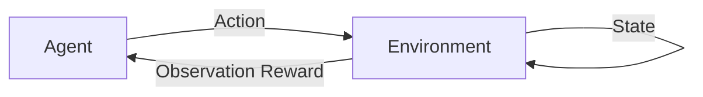

# AI人工智能深度学习算法：智能深度学习代理的自主行为与规划策略

## 1. 背景介绍

人工智能(Artificial Intelligence, AI)是计算机科学的一个分支,旨在创造能够执行通常需要人类智能的任务的智能机器。深度学习(Deep Learning, DL)是人工智能的一个子集,专注于使用多层神经网络从数据中学习。近年来,深度学习在计算机视觉、自然语言处理、语音识别等领域取得了巨大的成功。

然而,目前的深度学习系统大多是被动的,需要大量的人工标注数据进行训练,缺乏主动探索和自主学习的能力。为了进一步提升AI系统的智能水平,我们需要研究如何让深度学习代理(Agent)具备自主行为(Autonomous Behavior)和规划策略(Planning Strategy)的能力。本文将围绕这一主题展开探讨。

## 2. 核心概念与联系

在讨论智能深度学习代理的自主行为与规划策略之前,我们需要先了解一些核心概念:

- 代理(Agent):能感知环境并采取行动的实体,如机器人、自动驾驶汽车等。 
- 环境(Environment):代理所处的世界,提供观察(Observation)并接受代理的行动(Action)。
- 状态(State):环境在某一时刻的完整描述。马尔可夫决策过程假设下一个状态只取决于当前状态和行动。
- 观察(Observation):代理从环境中感知到的信息,通常是状态的一个子集。
- 行动(Action):代理施加于环境的作用,会导致环境状态的改变。
- 策略(Policy):将状态映射为行动的函数,即代理如何选择行动。
- 奖励(Reward):环境对代理行动的即时反馈,引导代理学习最优策略。
- 价值(Value):从某状态开始,代理按照某一策略行动,累积获得的期望奖励。

下图展示了这些概念之间的关系:



代理连续地感知环境,获得观察和奖励,并根据当前策略采取行动,行动导致环境状态变化,代理再次感知,如此循环往复。代理的目标是学习一个最优策略,使得从初始状态开始能获得最大的累积奖励。这就是强化学习(Reinforcement Learning)的基本框架。

## 3. 核心算法原理与具体操作步骤

为了让深度学习代理学习到最优策略,我们通常使用深度强化学习(Deep Reinforcement Learning, DRL)算法。DRL结合了深度学习和强化学习,使用深度神经网络来逼近策略函数或价值函数。

常见的DRL算法包括:

### 3.1 DQN (Deep Q-Network)

DQN使用深度神经网络来逼近最优的Q函数。Q函数 $Q(s,a)$ 表示在状态 $s$ 下采取行动 $a$ 的期望累积奖励。DQN的核心思想是最小化TD (Temporal-Difference) 误差:

$$L(\theta) = \mathbb{E}_{(s,a,r,s')\sim D}[(r + \gamma \max_{a'}Q(s',a';\theta^-) - Q(s,a;\theta))^2]$$

其中 $\theta$ 是当前网络的参数,$\theta^-$ 是目标网络的参数,$\gamma$ 是折扣因子。DQN的训练流程如下:

1. 初始化经验回放池 $D$,随机初始化Q网络参数 $\theta$。
2. 对每个episode循环:
   1. 初始化环境状态 $s_0$。 
   2. 对每个时间步 $t$ 循环:
      1. 使用 $\epsilon$-greedy 策略选择行动 $a_t$。
      2. 执行行动 $a_t$,观察奖励 $r_t$ 和下一状态 $s_{t+1}$。
      3. 将转移 $(s_t, a_t, r_t, s_{t+1})$ 存入 $D$。
      4. 从 $D$ 中随机采样一个批次的转移。
      5. 对每个采样的转移,计算TD目标 $y_i$:
         - 若 $s_{t+1}$ 是终止状态,则 $y_i = r_t$。
         - 否则, $y_i = r_t + \gamma \max_{a'}Q(s_{t+1},a';\theta^-)$。
      6. 最小化损失: $L(\theta) = \frac{1}{N} \sum_i (y_i - Q(s_t,a_t;\theta))^2$。
      7. 每 $C$ 步同步目标网络参数: $\theta^- \leftarrow \theta$。
      8. $s_t \leftarrow s_{t+1}$。

### 3.2 DDPG (Deep Deterministic Policy Gradient)

DDPG 是一种用于连续动作空间的无模型深度强化学习算法。它结合了DQN和Actor-Critic方法,使用一个Actor网络 $\mu(s;\theta^\mu)$ 来逼近最优确定性策略,一个Critic网络 $Q(s,a;\theta^Q)$ 来逼近状态-行动值函数。

DDPG的训练过程涉及对Actor网络和Critic网络交替进行更新:

1. Critic网络的更新与DQN类似,最小化TD误差:

$$L(\theta^Q) = \mathbb{E}_{(s,a,r,s')\sim D}[(r + \gamma Q(s',\mu(s';\theta^{\mu^-});\theta^{Q^-}) - Q(s,a;\theta^Q))^2]$$

2. Actor网络的更新使用Critic网络的梯度信息:

$$\nabla_{\theta^\mu} J \approx \mathbb{E}_{s\sim D}[\nabla_a Q(s,a;\theta^Q)|_{a=\mu(s;\theta^\mu)} \nabla_{\theta^\mu}\mu(s;\theta^\mu)]$$

DDPG算法的完整训练流程与DQN类似,同样使用经验回放和目标网络来提高训练稳定性。

## 4. 数学模型和公式详解

在本节,我们将详细讲解强化学习和深度强化学习中的一些关键数学模型和公式。

### 4.1 马尔可夫决策过程 (Markov Decision Process, MDP)

MDP 提供了一个标准的强化学习问题数学表述。一个MDP由一个元组 $\langle \mathcal{S}, \mathcal{A}, \mathcal{P}, \mathcal{R}, \gamma \rangle$ 定义:

- $\mathcal{S}$ 是有限的状态集合。 
- $\mathcal{A}$ 是有限的行动集合。
- $\mathcal{P}$ 是状态转移概率函数, $\mathcal{P}(s'|s,a) = \Pr(S_{t+1}=s'|S_t=s, A_t=a)$。
- $\mathcal{R}$ 是奖励函数, $\mathcal{R}(s,a) = \mathbb{E}[R_{t+1}|S_t=s, A_t=a]$。
- $\gamma \in [0,1]$ 是折扣因子,表示未来奖励的重要程度。

在MDP中,代理与环境交互,在每个时间步 $t$,代理处于状态 $S_t\in\mathcal{S}$,选择一个行动 $A_t\in\mathcal{A}$,环境根据 $\mathcal{P}$ 转移到下一个状态 $S_{t+1}$,并给予奖励 $R_{t+1}$。代理的目标是学习一个策略 $\pi(a|s)=\Pr(A_t=a|S_t=s)$,使得期望累积奖励最大化:

$$\mathbb{E}_\pi\left[\sum_{t=0}^\infty \gamma^t R_{t+1}\right]$$

### 4.2 贝尔曼方程 (Bellman Equation)

贝尔曼方程是动态规划的核心,描述了最优值函数所满足的递归关系。对于任意策略 $\pi$,其状态值函数 $V^\pi(s)$ 满足:

$$V^\pi(s) = \sum_a \pi(a|s) \sum_{s',r} p(s',r|s,a) [r + \gamma V^\pi(s')]$$

类似地,状态-行动值函数 $Q^\pi(s,a)$ 满足:

$$Q^\pi(s,a) = \sum_{s',r} p(s',r|s,a) [r + \gamma \sum_{a'} \pi(a'|s') Q^\pi(s',a')]$$

最优值函数 $V^*(s)$ 和 $Q^*(s,a)$ 满足贝尔曼最优方程:

$$V^*(s) = \max_a \sum_{s',r} p(s',r|s,a) [r + \gamma V^*(s')]$$

$$Q^*(s,a) = \sum_{s',r} p(s',r|s,a) [r + \gamma \max_{a'} Q^*(s',a')]$$

值函数和最优策略之间的关系为:

$$\pi^*(s) = \arg\max_a Q^*(s,a)$$

### 4.3 策略梯度定理 (Policy Gradient Theorem)

策略梯度定理给出了期望累积奖励 $J(\theta)$ 关于策略参数 $\theta$ 的梯度:

$$\nabla_\theta J(\theta) = \mathbb{E}_{\tau\sim p_\theta(\tau)} \left[ \sum_{t=0}^T \nabla_\theta \log \pi_\theta(a_t|s_t) Q^{\pi_\theta}(s_t,a_t) \right]$$

其中 $\tau=(s_0,a_0,r_1,s_1,\dots)$ 表示一条轨迹,$p_\theta(\tau)$ 是轨迹的概率密度函数。该定理告诉我们,通过以 $Q^{\pi_\theta}(s_t,a_t)$ 加权的 $\log \pi_\theta(a_t|s_t)$ 梯度来调整策略参数,可以提升期望累积奖励。这是REINFORCE等策略梯度算法的理论基础。

## 5. 项目实践：代码实例与详解

下面我们通过一个简单的 DQN 算法 Python 实现,来演示如何用深度强化学习解决经典的 CartPole 问题。完整代码如下:

```python
import gym
import math
import random
import numpy as np
import matplotlib.pyplot as plt
from collections import namedtuple
from itertools import count

import torch
import torch.nn as nn
import torch.optim as optim
import torch.nn.functional as F

env = gym.make('CartPole-v0').unwrapped

# 定义超参数
BATCH_SIZE = 128
GAMMA = 0.999
EPS_START = 0.9
EPS_END = 0.05
EPS_DECAY = 200
TARGET_UPDATE = 10

# 定义转移元组和经验回放池
Transition = namedtuple('Transition',
                        ('state', 'action', 'next_state', 'reward'))

class ReplayMemory(object):
    def __init__(self, capacity):
        self.capacity = capacity
        self.memory = []
        self.position = 0

    def push(self, *args):
        if len(self.memory) < self.capacity:
            self.memory.append(None)
        self.memory[self.position] = Transition(*args)
        self.position = (self.position + 1) % self.capacity

    def sample(self, batch_size):
        return random.sample(self.memory, batch_size)

    def __len__(self):
        return len(self.memory)

# 定义DQN网络
class DQN(nn.Module):
    def __init__(self, h, w, outputs):
        super(DQN, self).__init__()
        self.conv1 = nn.Conv2d(3, 16, kernel_size=5, stride=2)
        self.bn1 = nn.BatchNorm2d(16)
        self.conv2 = nn.Conv2d(16, 32, kernel_size=5, stride=2)
        self.bn2 = nn.BatchNorm2d(32)
        self.conv3 = nn.Conv2d(32, 32, kernel_size=5, stride=2)
        self.bn3 = nn.BatchNorm2d(32)

        def conv2d_size_out(size, kernel_size = 5, stride = 2):
            return (size - (kernel_size - 1) - 1) // stride  + 1
        convw = conv2d_size_out(conv2d_size_out(conv2d_size_out(w)))
        convh = conv2d_size_out(conv2d_size_out(conv2d_size_out(h)))
        linear_input_size = convw * convh * 32
        self.head = nn.Linear(linear_input_size, outputs)

    def forward(self, x):
        x = F.relu(self.bn1(self.conv1(x)))
        x = F.relu(self.bn2(self.conv2(x)))
        x = F.relu(self.bn3(self.conv3(x)))
        return self.head(x.view(x.size(0), -1))

# 输入提取器
resize = T.Compose([T.ToPILImage(),
                    T.Resize(40, interpolation=